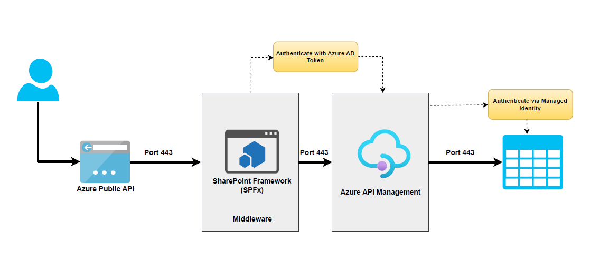
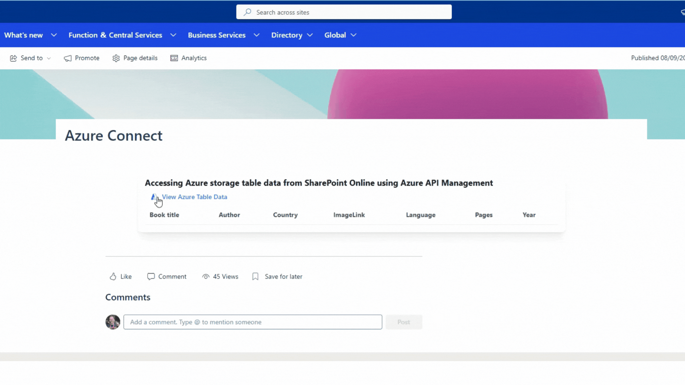
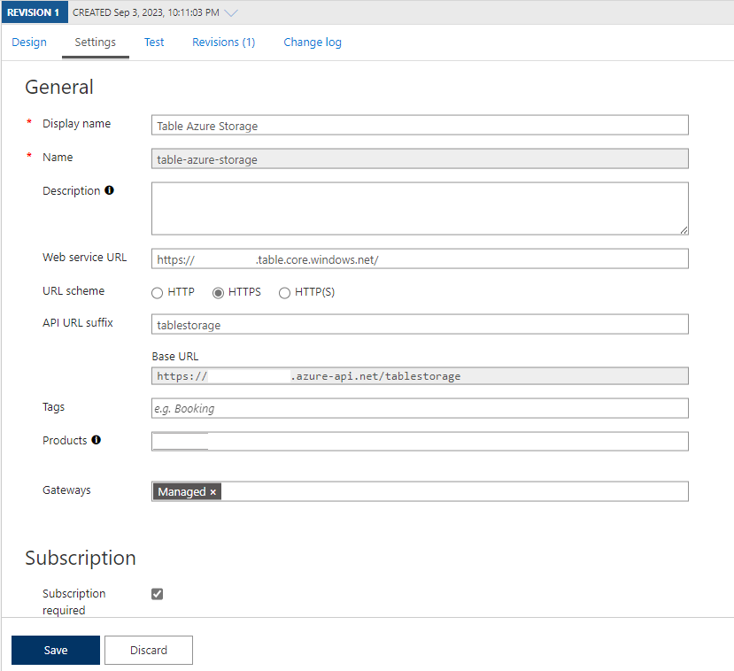

# Accessing Azure table storage data using Azure API Management

## Summary

This SharePoint Framework (SPFx) web part allows you to access securely Azure storage table data directly from a SharePoint Framework (SPFx) web part using Azure API Management (APIM). This scenario is useful when you want to provide a seamless user experience for your application without exposing your backend services or credentials. This is a great way to simplify and secure your web app’s communication with the cloud.

## Solution Architecture

The basic flow is as follows:

- The SharePoint Framework (SPFx) web part authenticates with Azure Active Directory (AAD) and obtains an access token.
- The SharePoint Framework (SPFx) makes a request to APIM with the access token in the header.
- APIM validates the access token using AAD token validation and CORS policies.
- APIM accesses the Azure resource via Azure managed identities and returns the response to the SharePoint Framework (SPFx) webpart.



## Demo



## Compatibility

| :warning: Important                                                                                                                                                                                                                                                                           |
| :-------------------------------------------------------------------------------------------------------------------------------------------------------------------------------------------------------------------------------------------------------------------------------------------- |
| Every SPFx version is only compatible with specific version(s) of Node.js. In order to be able to build this sample, please ensure that the version of Node on your workstation matches one of the versions listed in this section. This sample will not work on a different version of Node. |
| Refer to <https://aka.ms/spfx-matrix> for more information on SPFx compatibility.                                                                                                                                                                                                             |


-Incompatible-red.svg> "SharePoint Server 2016 Feature Pack 2 requires SPFx 1.1")


## Applies to

- [SharePoint Framework](https://aka.ms/spfx)
- [Microsoft 365 tenant](https://learn.microsoft.com/sharepoint/dev/spfx/set-up-your-developer-tenant)

> Get your own free development tenant by subscribing to [Microsoft 365 developer program](http://aka.ms/m365devprogram)

## Prerequisites

To implement this scenario, you will need to configure the following components:

- An Azure Storage account to store some data in the Azure table.
- An APIM instance to expose and secure access to the Azure Storage account using Managed Identity.
- An AAD app registration for the SharePoint Framework (SPFx) web part to authenticate with AAD and obtain an access token.
- A SharePoint Framework (SPFx) web part that calls the APIM endpoint with the access token.

Let's go through each step in detail.

### 1. Create an Azure API Management resource

Create an Azure API Management resource [Click here for more detail](https://learn.microsoft.com/azure/api-management/get-started-create-service-instance)

### 2. Create a Azure storage account

Create a Azure storage account [Click here for more detail](https://learn.microsoft.com/azure/storage/common/storage-account-create?tabs=azure-portal).

### 3. Configure Azure Managed Identities

The next step is to configure Azure Managed Identities. This will allow our API to access our Azure resources without storing any credentials or secrets in our code. To do this, follow these steps:

- Go to the Azure portal and click on your API Management instance.
- Click on Identity under Settings and enable System assigned identity. This will create a system-assigned managed identity for your API Management instance.
- Copy the Object ID of the identity. You will need it later.
- Go to your Azure Storage account and click on Access Control (IAM) under Settings.
- Click on Add role assignment and select Storage Table Data Reader as the role. For the assigned access option, select User assigned managed identity and search for the Object ID of your API Management instance's identity. Select it and click on Save. This will grant your API Management instance's identity access to read Azure storage table data in your storage account.

### 4. Register an application in Azure AD to represent the API

The next step is to create an Azure AD app. This will allow us to authenticate our users with Azure AD and get an access token that we can use to call our Azure API management endpoint. To do this, follow these steps:

1. In the Azure portal, search for and select App registrations.
2. Select New Registration.
3. When the Register an application page appears, enter your application's registration information:
    • In the Name section, enter a meaningful application name that will be displayed to users of the app, such as the backend-app.
    • In the Supported Account Types section, select an option that suits your scenario.
4. Leave the Redirect URI section empty. Later, you'll add a redirect URI generated in the OAuth 2.0 configuration in API Management.
5. Select Register to create the application.
6. On the app Overview page, find the Application (client) ID value and record it for later.
7. Under the Manage section of the side menu, select Expose an API and set the Application ID URI as below. Record this value for later.
    `api://[Client ID]/[Tenant Name].sharepoint.com`
8. Select the Add a Scope button to display the Add a Scope page:
    a. Enter a Scope name for a scope that's supported by the API (for example, **user_impersonation**).
    b. In Who can consent? Make a selection for your scenario, such as Admins and users. Select Admins only for higher privileged scenarios.
    c. Enter the Admin consent display name and Admin consent description.
    d. Make sure the Enabled scope state is selected.
9. Select the Add Scope button to create the scope.
10. Repeat the previous two steps to add all scopes supported by your API.
11. Once the scopes are created, make a note of them for use in a subsequent step.

### 5. Create an Azure Table Storage API

The next step is to create an API for our Azure Storage account in our API Management instance. To do this, follow these steps:

1. Navigate to your API Management service in the Azure portal and select APIs from the menu.
2. From the left menu, select + Add API.
3. Select HTTP from the list.

    

4. Enter the backend Web service URL (In our case, Azure storage table URI, `https://[storageaccountname].table.core.windows.net/`) and other settings for the API. The settings are explained in the [Import and publish your first API](https://learn.microsoft.com/azure/api-management/import-and-publish#import-and-publish-a-backend-api) tutorial.
5. Select Create.

At this point, you have no operations in API Management that map to the operations in your backend API. If you call an operation that is exposed through the back end but not through the API Management, you get a 404.

### 6. Add an operation

This section shows how to add a "/" operation to map it to the Azure Storage Table endpoint `https://[storageaccountname].table.core.windows.net/`" operation.

1. Select the API you created in the previous step.
2. Select + Add Operation.
3. In the URL, select GET and enter `/` in the resource.
4. Enter "Get Entities" for the Display name.
5. Select Save.



### 7. Inbound processing

Next, you will need to configure some inbound policies for the APIM operation to validate the access token from AAD and access the Azure Storage account via managed identities.

I have configured the following policies during the inbound processing of API requests.

1. Checking CORS to make a sure request can only be valid from your SharePoint tenant
2. Validating the Azure AD token
3. Read query parameters or headers if any
4. Setting up backend API URL
5. Managed identity integration with Azure resource

```xml

<!--
    IMPORTANT:
    - Policy elements can appear only within the <inbound>, <outbound>, <backend> section elements.
    - To apply a policy to the incoming request (before it is forwarded to the backend service), place a corresponding policy element within the <inbound> section element.
    - To apply a policy to the outgoing response (before it is sent back to the caller), place a corresponding policy element within the <outbound> section element.
    - To add a policy, place the cursor at the desired insertion point and select a policy from the sidebar.
    - To remove a policy, delete the corresponding policy statement from the policy document.
    - Position the <base> element within a section element to inherit all policies from the corresponding section element in the enclosing scope.
    - Remove the <base> element to prevent inheriting policies from the corresponding section element in the enclosing scope.
    - Policies are applied in the order of their appearance, from the top down.
    - Comments within policy elements are not supported and may disappear. Place your comments between policy elements or at a higher level scope.
-->
<policies>
    <inbound>
        <cors allow-credentials="true">
            <allowed-origins>
                <origin>https://[TenantName].sharepoint.com/</origin>
            </allowed-origins>
            <allowed-methods>
                <method>GET</method>
            </allowed-methods>
            <allowed-headers>
                <header>*</header>
            </allowed-headers>
            <expose-headers>
                <header>*</header>
            </expose-headers>
        </cors>
        <validate-azure-ad-token tenant-id="[TenantId]" failed-validation-error-message="Access token validation failed">
            <client-application-ids>
                <application-id>[Client Id of SharePoint Online Client Extensibility Web Application Principal]</application-id>
                <application-id>[Client Id of the Azure Ad App]</application-id>
            </client-application-ids>
            <audiences>
                <audience>api://[Client Id of the Azure Ad App ]/[Tenant Name].sharepoint.com</audience>
            </audiences>
        </validate-azure-ad-token>
        <set-variable name="Table" value="tblBooks" />
        <set-variable name="RowKey" value="@(context.Request.Headers.GetValueOrDefault("RowKey"))" />
        <set-variable name="UTCNowR" value="@(DateTime.UtcNow.ToString("R"))" />
        <set-header name="Ocp-Apim-Subscription-Key" exists-action="delete" />
        <set-header name="Sec-Fetch-Site" exists-action="delete" />
        <set-header name="Sec-Fetch-Mode" exists-action="delete" />
        <set-header name="Sec-Fetch-Dest" exists-action="delete" />
        <set-header name="Accept" exists-action="override">
            <value>application/json;odata=nometadata</value>
        </set-header>
        <set-header name="Referer" exists-action="delete" />
        <set-header name="X-Forwarded-For" exists-action="delete" />
        <set-header name="x-ms-version" exists-action="override">
            <value>@{string version = "2017-11-09"; return version;}</value>
        </set-header>
        <set-backend-service base-url="@{
string table = context.Variables.GetValueOrDefault<string>("Table");
        string rowKey = context.Variables.GetValueOrDefault<string>("RowKey");
return String.Format("https://[AzureStorageName].table.core.windows.net/{0}()", table);
}" />
        <authentication-managed-identity resource="https://storage.azure.com/" />
    </inbound>
    <backend>
        <base />
    </backend>
    <outbound>
        <base />
    </outbound>
    <on-error>
        <base />
    </on-error>
</policies>
```

## Contributors

- [Ejaz Hussain](https://github.com/ejazhussain)

## Version history

| Version | Date               | Comments        |
| ------- | ------------------ | --------------- |
| 1.0.0   | September 11, 2023 | Initial release |

## Minimal Path to Awesome

1. Clone this repository
2. From your command line, change your current directory to the directory containing this sample (`react-apim-tablestroage`, located under `samples`)
3. In the command line run:

    ```cmd
    npm install
    gulp bundle
    gulp package-solution
    ```

4. Deploy the package to your app catalog
5. Approve the following API permission request from the SharePoint admin

    ```JSON
        {
            "resource": "o3c-apim-sp",   //name of the Azure AD app
            "scope": "user_impersonation"
        }
    ```

6. In the command-line run:

    ```cmd
    gulp serve --nobrowser
    ```

7. Open the hosted workbench on a SharePoint site - i.e. https://_tenant_.sharepoint.com/site/_sitename_/_layouts/workbench.aspx

- Add the [O3C] Azure Connect web part to the page.
- In the web part properties, configure the following properties
  1. Add Subscription Key (e.g. `2a80a80cf8f7878485588ba887ad85`)
  2. Add AAD App Scope URL (e.g. `api://88784ee-44eee-4b8e-ad72-9918e7777/tenantname.sharepoint.com`)
  3. Azure Table Storage Endpoint (e.g. <https://myapim.azure-api.net/tablestorage)->
- Close the web part properties pane and save and reload the page

## Features

This SharePoint Framework (SPFx) web part allows you to access securely Azure storage table data directly from a SharePoint Framework (SPFx) web part using Azure API Management (APIM). This scenario is useful when you want to provide a seamless user experience for your application without exposing your backend services or credentials

## Help


We do not support samples, but this community is always willing to help, and we want to improve these samples. We use GitHub to track issues, which makes it easy for  community members to volunteer their time and help resolve issues.

If you're having issues building the solution, please run [spfx doctor](https://pnp.github.io/cli-microsoft365/cmd/spfx/spfx-doctor/) from within the solution folder to diagnose incompatibility issues with your environment.

You can try looking at [issues related to this sample](https://github.com/pnp/sp-dev-fx-webparts/issues?q=label%3A%22sample%3A%20react-apim-tablestorage%22) to see if anybody else is having the same issues.

You can also try looking at [discussions related to this sample](https://github.com/pnp/sp-dev-fx-webparts/discussions?discussions_q=react-apim-tablestorage) and see what the community is saying.

If you encounter any issues using this sample, [create a new issue](https://github.com/pnp/sp-dev-fx-webparts/issues/new?assignees=&labels=Needs%3A+Triage+%3Amag%3A%2Ctype%3Abug-suspected%2Csample%3A%20react-apim-tablestorage&template=bug-report.yml&sample=react-apim-tablestorage&authors=@ejazhussain&title=react-apim-tablestorage%20-%20).

For questions regarding this sample, [create a new question](https://github.com/pnp/sp-dev-fx-webparts/issues/new?assignees=&labels=Needs%3A+Triage+%3Amag%3A%2Ctype%3Aquestion%2Csample%3A%20react-apim-tablestorage&template=question.yml&sample=react-apim-tablestorage&authors=@ejazhussain&title=react-apim-tablestorage%20-%20).

Finally, if you have an idea for improvement, [make a suggestion](https://github.com/pnp/sp-dev-fx-webparts/issues/new?assignees=&labels=Needs%3A+Triage+%3Amag%3A%2Ctype%3Aenhancement%2Csample%3A%20react-apim-tablestorage&template=suggestion.yml&sample=react-apim-tablestorage&authors=@ejazhussain&title=react-apim-tablestorage%20-%20).

## Disclaimer

**THIS CODE IS PROVIDED _AS IS_ WITHOUT WARRANTY OF ANY KIND, EITHER EXPRESS OR IMPLIED, INCLUDING ANY IMPLIED WARRANTIES OF FITNESS FOR A PARTICULAR PURPOSE, MERCHANTABILITY, OR NON-INFRINGEMENT.**


