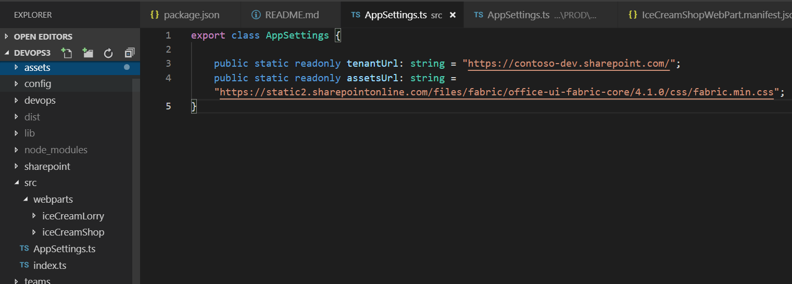

# SPFx React app settings webpart #

## Summary

This sample shows how AppSettings.ts file can be added and used within SharePoint Framewrok webparts similar to the Web.config / App.config key value app settings in .NET Framework projects.
That allows better DevOps and continuous integration (CI/CD) automation. The AppSettings.ts is transpiled/compiled with your SPFx solution which differs from the way the web.config. With .Net web.config file we would be able to update independently without the need of compiling DLLs. If that behavior is required, you can store your app settings in a SharePoint list and change them from there. However, that will have performance degradation over if the setting was part of the SPFx code where the logic can get a setting value in milliseconds.

### Replace values in AppSettings.ts if DEV, QA, PROD environments with Azure DevOps pipeline.

Azure DevOps pipelines configurations are included to demonstrate how the AppSettings.ts values can be changed per different environments. Please refer to the `devops/configurations` folder to see how this can be setup for your pipeline.

## Used SharePoint Framework Version 

## Applies to

* [SharePoint Framework](https://docs.microsoft.com/sharepoint/dev/spfx/sharepoint-framework-overview)
* [Office 365 Developer Tenant](https://docs.microsoft.com/sharepoint/dev/spfx/set-up-your-developer-tenant)

## Prerequisites

- Office 365 subscription with SharePoint Online.
- SharePoint Framework [development environment](https://docs.microsoft.com/sharepoint/dev/spfx/set-up-your-development-environment) already set up.

## Solution

Solution|Author(s)
--------|---------
react-app-settings | Velin Georgiev ([@VelinGeorgiev](https://twitter.com/velingeorgiev))

## Version history

Version|Date|Comments
-------|----|--------
0.0.1|August 03, 2017 | Initial commit
0.0.2|March 08, 2018 | Update to SPFx 1.4.1
0.0.3|March 03, 2019 | Update to SPFx 1.7.1

## Disclaimer
**THIS CODE IS PROVIDED *AS IS* WITHOUT WARRANTY OF ANY KIND, EITHER EXPRESS OR IMPLIED, INCLUDING ANY IMPLIED WARRANTIES OF FITNESS FOR A PARTICULAR PURPOSE, MERCHANTABILITY, OR NON-INFRINGEMENT.**

---

## Minimal Path to Awesome

- Clone this repository.
- Open the command line, navigate to the web part folder and execute:
    - `npm i`
    - `gulp serve`
- Navigate to the local or hosted version of the SharePoint workbench.(`https://<your_tenant>.sharepoint.com/sites/<your_site>/_layouts/15/workbench.aspx`).
- Add the **React AppSettings Webpart** web part.

## Features

This Web Part illustrates the following concepts on top of the SharePoint Framework:

- Using React for building SharePoint Framework client-side web parts.
- The use of app settings and passing the app settings to React components.

