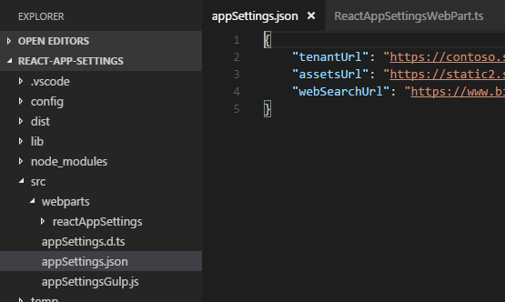

# SPFx React app settings webpart #

## Summary

This sample shows how appSettings.json file can be added and used within SharePoint Framewrok webparts similar to the Web.config / App.config key value app settings in .NET Framework projects.
That allows better DevOps and Continious Integration automation. Typescript module appSettings.d.ts is also added so it allows the json app settings to be imported to any webpart or react component with intellisense support.

### Easy to replace values in appSettings.json if DEV, QA, PROD environments.

Since the appSettings.json is a known format, a DevOps guy can easily open it and add values according the environment then start `gulp build` process in an CI tool like VSTS, Jenkins.

### Gulp task added to verity that the appSettings.json and appSettings.d.ts match.

I have added appSettingsGulp.js with one gulp task in it. The task starts just before solution build or on watch to verify that all the app settings match in both appSettings.json and appSettings.d.ts. If they not match, then error is thrown so the CI tool is aware that the build failed.

### Keep the appSettings.json and appSettings.d.ts format as is.

Since the gulp task I created contains checks based on string operations, it is required that the appSettings.json and appSettings.d.ts are in format as provided and just key-pairs are added to the json file and respective just new properties are added to the IAppSettings interface in the appSettings.d.ts.

## Used SharePoint Framework Version 

## Applies to

* [SharePoint Framework](http://dev.office.com/sharepoint/docs/spfx/sharepoint-framework-overview)
* [Office 365 Developer Tenant](http://dev.office.com/sharepoint/docs/spfx/set-up-your-developer-tenant)

## Prerequisites

- Office 365 subscription with SharePoint Online.
- SharePoint Framework [development environment](https://dev.office.com/sharepoint/docs/spfx/set-up-your-development-environment) already set up.

## Solution

Solution|Author(s)
--------|---------
react-app-settings | Velin Georgiev ([@VelinGeorgiev](https://twitter.com/velingeorgiev))

## Version history

Version|Date|Comments
-------|----|--------
0.0.1|August 03, 2017 | Initial commit

## Disclaimer
**THIS CODE IS PROVIDED *AS IS* WITHOUT WARRANTY OF ANY KIND, EITHER EXPRESS OR IMPLIED, INCLUDING ANY IMPLIED WARRANTIES OF FITNESS FOR A PARTICULAR PURPOSE, MERCHANTABILITY, OR NON-INFRINGEMENT.**

---

## Minimal Path to Awesome

- Clone this repository.
- Open the command line, navigate to the web part folder and execute:
    - `npm i`
    - `gulp serve`
- Navigate to the local or hosted version of the SharePoint workbench.(`https://<your_tenant>.sharepoint.com/sites/<your_site>/_layouts/15/workbench.aspx`).
- Add the **React AppSettings Webpart** web part.

## Features

This Web Part illustrates the following concepts on top of the SharePoint Framework:

- Using React for building SharePoint Framework client-side web parts.
- The use of app settings and passing the app settings to React components.

