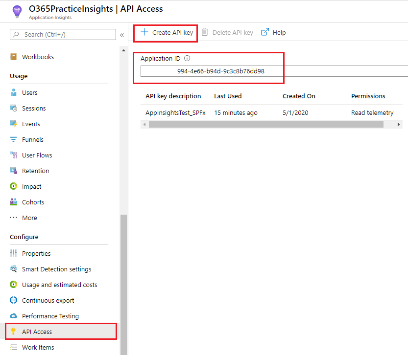
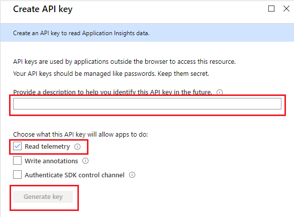
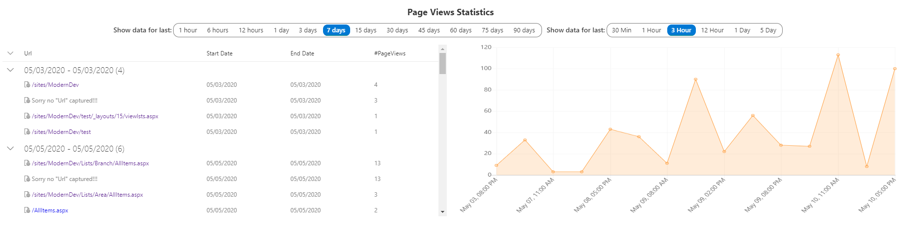
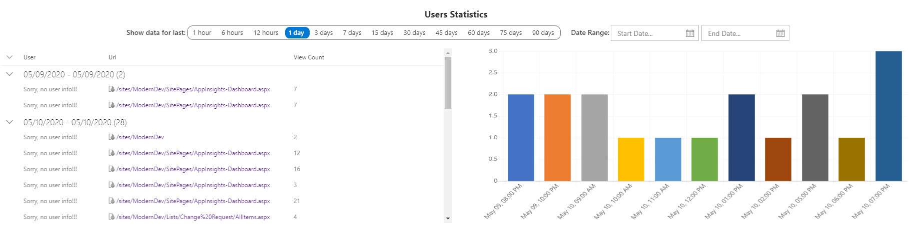
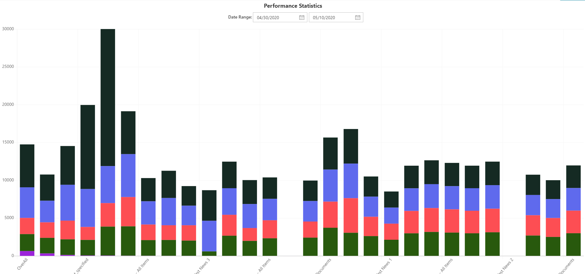

# React AppInsights Dashboard

## Summary

This web part displays different statistics data captured in the **Azure Application Insights** in a graphical representation. Filters are provided to search for certain period of days. There are few **Application Customizer** which can be activated in **SharePoint Online** to track page view, performance etc., to **Azure Application Insights**, but the data can be viewed only by the administrator who is in-charge of **Azure portal**. Not all the users will have access to this data, this web gupart will provide access to those data that can be used by the portal administrators and developers to keep track of the page performance and hits. Fetched insights data using **[Application Insights API](https://dev.applicationinsights.io/)**.

## Pre-requisites

**Azure Application Insights** has to be configured. If you want to track the **SharePoint Online** web parts and pages, please use either of the following **Application Customizer** or you can use your own extensions to track the pages and other components. 
* [Injecting JavaScript with SharePoint Framework Extensions - Azure Application Insights](https://github.com/pnp/sp-dev-fx-extensions/tree/master/samples/js-application-appinsights)
* [JS Application AppInsights Advanced](https://github.com/pnp/sp-dev-fx-extensions/tree/master/samples/js-application-appinsights-advanced)

Following are required to access the data using **[App Insights API](https://dev.applicationinsights.io/)**. The API has been provided in a very simple way with **[API Explorer](https://dev.applicationinsights.io/apiexplorer)** for the developers to play around the API to understand the schema and the methods that can used.
* **Application ID** of the Application Insights
* **API Key** for the data access

## Properties

* **_Application ID_**: Application ID of the Azure Application Insights API Access.
* **_Application Key_**: Application Key of the Azure Application Insights API Access.

## Preview

#### AppInsights Dashboard

#### Page Statistics

#### User Statistics

#### Performance Statistics

## Applies to

* [SharePoint Framework](https://docs.microsoft.com/sharepoint/dev/spfx/sharepoint-framework-overview)
* [Office 365 tenant](https://docs.microsoft.com/sharepoint/dev/spfx/set-up-your-development-environment)

## SharePoint Framework Pre-requisites
 
**@microsoft/generator-sharepoint - 1.10.0**

## Solution

Solution|Author(s)
--------|---------
react-appinsights-dashboard | Sudharsan K.([@sudharsank](https://twitter.com/sudharsank), [Know More](http://windowssharepointserver.blogspot.com/))

## Version history

Version|Date|Comments
-------|----|--------
1.0.0.0|May 10, 2020|Initial release
1.0.0.1|June 16, 2020|Initial release

## Disclaimer
**THIS CODE IS PROVIDED *AS IS* WITHOUT WARRANTY OF ANY KIND, EITHER EXPRESS OR IMPLIED, INCLUDING ANY IMPLIED WARRANTIES OF FITNESS FOR A PARTICULAR PURPOSE, MERCHANTABILITY, OR NON-INFRINGEMENT.**

## Minimal Path to Awesome

- Clone this repository
- in the command line run:
  - `npm install`
  - `gulp bundle --ship && gulp package-solution --ship`

#### Local Mode

This solution doesn't work on local mode.

