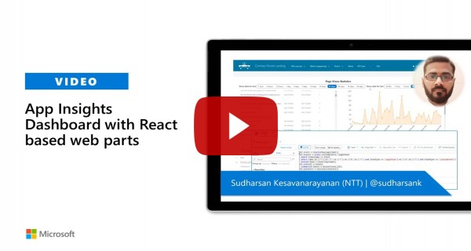

# Azure Application Insights Dashboard

## Summary

This web part displays different statistics data captured in the **Azure Application Insights** in a graphical representation. Filters are provided to search for certain period of days. There are few **Application Customizer** which can be activated in **SharePoint Online** to track page view, performance etc., to **Azure Application Insights**, but the data can be viewed only by the administrator who is in-charge of **Azure portal**. Not all the users will have access to this data, this web gupart will provide access to those data that can be used by the portal administrators and developers to keep track of the page performance and hits. Fetched insights data using **[Application Insights API](https://dev.applicationinsights.io/)**.

## Compatibility

| :warning: Important          |
|:---------------------------|
| Every SPFx version is only compatible with specific version(s) of Node.js. In order to be able to build this sample, please ensure that the version of Node on your workstation matches one of the versions listed in this section. This sample will not work on a different version of Node.|
|Refer to <https://aka.ms/spfx-matrix> for more information on SPFx compatibility.   |

 
 

-Incompatible-red.svg "SharePoint Server 2016 Feature Pack 2 requires SPFx 1.1")

## Pre-requisites

**Azure Application Insights** has to be configured. If you want to track the **SharePoint Online** web parts and pages, please use either of the following **Application Customizer** or you can use your own extensions to track the pages and other components. 
* [Injecting JavaScript with SharePoint Framework Extensions - Azure Application Insights](https://github.com/pnp/sp-dev-fx-extensions/tree/main/samples/js-application-appinsights)
* [JS Application AppInsights Advanced](https://github.com/pnp/sp-dev-fx-extensions/tree/main/samples/js-application-appinsights-advanced)

Following are required to access the data using **[App Insights API](https://learn.microsoft.com/en-us/rest/api/application-insights/)**. To try the API without writing any code, see [Trying the Log Analytics API](https://learn.microsoft.com/en-us/azure/azure-monitor/logs/api/overview#trying-the-log-analytics-api)
* **Application ID** of the Application Insights
* **API Key** for the data access

## Properties

* **_Application ID_**: Application ID of the Azure Application Insights API Access.
* **_Application Key_**: Application Key of the Azure Application Insights API Access.

## Preview

#### AppInsights Dashboard

#### Page Statistics

#### User Statistics

#### Performance Statistics

## Applies to

* [SharePoint Framework](https://learn.microsoft.com/sharepoint/dev/spfx/sharepoint-framework-overview)
* [Microsoft 365 tenant](https://learn.microsoft.com/sharepoint/dev/spfx/set-up-your-development-environment)

## Contributors

* [Sudharsan K.](https://github.com/sudharsank)

## Version history

Version|Date|Comments
-------|----|--------
1.0.1.0| February 06, 2023 | Upgrade to SPFx 1.16
1.0.0.0|May 10, 2020|Initial release
1.0.0.1|June 16, 2020|Initial release

## Minimal Path to Awesome

- Clone this repository
- From your command line, change your current directory to the directory containing this sample (`react-appinsights-dashboard`, located under `samples`)
- in the command line run:
  - `npm install` (or even better, `pnpm install` )
  - `gulp bundle --ship && gulp package-solution --ship`

>  This sample can also be opened with [VS Code Remote Development](https://code.visualstudio.com/docs/remote/remote-overview). Visit https://aka.ms/spfx-devcontainer for further instructions.

#### Local Mode

This solution doesn't work on local mode.

## Video

## Help

We do not support samples, but this community is always willing to help, and we want to improve these samples. We use GitHub to track issues, which makes it easy for  community members to volunteer their time and help resolve issues.

If you're having issues building the solution, please run [spfx doctor](https://pnp.github.io/cli-microsoft365/cmd/spfx/spfx-doctor/) from within the solution folder to diagnose incompatibility issues with your environment.

You can try looking at [issues related to this sample](https://github.com/pnp/sp-dev-fx-webparts/issues?q=label%3A%22sample%3A%20react-appinsights-dashboard") to see if anybody else is having the same issues.

You can also try looking at [discussions related to this sample](https://github.com/pnp/sp-dev-fx-webparts/discussions?discussions_q=react-appinsights-dashboard) and see what the community is saying.

If you encounter any issues while using this sample, [create a new issue](https://github.com/pnp/sp-dev-fx-webparts/issues/new?assignees=&labels=Needs%3A+Triage+%3Amag%3A%2Ctype%3Abug-suspected%2Csample%3A%20react-appinsights-dashboard&template=bug-report.yml&sample=react-appinsights-dashboard&authors=@sudharsank&title=react-appinsights-dashboard%20-%20).

For questions regarding this sample, [create a new question](https://github.com/pnp/sp-dev-fx-webparts/issues/new?assignees=&labels=Needs%3A+Triage+%3Amag%3A%2Ctype%3Aquestion%2Csample%3A%20react-appinsights-dashboard&template=question.yml&sample=react-appinsights-dashboard&authors=@sudharsank&title=react-appinsights-dashboard%20-%20).

Finally, if you have an idea for improvement, [make a suggestion](https://github.com/pnp/sp-dev-fx-webparts/issues/new?assignees=&labels=Needs%3A+Triage+%3Amag%3A%2Ctype%3Aenhancement%2Csample%3A%20react-appinsights-dashboard&template=question.yml&sample=react-appinsights-dashboard&authors=@sudharsank&title=react-appinsights-dashboard%20-%20).

## Disclaimer

**THIS CODE IS PROVIDED *AS IS* WITHOUT WARRANTY OF ANY KIND, EITHER EXPRESS OR IMPLIED, INCLUDING ANY IMPLIED WARRANTIES OF FITNESS FOR A PARTICULAR PURPOSE, MERCHANTABILITY, OR NON-INFRINGEMENT.**

