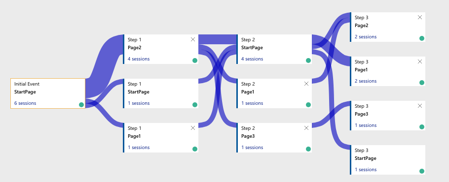
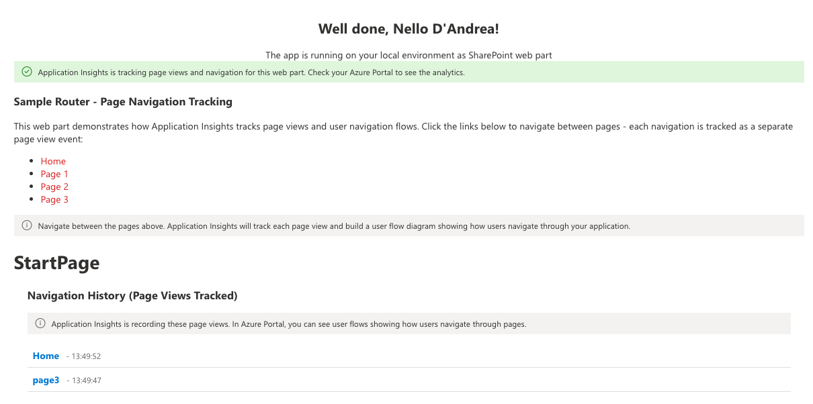
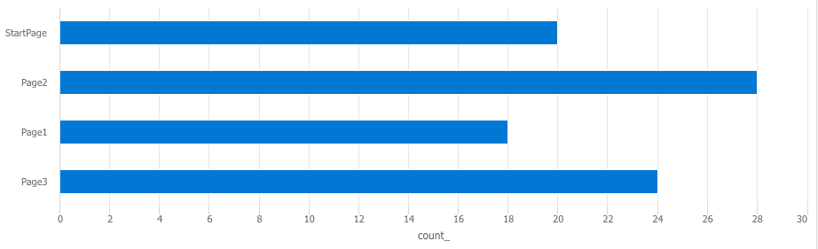
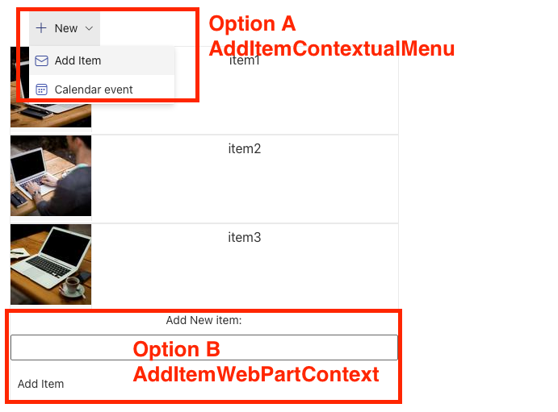
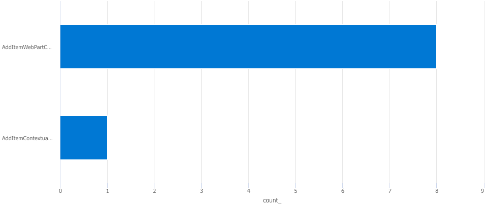
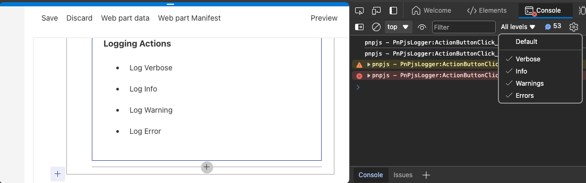

# Application Insights not only a Dev Tool

## Summary

Application Insights provides telemetry data to monitor and improve application performance and user experience, while AB Testing, user flow analysis, and logging help in optimizing and debugging applications by comparing different versions, mapping user paths, and recording significant events. The 3 sample web part demonstrates web part functionalities to aid developers in integrating customizable components effectively.



more details after the `Features` section

## Compatibility

| :warning: Important          |
|:---------------------------|
| Every SPFx version is optimally compatible with specific versions of Node.js. In order to be able to build this sample, you need to ensure that the version of Node on your workstation matches one of the versions listed in this section. This sample will not work on a different version of Node.|
|Refer to <https://aka.ms/spfx-matrix> for more information on SPFx compatibility.   |

This sample is optimally compatible with the following environment configuration:


-Incompatible-red.svg "SharePoint Server 2016 Feature Pack 2 requires SPFx 1.1")


## Applies to

- [SharePoint Framework](https://aka.ms/spfx)
- [Microsoft 365 tenant](https://docs.microsoft.com/en-us/sharepoint/dev/spfx/set-up-your-developer-tenant)

> Get your own free development tenant by subscribing to [Microsoft 365 developer program](http://aka.ms/o365devprogram)

## Contributors

* [Peter Paul Kirschner](https://github.com/petkir)

## Version history

| Version | Date             | Comments        |
| ------- | ---------------- | --------------- |
| 1.0     | Mai 26, 2024 | Initial release |


## Prerequisites

Application Insight Service on Azure
Add the connection stirng of this Service to the the variable ```AIConnectionString``` at ```src/EnvProps.ts```


## Minimal Path to Awesome

- Clone this repository
- Ensure that you are at the solution folder
- Create or use Existing Azure Application Insights
- Update ```src/EnvProps.ts``` and set ```AIConnectionString``` 
- in the command-line run:
  - **npm install**
  - **gulp serve**


## Features

Description of the extension that expands upon high-level summary above.

This extension illustrates the following concepts:

- Sample Router WebPart 
      - Using Hash Router and use Page Tracking
- ABTest WebPart (check User activity)
    - Event Tracking
    - Logging
- PnP JS Logger
    - Logging with PnPJS


## Sample Router WebPart

How is your application used by Users



Analyse in Application Insight


Query in Application Insights Count PageViews
```
pageViews 
| where name contains "Page"
| where cloud_RoleName contains "app-insights-spfx-webparts"
| where cloud_RoleInstance contains "SampleRouterWebPart"
| where timestamp >= ago(8h)
| summarize count()  by name
| render barchart 
```


Query in Application Insights Avarage Page visit duration by PageName
```
customMetrics 
| where name contains "PageVisitTime"
| where customDimensions.PageName contains "Page"
| where cloud_RoleName contains "app-insights-spfx-webparts"
| where cloud_RoleInstance contains "SampleRouterWebPart"
| where timestamp >= ago(8h)
| summarize avg(value)  by tostring(customDimensions.PageName)
| render barchart 
```


## AB-Test WebPart

How users add new items?



Query in Application Insights
```
customEvents 
| where name contains "AddItem"
| where cloud_RoleName contains "app-insights-spfx-webparts"
| where cloud_RoleInstance contains "ABTestWebPart"
| where timestamp >= ago(1h)
| summarize  count()  by name
| render barchart 
```


## PnPJS Logger WebPart




## Help

We do not support samples, but this community is always willing to help, and we want to improve these samples. We use GitHub to track issues, which makes it easy for  community members to volunteer their time and help resolve issues.

If you're having issues building the solution, please run [spfx doctor](https://pnp.github.io/cli-microsoft365/cmd/spfx/spfx-doctor/) from within the solution folder to diagnose incompatibility issues with your environment.

You can try looking at [issues related to this sample](https://github.com/pnp/sp-dev-fx-webparts/issues?q=label%3A%22sample%3A%20react-appinsights-usage%22) to see if anybody else is having the same issues.

You can also try looking at [discussions related to this sample](https://github.com/pnp/sp-dev-fx-webparts/discussions?discussions_q=react-appinsights-usage) and see what the community is saying.

If you encounter any issues using this sample, [create a new issue](https://github.com/pnp/sp-dev-fx-webparts/issues/new?assignees=&labels=Needs%3A+Triage+%3Amag%3A%2Ctype%3Abug-suspected%2Csample%3A%20react-appinsights-usage&template=bug-report.yml&sample=react-appinsights-usage&authors=@petkir&title=react-appinsights-usage%20-%20).

For questions regarding this sample, [create a new question](https://github.com/pnp/sp-dev-fx-webparts/issues/new?assignees=&labels=Needs%3A+Triage+%3Amag%3A%2Ctype%3Aquestion%2Csample%3A%20react-appinsights-usage&template=question.yml&sample=react-appinsights-usage&authors=@petkir&title=react-appinsights-usage%20-%20).

Finally, if you have an idea for improvement, [make a suggestion](https://github.com/pnp/sp-dev-fx-webparts/issues/new?assignees=&labels=Needs%3A+Triage+%3Amag%3A%2Ctype%3Aenhancement%2Csample%3A%20react-appinsights-usage&template=suggestion.yml&sample=react-appinsights-usage&authors=@petkir&title=react-appinsights-usage%20-%20).

## Disclaimer

**THIS CODE IS PROVIDED *AS IS* WITHOUT WARRANTY OF ANY KIND, EITHER EXPRESS OR IMPLIED, INCLUDING ANY IMPLIED WARRANTIES OF FITNESS FOR A PARTICULAR PURPOSE, MERCHANTABILITY, OR NON-INFRINGEMENT.**


