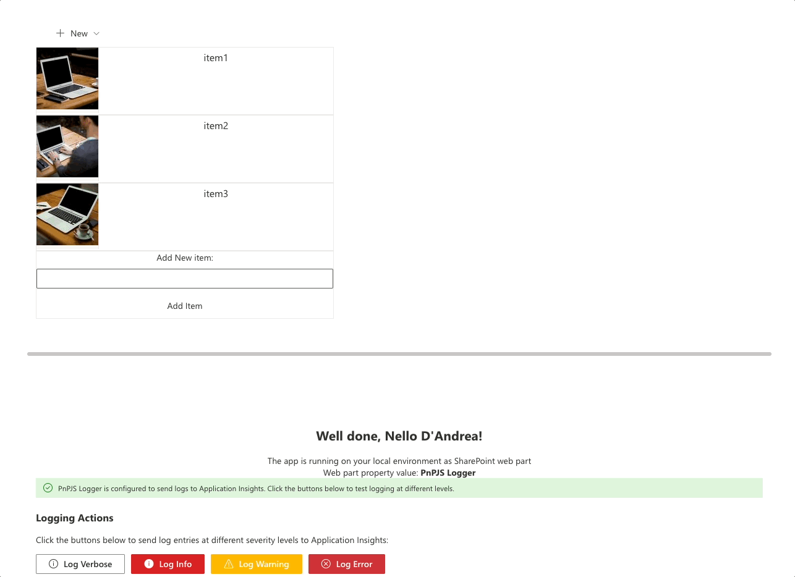

# Application Insights not only a Dev Tool

## Summary

Application Insights provides telemetry data to monitor and improve application performance and user experience, while AB Testing, user flow analysis, and logging help in optimizing and debugging applications by comparing different versions, mapping user paths, and recording significant events. The 3 sample web part demonstrates web part functionalities to aid developers in integrating customizable components effectively.




more details after the `Features` section

## Compatibility

| :warning: Important          |
|:---------------------------|
| Every SPFx version is optimally compatible with specific versions of Node.js. In order to be able to build this sample, you need to ensure that the version of Node on your workstation matches one of the versions listed in this section. This sample will not work on a different version of Node.|
|Refer to <https://aka.ms/spfx-matrix> for more information on SPFx compatibility.   |

This sample is optimally compatible with the following environment configuration:


-Incompatible-red.svg "SharePoint Server 2016 Feature Pack 2 requires SPFx 1.1")


## Applies to

- [SharePoint Framework](https://aka.ms/spfx)
- [Microsoft 365 tenant](https://docs.microsoft.com/en-us/sharepoint/dev/spfx/set-up-your-developer-tenant)

> Get your own free development tenant by subscribing to [Microsoft 365 developer program](http://aka.ms/o365devprogram)

## Contributors

* [Peter Paul Kirschner](https://github.com/petkir)

## Version history

| Version | Date             | Comments        |
| ------- | ---------------- | --------------- |
| 1.2     | October 2025 | Upgraded to 1.21.1
| 1.0     | Mai 26, 2024 | Initial release |


## Prerequisites

Azure Application Insights resource. If you don't have one:
1. Go to [Azure Portal](https://portal.azure.com)
2. Create a new Application Insights resource
3. Copy the **Connection String** from the Overview page

## Configuration

You have **two options** to configure the Application Insights connection string:

### Option 1: Web Part Properties (Recommended)

This is the easiest and most secure way to configure Application Insights:

**Steps:**
1. Add any of the three web parts to a SharePoint page
2. If not configured, you'll see a **yellow warning banner** with setup instructions
3. Click the **Edit** (pencil) icon on the web part to open the property pane
4. Scroll down to find the **Application Insights Configuration** section
5. Paste your connection string in the **Application Insights Connection String** text field
6. The connection string will be validated immediately
7. Once valid, the warning disappears and you'll see a **green success banner**
8. Save the page

**Real-Time Configuration Feedback:**
- The web part updates instantly when you paste the connection string
- No need to save or reload - you'll see the configuration status change immediately
- If the connection string is invalid, the warning remains visible

**Benefits:**
- ✅ No code changes needed
- ✅ Connection string stays secure (not in source control)
- ✅ Different web part instances can use different Application Insights resources
- ✅ Easy to update without redeploying
- ✅ Immediate visual feedback on configuration status

### Option 2: Developer Configuration (For Development)

For local development, you can set the connection string in code:
1. Open `src/EnvProps.ts`
2. Replace `'set-your-connection-string-here'` with your actual connection string
3. **Important**: Do not commit this file with your real connection string to source control

## Minimal Path to Awesome

- Clone this repository
- Ensure that you are at the solution folder
- in the command-line run:
  - `npm install`
  - `gulp serve`
- Add the web part to a page and configure the Application Insights connection string using **Option 1** or **Option 2** above

## Real-Time Event Tracking

One of the key features of this sample is **real-time visibility** into what data is being sent to Application Insights. Unlike traditional implementations where you need to check the Azure Portal to verify data is flowing, these web parts show you exactly what's happening:

### Visual Feedback

All three web parts provide immediate visual feedback:

- **Success banners** when Application Insights is configured correctly
- **Warning messages** when configuration is missing, with step-by-step setup instructions
- **Real-time displays** showing tracked events, logs, and page views as they're sent to Azure

### Educational Purpose

Each web part demonstrates Application Insights capabilities in an interactive way:

1. **See what you're tracking**: Click buttons or navigate pages and immediately see the data that's sent
2. **Understand the data structure**: View event names, properties, severity levels, and timestamps
3. **Learn Azure Portal queries**: Each section includes sample KQL queries to analyze data in Azure
4. **No waiting**: Don't wait for data to appear in Azure - see it instantly in the web part

This makes the sample perfect for:
- Learning how Application Insights works
- Testing different tracking scenarios
- Demonstrating telemetry to stakeholders
- Debugging tracking implementation

## Features

This sample includes three interactive web parts that demonstrate different Application Insights capabilities:

### 1. AB-Test WebPart - Event Tracking

**What it demonstrates:**
- Custom event tracking with properties
- Multiple event sources (button clicks, menu actions)
- Real-time event display with timestamps

**Interactive Features:**
- Add items via text field or contextual menu
- See each tracked event immediately in the "Recent Events Tracked" section
- View event properties (e.g., item names)
- Success message confirms data sent to Application Insights

**Use Cases:**
- A/B testing different UI approaches
- Tracking user interactions
- Understanding feature usage patterns

### 2. Sample Router WebPart - Page View Tracking

**What it demonstrates:**
- Automatic page view tracking with React Router
- User flow analysis
- Navigation pattern tracking

**Interactive Features:**
- Navigate between pages (Home, Page 1, Page 2, Page 3)
- See each page view tracked in real-time
- View complete navigation history with timestamps
- Application Insights builds user flow diagrams from this data

**Use Cases:**
- Understanding navigation patterns
- Identifying popular content
- Finding navigation bottlenecks
- Analyzing user journey flows

### 3. PnPJS Logger WebPart - Logging Integration

**What it demonstrates:**
- Integration with PnPJS logging framework
- Different log severity levels
- Centralized logging to Application Insights

**Interactive Features:**
- Color-coded buttons for each log level (Verbose, Info, Warning, Error)
- Real-time display of logged entries with severity colors
- See logs sent to Azure under "Traces"

**Use Cases:**
- Application diagnostics and debugging
- Error tracking and monitoring
- Performance troubleshooting
- Operational insights


## Sample Router WebPart - Detailed View

### How It Works

This web part uses React Router (HashRouter) to create a single-page application with multiple routes. Application Insights automatically tracks each route change as a separate page view, allowing you to analyze user navigation patterns.


### Real-Time Navigation Tracking

When you navigate between pages, the web part displays:
- **Navigation History**: A list of all page views with timestamps
- Each navigation is immediately visible in the web part before it appears in Azure
- The Application Insights ReactPlugin handles automatic tracking

### Analyze in Application Insights

Once data flows to Azure, you can create powerful visualizations:


Query in Application Insights Count PageViews

```
pageViews 
| where name contains "Page"
| where cloud_RoleName contains "app-insights-spfx-webparts"
| where cloud_RoleInstance contains "SampleRouterWebPart"
| where timestamp >= ago(8h)
| summarize count()  by name
| render barchart 
```


Query in Application Insights Average Page visit duration by PageName

```
customMetrics 
| where name contains "PageVisitTime"
| where customDimensions.PageName contains "Page"
| where cloud_RoleName contains "app-insights-spfx-webparts"
| where cloud_RoleInstance contains "SampleRouterWebPart"
| where timestamp >= ago(8h)
| summarize avg(value)  by tostring(customDimensions.PageName)
| render barchart 
```


## AB-Test WebPart - Detailed View

### How It Works

This web part demonstrates event tracking for A/B testing scenarios. It tracks different ways users can add items (via text input button vs. contextual menu) to help you understand which UI approach works better.


### Real-Time Event Tracking

When you interact with the web part:
1. **Add items** through the text field or "New" menu
2. See a **green success message** confirming the event was tracked
3. View the event in the **"Recent Events Tracked"** section with:
   - Event name (e.g., "AddItemWebPartContext" or "AddItemContextualMenu")
   - Timestamp
   - Properties (e.g., item name)

This immediate feedback helps you understand exactly what data Application Insights receives.

### Analyze in Application Insights

Query in Application Insights to compare different user actions:

```
customEvents 
| where name contains "AddItem"
| where cloud_RoleName contains "app-insights-spfx-webparts"
| where cloud_RoleInstance contains "ABTestWebPart"
| where timestamp >= ago(1h)
| summarize  count()  by name
| render barchart 
```


## PnPJS Logger WebPart - Detailed View

### How It Works

This web part demonstrates integration between PnPJS logging framework and Application Insights. All PnPJS log entries are automatically forwarded to Azure Application Insights for centralized monitoring.


### Real-Time Log Tracking

The web part features color-coded buttons for different severity levels:
- **Verbose** (Gray): Detailed diagnostic information
- **Info** (Blue): General informational messages
- **Warning** (Orange): Warning conditions
- **Error** (Red): Error conditions

When you click any button:
1. The log entry is sent to Application Insights
2. It appears in the **"Recent Logs Sent to Application Insights"** section
3. Each entry shows:
   - Severity level with color coding
   - Log message
   - Timestamp

### View in Application Insights

Logs appear in Azure under **Traces**. You can query them by severity level, message content, or time range to troubleshoot issues and monitor application health.


## Help

We do not support samples, but this community is always willing to help, and we want to improve these samples. We use GitHub to track issues, which makes it easy for  community members to volunteer their time and help resolve issues.

If you're having issues building the solution, please run [spfx doctor](https://pnp.github.io/cli-microsoft365/cmd/spfx/spfx-doctor/) from within the solution folder to diagnose incompatibility issues with your environment.

You can try looking at [issues related to this sample](https://github.com/pnp/sp-dev-fx-webparts/issues?q=label%3A%22sample%3A%20react-appinsights-usage%22) to see if anybody else is having the same issues.

You can also try looking at [discussions related to this sample](https://github.com/pnp/sp-dev-fx-webparts/discussions?discussions_q=react-appinsights-usage) and see what the community is saying.

If you encounter any issues using this sample, [create a new issue](https://github.com/pnp/sp-dev-fx-webparts/issues/new?assignees=&labels=Needs%3A+Triage+%3Amag%3A%2Ctype%3Abug-suspected%2Csample%3A%20react-appinsights-usage&template=bug-report.yml&sample=react-appinsights-usage&authors=@petkir&title=react-appinsights-usage%20-%20).

For questions regarding this sample, [create a new question](https://github.com/pnp/sp-dev-fx-webparts/issues/new?assignees=&labels=Needs%3A+Triage+%3Amag%3A%2Ctype%3Aquestion%2Csample%3A%20react-appinsights-usage&template=question.yml&sample=react-appinsights-usage&authors=@petkir&title=react-appinsights-usage%20-%20).

Finally, if you have an idea for improvement, [make a suggestion](https://github.com/pnp/sp-dev-fx-webparts/issues/new?assignees=&labels=Needs%3A+Triage+%3Amag%3A%2Ctype%3Aenhancement%2Csample%3A%20react-appinsights-usage&template=suggestion.yml&sample=react-appinsights-usage&authors=@petkir&title=react-appinsights-usage%20-%20).

## Disclaimer

**THIS CODE IS PROVIDED *AS IS* WITHOUT WARRANTY OF ANY KIND, EITHER EXPRESS OR IMPLIED, INCLUDING ANY IMPLIED WARRANTIES OF FITNESS FOR A PARTICULAR PURPOSE, MERCHANTABILITY, OR NON-INFRINGEMENT.**


