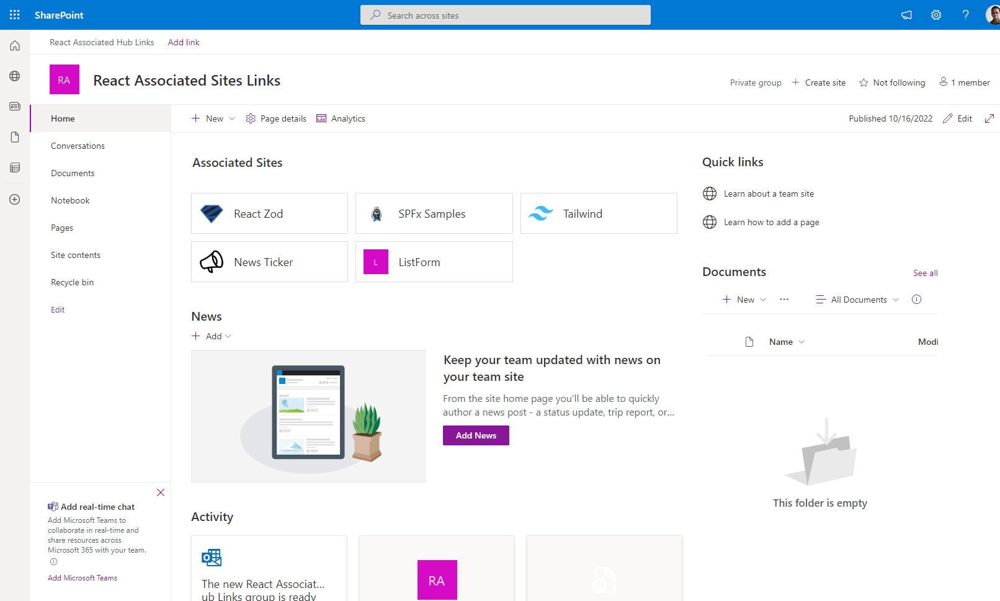

# Associated Sites Links

## Summary

Web part that will display links to all associated sites that registered to the current site.
Current site should be a hub site.

For instance, below is the result when there are 5 sites (React Zod, SPFx Samples, Tailwind, News Tracker, ListForm) registered to the current site:

>Please be reminded that this web part retrieving associated sites data using Search API so please wait a few minutes after you register sites until the links displayed on the web part.

## Compatibility

| :warning: Important          |
|:---------------------------|
| Every SPFx version is only compatible with specific version(s) of Node.js. In order to be able to build this sample, please ensure that the version of Node on your workstation matches one of the versions listed in this section. This sample will not work on a different version of Node.|
|Refer to <https://aka.ms/spfx-matrix> for more information on SPFx compatibility.   |

## Applies to

* [SharePoint Framework](https://docs.microsoft.com/sharepoint/dev/spfx/sharepoint-framework-overview)
* [Microsoft 365 tenant](https://docs.microsoft.com/sharepoint/dev/spfx/set-up-your-development-environment)

> Get your own free development tenant by subscribing to [Microsoft 365 developer program](http://aka.ms/m365devprogram)

## Contributors

* [Ari Gunawan](https://github.com/AriGunawan)

## Version history

Version|Date|Comments
-------|----|--------
1.0|October 16, 2022|Initial version

## Prerequisites

- Setup current site as a Hub Site.
- Register some sites to be associated sites of the Hub Site.

## Minimal path to awesome

* Clone this repository (or [download this solution as a .ZIP file](https://pnp.github.io/download-partial/?url=https://github.com/pnp/sp-dev-fx-webparts/tree/main/samples/react-associated-sites-links) then unzip it)
* From your command line, change your current directory to the directory containing this sample (`react-associated-sites-links`, located under `samples`)
* in the command line run:
  * `npm install`
  * `gulp serve`

## Features

This sample illustrates the following concepts:
- Use [PnPJS](https://pnp.github.io/pnpjs/) for getting associated sites
- Use [React](https://reactjs.org/) for displaying sites as link button
- Display site logo on the link button
- Use [Tailwind](https://tailwindcss.com/) for styling the link buttons
- Use [SPFx Fast Serve](https://github.com/s-KaiNet/spfx-fast-serve) for improving development productivity

<!--
RESERVED FOR REPO MAINTAINERS

We'll add the video from the community call recording here

## Video

-->

## Help

We do not support samples, but this community is always willing to help, and we want to improve these samples. We use GitHub to track issues, which makes it easy for  community members to volunteer their time and help resolve issues.

If you're having issues building the solution, please run [spfx doctor](https://pnp.github.io/cli-microsoft365/cmd/spfx/spfx-doctor/) from within the solution folder to diagnose incompatibility issues with your environment.

You can try looking at [issues related to this sample](https://github.com/pnp/sp-dev-fx-webparts/issues?q=label%3A%22sample%3A%20react-associated-sites-links%22) to see if anybody else is having the same issues.

You can also try looking at [discussions related to this sample](https://github.com/pnp/sp-dev-fx-webparts/discussions?discussions_q=react-associated-sites-links) and see what the community is saying.

If you encounter any issues using this sample, [create a new issue](https://github.com/pnp/sp-dev-fx-webparts/issues/new?assignees=&labels=Needs%3A+Triage+%3Amag%3A%2Ctype%3Abug-suspected%2Csample%3A%20react-associated-sites-links&template=bug-report.yml&sample=react-associated-sites-links&authors=@AriGunawan&title=react-associated-sites-links%20-%20).

For questions regarding this sample, [create a new question](https://github.com/pnp/sp-dev-fx-webparts/issues/new?assignees=&labels=Needs%3A+Triage+%3Amag%3A%2Ctype%3Aquestion%2Csample%3A%20react-associated-sites-links&template=question.yml&sample=react-associated-sites-links&authors=@AriGunawan&title=react-associated-sites-links%20-%20).

Finally, if you have an idea for improvement, [make a suggestion](https://github.com/pnp/sp-dev-fx-webparts/issues/new?assignees=&labels=Needs%3A+Triage+%3Amag%3A%2Ctype%3Aenhancement%2Csample%3A%20react-associated-sites-links&template=suggestion.yml&sample=react-associated-sites-links&authors=@AriGunawan&title=react-associated-sites-links%20-%20).

## Disclaimer

**THIS CODE IS PROVIDED *AS IS* WITHOUT WARRANTY OF ANY KIND, EITHER EXPRESS OR IMPLIED, INCLUDING ANY IMPLIED WARRANTIES OF FITNESS FOR A PARTICULAR PURPOSE, MERCHANTABILITY, OR NON-INFRINGEMENT.**

