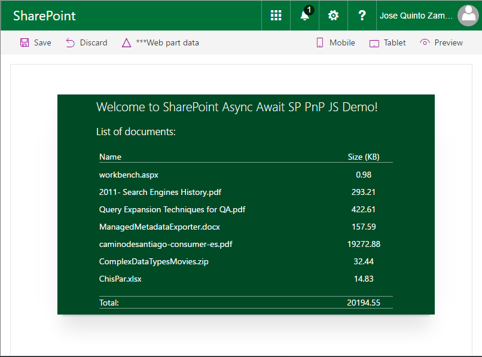
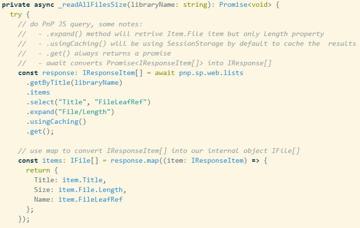

# Using @pnp/js with Async / Await

## Summary

This web part demonstrates how to use [PnPJS](https://pnp.github.io/pnpjs/) with Async functions into the SharePoint Framework.

## Compatibility

## Compatibility

 
 

-Incompatible-red.svg "SharePoint Server 2016 Feature Pack 2 requires SPFx 1.1")

## Applies to

* [SharePoint Framework](https://docs.microsoft.com/sharepoint/dev/spfx/sharepoint-framework-overview)
* [Microsoft 365 developer tenant](https://docs.microsoft.com/sharepoint/dev/spfx/set-up-your-developer-tenant)

## Solution

Solution|Author(s)
--------|---------
react-async-await-sp-pnp-js | Jose Quinto ([@jquintozamora](https://twitter.com/jquintozamora) , [blog.josequinto.com](https://blog.josequinto.com))
Version 2 refactored as purely a PnPjs sample by Julie Turner ([@jfj1997](https://twitter.com/jfj1997))

## Version history

Version|Date|Comments
-------|----|--------
2.0|Jan 13, 2022|Updated to SPFx 1.14 & PnPjs version 3 & removed logging sample.
1.2|Jul 20, 2018|Replaced deprecated sp-pnp-js with @pnp/js
1.1|Mar 6, 2018|Update to 1.4.1
1.0|May 1, 2017|Initial release

## Minimal Path to Awesome

1. clone this repo
1. `$ npm i`
1. Update online workbench url in the `initialPage` property of the `config/serve.json` file.
1. `$ gulp serve`

>  This sample can also be opened with [VS Code Remote Development](https://code.visualstudio.com/docs/remote/remote-overview). Visit https://aka.ms/spfx-devcontainer for further instructions.

### Local Mode

A browser in local mode (localhost) will be opened.
https://localhost:4321/temp/workbench.html

### SharePoint Mode

If you want to try on a real environment, open:
https://your-domain.sharepoint.com/_layouts/15/workbench.aspx

## Usage

## Features

* [Async / Await functionality working with PnP JS sample](https://github.com/jquintozamora/spfx-react-async-await-sp-pnp-js/blob/master/src/webparts/asyncAwaitPnPJs/components/AsyncAwaitPnPJs.tsx#L93)
  * Tested and working on IE11 (as TypeScript config provides Promise polyfill)
* React Container for the initial load. [Smart Component](https://github.com/jquintozamora/spfx-react-async-await-sp-pnp-js/blob/master/src/webparts/asyncAwaitPnPJs/components/IAsyncAwaitPnPJsState.ts)
* [Interface best practices](https://github.com/jquintozamora/spfx-react-async-await-sp-pnp-js/tree/master/src/webparts/asyncAwaitPnPJs/interfaces)
* [PnP JS and SPFx Logging systems integration](https://blog.josequinto.com/2017/04/30/how-to-integrate-pnp-js-core-and-sharepoint-framework-logging-systems)

## Disclaimer

**THIS CODE IS PROVIDED *AS IS* WITHOUT WARRANTY OF ANY KIND, EITHER EXPRESS OR IMPLIED, INCLUDING ANY IMPLIED WARRANTIES OF FITNESS FOR A PARTICULAR PURPOSE, MERCHANTABILITY, OR NON-INFRINGEMENT.**

