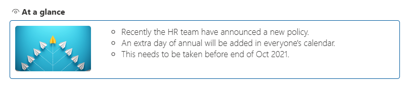
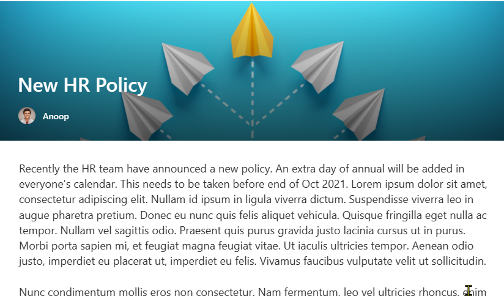
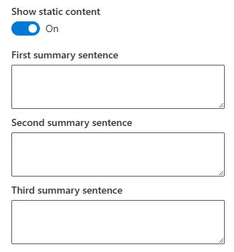

# react-at-a-glance

## Summary

This sample shows a webpart to show the first few sentences of an article in a SharePoint site, so that the article can be looked at a glance.

The idea is based of the *At a glance* section of a news in the BBC news app (beta).

### Highlights
- Usage of `SPHttpClient` or `PnP JS`
- Conditional property enabling
- Usage of regex to get the sentences from article content
- Usage of Carousel for mobile view
- Usage of the width property to control webpart views (small or learge)

## Demo

### Small section / mobile view

### Large section / desktop view

## Screenshot of the article

## Used SharePoint Framework Version

## Applies to

- [SharePoint Framework](https://aka.ms/spfx)
- [Microsoft 365 tenant](https://docs.microsoft.com/en-us/sharepoint/dev/spfx/set-up-your-developer-tenant)

> Get your own free development tenant by subscribing to [Microsoft 365 developer program](http://aka.ms/o365devprogram)

## Prerequisites

> Any special pre-requisites?

## Solution

Solution|Author(s)
--------|---------
react-at-a-glance | [Anoop Tatti](https://linktr.ee/anoopt)

## Version history

Version|Date|Comments
-------|----|--------
1.0|September 09, 2021|Initial release

## Disclaimer

**THIS CODE IS PROVIDED *AS IS* WITHOUT WARRANTY OF ANY KIND, EITHER EXPRESS OR IMPLIED, INCLUDING ANY IMPLIED WARRANTIES OF FITNESS FOR A PARTICULAR PURPOSE, MERCHANTABILITY, OR NON-INFRINGEMENT.**

---

## Minimal Path to Awesome

- Clone this repository
- Ensure that you are at the solution folder
- in the command-line run:
  - **npm install**
  - **gulp serve**
- Open a news article
- Add `?loadSPFX=true&debugManifestsFile=https://localhost:4321/temp/manifests.js` to the URL
- Add the `At a glance` webpart to the page

## Features

The webpart also has properties to show custom text instead of article text. Upto 3 custom sentences can be added in the properties.

## References

- [Getting started with SharePoint Framework](https://docs.microsoft.com/en-us/sharepoint/dev/spfx/set-up-your-developer-tenant)
- [Building for Microsoft teams](https://docs.microsoft.com/en-us/sharepoint/dev/spfx/build-for-teams-overview)
- [Use Microsoft Graph in your solution](https://docs.microsoft.com/en-us/sharepoint/dev/spfx/web-parts/get-started/using-microsoft-graph-apis)
- [Publish SharePoint Framework applications to the Marketplace](https://docs.microsoft.com/en-us/sharepoint/dev/spfx/publish-to-marketplace-overview)
- [Microsoft 365 Patterns and Practices](https://aka.ms/m365pnp) - Guidance, tooling, samples and open-source controls for your Microsoft 365 development