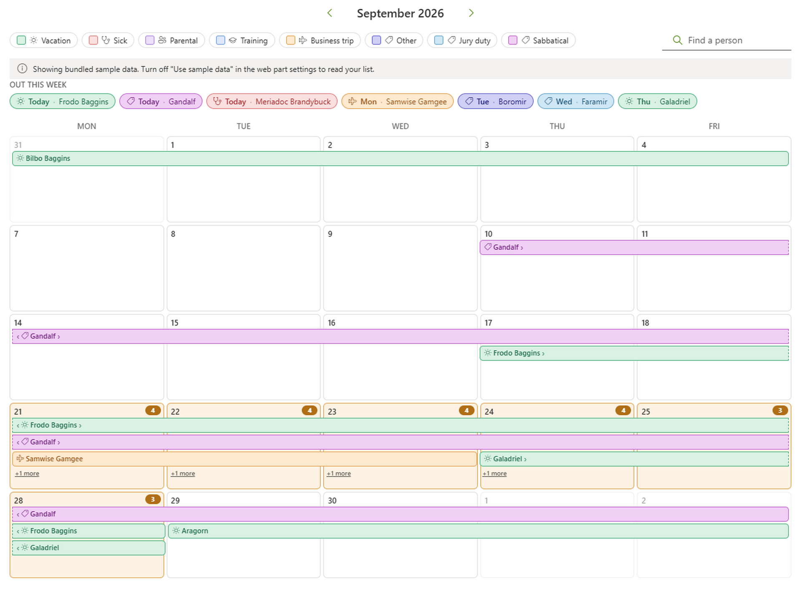
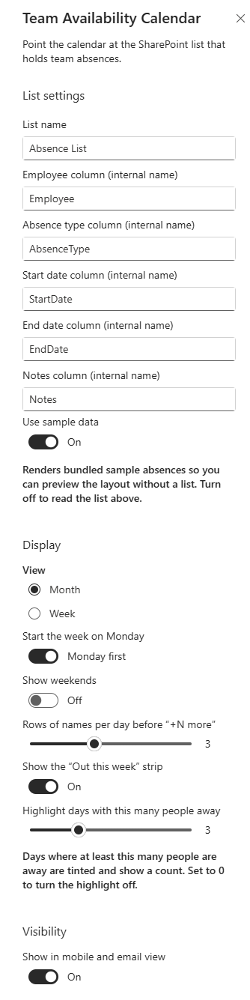

# Team Availability Calendar

## Summary

A SharePoint Framework web part that shows team vacations and absences on a **month calendar**. Each absence is a coloured bar that spans its days across the grid; overlapping absences stack onto separate rows, and when a day has more than fit, a **"+N more"** button opens the full list.

Each bar carries a **type icon**; the **legend doubles as a filter** (select a type to hide it) and a **Find a person** box narrows the grid by name. Days where a configurable number of people are away are **tinted and badged** so clashes stand out. An **Out this week** strip above the grid names everyone away in the next seven days, and selecting any bar — or a busy day — opens a details panel with the person, the absence type, the date range, any notes, and one-click **Email** and **Teams** buttons.

The web part reads one plain SharePoint list. It needs **no Microsoft Graph permissions, no tenant-admin API approval and no Azure Function** — the list title and every column's internal name are configurable, so an existing list can be pointed at as-is. A **Use sample data** toggle renders bundled demo absences so you can preview the layout before the list exists.



## Compatibility

| :warning: Important                                                                                                                                                                                        |
| :-------------------------------------------------------------------------------------------------------------------------------------------------------------------------------------------------------------- |
| Every SPFx version is only compatible with specific versions of Node.js. Before building this sample, make sure your Node.js version matches the one below. This sample has not been tested with other versions. |


> The web part's manifest also lists Teams as a host (`TeamsTab`, `TeamsPersonalApp`), but this sample has been tested only on a SharePoint page.

## Applies to

- [SharePoint Framework](https://aka.ms/spfx)
- [Microsoft 365 tenant](https://learn.microsoft.com/sharepoint/dev/spfx/set-up-your-developer-tenant)

> Get your own free development tenant by subscribing to the [Microsoft 365 developer program](https://aka.ms/o365devprogram).

## Contributors

- [Alexandr Abdulca](https://github.com/Niacrisss)

## Version history

| Version | Date             | Comments                                                                                                                                                                                                                                                                                                          |
| ------- | ---------------- | ------------------------------------------------------------------------------------------------------------------------------------------------------------------------------------------------------------------------------------------------------------------------------------------------------------------------- |
| 1.0     | September 7, 2026 | Initial release. Month and week views; multi-day absence bars with lane stacking, "+N more" overflow and a details panel (Email / Teams); type icons; the legend doubles as type filters, with a person search; a capacity highlight for busy days; absence-type colours read from the list's Choice column; "Out this week" strip; weekend and Monday-start options; sample-data toggle; light/dark palette. |

## Prerequisites

- Node.js `>=22.14.0 <23.0.0`
- A modern SharePoint Online site where you can add a list and edit pages
- **Manage Web** (or site owner) rights on that site to create the list once; readers of the page only need to see the list
- A tenant App Catalog (or a site-collection App Catalog) to deploy the package

You do **not** need: a Microsoft Graph permission grant, SharePoint admin API approval, an Azure Function, or a list on the tenant root site. The list is read with the signed-in user's own permissions through [PnPjs](https://pnp.github.io/pnpjs/).

## Create the absence list

The web part reads one SharePoint list. By default it looks for a list titled **`Team Absences`**, but the list title and every column's **internal name** are configurable in the property pane, so you can point it at a list you already have.

### 1. Add the list

On the target site: **New → List → Blank list**, name it `Team Absences` (or anything — you set the name in the property pane later).

### 2. Add the columns

| Column         | Type                        | Required | Internal name  | Purpose                                                                                       |
| -------------- | --------------------------- | -------- | -------------- | -------------------------------------------------------------------------------------------------- |
| **Employee**   | Person (single)             | Yes      | `Employee`     | Who is away. Drives the name, photo and the Email / Teams buttons.                                |
| **AbsenceType**| Choice                      | Yes      | `AbsenceType`  | `Vacation`, `Sick`, `Parental`, `Training`, `Business trip`, `Other`. Sets the bar colour.       |
| **StartDate**  | Date and Time — **Date Only** | Yes    | `StartDate`    | First day away (inclusive).                                                                        |
| **EndDate**    | Date and Time — **Date Only** | Yes    | `EndDate`      | Last day away (inclusive). Same as **StartDate** for a one-day absence.                            |
| **Notes**      | Multiple lines of text (plain) | No    | `Notes`        | Optional free text shown in the details panel.                                                    |

> **Use Date Only, not Date and Time**, for `StartDate` / `EndDate`. A Date-Only value is stored at midnight and reads back on the day it was entered for every viewer; a Date-and-Time value shifts by the viewer's time zone and can land the bar on the wrong day.

> **Internal names vs. display names.** When you create a column called `StartDate`, SharePoint sets its internal name to `StartDate` too. If you rename a column later, or create one with spaces, the internal name stays frozen at its original value (spaces become `_x0020_`). The property pane asks for **internal names**. To check one: **List settings → click the column →** read the `Field=` value at the end of the URL.

### 3. Add some absences

Add one item per absence: pick the **Employee**, choose an **AbsenceType**, set **StartDate** and **EndDate**. A person can have several rows (a vacation now, training next month). There is no approval column — every row in the list shows on the calendar.

### Choice values and colours

The legend is built from the **AbsenceType** column's declared choices (read from the list schema), so it shows every category the list allows even before anyone has used one. Any extra value found in the data but missing from the choices is appended.

Six built-in types have hand-picked colours, matched case-insensitively with a few synonyms:

| Built-in type   | Matches                                   |
| --------------- | ------------------------------------------- |
| Vacation        | `vacation`, `holiday`, `annual leave`       |
| Sick            | `sick`, `sick leave`                        |
| Parental        | `parental`, `maternity`, `paternity`       |
| Training        | `training`, `course`                        |
| Business trip   | `business trip`, `travel`                   |
| Other           | *(empty value)*                            |

**Any other value keeps its own distinct colour**, generated from the text so it is stable across renders. Add `Conference`, `Sabbatical`, `Jury duty` — each gets a colour and an icon with no code change. To re-pick the built-in colours, edit `KNOWN_COLORS` in [`absenceTypeVisuals.ts`](./src/webparts/teamAvailabilityCalendar/components/absenceTypeVisuals.ts).

## Deploy to your tenant

From the sample folder:

```bash
cd samples/react-availability-calendar
npm install
npm run build        # heft test --clean --production && heft package-solution --production
```

The build writes **`sharepoint/solution/react-availability-calendar.sppkg`**.

Then:

1. Open your **App Catalog** — `https://<tenant>-admin.sharepoint.com` → **More features → Apps → Open**, or the site-collection App Catalog.
2. Upload the `.sppkg`.
3. In the trust dialog, tick **"Make this solution available to all sites in the organization"** if you want it usable everywhere, then **Deploy**. This solution has `skipFeatureDeployment: true`, so no per-site feature activation is needed.
4. If you did **not** make it tenant-wide: on the target site go to **Site contents → New → App**, find **Team Availability Calendar** and add it.

The package contains no API permission requests, so there is nothing to approve in **SharePoint admin → Advanced → API access**.

## Add and configure the web part

1. Edit a modern page. Add a **full-width section** or a **one-column section** (see [Placement](#placement)).
2. Click **+**, and pick **Team Availability Calendar** (it's under the *Advanced* group, calendar icon).
3. Open the web part's **property pane** (pencil icon) and fill in:



### List settings

| Setting                       | Property             | Default         | Description                                                                          |
| ----------------------------- | -------------------- | --------------- | -------------------------------------------------------------------------------------- |
| **List name**                 | `listName`           | `Team Absences` | The **title** of the absence list on the page's own site.                             |
| **Employee column**           | `employeeFieldName`  | `Employee`      | **Internal name** of the Person column.                                               |
| **Absence type column**       | `typeFieldName`      | `AbsenceType`   | **Internal name** of the Choice column.                                               |
| **Start date column**         | `startDateFieldName` | `StartDate`     | **Internal name** of the Date-Only start column.                                      |
| **End date column**           | `endDateFieldName`   | `EndDate`       | **Internal name** of the Date-Only end column.                                        |
| **Notes column**              | `notesFieldName`     | `Notes`         | **Internal name** of the notes column.                                               |
| **Use sample data**           | `useMockData`        | Off             | Renders bundled demo absences and skips the list entirely. Handy before the list exists, or for the hosted/local workbench. |

### Display

| Setting                            | Property            | Default            | Description                                                                    |
| ---------------------------------- | ------------------- | ------------------ | ------------------------------------------------------------------------------ |
| **View**                            | `viewMode`          | Month              | **Month** — the full grid. **Week** — one taller week row; the arrows move a week at a time and the title shows the week's date range. Both honour the weekend and Monday-start settings. |
| **Start the week on Monday**        | `startWeekOnMonday` | On                 | Switches the grid and the weekday header. Ignored when weekends are hidden (always Monday-first). |
| **Show weekends**                   | `showWeekends`      | Off                | Off gives a five-column Mon–Fri grid; a Fri→Mon vacation joins across the gap. On gives the full seven columns. |
| **Rows of names per day before "+N more"** | `maxLanesPerDay` | 3            | 1–6. How many stacked bars a day cell shows before collapsing the rest.       |
| **Show the "Out this week" strip**  | `showOutThisWeek`   | On                 | The summary row above the grid.                                               |
| **Highlight days with this many people away** | `capacityWarningThreshold` | 3    | Days where at least this many people (after any filter) are away get a tint and a count badge. `0` turns it off. |

On the page, the **legend chips double as filters** — select a type to hide it — and the **Find a person** box filters bars by name. A **Show all** link clears both. The capacity highlight and "Out this week" reflect whatever the filters leave visible.

If a column name is wrong, the calendar still renders what it can: the person expand is retried without profile fields so dates still show, a warning is logged to the browser console, and a red message bar explains what to check.

## How it connects to your data

Everything runs as the signed-in user through PnPjs (`spfi().using(SPFx(context))`) — no tokens to broker, no permissions to grant.

| Step | Call | Notes |
| ---- | ---- | ----- |
| Load absences | `web.lists.getByTitle('<list>').items.select(…).expand('<employee>').filter("<start> le '…' and <end> ge '…'").top(5000)` | One request per month view, for a window a little wider than the visible grid. Rows are clipped to the grid client-side. |
| Load type choices | `web.lists.getByTitle('<list>').fields.getByInternalNameOrTitle('<type>').select('Choices')` | Once per list, to build the legend. Falls back to the types found in the data if the field is not a Choice column. |
| Person photo | `_layouts/15/userphoto.aspx?size=M&username=<email>` | The endpoint the SharePoint UI itself uses; works even when the My Site host isn't provisioned. |
| Contact | `mailto:<email>` and `https://teams.microsoft.com/l/chat/0/0?users=<email>` | Opens Outlook / a Teams chat with the person. |

Date-only values are parsed from the leading `YYYY-MM-DD` of the returned string, so a bar lands on the day the author picked regardless of the viewer's time zone.

## Placement

> **Use this web part in a full-width or one-column section.** The calendar is a five- or seven-column grid with fixed-height cells; in a narrow column the day cells become too small to read names.

## Minimal Path to Awesome

- Clone this repository (or [download this solution as a .ZIP file](https://pnp.github.io/download-partial/?url=https://github.com/pnp/sp-dev-fx-webparts/tree/main/samples/react-availability-calendar) then unzip it)
- From your command line, change your current directory to the directory containing this sample (`react-availability-calendar`, located under `samples`)
- In the command line run:
  - `npm install`
  - `npm run start`
- Open the **hosted** workbench on a site that has the absence list: `https://<tenant>.sharepoint.com/sites/<site>/_layouts/15/workbench.aspx`. To try it without a list, add the web part and turn on **Use sample data** in the property pane (this also works in the local workbench).

> This sample can also be opened with [VS Code Remote Development](https://code.visualstudio.com/docs/remote/remote-overview). Visit <https://aka.ms/spfx-devcontainer> for further instructions.

To run the unit tests:

- `heft test`

To produce the deployable package:

- `npm run build` — writes `sharepoint/solution/react-availability-calendar.sppkg`

Other build commands: `heft --help`.

## Features

This web part illustrates the following concepts:

- Reading a SharePoint list with **PnPjs** in SPFx — `select` / `expand` on a Person column, an OData date-range `filter`, and a graceful retry when the expand fails
- Laying out **multi-day event bars**: clipping each absence to a week row, greedy lane assignment for overlaps, continuation markers, per-day overflow and capacity counting — all in a pure, unit-tested module ([`utils/calendarUtils.ts`](./src/webparts/teamAvailabilityCalendar/utils/calendarUtils.ts))
- The same layout code driving both a **whole-month grid** and a **single-week row**
- A five-column Mon–Fri mode where a run of days joins across the hidden weekend
- Reading a Choice field's declared values from the list schema, and generating a **stable colour per category** from its text so custom values need no configuration
- Client-side **filtering** — legend chips as type toggles, a name search — recomputed with `useMemo`
- A **capacity highlight**: days at or over a configurable head-count are tinted and badged
- Fluent UI `Panel`, `Persona`, `SearchBox`, `MessageBar`, `Icon` and `IconButton` in a React 17 SPFx web part
- Theme-aware styling with CSS custom properties and a light/dark palette that also reaches Fluent's `Layer` (the details panel)
- Reading user photos and opening Outlook / Teams **without a Graph permission grant**
- A bundled sample-data mode so the web part previews with no list

## Notes

- `EndDate` is **inclusive**; a single-day absence has `StartDate` equal to `EndDate`.
- An `EndDate` earlier than `StartDate` is treated as a single day on `StartDate`.
- With weekends hidden, an absence that falls **only** on a Saturday/Sunday does not appear on the grid — it still shows in **Out this week** and in a day's details if that day is visible.
- A day cell shows `maxLanesPerDay` bars, then a **"+N more"** button that opens everyone away that day in the details panel.
- Filters are view-only and per-session — they never change the list, and reload with the page.
- The bundled sample data uses fictional characters on the `@contoso.com` domain, with two entries (`Sabbatical`, `Jury duty`) that are deliberately *not* standard types, to show custom categories getting their own colour.
- The capacity badge and tint count everyone whose range covers the day, even those collapsed into "+N more".
- The server query caps at 5000 rows per month view — ample for a team absence list, and a guard against a mis-pointed list.

## References

- [Getting started with SharePoint Framework](https://learn.microsoft.com/sharepoint/dev/spfx/set-up-your-developer-tenant)
- [Overview of the SharePoint Framework Heft-based build](https://learn.microsoft.com/sharepoint/dev/spfx/toolchain/heft-overview)
- [PnPjs — @pnp/sp](https://pnp.github.io/pnpjs/)
- [Deploy your client-side solution to the App Catalog](https://learn.microsoft.com/sharepoint/dev/spfx/toolchain/deploy-to-a-sharepoint-library)
- [Build web parts for Microsoft Teams](https://learn.microsoft.com/sharepoint/dev/spfx/build-for-teams-overview)
- [Microsoft 365 Patterns and Practices](https://aka.ms/m365pnp)

## Help

We do not support samples, but this community is always willing to help, and we want to improve these samples. We use GitHub to track issues, which makes it easy for community members to volunteer their time and help resolve issues.

If you're having issues building the solution, please run [spfx doctor](https://pnp.github.io/cli-microsoft365/cmd/spfx/spfx-doctor/) from within the solution folder to diagnose incompatibility issues with your environment.

If you encounter any issues while using this sample, [create a new issue](https://github.com/pnp/sp-dev-fx-webparts/issues/new?assignees=&labels=Needs%3A+Triage+%3Amag%3A%2Ctype%3Abug-suspected%2Csample%3A%20react-availability-calendar&template=bug-report.yml&sample=react-availability-calendar&authors=@Niacrisss&title=react-availability-calendar%20-%20).

For questions regarding this sample, [create a new question](https://github.com/pnp/sp-dev-fx-webparts/issues/new?assignees=&labels=Needs%3A+Triage+%3Amag%3A%2Ctype%3Aquestion%2Csample%3A%20react-availability-calendar&template=question.yml&sample=react-availability-calendar&authors=@Niacrisss&title=react-availability-calendar%20-%20).

Finally, if you have an idea for improvement, [make a suggestion](https://github.com/pnp/sp-dev-fx-webparts/issues/new?assignees=&labels=Needs%3A+Triage+%3Amag%3A%2Ctype%3Aenhancement%2Csample%3A%20react-availability-calendar&template=suggestion.yml&sample=react-availability-calendar&authors=@Niacrisss&title=react-availability-calendar%20-%20).

> Share your web part with others through the Microsoft 365 Patterns and Practices program to get visibility and exposure. More about the community, open-source projects and other activities at [aka.ms/m365pnp](https://aka.ms/m365pnp).

## Disclaimer

**THIS CODE IS PROVIDED *AS IS* WITHOUT WARRANTY OF ANY KIND, EITHER EXPRESS OR IMPLIED, INCLUDING ANY IMPLIED WARRANTIES OF FITNESS FOR A PARTICULAR PURPOSE, MERCHANTABILITY, OR NON-INFRINGEMENT.**


