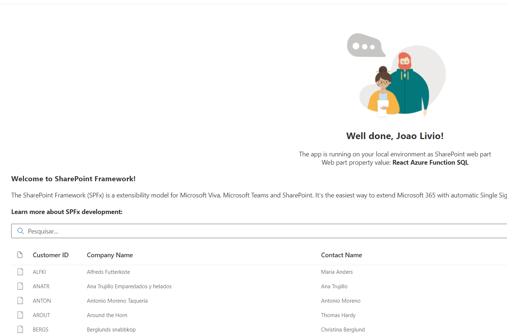

# Consume Northwind Microsoft database from Azure using a Function App 

## Summary

This web part consume an anonymous Function App from an HTTP Trigger using the templates from the Northwind Microsoft DBs
You must create a database in azure and run the scripts

- [Here](https://github.com/microsoft/sql-server-samples/blob/master/samples/databases/northwind-pubs/readme.md)

## Compatibility

| :warning: Important          |
|:---------------------------|
| Every SPFx version is only compatible with specific version(s) of Node.js. In order to be able to build this sample, please ensure that the version of Node on your workstation matches one of the versions listed in this section. This sample will not work on a different version of Node.|
|Refer to <https://aka.ms/spfx-matrix> for more information on SPFx compatibility.   |

This sample is optimally compatible with the following environment configuration:

-Incompatible-red.svg "SharePoint Server 2016 Feature Pack 2 requires SPFx 1.1")

For more information about SPFx compatibility, please refer to <https://aka.ms/spfx-matrix>

## Applies to

- [SharePoint Framework](https://learn.microsoft.com/sharepoint/dev/spfx/sharepoint-framework-overview)
- [Microsoft 365 tenant](https://learn.microsoft.com/sharepoint/dev/spfx/set-up-your-development-environment)

> Get your own free development tenant by subscribing to [Microsoft 365 developer program](http://aka.ms/m365devprogram)

## Contributors

* [Joao Livio](https://github.com/jtlivio)

## Version history

| Version | Date             | Comments        |
| ------- | ---------------- | --------------- |
| 1.0     | August 15, 2022 | Initial release |

## Minimal Path to Awesome

- Clone this repository (or [download this solution as a .ZIP file](https://pnp.github.io/download-partial/?url=https://github.com/pnp/sp-dev-fx-webparts/tree/main/samples/react-azurefunction-northwind2) then unzip it)
- From your command line, change your current directory to the directory containing this sample (`react-azurefunction-northwind2`, located under `samples`)
- in the command line run:
  - `npm install`
  - `gulp serve`

## Features

- Consume a Function app from SQL Server
- No Authentication is active, only the url code for the Function, must change
- [Uses react controls (Listview)](https://pnp.github.io/sp-dev-fx-controls-react/)
- [Uses react property controls](https://pnp.github.io/sp-dev-fx-property-controls/)

## References

- [Go and create a database in Azure](https://github.com/Microsoft/sql-server-samples/tree/master/samples/databases/northwind-pubs)
- [Create your first Function](https://docs.microsoft.com/en-us/sharepoint/dev/spfx/build-for-teams-overview)
- [Microsoft 365 Patterns and Practices](https://aka.ms/m365pnp)

## Function Code

- [Code for your Function](https://github.com/jtlivio/react-azurefunction-northwind/blob/master/FunctionCode.cs)

## Suggestion

- Use a Serverless Database
- Use a Pay as You Go Model in your function
- In Production use Key Vault for your Connection String

## Secure your Function with AAD
- [Securing Azure Functions](https://docs.microsoft.com/en-us/azure/azure-functions/security-concepts?tabs=v4)
- [Configure your App Service or Azure Functions app to use Azure AD login](https://docs.microsoft.com/en-us/azure/app-service/configure-authentication-provider-aad)

## aadHttpClientFactory

- [Connect to Azure AD applications using the AadHttpClient](https://docs.microsoft.com/en-us/sharepoint/dev/spfx/use-aadhttpclient)

## Help

We do not support samples, but this community is always willing to help, and we want to improve these samples. We use GitHub to track issues, which makes it easy for  community members to volunteer their time and help resolve issues.

If you're having issues building the solution, please run [spfx doctor](https://pnp.github.io/cli-microsoft365/cmd/spfx/spfx-doctor/) from within the solution folder to diagnose incompatibility issues with your environment.

You can try looking at [issues related to this sample](https://github.com/pnp/sp-dev-fx-webparts/issues?q=label%3A%22sample%3A%20react-azurefunction-northwind2%22) to see if anybody else is having the same issues.

You can also try looking at [discussions related to this sample](https://github.com/pnp/sp-dev-fx-webparts/discussions?discussions_q=react-azurefunction-northwind2) and see what the community is saying.

If you encounter any issues using this sample, [create a new issue](https://github.com/pnp/sp-dev-fx-webparts/issues/new?assignees=&labels=Needs%3A+Triage+%3Amag%3A%2Ctype%3Abug-suspected%2Csample%3A%20react-azurefunction-northwind2&template=bug-report.yml&sample=react-azurefunction-northwind2&authors=@jtlivio&title=react-azurefunction-northwind2%20-%20).

For questions regarding this sample, [create a new question](https://github.com/pnp/sp-dev-fx-webparts/issues/new?assignees=&labels=Needs%3A+Triage+%3Amag%3A%2Ctype%3Aquestion%2Csample%3A%20react-azurefunction-northwind2&template=question.yml&sample=react-azurefunction-northwind2&authors=@jtlivio&title=react-azurefunction-northwind2%20-%20).

Finally, if you have an idea for improvement, [make a suggestion](https://github.com/pnp/sp-dev-fx-webparts/issues/new?assignees=&labels=Needs%3A+Triage+%3Amag%3A%2Ctype%3Aenhancement%2Csample%3A%20react-azurefunction-northwind2&template=suggestion.yml&sample=react-azurefunction-northwind2&authors=@jtlivio&title=react-azurefunction-northwind2%20-%20).

## Disclaimer

**THIS CODE IS PROVIDED _AS IS_ WITHOUT WARRANTY OF ANY KIND, EITHER EXPRESS OR IMPLIED, INCLUDING ANY IMPLIED WARRANTIES OF FITNESS FOR A PARTICULAR PURPOSE, MERCHANTABILITY, OR NON-INFRINGEMENT.**

