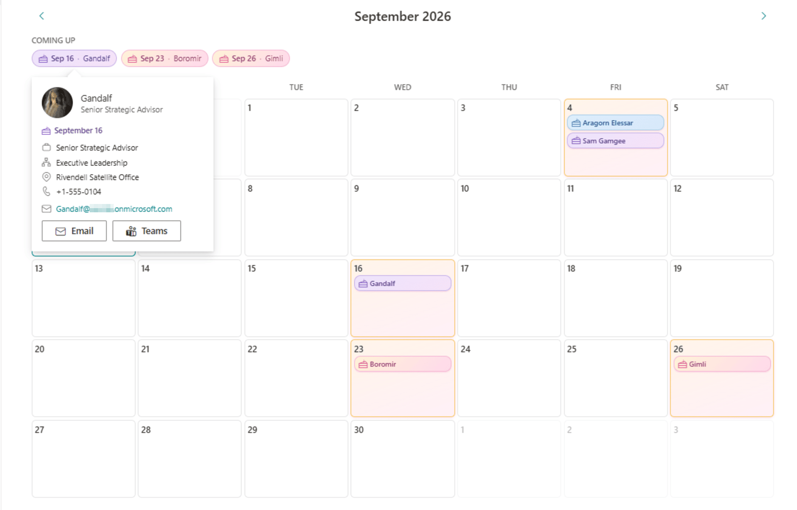

# Birthday Calendar View

## Summary

A SharePoint Framework web part that shows your team's birthdays on a month calendar. Each birthday appears as a coloured pill in its day cell; clicking one opens a person card with department, job title, office and phone pulled from the SharePoint user profile, plus one-click **Email** and **Teams** buttons to send a greeting.

A **Coming up** strip above the grid lists the next few birthdays so people don't have to go hunting for them.

The web part reads a plain SharePoint list that people opt into. It needs **no Microsoft Graph permissions, no tenant-admin API approval and no Azure Function** — every column name is configurable, so an existing list can be pointed at as-is.



## Compatibility

| :warning: Important                                                                                                                                                                                        |
| :-------------------------------------------------------------------------------------------------------------------------------------------------------------------------------------------------------------- |
| Every SPFx version is only compatible with specific versions of Node.js. Before building this sample, make sure your Node.js version matches the one below. This sample has not been tested with other versions. |


-Incompatible-red.svg "SharePoint Server 2016 Feature Pack 2 requires SPFx 1.1")


> The web part's manifest also lists Teams as a host (`TeamsTab`, `TeamsPersonalApp`), but this sample has been tested only on a SharePoint page.

## Applies to

- [SharePoint Framework](https://aka.ms/spfx)
- [Microsoft 365 tenant](https://learn.microsoft.com/sharepoint/dev/spfx/set-up-your-developer-tenant)

> Get your own free development tenant by subscribing to the [Microsoft 365 developer program](https://aka.ms/o365devprogram).

## Contributors

- [Alexandr Abdulca](https://github.com/Niacrisss)

## Version history

| Version | Date              | Comments                                                                                                                        |
| ------- | ----------------- | ----------------------------------------------------------------------------------------------------------------------------------- |
| 1.0     | September 6, 2026 | Initial release: month grid, person cards, "Coming up" strip, Email/Teams greetings, Monday start option, light/dark palette. |

## Prerequisites

- Node.js `>=22.14.0 <23.0.0`
- A modern SharePoint Online site where you can add a list and edit pages
- **Manage Web** (or site owner) rights on that site to create the list once; readers of the page only need to see the list
- A tenant App Catalog (or a site-collection App Catalog) to deploy the package

You do **not** need: a Microsoft Graph permission grant, SharePoint admin API approval, an Azure Function, or a list on the tenant root site. Profile details are read with the signed-in user's own permissions through `SP.UserProfiles.PeopleManager`.

## Create the birthday list

The web part reads one SharePoint list. By default it looks for a list titled **`BDay`** with three columns, but the list title and every column's **internal name** are configurable in the property pane, so you can point it at a list you already have.

### 1. Add the list

On the target site: **New → List → Blank list**, name it `BDay` (or anything — you'll set the name in the property pane later).

### 2. Add the columns

| Column       | Type              | Required | Purpose                                                                                         |
| ------------ | ----------------- | -------- | ------------------------------------------------------------------------------------------------- |
| **Title**    | Single line text  | Yes      | Fallback display name, used when no person is linked. This column already exists on a new list.   |
| **BDate**    | Date (date only)  | Yes      | The birthday. **Only the month and day are read** — the year is ignored, so any year is fine.     |
| **Person**   | Person            | No       | Links the entry to a real user, which is what lets the person card show profile details.          |

> **Internal names vs. display names.** When you create a column called `BDate`, SharePoint sets its internal name to `BDate` too. But if you rename a column later, or create one with spaces or non-English characters, the internal name stays frozen at its original value (spaces become `_x0020_`). The property pane asks for **internal names**. To check one: **List settings → click the column →** read the `Field=` value at the end of the URL.

### 3. Add some birthdays

Add one item per person. Set **Person** to the user so their card shows department / job title / office / phone and the Email and Teams buttons appear. Leave **Person** blank and just fill **Title** if you only want a name with no card details.

Nothing here needs a year or an age — enter `1990-09-16` or `2000-09-16`, the calendar shows both as **September 16**.

## Deploy to your tenant

From the sample folder:

```bash
cd samples/birthday-calendar
npm install
npm run build        # heft test --production && heft package-solution --production
```

The build writes **`sharepoint/solution/sp-fx-bday-calendar-view.sppkg`**.

Then:

1. Open your **App Catalog** — `https://<tenant>-admin.sharepoint.com` → **More features → Apps → Open**, or the site-collection App Catalog at `https://<tenant>.sharepoint.com/sites/<appcatalog>/AppCatalog`.
2. Upload the `.sppkg`.
3. In the trust dialog, tick **"Make this solution available to all sites in the organization"** if you want it usable everywhere, then **Deploy**. This solution has `skipFeatureDeployment: true`, so no per-site feature activation is needed.
4. If you did **not** make it tenant-wide: on the target site go to **Site contents → New → App**, find **SPFx-Bday-CalendarView** and add it.

The package contains no API permission requests, so there is nothing to approve in **SharePoint admin → Advanced → API access**.

## Add and configure the web part

1. Edit a modern page. Add a **full-width section** or a **one-column section** (see [Placement](#placement)).
2. Click **+**, and pick **Birthday Calendar View** (it's under the *Advanced* group, cake/calendar icon).
3. Open the web part's **property pane** (pencil icon) and fill in:

### List settings

| Setting                          | Property         | Default   | Description                                                                                                    |
| -------------------------------- | ---------------- | --------- | -------------------------------------------------------------------------------------------------------------- |
| **Site URL**                     | `siteUrl`        | *(blank)* | Absolute URL of the site holding the list. Leave blank to use the page's own site.                             |
| **List name**                    | `listName`       | `BDay`    | The **title** of the birthday list.                                                                            |
| **Birthday date column**         | `dateFieldName`  | `BDate`   | **Internal name** of the date column.                                                                          |
| **Person column**                | `personFieldName`| `Person`  | **Internal name** of the Person column. Leave blank to show names only, with no profile lookup and no card.    |

### Display

| Setting                      | Property            | Default              | Description                                                             |
| ---------------------------- | ------------------- | -------------------- | --------------------------------------------------------------------------- |
| **Start the week on Monday** | `startWeekOnMonday` | Off (Sunday first)   | Switches both the grid and the weekday header row.                         |
| **Colour mode**              | `themeMode`         | Match the site theme | Pin the birthday palette to `Always light` / `Always dark` instead of following the site theme. |

If the person-column name is wrong, the calendar still renders: it falls back to a plain query so the dates show, logs a warning to the browser console, and each person card explains that no profile is linked.

## How it connects to your data

Everything runs as the signed-in user, with `SPHttpClient` — no libraries to configure, no tokens to broker.

| Step | Call | Notes |
| ---- | ---- | ----- |
| Load birthdays | `GET _api/web/lists/getbytitle('<list>')/items?$select=Id,Title,<date>,<person>/Title,<person>/EMail,<person>/Name&$expand=<person>&$top=500` | Paged via `odata.nextLink`. Only the month/day of `<date>` are kept. |
| Load a person card | `GET _api/SP.UserProfiles.PeopleManager/GetPropertiesFor(accountName=@v)` | Reads `DisplayName`, `Title` (job title), `Department` / `SPS-Department`, `Office` / `SPS-Location`, `WorkPhone`. Cached per user for the life of the page. |
| Person photo | `_layouts/15/userphoto.aspx?size=L&username=<email>` | The endpoint the SharePoint UI itself uses; works even when the My Site host isn't provisioned. |
| Send a greeting | `mailto:` link, and `https://teams.microsoft.com/l/chat/0/0?users=<email>&message=<greeting>` | Opens Outlook / Teams with the subject and message pre-filled. |

Why a list and not Entra ID: `user.birthday` in Microsoft Graph can't be queried in bulk, needs tenant-wide `User.Read.All`, and is empty for most users because it's a self-service Delve field. A list people opt into is accurate and needs no admin grant.

## Placement

> **Use this web part in a full-width or one-column section.** The calendar is a seven-column grid with fixed-height cells; in a narrow column the day cells become too small to read names. A responsive list view for narrow columns is a possible future addition.

## Minimal Path to Awesome

- Clone this repository (or [download this solution as a .ZIP file](https://pnp.github.io/download-partial/?url=https://github.com/pnp/sp-dev-fx-webparts/tree/main/samples/react-birthday-calendar) then unzip it)
- From your command line, change your current directory to the directory containing this sample (`react-birthday-calendar`, located under `samples`)
- In the command line run:
  - `npm install`
  - `npm run start`
- Open the **hosted** workbench on a site that has the birthday list: `https://<tenant>.sharepoint.com/sites/<site>/_layouts/15/workbench.aspx` (the local workbench has no list or user-profile service, so it can't run this web part)

> This sample can also be opened with [VS Code Remote Development](https://code.visualstudio.com/docs/remote/remote-overview). Visit <https://aka.ms/spfx-devcontainer> for further instructions.

To run the unit tests:

- `heft test`

To produce the deployable package:

- `npm run build` — writes `sharepoint/solution/sp-fx-bday-calendar-view.sppkg`

Other build commands: `heft --help`.

## Features

This web part illustrates the following concepts:

- Reading a SharePoint list with `SPHttpClient`, including `$expand` on a Person column and paging through `odata.nextLink`
- Reading user-profile properties (department, job title, office, phone) with **no Graph permission grant**, using `SP.UserProfiles.PeopleManager`
- Fluent UI `Callout`, `Persona` and `MessageBar` in a React 17 SPFx web part
- Theme-aware styling with CSS custom properties fed from `onThemeChanged`, plus an author override in the property pane
- Deep links that open Outlook or a Teams chat with a pre-filled birthday greeting
- Keeping date arithmetic in a pure, unit-tested module (`utils/calendarUtils.ts`) — including the 29 February case

## Notes

- Only the month and day of each date are used, so entries never need updating and no ages are shown or stored.
- Birthdays on **29 February** are shown on **28 February** in common years rather than disappearing for three years at a time.
- The **Coming up** strip lists the next five birthdays within the next 60 days.
- A day cell shows up to three pills, then a **"+N more"** button that opens the rest in a callout.

## References

- [Getting started with SharePoint Framework](https://learn.microsoft.com/sharepoint/dev/spfx/set-up-your-developer-tenant)
- [Overview of the SharePoint Framework Heft-based build](https://learn.microsoft.com/sharepoint/dev/spfx/toolchain/heft-overview)
- [Connect to SharePoint APIs — `SPHttpClient`](https://learn.microsoft.com/sharepoint/dev/spfx/connect-to-sharepoint)
- [Deploy your client-side solution to the App Catalog](https://learn.microsoft.com/sharepoint/dev/spfx/toolchain/deploy-to-a-sharepoint-library)
- [Build web parts for Microsoft Teams](https://learn.microsoft.com/sharepoint/dev/spfx/build-for-teams-overview)
- [Microsoft 365 Patterns and Practices](https://aka.ms/m365pnp)

## Help

We do not support samples, but this community is always willing to help, and we want to improve these samples. We use GitHub to track issues, which makes it easy for community members to volunteer their time and help resolve issues.

If you're having issues building the solution, please run [spfx doctor](https://pnp.github.io/cli-microsoft365/cmd/spfx/spfx-doctor/) from within the solution folder to diagnose incompatibility issues with your environment.

If you encounter any issues while using this sample, [create a new issue](https://github.com/pnp/sp-dev-fx-webparts/issues/new?assignees=&labels=Needs%3A+Triage+%3Amag%3A%2Ctype%3Abug-suspected%2Csample%3A%20react-birthday-calendar&template=bug-report.yml&sample=react-birthday-calendar&authors=@Niacrisss&title=react-birthday-calendar%20-%20).

For questions regarding this sample, [create a new question](https://github.com/pnp/sp-dev-fx-webparts/issues/new?assignees=&labels=Needs%3A+Triage+%3Amag%3A%2Ctype%3Aquestion%2Csample%3A%20react-birthday-calendar&template=question.yml&sample=react-birthday-calendar&authors=@Niacrisss&title=react-birthday-calendar%20-%20).

Finally, if you have an idea for improvement, [make a suggestion](https://github.com/pnp/sp-dev-fx-webparts/issues/new?assignees=&labels=Needs%3A+Triage+%3Amag%3A%2Ctype%3Aenhancement%2Csample%3A%20react-birthday-calendar&template=suggestion.yml&sample=react-birthday-calendar&authors=@Niacrisss&title=react-birthday-calendar%20-%20).

> Share your web part with others through the Microsoft 365 Patterns and Practices program to get visibility and exposure. More about the community, open-source projects and other activities at [aka.ms/m365pnp](https://aka.ms/m365pnp).

## Disclaimer

**THIS CODE IS PROVIDED *AS IS* WITHOUT WARRANTY OF ANY KIND, EITHER EXPRESS OR IMPLIED, INCLUDING ANY IMPLIED WARRANTIES OF FITNESS FOR A PARTICULAR PURPOSE, MERCHANTABILITY, OR NON-INFRINGEMENT.**


