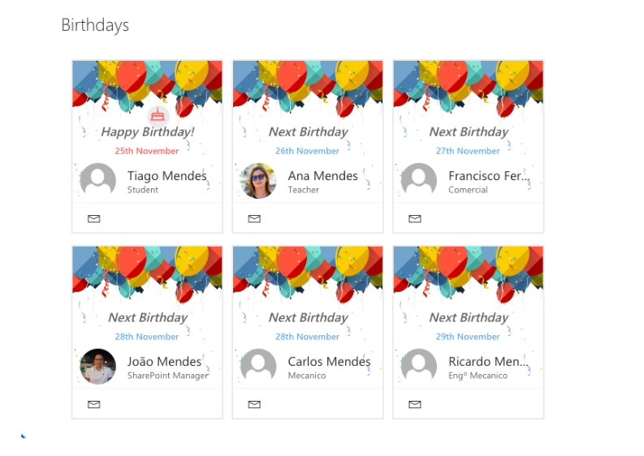

# Birthdays

## Summary
The Web Part Birthdays shows the upcoming birthdays in the company, the web part reads birthdays from a list located on the tenant's root site with title "Birthdays."

Now is possible to the user select an image for the background in the properties of the web part.

There is an Azure function available that get AAD user birthdays, this function creates a list on the tenant root site, if it does not exist.
See the local.settings.json for details on the required application variable located in SyncUsersBirthdaysFunction folder.

But you can synchronize the Birthdays list with other applications HR Systems, or other sources

## Compatibility

 

 

## Applies to

* [SharePoint Framework](https://docs.microsoft.com/sharepoint/dev/spfx/sharepoint-framework-overview)
* [Office 365 tenant](https://docs.microsoft.com/sharepoint/dev/spfx/set-up-your-development-environment)

## Prerequisites
 
Existing list in tenant root site, with the Title "Birthdays"  and columns:

Column Internal Name|Type|Required| comments
--------------------|----|--------|----------
JobTitle| Text| no|
Birthday| DateTime | true|
userAADGUID| Text| no | required if used Azure Function to get Birthdays from AAD
Title| Text| true
email| Text| true

> **IMPORTANT:** After create a column Index on column "Birthday"

## Solution

Solution|Author(s)
--------|---------
react Birthday Web Part|[João Mendes](https://github.com/joaojmendes)
react Birthday Web Part|[Sajal Maity](https://github.com/smaity)

## Version history

Version|Date|Comments
-------|----|--------
1.0.0|November 6, 2018|Initial release
1.1.0|July 23, 2019 | new version
2.0.0|June 16, 2021 | Upgraded to SPFx 1.12.1

## Minimal Path to Awesome

- Clone this repository
- in the command line run:
  - `npm install`
  - `gulp build`
  - `gulp bundle --ship`
  - `gulp package-solution --ship`
  - Add and Deploy Package to AppCatalog
  - Go to API Management - from SharePoint Admin Center new experience,  and Approve the Permission Require to Use Graph API SCOPES

>  This sample can also be opened with [VS Code Remote Development](https://code.visualstudio.com/docs/remote/remote-overview). Visit https://aka.ms/spfx-devcontainer for further instructions.

## Features
This project contains sample Birthday web parts built on the SharePoint Framework using React
and an Azure Function to get user Birthdays from AAD.
This sample illustrates the following concepts on top of the SharePoint Framework:
- using React for building SharePoint Framework client-side web parts
- using React components for building Birthday web part
- using MSGraph API to get data from SharePoint Lists 
- using MSGraph API to read users from AAD
- using @PnP/PnPjs to create a List, add, update, delete Items.

## Help

We do not support samples, but we this community is always willing to help, and we want to improve these samples. We use GitHub to track issues, which makes it easy for  community members to volunteer their time and help resolve issues.

If you're having issues building the solution, please run [spfx doctor](https://pnp.github.io/cli-microsoft365/cmd/spfx/spfx-doctor/) from within the solution folder to diagnose incompatibility issues with your environment.

If you encounter any issues while using this sample, [create a new issue](https://github.com/pnp/sp-dev-fx-webparts/issues/new?assignees=&labels=Needs%3A+Triage+%3Amag%3A%2Ctype%3Abug-suspected%2Csample%3A%20react-birthdays&template=bug-report.yml&sample=react-birthdays&authors=@smaity%20@joaojmendes&title=react-birthdays%20-%20).

For questions regarding this sample, [create a new question](https://github.com/pnp/sp-dev-fx-webparts/issues/new?assignees=&labels=Needs%3A+Triage+%3Amag%3A%2Ctype%3Aquestion%2Csample%3A%20react-birthdays&template=question.yml&sample=react-birthdays&authors=@smaity%20@joaojmendes&title=react-birthdays%20-%20).

Finally, if you have an idea for improvement, [make a suggestion](https://github.com/pnp/sp-dev-fx-webparts/issues/new?assignees=&labels=Needs%3A+Triage+%3Amag%3A%2Ctype%3Aenhancement%2Csample%3A%20react-birthdays&template=question.yml&sample=react-birthdays&authors=@smaity%20@joaojmendes&title=react-birthdays%20-%20).

## Disclaimer

**THIS CODE IS PROVIDED *AS IS* WITHOUT WARRANTY OF ANY KIND, EITHER EXPRESS OR IMPLIED, INCLUDING ANY IMPLIED WARRANTIES OF FITNESS FOR A PARTICULAR PURPOSE, MERCHANTABILITY, OR NON-INFRINGEMENT.**

