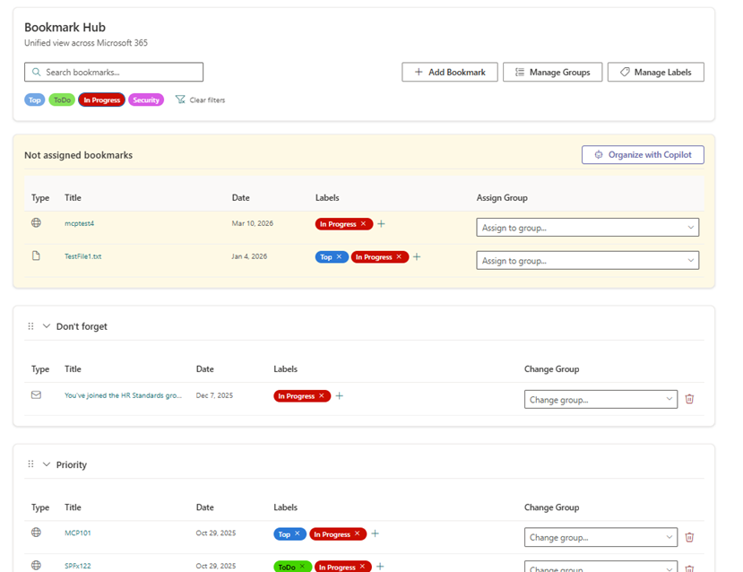
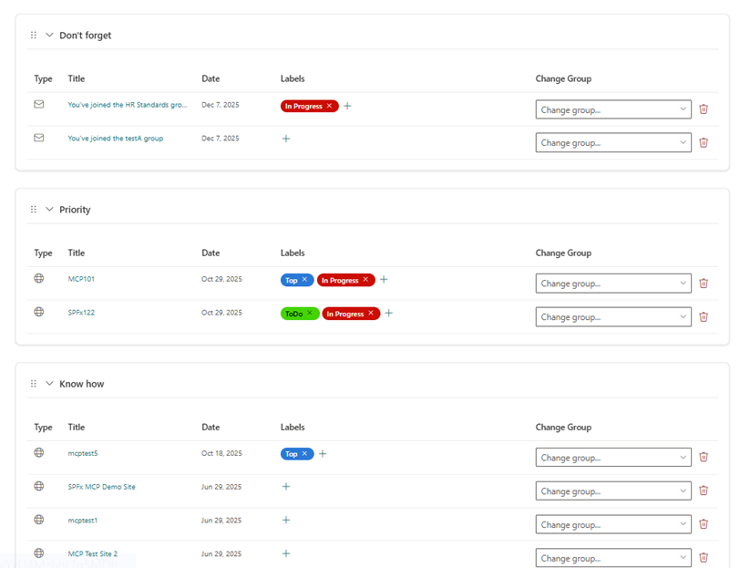
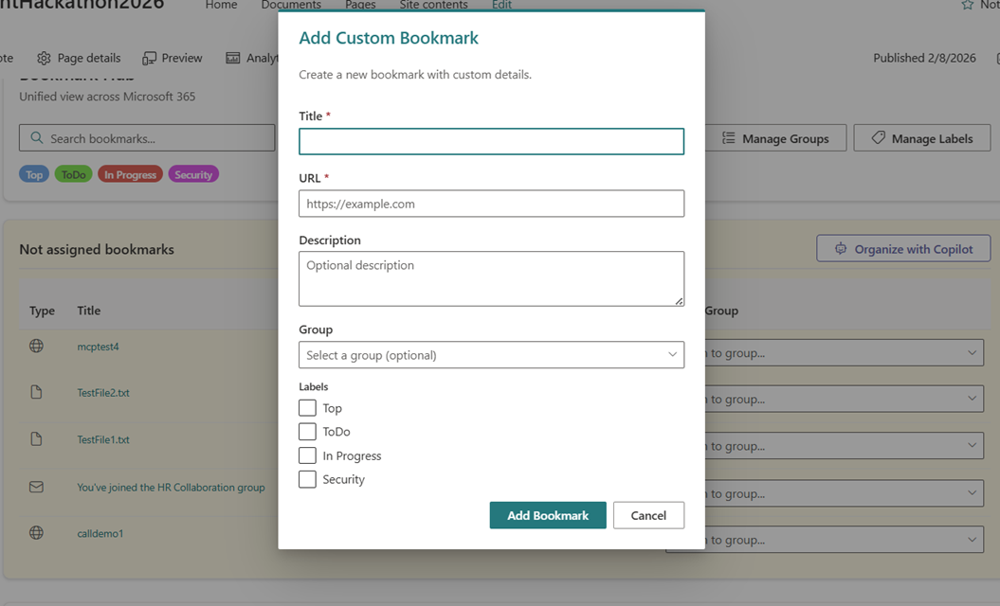
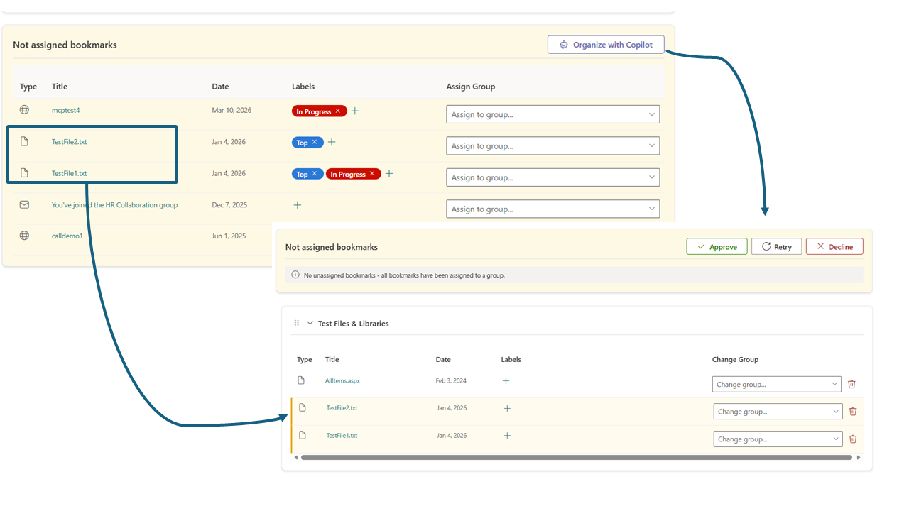
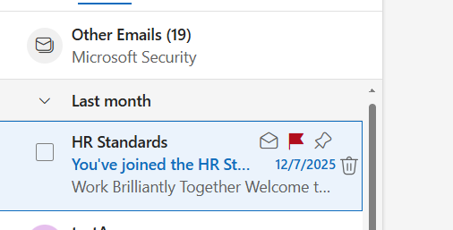
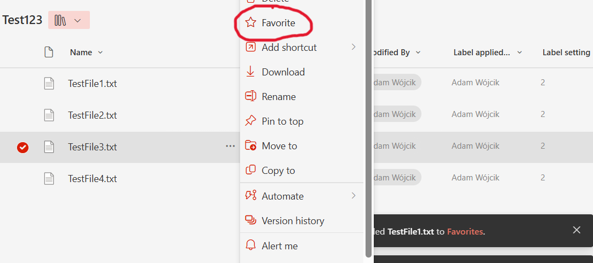
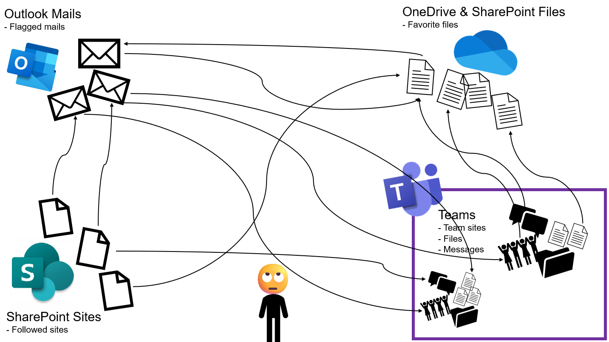

# Bookmark Hub

## Summary

Bookmark Hub will allow you to easily find and organize all your flagged emails 📧, favorite files 📎, followed sites 🌐, and any custom URLs you might add, in simple and well organized table groups with labels 🏷️. This solution will allow you to bring together all loose ends that are stored outside of your well organized team in Teams. 

Stop correlating your Teams messages with hundreds of flagged emails or searching for the relevant followed document for your current work 🔍, instead organize all your bookmarked URLs (mails, files, sites, messages...) into meaningful groups like: 'Don't forget' 🚩, 'Priority' ⭐, 'Knowledge base' 📚, or something more meaningful connected to your projects and work. Use labels to easily find and filter out your bookmarks. 

Easily extend your flagged emails, followed sites and favorite files with any custom URLs you want to add more context to your work.

The application may easily be used as a full page SharePoint application, Microsoft 365 app, and a Teams personal app 🚀.

Use Microsoft Copilot to suggest current or new groups for your bookmarks and start your organization journey with a little help of AI 🤖✨.

## Motivation

Microsoft Teams is our 'single point' platform that allows to organize all of our work in a structured and unified, easy to search way. At least this is what it was supposed to do. 🤔 To some extent this is correct as Microsoft Teams allows us to organize our work and projects into Teams. 

Each Team groups together: 

- conversations by organizing them in channels, 💬 
- emails by having group email boxes, 📧 
- SharePoint activities and files by having a team site correlated with each team 📁

This works perfectly for most of the use case but as we all now, life is never that simple, and there are always some loose ends we need to remember about and 'manually' correlate them with our work and projects. I'm thinking about: 

- those shared files we need to remember about 📎
- or just files stored outside of our Teams team, kept on our OneDrive or some different SharePoint site ☁️
- Those other SharePoint sites totally not connected in any way with our project 🌐
- Those important emails we need to remember that related to our work or project ✉️

All those loose ends we need to remember about and we start: 

- flagging emails, 

- following sites, 

- and adding files to favorite

...  All this so we don't forget 🚩 

The problem is that it is still not organized. It is just 'saved for later not to forget'. That's when CHAOS enters our work and projects. 🌪️

What if we could correlate all those 'saved for later' followed sites, favorite files, bookmarked messages, flagged emails... and organize them with labels and groups so it all has some meaning. ✨ 

## Compatibility

| :warning: Important          |
|:---------------------------|
| Every SPFx version is optimally compatible with specific versions of Node.js. In order to be able to Toolchain this sample, you need to ensure that the version of Node on your workstation matches one of the versions listed in this section. This sample will not work on a different version of Node.|
|Refer to <https://aka.ms/spfx-matrix> for more information on SPFx compatibility.   |

This sample is optimally compatible with the following environment configuration:

-Incompatible-red.svg "SharePoint Server 2016 Feature Pack 2 requires SPFx 1.1")

 

## Applies to

* [SharePoint Framework](https://learn.microsoft.com/sharepoint/dev/spfx/sharepoint-framework-overview)
* [Microsoft 365 tenant](https://learn.microsoft.com/sharepoint/dev/spfx/set-up-your-development-environment)

> Get your own free development tenant by subscribing to [Microsoft 365 developer program](https://aka.ms/m365/devprogram)

## Contributors

* [Adam Wójcik](https://github.com/Adam-it)
* [Saurabh Tripathi](https://github.com/Saurabh7019)
* [Nico De Cleyre](https://github.com/nicodecleyre)

## Version history

|Version|Date|Comments|
|-------|----|--------|
|1.0|March 14, 2026|Initial release|

## Prerequisites

- In order to use AI capabilities of the web part to organize your bookmarks using Microsoft Copilot suggestions you will need to have an active copilot license.
- After you build and package and deploy the webpart to your tenant you need to consent to the following Web API permission using the SharePoint admin portal: `Sites.Read.All`, `Mail.Read`, `Files.ReadWrite`, `People.Read.All`, `OnlineMeetingTranscript.Read.All`, `Chat.Read`, `ChannelMessage.Read.All`, `ExternalItem.Read.All` 
- It is not required but it would be good to have at least a few favorite sites, followed documents and flagged emails in order to have some bookmarks to organize

## Minimal path to awesome

* Clone this repository (or [download this solution as a .ZIP file](https://pnp.github.io/download-partial/?url=https://github.com/pnp/sp-dev-fx-webparts/tree/main/samples/react-bookmark-hub) then unzip it)

To just build and run the sample in the workbench, please follow the below guidance:

* From your command line, change your current directory to the directory containing this sample (`react-bookmark-hub`, located under `samples`)
* in the command line run:
  * `npm install`
  * `heft start`

To build, package and deploy the solution to a tenant, please follow the below guidance:

* From your command line, change your current directory to the directory containing this sample (`react-bookmark-hub`, located under `samples`)
* in the command line run:
  * `npm install`
  * `heft build --production`
  * `heft package-solution --production`
* Deploy the generated .sppkg file from the `sharepoint/solution` folder to your tenant's app catalog

### Pro Tip - SPFx Toolkit ⭐

Use [SPFx Toolkit VS Code extension](https://marketplace.visualstudio.com/items?itemName=m365pnp.viva-connections-toolkit) to streamline building, testing, deploying, installing and everything that is needed for your SPFx project.

Using [SPFx Toolkit Task view](https://marketplace.visualstudio.com/items?itemName=m365pnp.viva-connections-toolkit) You may simply use the `publish` task to build, package your solution. 

Then use the [deploy action](https://marketplace.visualstudio.com/items?itemName=m365pnp.viva-connections-toolkit) to deploy the .sppkg file to your tenant's app catalog without leaving VS Code. 

You may even install the web part to any site on your tenant using the [install management capability](https://pnp.github.io/vscode-viva/features/management-capabilities/#app-catalogs-management)

> This sample can also be opened with [VS Code Remote Development](https://code.visualstudio.com/docs/remote/remote-overview). Visit <https://aka.ms/spfx-devcontainer> for further instructions.

## Features

This Web Part illustrates the following concepts on top of the SharePoint Framework:

* Using Microsoft Copilot Chat API in order to add AI capabilities to your web part. Works only with active copilot license.
* Using [PnPjs](https://pnp.github.io/pnpjs/) which is a collection of fluent libraries for consuming SharePoint, Graph, and Office 365 REST APIs in a type-safe way. The web part demonstrates how to use PnPjs to interact with Ms Graph API.
* Using [Fluent UI React](https://developer.microsoft.com/en-us/fluentui) to build UI compatible with Microsoft 365 design guidelines and SharePoint Online look and feel.

<!--
RESERVED FOR REPO MAINTAINERS

We'll add the video from the community call recording here

## Video

-->

## Help

We do not support samples, but this community is always willing to help, and we want to improve these samples. We use GitHub to track issues, which makes it easy for  community members to volunteer their time and help resolve issues.

If you're having issues building the solution, please run [spfx doctor](https://pnp.github.io/cli-microsoft365/cmd/spfx/spfx-doctor/) from within the solution folder to diagnose incompatibility issues with your environment.

You can try looking at [issues related to this sample](https://github.com/pnp/sp-dev-fx-webparts/issues?q=label%3A%22sample%3A%20YOUR-SOLUTION-NAME%22) to see if anybody else is having the same issues.

You can also try looking at [discussions related to this sample](https://github.com/pnp/sp-dev-fx-webparts/discussions?discussions_q=YOUR-SOLUTION-NAME) and see what the community is saying.

If you encounter any issues using this sample, [create a new issue](https://github.com/pnp/sp-dev-fx-webparts/issues/new?assignees=&labels=Needs%3A+Triage+%3Amag%3A%2Ctype%3Abug-suspected%2Csample%3A%20YOUR-SOLUTION-NAME&template=bug-report.yml&sample=YOUR-SOLUTION-NAME&authors=@YOURGITHUBUSERNAME&title=YOUR-SOLUTION-NAME%20-%20).

For questions regarding this sample, [create a new question](https://github.com/pnp/sp-dev-fx-webparts/issues/new?assignees=&labels=Needs%3A+Triage+%3Amag%3A%2Ctype%3Aquestion%2Csample%3A%20YOUR-SOLUTION-NAME&template=question.yml&sample=YOUR-SOLUTION-NAME&authors=@YOURGITHUBUSERNAME&title=YOUR-SOLUTION-NAME%20-%20).

Finally, if you have an idea for improvement, [make a suggestion](https://github.com/pnp/sp-dev-fx-webparts/issues/new?assignees=&labels=Needs%3A+Triage+%3Amag%3A%2Ctype%3Aenhancement%2Csample%3A%20YOUR-SOLUTION-NAME&template=suggestion.yml&sample=YOUR-SOLUTION-NAME&authors=@YOURGITHUBUSERNAME&title=YOUR-SOLUTION-NAME%20-%20).

## Disclaimer

**THIS CODE IS PROVIDED *AS IS* WITHOUT WARRANTY OF ANY KIND, EITHER EXPRESS OR IMPLIED, INCLUDING ANY IMPLIED WARRANTIES OF FITNESS FOR A PARTICULAR PURPOSE, MERCHANTABILITY, OR NON-INFRINGEMENT.**

