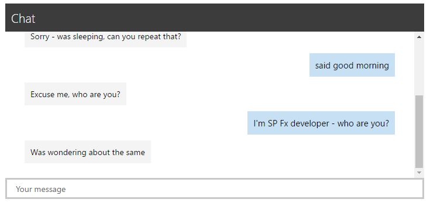

# Microsoft Bot Framework Web Chat

## Summary

| Name | Image |Description |  
|:------------:|------------|------------|
|Bot Framework v4 Web Part||A web part that uses the [botframework-webchat module](https://www.npmjs.com/package/botframework-webchat) to create implement a React component to render the Bot Framework v4 webchat component. This web part is able to render Text and richt attachments (Images, Cards, Adaptive Cards, ...) and has settings for branding purposes.|
|Bot Framework v3 Web Part||A web part that acts as a web chat component for bot's built on the Microsoft Bot Framework using the DirectLine API. When sending messages the web part uses the username of the currently logged in user. The web part has settings for color for branding purposes.|

You can see this web part sample, including a sample VS 2015 bot application in practice from [PnP SPFx Special Interest Group recording](https://youtu.be/Tv03CU_PmVs?t=1329)
where sample was demonstrated.

## Compatibility

 

-Incompatible-red.svg "SharePoint Server 2016 Feature Pack 2 requires SPFx 1.1")

## Applies to

* [SharePoint Framework Developer](https://docs.microsoft.com/sharepoint/dev/spfx/sharepoint-framework-overview)
* [Office 365 developer tenant](https://docs.microsoft.com/sharepoint/dev/spfx/set-up-your-developer-tenant)
* [Microsoft Bot Framework](http://dev.botframework.com)

## Prerequisites

> You need to have a bot created and registered using the Microsoft Bot Framework and registered to use the DirectLine Channel,
which will give you the secret needed when adding this web part to the page.  For more information on creating a bot and registering
the channel you can see the official web site at [dev.botframework.com](http://dev.botframework.com), as well as various tutorials
over at [www.garypretty.co.uk/category/microsoft-bot-framework/](http://www.garypretty.co.uk/category/microsoft-bot-framework/) & [Stephan Bisser's blog](https://bisser.io)

See more details on how to create a bot from following locations.

* [Getting started with the Connector](https://docs.botframework.com/en-us/csharp/builder/sdkreference/gettingstarted.html) - MS Bot Framework documentation
* [Creating your first bot with the Microsoft Bot Framework – Part 1 – Build and test locally](http://www.garypretty.co.uk/2016/07/14/creating-your-first-bot-with-the-microsoft-bot-framework-part-1/) - [@GaryPretty](https://twitter.com/GaryPretty)
* [Creating your first bot with the Microsoft Bot Framework – Part 2 – publishing and chatting through Skype](http://www.garypretty.co.uk/2016/07/16/creating-your-first-bot-with-the-microsoft-bot-framework-part-2/)- [@GaryPretty](https://twitter.com/GaryPretty)
* [Create a QnA Bot with Azure Bot Service v4](https://docs.microsoft.com/en-us/azure/cognitive-services/qnamaker/tutorials/create-qna-bot)

> Notice that you can find simplistic bot implemented with Visual Studio 2015 using the bot templates (Oct 2016)
under the [vs2015-bot-application](./vs2015-bot-application) folder. This is simplistic bot based on above blog posts, which responses random string back.

## Solution

Solution|Author(s)
--------|---------
bot-framework | [Gary Pretty](https://github.com/garypretty) ([@garypretty](http://www.twitter.com/garypretty), [garypretty.co.uk](www.garypretty.co.uk))
|web part v4| [Stephan Bisser](https://github.com/stephanbisser) ([@stephanbisser](https://twitter.com/stephanbisser), [bisser.io](https://bisser.io))
|Upgrade to SPFx 1.10.0| [Harsha Vardhini](https://github.com/Harshagracy) ([@harshagracy](https://twitter.com/harshagracy))

## Version history

Version|Date|Comments
-------|----|--------
1.0|October 11th, 2016|Initial release
1.1|Jan 24th, 2017|Updated to RC0
1.2|Feb 23rd, 2017|Initial load bug fix
1.3|February 8, 2018|Updated to SPFx 1.7
1.4|September 4, 2019|Added BotFramework webchat v4
1.5|April 15, 2020|Upgraded to SPFx 1.10.0

## Minimal Path to Awesome

- Clone this repository
- in the command line run:
  - `npm install`
  - `gulp serve`

>  This sample can also be opened with [VS Code Remote Development](https://code.visualstudio.com/docs/remote/remote-overview). Visit https://aka.ms/spfx-devcontainer for further instructions.

- Register your bot in the Microsoft Bot Framework Portal, configure the DirectLine channel on the bot and obtain your DirectLine secret.

## Features
This Web Part illustrates the following concepts on top of the SharePoint Framework:

- Connecting and communicating with a bot built on the Microsoft Bot Framework using the DirectLine Channel
- Validating Property Pane Settings
- Office UI Fabric
- React

When adding the web part to a page you need to obtain your bot's DirectLine channel secret via the [Azure Portal](http://portal.azure.com).
You then add this secret via the Property Pane of the web part. If there is an error initializing the DirectLine Client with the bot then they will be shown in the console within the browser.

You can add DirectLine channel to bot from the bot details page under the "Add a featured channel" section

After this, you can click Edit for the just added Channel to get the needed secret for the client side web part.

Additional settings can be set to style the web part, including:

|Version|Description|
|-------|----|
|[v3](./src/webparts/botFrameworkChat) & [v4](./src/webparts/botFrameworkChatv4) | Foreground / background colors for messages & sendbox, both from the user and from the bot|
|[v4](./src/webparts/botFrameworkChatv4)| Add avatar images or initials for both user and bot|
|[v4](./src/webparts/botFrameworkChatv4)| Hide upload button in sendbox|
|[v3](./src/webparts/botFrameworkChat)| Display title of the web part|
|[v3](./src/webparts/botFrameworkChat)| Web part header background color|
|[v3](./src/webparts/botFrameworkChat)| Placeholder text|

Currently the [Bot Framework Webchat v3 web part](./src/webparts/botFrameworkChat) only supports plain text conversations with a bot. Other message types, such as Rich Cards and Attachments are not supported, so in order to use that, use the [Bot Framework Webchat v4 web part](./src/webparts/botFrameworkChatv4)

## Help

We do not support samples, but we this community is always willing to help, and we want to improve these samples. We use GitHub to track issues, which makes it easy for  community members to volunteer their time and help resolve issues.

If you're having issues building the solution, please run [spfx doctor](https://pnp.github.io/cli-microsoft365/cmd/spfx/spfx-doctor/) from within the solution folder to diagnose incompatibility issues with your environment.

You can try looking at [issues related to this sample](https://github.com/pnp/sp-dev-fx-webparts/issues?q=label%3A%22sample%3A%20react-bot-framework") to see if anybody else is having the same issues.

You can also try looking at [discussions related to this sample](https://github.com/pnp/sp-dev-fx-webparts/discussions?discussions_q=react-bot-framework) and see what the community is saying.

If you encounter any issues while using this sample, [create a new issue](https://github.com/pnp/sp-dev-fx-webparts/issues/new?assignees=&labels=Needs%3A+Triage+%3Amag%3A%2Ctype%3Abug-suspected%2Csample%3A%20react-bot-framework&template=bug-report.yml&sample=react-bot-framework&authors=@Harshagracy%20@stephanbisser%20@garypretty&title=react-bot-framework%20-%20).

For questions regarding this sample, [create a new question](https://github.com/pnp/sp-dev-fx-webparts/issues/new?assignees=&labels=Needs%3A+Triage+%3Amag%3A%2Ctype%3Aquestion%2Csample%3A%20react-bot-framework&template=question.yml&sample=react-bot-framework&authors=@Harshagracy%20@stephanbisser%20@garypretty&title=react-bot-framework%20-%20).

Finally, if you have an idea for improvement, [make a suggestion](https://github.com/pnp/sp-dev-fx-webparts/issues/new?assignees=&labels=Needs%3A+Triage+%3Amag%3A%2Ctype%3Aenhancement%2Csample%3A%20react-bot-framework&template=question.yml&sample=react-bot-framework&authors=@Harshagracy%20@stephanbisser%20@garypretty&title=react-bot-framework%20-%20).

## Disclaimer

**THIS CODE IS PROVIDED *AS IS* WITHOUT WARRANTY OF ANY KIND, EITHER EXPRESS OR IMPLIED, INCLUDING ANY IMPLIED WARRANTIES OF FITNESS FOR A PARTICULAR PURPOSE, MERCHANTABILITY, OR NON-INFRINGEMENT.**

