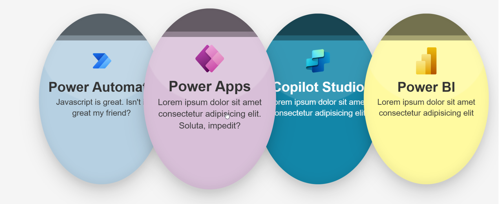

# React Bubble Template

## Summary
Displays SharePoint list items as interactive circular bubbles. Each bubble can show an optional logo, title, optional description and act as a link. The bubbles use customizable background and text colors, and a soft shadow to give a lifted appearance. On hover bubbles gently enlarge and return to their original size.

## SharePoint List
Create (or reuse) a Custom List (default view OK). Recommended columns:

| Column | Type | Required | Notes |
|--------|------|----------|-------|
| Title | Single line | Yes | Bubble title |
| Description | Multiple lines (Plain) | No | Shown if present |
| Icon | Single line (Text) | No | Image URL (PNG/SVG/JPG/Data URI) |
| BackgroundColor | Single line (Text) | No | Hex (fallback palette if missing) |
| Color | Single line (Text) | No | Text/logo color hex (defaults to `#FFFFFF`) |
| Url | Single line (or Hyperlink) | No | Destination link (opens in new tab) |

## Web Part Property
| Property | Description |
|----------|-------------|
| listName | Title of the SharePoint list supplying data |

## Features
- Data‑driven bubbles (rendered from a SharePoint list)
- Custom background & text colors (per item)
- Soft, layered shadow for a lifted circle look
- Gentle hover scale with smooth return to original size
- Clickable bubbles that open links in a new tab

### UX details
- Hover effect: bubbles scale up slightly and gain z-index priority.
- The bubble shadow and subtle inset gradient create depth without additional decorative elements.

### Build and Test
1. `npm i`
2. `gulp build`
3. `gulp serve --nobrowser`
4. Open hosted workbench: `https://<tenant>.sharepoint.com/sites/<site>/_layouts/15/workbench.aspx`
5. Add the web part and set the List name.

## Troubleshooting

If something does not work:

1. Run environment diagnostics:
   `npx @pnp/cli-microsoft365 spfx doctor`
2. Confirm Node + SPFx version compatibility: https://aka.ms/spfx-matrix
3. Clear old build artifacts:
   `gulp clean && gulp build`

Community support (GitHub Issues in pnp/sp-dev-fx-webparts):

- Report a bug:
  https://github.com/pnp/sp-dev-fx-webparts/issues/new?labels=Needs%3A+Triage+%3Amag%3A,type%3Abug-suspected&template=bug-report.yml&sample=react-bubble-template&title=react-bubble-template%3A+Bug
- Ask a question:
  https://github.com/pnp/sp-dev-fx-webparts/issues/new?labels=Needs%3A+Triage+%3Amag%3A,type%3Aquestion&template=question.yml&sample=react-bubble-template&title=react-bubble-template%3A+Question
- Suggest an enhancement:
  https://github.com/pnp/sp-dev-fx-webparts/issues/new?labels=Needs%3A+Triage+%3Amag%3A,type%3Aenhancement&template=feature-request.yml&sample=react-bubble-template&title=react-bubble-template%3A+Enhancement

(Replace any outdated template names if the repo updates its issue forms.)

## Disclaimer
**THIS CODE IS PROVIDED *AS IS* WITHOUT WARRANTY OF ANY KIND, EITHER EXPRESS OR IMPLIED, INCLUDING ANY IMPLIED WARRANTIES OF FITNESS FOR A PARTICULAR PURPOSE, MERCHANTABILITY, OR NON-INFRINGEMENT.**

</README>