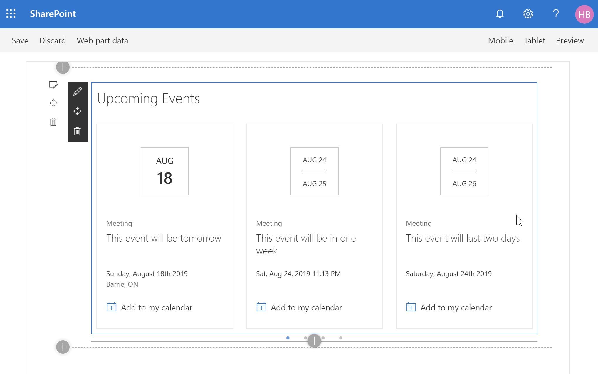

# React Calendar Feed Web Part

## Summary

This web part uses event feeds from various sources and renders events using a look and feel that is consistent with the SharePoint out-of-the-box Group calendar/events web part.

It supports the following types of feeds:

- iCal
- WordPress
- RSS
- Exchange Public Calendar
- SharePoint

The web part was designed to allow other calendar feed types (or any other type of data you'd like to show as events). If you have additional feeds that you'd like to support, please contact the author or submit a pull request.

Like the SharePoint event web parts, this web part renders a film-strip view when placed on a single column page, and renders a list view when placed in narrow column (e.g.: 3 column layout), or when viewed on a mobile device.

To improve performance, the web part caches the events to the user's local storage (so that it doesn't retrieve the events every time the user visits the page). You can turn off the cache by setting the cache duration to 0 minutes.

For more information about how this solution was built, including some design decisions and information on how you can extend this example to allow additional event feed provider, visit https://tahoeninjas.blog/creating-a-calendar-feed-web-part.

## Used SharePoint Framework Version

## Applies to

- [SharePoint Framework](https:/dev.office.com/sharepoint)
- [Office 365 tenant](https://dev.office.com/sharepoint/docs/spfx/set-up-your-development-environment)

## Prerequisites

Before you can use this web part example, you will need one of the following:

- A publicly-accessible iCal feed (i.e.: .ics)
- A publicly-accessible RSS feed of events (e.g.: Google calendar)
- A WordPress WP-FullCalendar feed
- An Exchange Public Calendar

It is important that all feeds do not require authentication. Also, make sure that your calendar includes upcoming events, as the web part will filter out evens that are earlier than today's date.

If your feed supports filtering by dates, you can specify **{s}** in the URL where the start date should be inserted, and the web part will automatically replace the **{s}** placeholder with today's date. Similarly, you can specify **{e}** in the URL where you wish the end date to be inserted, and the web part will automatically replace the placeholder for the end date, as determined by the date range you select.

## Solution

Solution|Author(s)
--------|---------
react-calendar-feed | Hugo Bernier ([Tahoe Ninjas](http://tahoeninjas.blog), @bernierh)

## Version history

Version|Date|Comments
-------|----|--------
1.0|May 15, 2018|Initial release
2.0|June 25, 2018|Converted to SPFx 1.5 and added Exchange Public Calendar support
3.0|November 9, 2018|Converted to SPFx 1.7; Added SharePoint Calendar feed
4.0|January 16, 2019|Converted to SPFx 1.7.1; Removed NPM libraries associated with issue #708.
5.0|August 17, 2019|Converted to SPFx 1.9.1; Refreshed carousel code; Addresses #735, #909. Also added **Convert from UTC** option to handle feeds which do not provide time zone information.

## Disclaimer

**THIS CODE IS PROVIDED *AS IS* WITHOUT WARRANTY OF ANY KIND, EITHER EXPRESS OR IMPLIED, INCLUDING ANY IMPLIED WARRANTIES OF FITNESS FOR A PARTICULAR PURPOSE, MERCHANTABILITY, OR NON-INFRINGEMENT.**

---

## Minimal Path to Awesome

- Clone this repository
- in the command line run:
  - `npm install`
  - `gulp serve`
- Insert the web part on a page
- When prompted to configure the web part, select **Configure** to launch the web part property pane.
- Select a feed type (RSS, iCal, WordPress, or Mock if using the debug solution)
- Provide the feed's URL. If using _Mock_, provide any valid URL (value will be ignored). If you wish to use a SharePoint calendar feed, provide the URL to the list (e.g.: https://yourtenant.sharepoint.com/sites/sitename/lists/eventlistname)
- Specify a date range (one week, two weeks, one month, one quarter, one year)
- Specify a maximum number of events to retrieve
- If necessary, specify to use a proxy. Use this option if you encounter issues where your feed provider does not accept your tenant URL as a CORS origin.
- If desired, specify how long (in minutes) you want to expire your users' local storage and refresh the events.

## Features

This Web Part illustrates the following concepts on top of the SharePoint Framework:

- Rendering different views based on size
- Loading third-party CSS from a CDN
- Excluding mock data from production build
- Using @pnp/spfx-property-controls
- Using @pnp/spfx-controls-react
- Using localStorage to cache results locally
- Creating shared components and services
- Creating extensible services
- Using a proxy to resolve CORS issues
- Retrieving SharePoint events from a list with a filter

