# Calendar

## Summary

This Web Part allows you to manage events in a calendar. 
Uses a list of existing calendars on any website.
The location and name of the list and the dates of the events to be displayed are defined in the properties of the web part.

Each category has its own color that is generated in the load.

The Web Part checks the user's permissions for the View, Add, Edit, and Delete events.

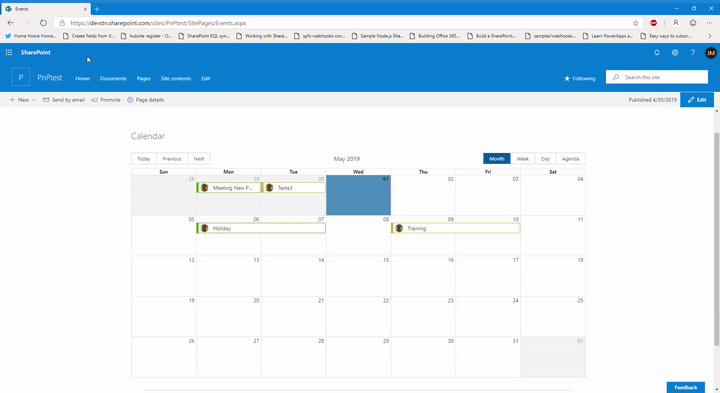 

 

 

 

##  Web Part  - Screenshots

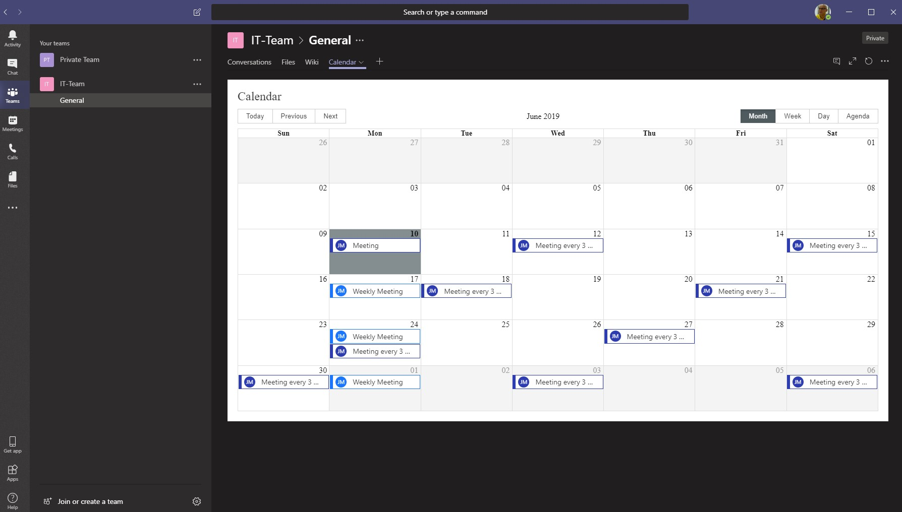

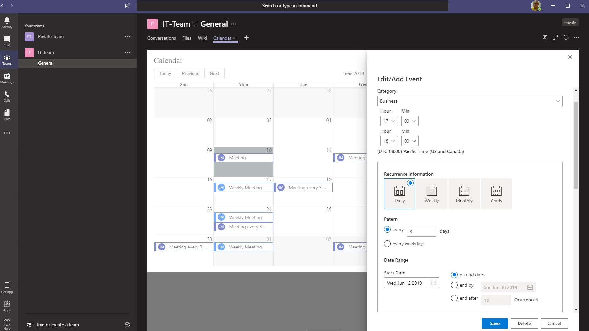

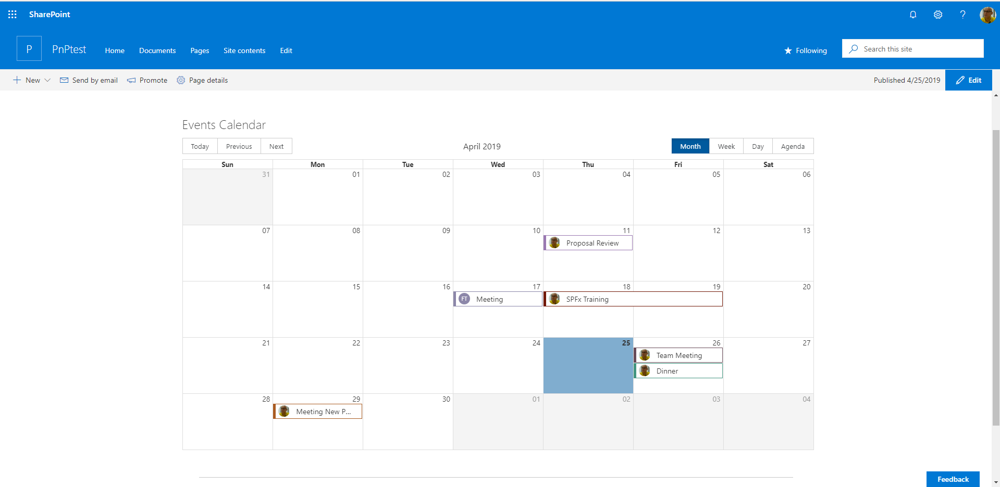

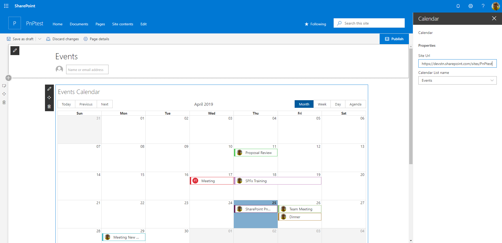

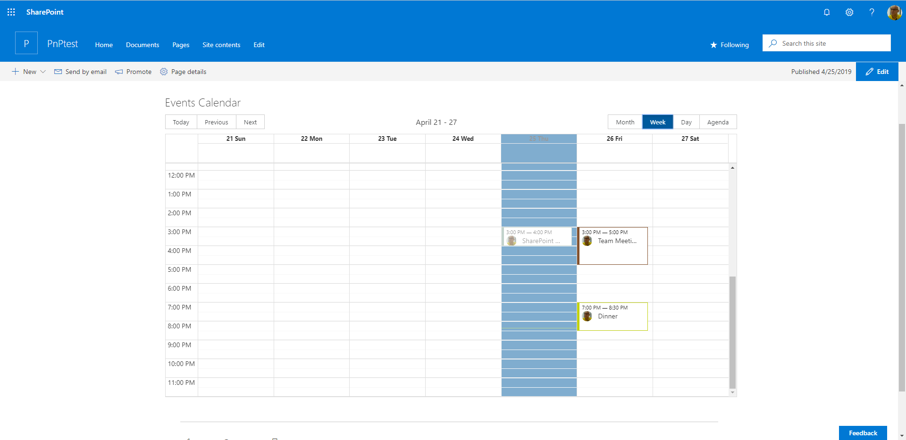

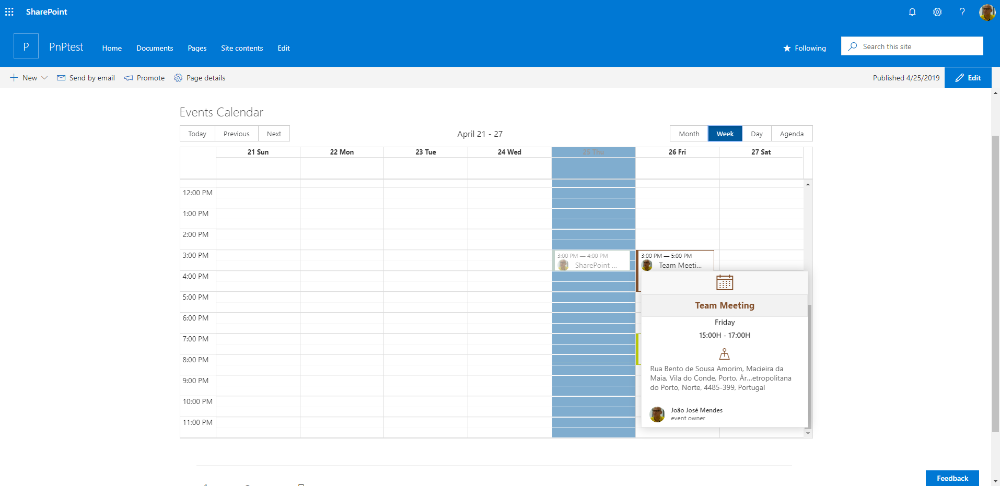

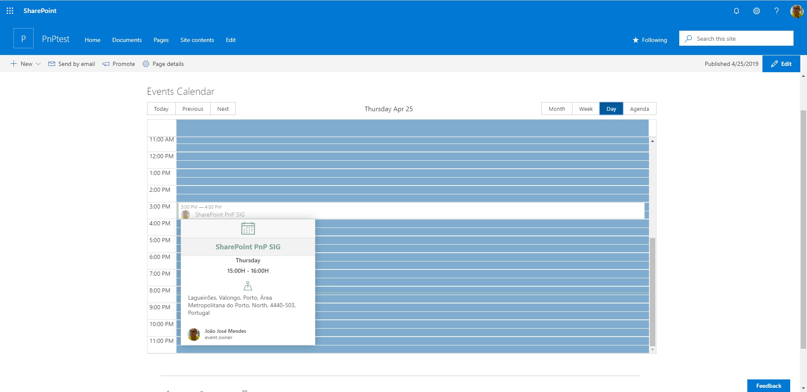

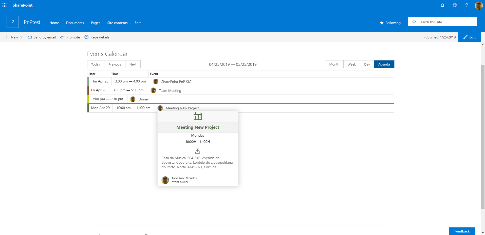

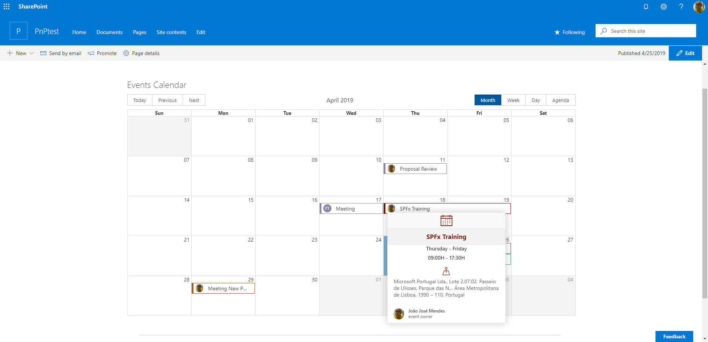

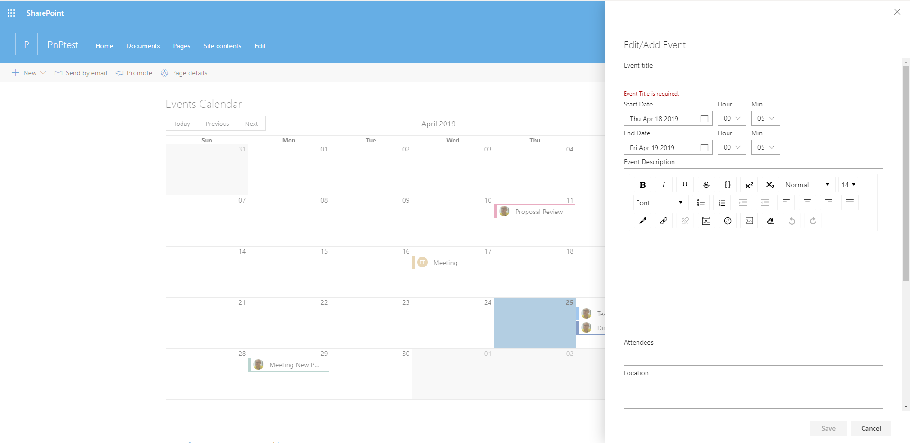

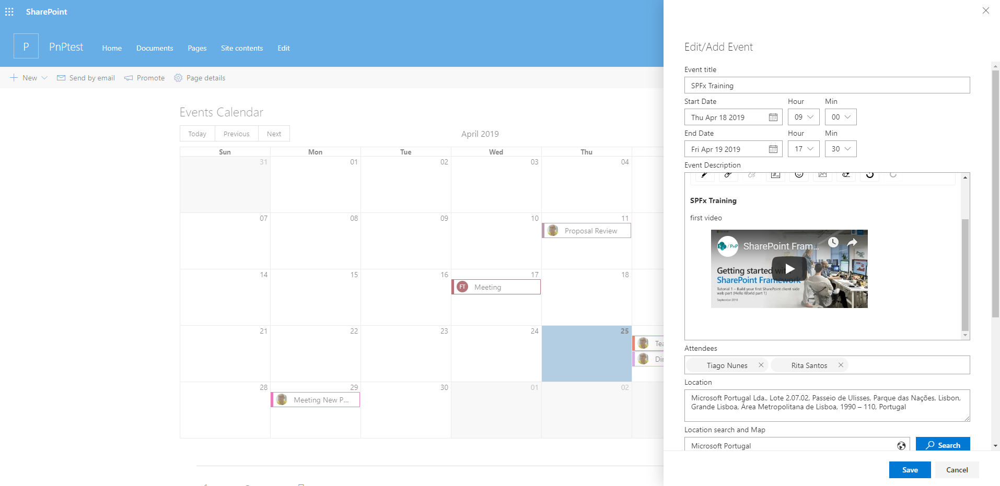

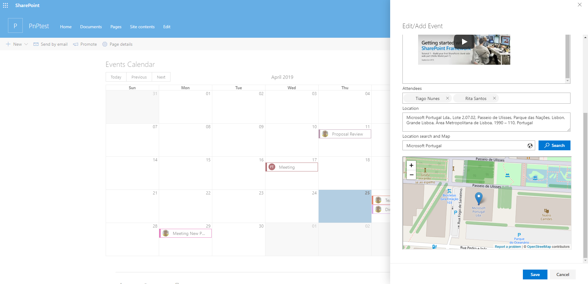

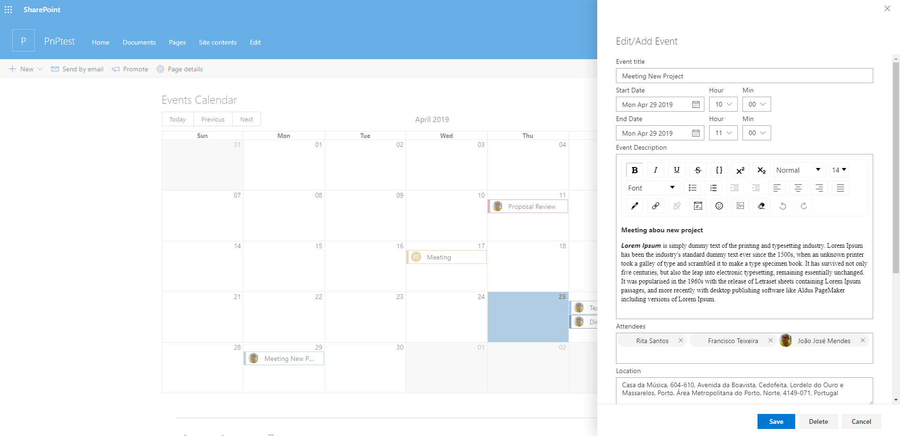

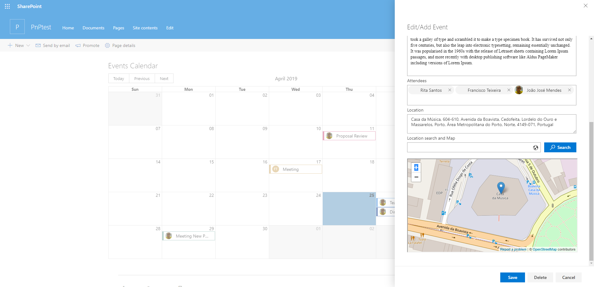

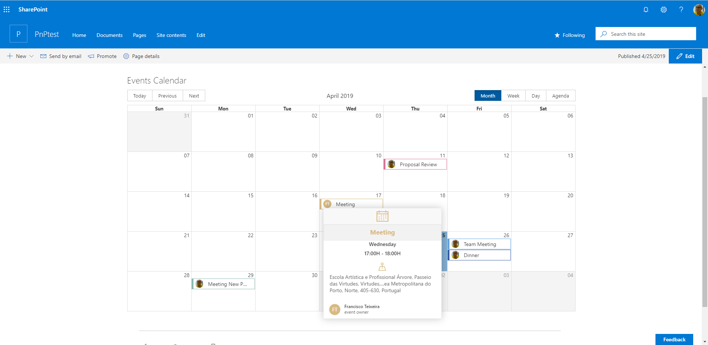

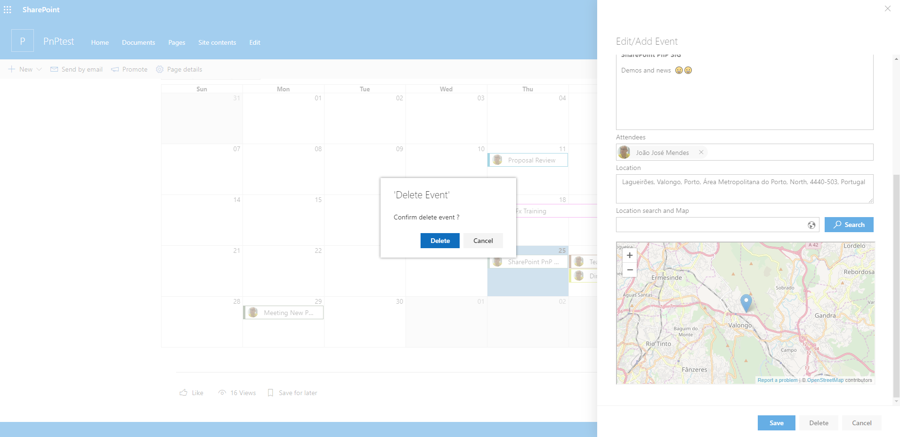

## Compatibility

 

 
 

## Applies to

* [SharePoint Framework](https://docs.microsoft.com/sharepoint/dev/spfx/sharepoint-framework-overview)
* [Office 365 tenant](https://docs.microsoft.com/sharepoint/dev/spfx/set-up-your-development-environment)

## Web Part Properties
 
Property |Type|Required| comments
--------------------|----|--------|----------
Site Url of Calendar List | Text| yes|
Calendar list| Choice/Dropdown | yes|  this is filled with all list of  type "event list" created
Start Date | Date | yes | Event Date
End Date| Date| yes | Event Date

## Solution

The Web Part Use PnPjs library, Office-ui-fabric-react components. react Big-Calendar Component

Solution|Author(s)
--------|---------
Calendar Web Part|[Abderahman Moujahid](https://github.com/Abderahman88)
Calendar Web Part|[Eli H. Schei](https://github.com/Eli-Schei)
Calendar Web Part|[Hugo Bernier](https://github.com/hugoabernier) ([@bernier](https://twitter.com/bernierh), [Tahoe Ninjas](https://tahoeninjas.blog/))
Calendar Web Part|[João Mendes](https://github.com/joaojmendes)
Calendar Web Part|[Mohamed Derhalli](https://github.com/derhallim)
Calendar Web PArt|[Mohammed Amer](https://www.linkedin.com/in/mohammad3mer/) ([@Mohammad3mer](https://twitter.com/Mohammad3mer))
Calendar Web Part|[Nanddeep Nachan](https://github.com/nanddeepn) ([@NanddeepNachan](https://twitter.com/NanddeepNachan))

## Version history

Version|Date|Comments
-------|----|--------
1.0.0|April 25, 2019|Initial release
1.0.1|June 10, 2019|update add recurrence events
1.0.2|April 25, 2020|Update styles according to the applied theme
1.0.3|June 06, 2020|Upgrade to SPFx 1.10.0
1.0.4|October 18, 2020|Added support for all-day events
1.0.5|October 21, 2020|Added Year view
1.0.6|December 3, 2020|Fixed all-day events (#1623)
1.0.7|December 4, 2020|Fixed styling Year view + Dutch localization
1.0.8|December 24, 2020|Fixed timezone difference (#1646)
1.0.9|March 16, 2021|Fixed issue deleting events (#1773)
1.0.10|March 27, 2021|Updated prompt message when deleting single v/s multi-event.
1.0.11|May 10, 2021|Optimized page refresh using local storage

## Minimal Path to Awesome

- Clone this repository
- in the command line run:
  - `npm install`
  - `gulp build`
  - `gulp bundle --ship`
  - `gulp package-solution --ship`
  - Add to **AppCatalog** and deploy

## Disclaimer

**THIS CODE IS PROVIDED *AS IS* WITHOUT WARRANTY OF ANY KIND, EITHER EXPRESS OR IMPLIED, INCLUDING ANY IMPLIED WARRANTIES OF FITNESS FOR A PARTICULAR PURPOSE, MERCHANTABILITY, OR NON-INFRINGEMENT.**

## Support

We do not support samples, but we do use GitHub to track issues and constantly want to improve these samples.

If you encounter any issues while using this sample, [create a new issue](https://github.com/pnp/sp-dev-fx-webparts/issues/new?assignees=&labels=Needs%3A+Triage+%3Amag%3A%2Ctype%3Abug-suspected&template=bug-report.yml&sample=react-calendar&authors=@Abderahman88,%20@Eli-Schei,%20@hugoabernier,%20@joaojmendes,%20@derhallim,%20@nanddeepn,%20@mohammadamer&title=react-calendar%20-%20).

For questions regarding this sample, [create a new question](https://github.com/pnp/sp-dev-fx-webparts/issues/new?assignees=&labels=Needs%3A+Triage+%3Amag%3A%2Ctype%3Abug-suspected&template=question.yml&sample=react-calendar&authors=@Abderahman88,%20@Eli-Schei,%20@hugoabernier,%20@joaojmendes,%20@derhallim,%20@nanddeepn,%20@mohammadamer&title=react-calendar%20-%20).

Finally, if you have an idea for improvement, [make a suggestion](https://github.com/pnp/sp-dev-fx-webparts/issues/new?assignees=&labels=Needs%3A+Triage+%3Amag%3A%2Ctype%3Abug-suspected&template=suggestion.yml&sample=react-calendar&authors=@Abderahman88,%20@Eli-Schei,%20@hugoabernier,%20@joaojmendes,%20@derhallim,%20@nanddeepn,%20@mohammadamer&title=react-calendar%20-%20).

