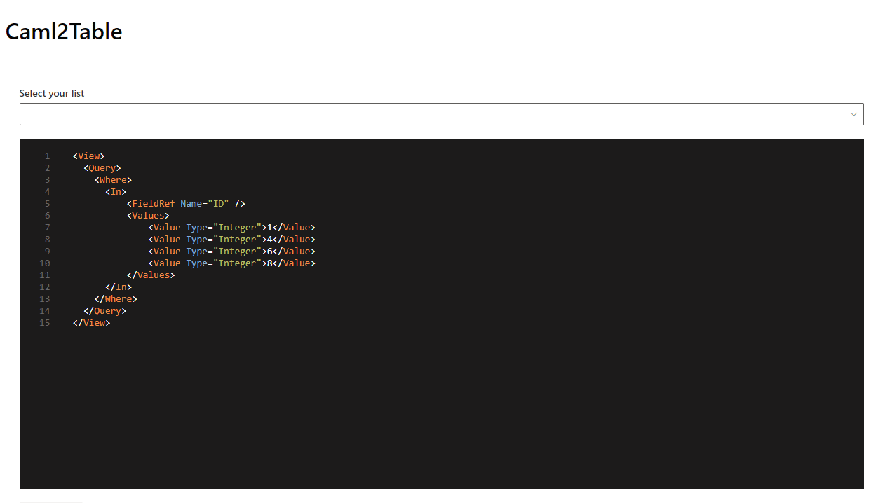

# CAML to Table

## Summary

A powerful web part that allows users to test and build CAML queries visually with a rich, intuitive interface. This enhanced version includes a visual query builder, query validation, saved queries, and more.




## Compatibility

| :warning: Important          |
|:---------------------------|
| Every SPFx version is only compatible with specific version(s) of Node.js. In order to be able to build this sample, please ensure that the version of Node on your workstation matches one of the versions listed in this section. This sample will not work on a different version of Node.|
|Refer to <https://aka.ms/spfx-matrix> for more information on SPFx compatibility.   |

This sample is optimally compatible with the following environment configuration:


-Incompatible-red.svg "SharePoint Server 2016 Feature Pack 2 requires SPFx 1.1")


For more information about SPFx compatibility, please refer to https://aka.ms/spfx-matrix

## Applies to

* [SharePoint Framework](https://learn.microsoft.com/sharepoint/dev/spfx/sharepoint-framework-overview)
* [Microsoft 365 tenant](https://learn.microsoft.com/sharepoint/dev/spfx/set-up-your-development-environment)
* [Microsoft Graph API](https://learn.microsoft.com/graph/overview)

> Get your own free development tenant by subscribing to [Microsoft 365 developer program](https://aka.ms/m365/devprogram)

## Contributors

* [Dan Toft](https://github.com/Tanddant) - Original author
* [Nicolas Kheirallah](https://github.com/NicolasKheirallah) - SPFx 1.20.0 modernization with enhanced features including visual query builder, validator, and saved queries

## Version history

| Version | Date             | Comments        |
| ------- | ---------------- | --------------- |
| 1.0     | November 26, 2022 | Initial release |
| 2.0     | March 11, 2025   | Enhanced version with visual query builder, validator, saved queries, and SPFx 1.20.0 upgrade |

## Prerequisites

Basic knowledge of SharePoint lists and CAML query language is helpful, but the visual query builder makes it accessible to beginners as well.

For advanced usage, check out [the CAML documentation](https://learn.microsoft.com/sharepoint/dev/schema/collaborative-application-markup-language-caml-schemas).

## Minimal path to awesome

* Clone this repository (or [download this solution as a .ZIP file](https://pnp.github.io/download-partial/?url=https://github.com/pnp/sp-dev-fx-webparts/tree/main/samples/react-caml2table) then unzip it)
* From your command line, change your current directory to the directory containing this sample (`react-caml2table`, located under `samples`)
* in the command line run:
  * `npm install`
  * `gulp serve`

> This sample can also be opened with [VS Code Remote Development](https://code.visualstudio.com/docs/remote/remote-overview). Visit <https://aka.ms/spfx-devcontainer> for further instructions.

## Features

This enhanced web part provides a comprehensive tool for working with CAML queries in SharePoint:

### Core Features

- **Visual Query Builder** - Create complex CAML queries without writing XML
- **Query Validation** - Instant feedback on query syntax and potential issues
- **Query Templates** - Pre-built templates for common query patterns
- **Query History** - Navigate through previously executed queries
- **Saved Queries** - Save, manage and reuse your queries
- **Field Reference** - Quick access to list field metadata
- **Export Results** - Export query results to CSV
- **Enhanced Editor** - Monaco Editor for rich XML editing experience
- **Modern UI** - Fluent UI components for a SharePoint-native look and feel

### Technical Highlights

- **Microsoft Graph API Integration** - For SharePoint list operations
- **PnPjs Integration** - Simplified SharePoint REST API interactions
- **SPFx 1.20.0 compatibility** - Latest SharePoint Framework support
- **React Hooks & Context** - Modern React patterns
- **Separation of Concerns** - Clean architecture with services, utilities, and components
- **TypeScript Type Safety** - Strong typing throughout
- **Responsive Design** - Works on all device sizes

## Sample Queries

The web part includes several pre-built query templates:

### Get items by ID

```xml
<View>
  <Query>
    <Where>
      <In>
          <FieldRef Name="ID" />
          <Values>
              <Value Type="Integer">1</Value>
              <Value Type="Integer">4</Value>
              <Value Type="Integer">6</Value>
              <Value Type="Integer">8</Value>
          </Values>
      </In>
    </Where>
  </Query>
</View>
```

### Modified in last 7 days

```xml
<View>
  <Query>
    <Where>
      <Geq>
        <FieldRef Name="Modified" />
        <Value Type="DateTime">
          <Today OffsetDays="-7" />
        </Value>
      </Geq>
    </Where>
    <OrderBy>
      <FieldRef Name="Modified" Ascending="False" />
    </OrderBy>
  </Query>
</View>
```

### Top 10 items

```xml
<View>
  <RowLimit>10</RowLimit>
  <Query>
    <OrderBy>
      <FieldRef Name="ID" Ascending="False" />
    </OrderBy>
  </Query>
</View>
```

## For more info on CAML

- [Collaborative Application Markup Language (CAML) schemas](https://learn.microsoft.com/en-us/sharepoint/dev/schema/collaborative-application-markup-language-caml-schemas)
- [camljs](https://github.com/andrei-markeev/camljs)
- [Camlex.Net](https://github.com/sadomovalex/camlex)

## Solution Architecture

The solution follows a modular architecture:

```
src/
  └── webparts/
      └── caml2Table/
          ├── Caml2TableWebPart.ts        # Main web part definition
          ├── Caml2TableContext.ts        # React context
          ├── components/                 # React components
          │   ├── Caml2Table.tsx          # Main component 
          │   ├── CamlValidator.tsx       # Query validation component
          │   ├── CamlQueryBuilder.tsx    # Visual query builder
          │   └── SavedQueriesManager.tsx # Saved queries component
          ├── models/                     # Data models
          │   ├── IFieldInfo.ts           # Field metadata interface
          │   ├── ICamlCondition.ts       # Query condition interface
          │   └── ISavedQuery.ts          # Saved query interface
          ├── services/                   # Service layer
          │   ├── SharePointService.ts    # SharePoint API interactions
          │   └── StorageService.ts       # Local storage service
          └── utils/                      # Utilities
              ├── CamlHelpers.ts          # CAML generation utilities
              ├── QueryTemplates.ts       # Predefined query templates
              └── QueryHistoryManager.ts  # Query history utilities
```

## Help

We do not support samples, but this community is always willing to help, and we want to improve these samples. We use GitHub to track issues, which makes it easy for community members to volunteer their time and help resolve issues.

If you're having issues building the solution, please run [spfx doctor](https://pnp.github.io/cli-microsoft365/cmd/spfx/spfx-doctor/) from within the solution folder to diagnose incompatibility issues with your environment.

You can try looking at [issues related to this sample](https://github.com/pnp/sp-dev-fx-webparts/issues?q=label%3A%22sample%3A%20react-caml2table%22) to see if anybody else is having the same issues.

You can also try looking at [discussions related to this sample](https://github.com/pnp/sp-dev-fx-webparts/discussions?discussions_q=react-caml2table) and see what the community is saying.

If you encounter any issues using this sample, [create a new issue](https://github.com/pnp/sp-dev-fx-webparts/issues/new?assignees=&labels=Needs%3A+Triage+%3Amag%3A%2Ctype%3Abug-suspected%2Csample%3A%20react-caml2table&template=bug-report.yml&sample=react-caml2table&authors=@Tanddant&title=react-caml2table%20-%20).

For questions regarding this sample, [create a new question](https://github.com/pnp/sp-dev-fx-webparts/issues/new?assignees=&labels=Needs%3A+Triage+%3Amag%3A%2Ctype%3Aquestion%2Csample%3A%20react-caml2table&template=question.yml&sample=react-caml2table&authors=@Tanddant&title=react-caml2table%20-%20).

Finally, if you have an idea for improvement, [make a suggestion](https://github.com/pnp/sp-dev-fx-webparts/issues/new?assignees=&labels=Needs%3A+Triage+%3Amag%3A%2Ctype%3Aenhancement%2Csample%3A%20react-caml2table&template=suggestion.yml&sample=react-caml2table&authors=@Tanddant&title=react-caml2table%20-%20).

## Disclaimer

**THIS CODE IS PROVIDED *AS IS* WITHOUT WARRANTY OF ANY KIND, EITHER EXPRESS OR IMPLIED, INCLUDING ANY IMPLIED WARRANTIES OF FITNESS FOR A PARTICULAR PURPOSE, MERCHANTABILITY, OR NON-INFRINGEMENT.**

