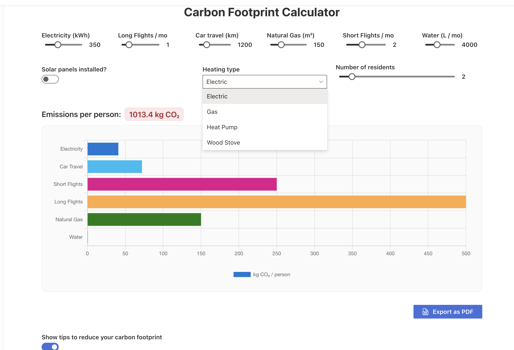

# React Carbon Footprint Calculator

## Summary

This SharePoint Framework (SPFx) web part provides users with an interactive calculator to estimate their monthly carbon footprint.

It helps users visualize their CO₂ emissions through intuitive inputs such as electricity usage, transportation habits, and more.

The solution uses **React**, **Fluent UI**, and **Chart.js** for dynamic charts, and supports exporting results to **PDF**.



## Used SharePoint Framework Version

[](https://aka.ms/spfx)
[](https://nodejs.org)


## Applies to

* [SharePoint Framework](https://aka.ms/spfx)
* [Microsoft 365 tenant](https://learn.microsoft.com/en-us/sharepoint/dev/spfx/set-up-your-developer-tenant)

> Get your own free development tenant by subscribing to the [Microsoft 365 developer program](https://aka.ms/o365devprogram)

## Prerequisites

* Node.js LTS (v18.x recommended)
* npm package manager
* SharePoint Online tenant for testing

## Solution

| Solution                          | Author(s)                                                                                                         |
| --------------------------------- | ----------------------------------------------------------------------------------------------------------------- |
| react-carbon-footprint-calculator | João LIVIO ([GitHub](https://github.com/jtlivio), [pH7x Systems](https://www.ph7x.com)) |

## Version History

| Version | Date        | Comments                       |
| ------- | ----------- | ------------------------------ |
| 1.1     | May 8, 2025 | Added PDF export functionality |
| 1.0     | May 8, 2025 | Initial release                |

## Disclaimer

**THIS CODE IS PROVIDED *AS IS* WITHOUT WARRANTY OF ANY KIND, EITHER EXPRESS OR IMPLIED, INCLUDING ANY IMPLIED WARRANTIES OF FITNESS FOR A PARTICULAR PURPOSE, MERCHANTABILITY, OR NON-INFRINGEMENT.**

---

## Minimal Path to Awesome

To test this solution in your environment:

```bash
npm install
gulp serve
```

> Open SharePoint Online Workbench to load the web part.

## Features

This SPFx web part demonstrates the following features:

* Interactive sliders for real-time emissions calculation
* Dynamic chart visualization of carbon footprint
* Sustainable threshold indicators (green, yellow, red)
* PDF export capability for sharing results
* Tips for reducing carbon footprint

## References

* [Getting started with SharePoint Framework](https://learn.microsoft.com/en-us/sharepoint/dev/spfx/set-up-your-developer-tenant)
* [Building solutions for Microsoft Teams](https://learn.microsoft.com/en-us/sharepoint/dev/spfx/build-for-teams-overview)
* [Using Microsoft Graph in SPFx solutions](https://learn.microsoft.com/en-us/sharepoint/dev/spfx/web-parts/get-started/using-microsoft-graph-apis)
* [Publishing SPFx applications to Marketplace](https://learn.microsoft.com/en-us/sharepoint/dev/spfx/publish-to-marketplace-overview)
* [Microsoft 365 Patterns and Practices](https://aka.ms/m365pnp) – Community-driven guidance, samples, and open-source tools


