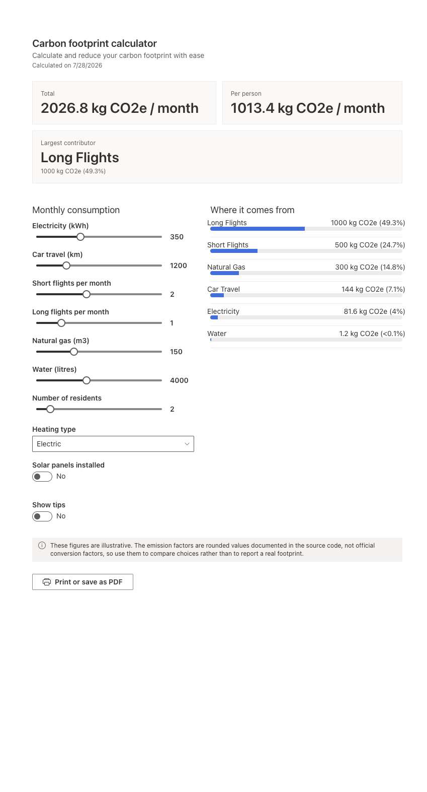

# Carbon Footprint Calculator

## Summary

This SharePoint Framework (SPFx) web part provides users with an interactive calculator to estimate their monthly carbon footprint.

It helps users visualize their CO₂ emissions through intuitive inputs such as electricity usage, transportation habits, and more.

The solution uses **React**, **Fluent UI**, and **Chart.js** for dynamic charts, and supports exporting results to **PDF**.



## Compatibility

| :warning: Important          |
|:---------------------------|
| Every SPFx version is optimally compatible with specific versions of Node.js. In order to be able to build this sample, you need to ensure that the version of Node on your workstation matches one of the versions listed in this section. This sample will not work on a different version of Node.|
|Refer to <https://aka.ms/spfx-matrix> for more information on SPFx compatibility.   |

This sample is optimally compatible with the following environment configuration:


-Incompatible-red.svg "SharePoint Server 2016 Feature Pack 2 requires SPFx 1.1")


## Applies to

* [SharePoint Framework](https://aka.ms/spfx)
* [Microsoft 365 tenant](https://learn.microsoft.com/en-us/sharepoint/dev/spfx/set-up-your-developer-tenant)

> Get your own free development tenant by subscribing to the [Microsoft 365 developer program](https://aka.ms/o365devprogram)

## Prerequisites

* Node.js LTS (v18.x recommended)
* npm package manager
* SharePoint Online tenant for testing

## Contributors

* [João LIVIO](https://github.com/jtlivio)

## Version History

| Version | Date        | Comments                       |
| ------- | ----------- | ------------------------------ |
| 1.2     | July 28, 2026 | Documented the emission factors and their limitations. Removed unused services, models and the chart and PDF dependencies. Replaced PDF export with a print view, improved accessibility and localization, and added unit tests for the calculations. |
| 1.1     | May 8, 2025 | Added PDF export functionality |
| 1.0     | May 8, 2025 | Initial release                |


## Minimal Path to Awesome

To test this solution in your environment:

```bash
npm install
gulp serve
```

> Open SharePoint Online Workbench to load the web part.

## Features

This SPFx web part demonstrates the following features:

* Interactive sliders that recalculate the footprint as they move
* Headline figures for the total, the per-person share and the largest contributor
* A per-category breakdown where every value is shown as text, with a proportional bar as a visual aid only
* A print view that hides the controls, so the browser's "Save as PDF" produces selectable text rather than an image
* Tips for reducing the footprint
* Household size configured in the property pane
* All user-facing text localizable through the standard SPFx string files
* Unit tests for the emission arithmetic, runnable with `npm test`
* Accessible markup: heading structure, `aria-live` result updates, and no information conveyed by colour alone
* No colour of its own: every colour comes from the host theme through the SPFx `ThemeProvider` service, so the web part follows the site theme, a section background, or whichever theme the host applies
* Fluent UI throughout, with no third-party UI, charting or PDF dependencies

## References

* [Getting started with SharePoint Framework](https://learn.microsoft.com/en-us/sharepoint/dev/spfx/set-up-your-developer-tenant)
* [Building solutions for Microsoft Teams](https://learn.microsoft.com/en-us/sharepoint/dev/spfx/build-for-teams-overview)
* [Using Microsoft Graph in SPFx solutions](https://learn.microsoft.com/en-us/sharepoint/dev/spfx/web-parts/get-started/using-microsoft-graph-apis)
* [Publishing SPFx applications to Marketplace](https://learn.microsoft.com/en-us/sharepoint/dev/spfx/publish-to-marketplace-overview)
* [Microsoft 365 Patterns and Practices](https://aka.ms/m365pnp) – Community-driven guidance, samples, and open-source tools

## Help

We do not support samples, but this community is always willing to help, and we want to improve these samples. We use GitHub to track issues, which makes it easy for  community members to volunteer their time and help resolve issues.

If you're having issues building the solution, please run [spfx doctor](https://pnp.github.io/cli-microsoft365/cmd/spfx/spfx-doctor/) from within the solution folder to diagnose incompatibility issues with your environment.

You can try looking at [issues related to this sample](https://github.com/pnp/sp-dev-fx-webparts/issues?q=label%3A%22sample%3A%20react-carbon-footprint-calculator%22) to see if anybody else is having the same issues.

You can also try looking at [discussions related to this sample](https://github.com/pnp/sp-dev-fx-webparts/discussions?discussions_q=react-carbon-footprint-calculator) and see what the community is saying.

If you encounter any issues using this sample, [create a new issue](https://github.com/pnp/sp-dev-fx-webparts/issues/new?assignees=&labels=Needs%3A+Triage+%3Amag%3A%2Ctype%3Abug-suspected%2Csample%3A%20react-carbon-footprint-calculator&template=bug-report.yml&sample=react-carbon-footprint-calculator&authors=@jtlivio&title=react-carbon-footprint-calculator%20-%20).

For questions regarding this sample, [create a new question](https://github.com/pnp/sp-dev-fx-webparts/issues/new?assignees=&labels=Needs%3A+Triage+%3Amag%3A%2Ctype%3Aquestion%2Csample%3A%20react-carbon-footprint-calculator&template=question.yml&sample=react-carbon-footprint-calculator&authors=@jtlivio&title=react-carbon-footprint-calculator%20-%20).

Finally, if you have an idea for improvement, [make a suggestion](https://github.com/pnp/sp-dev-fx-webparts/issues/new?assignees=&labels=Needs%3A+Triage+%3Amag%3A%2Ctype%3Aenhancement%2Csample%3A%20react-carbon-footprint-calculator&template=suggestion.yml&sample=react-carbon-footprint-calculator&authors=@jtlivio&title=react-carbon-footprint-calculator%20-%20).

## About the numbers

The emission factors used by this sample are rounded, illustrative values. They
are declared in `src/models/EmissionFactors.ts`, where each one carries the unit
it applies to and a note on what it assumes.

They are **not** official conversion factors and should not be used for
reporting. A real figure depends on the local electricity mix, the vehicle, the
aircraft and its load factor, and the accounting boundary in use. The orders of
magnitude follow commonly published national conversion factors such as the
[UK Government GHG conversion factors for company reporting](https://www.gov.uk/government/collections/government-conversion-factors-for-company-reporting).

To adapt the calculator to a region, replace the values in that file with the
factors published by that region's authority and cite the source alongside them.

The calculator is meant for comparing choices — "what happens if I fly less" —
not for producing a number to report.

## Disclaimer

**THIS CODE IS PROVIDED *AS IS* WITHOUT WARRANTY OF ANY KIND, EITHER EXPRESS OR IMPLIED, INCLUDING ANY IMPLIED WARRANTIES OF FITNESS FOR A PARTICULAR PURPOSE, MERCHANTABILITY, OR NON-INFRINGEMENT.**


