# Chart Control Samples

## Summary

This sample contains several web parts that demonstrate how to use the ChartControl from @pnp/spfx-controls-react.

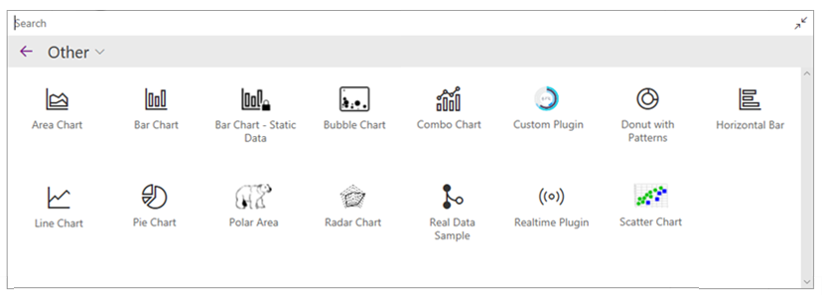

The web parts in this sample are not intended to be used in production -- they simply demonstrate how you would use all the capabilities of the ChartControl.

> **NOTE:** If you are looking for a ready-to-use web part, please look into [joelfmrodrigues' cool react-modern-charts sample](https://github.com/pnp/sp-dev-fx-webparts/tree/main/samples/react-modern-charts), which was built without the `ChartControl`.

## About the samples

We created the ChartControl by popular request of [@pnp/spfx-controls-react](https://sharepoint.github.io/sp-dev-fx-controls-react/) users who wanted a way to easily insert [Chart.js](https://www.chartjs.org/) charts into their solutions.

To keep things as easy as possible, the ChartControl supports (most) of the Chart.js functionality (yes, even the use of plugins!).

The samples in this solution mostly use code found from the Chart.js code samples -- with little or no conversion. Wherever possible, we localized strings, moved colors and styles to the web part's SCSS, and used Office Fabric UI components instead of regular buttons.

Each sample retrieves data and passes it to the ChartControl using one of the 3 methods:

* Static data passed in the control's properties
* Dynamic data passed through the web part's state
* Dynamic data passed directly to the ChartControl, without state.

Feel free to use any method you wish for your own web parts.

## Web Part List

### Accessible Chart

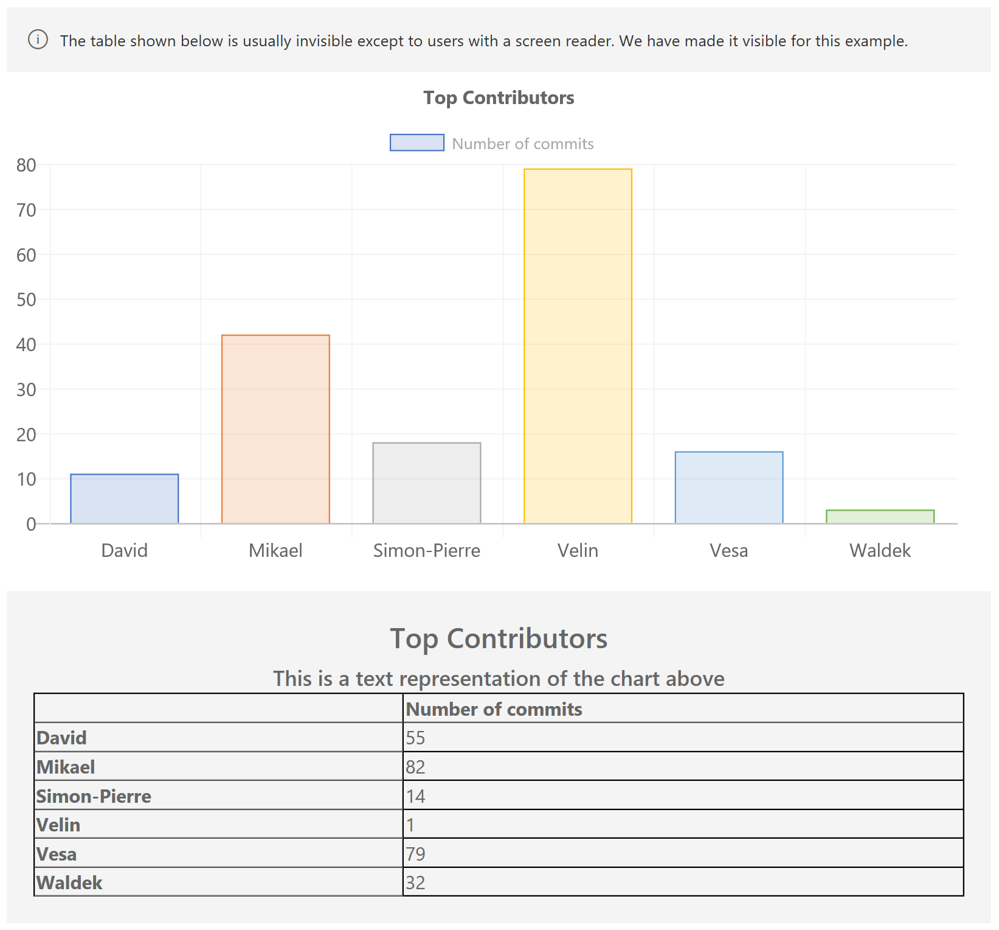

Demonstrates the accessibility features of the Chart Control.

This sample shows the table that is automatically generated by the Chart Control.

### Area Chart

This sample shows how you can render an area chart and configure the chart to use the `fill` option, as well as whether to use straight lines or curves.

It also shows how to render gradient fills.

### Bar Chart -- Static data

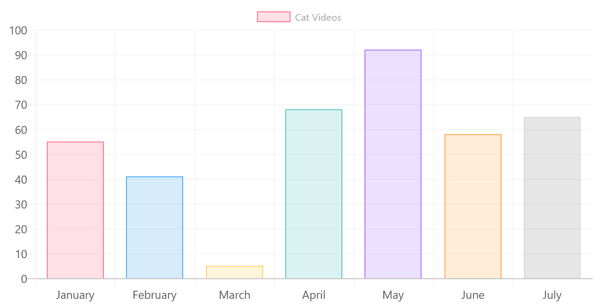

Uses the most basic features of the ChartControl; It uses static data and does not provide any optional parameters.

The ChartControl automatic generates chart colors that mimic the colors you would find in Office.

The control also automatically picks up the environment's theme and changes the chart's background color, lines, and fonts to match the theme.

For accessibility purposes, the ChartControl also renders a hidden table that contains a summary of the data which will be available for those who use a screen reader.

### Bar Chart

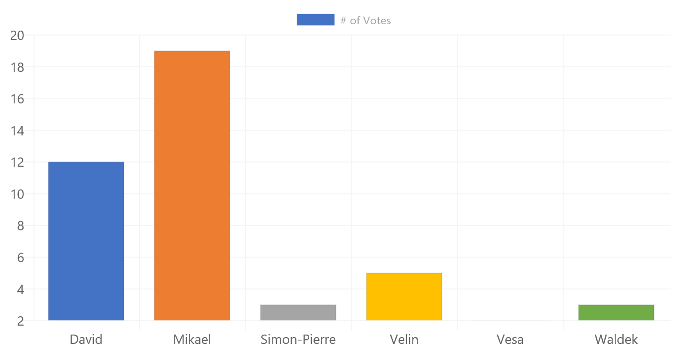

Another bar chart, but this one loads data asynchronously from a (fake) service.

While the sample service simply returns an array of numbers, you could replace it with your own code that reads from SharePoint, or any other service.

### Bubble Chart

This sample demonstrates the use of data elements with a X, Y, and R value to create a bubble chart.

You can even pop the bubbles, which is a fun way to demonstrate event handlers.

### Chartinator

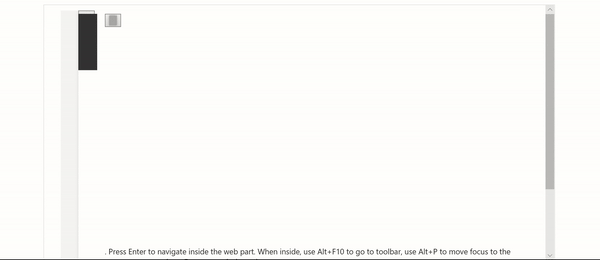

This is a Chart Control version of the SharePoint Quick Charts. It supports every chart type and offers many configuration options.

This sample also demonstrates how to create conditional property pane groups and custom property pane controls.

### Combo Chart

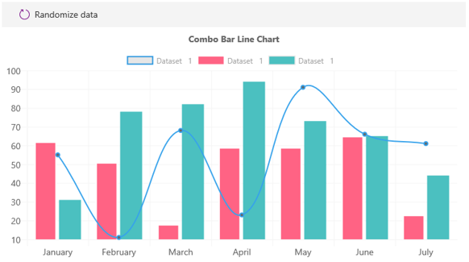

Demonstrates how to create combination charts with multiple datasets.

### Custom Plugin

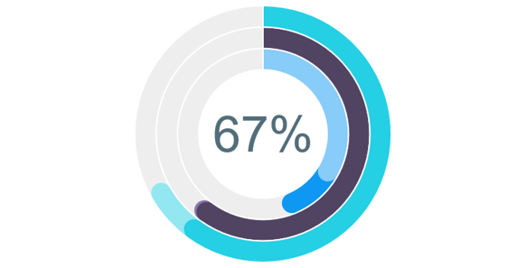

If you can't find a Chart.js plugin that already exists, and you want to create your own, simply implement the `IChartPlugin` interface.

This example takes sample plugin code to create a custom plugin.

The concept for the chart's look and feel came from a [StackOverflow question](https://stackoverflow.com/questions/45446153/chartjs-round-borders-on-a-doughnut-chart-with-multiple-datasets) from fsenna.

The custom plugin code is inspired from a [JSFiddle](http://jsfiddle.net/tgyxmkLj/1/) written by user8296539 in response to fsenna's question.

### Doughnut with Patterns

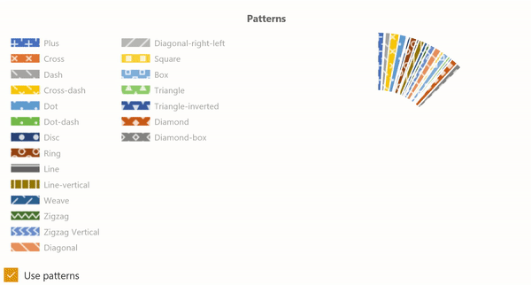

This web part demonstrates how to use the ChartControl to render a donut chart with patterns instead of colors.

It is inspired by the [patternomaly sample](https://github.com/ashiguruma/patternomaly/blob/master/examples/optional.html) referred by the [Chart.js documentation](https://www.chartjs.org/docs/latest/general/colors.html).

### Dynamic Data Callable

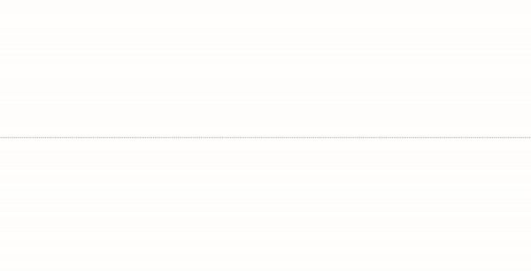

I wanted to use real data, but didn't want to deal with creating data on SharePoint, so I created a web part that calls the GitHub REST APIs and shows contributors for a given repository.

The sample is also a dynamic data provider. It demonstrates how to respond to mouse events (clicking on a segment of the donut chart will send the data to another web part).

Use in combination with the **Dynamic Data Consumer** web part.

### Dynamics Data Consumer

This demonstrates how to render a chart by receiving events from a dynamic data connection.

It also demonstrates how to render a line chart that looks like the Office 365 Admin dashboards.

### Horizontal Bar

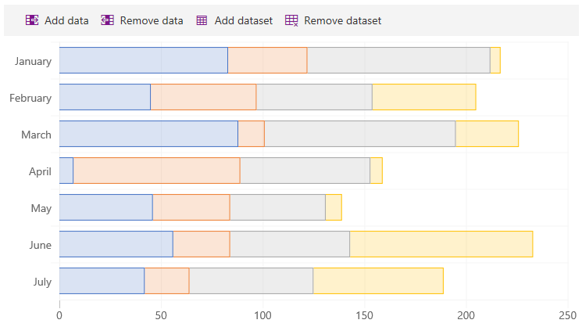

This sample shows how to render a horizontal bar chart. It also demonstrates how to create stacked bars.

### Line Chart

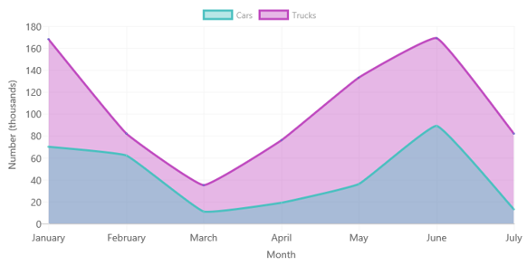

This sample demonstrates how to render line charts.

### Pie Chart

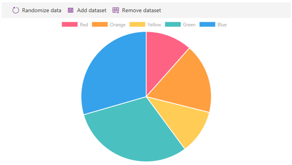

Demonstrates how to create a pie chart.

### Polar Chart

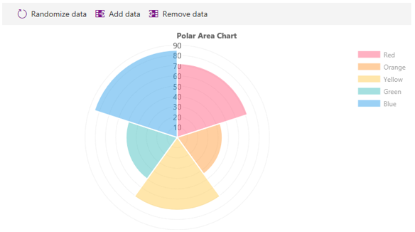

Creates a polar area chart. Also adds ability to add and remove data.

### Radar Chart

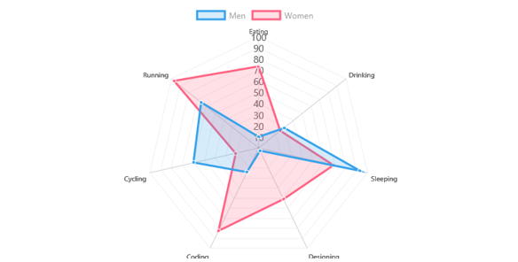

Renders a multi-dataset radar chart.

### Real-Time Chart

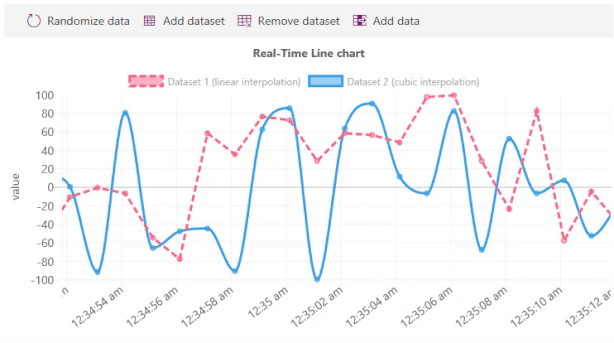

This sample uses an existing plugin to create a scrolling/real-time chart.

This sample also demonstrates how to use time series for the X axis.

### Scatter Chart

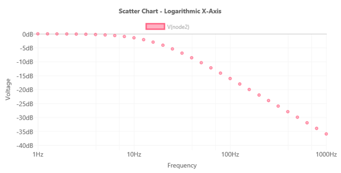

This sample shows how to use X and Y coordinate data elements in a scatter chart.

## Compatibility

-Incompatible-red.svg "SharePoint Server 2016 Feature Pack 2 requires SPFx 1.1")

## Applies to

* [SharePoint Framework](https://docs.microsoft.com/sharepoint/dev/spfx/sharepoint-framework-overview)
* [Office 365 tenant](https://docs.microsoft.com/sharepoint/dev/spfx/set-up-your-development-environment)

## Prerequisites

There are no pre-requisites to use these samples.

## Solution

Solution|Author(s)
--------|---------
react-chart-control | Hugo Bernier ([Tahoe Ninjas](http://tahoeninjas.blog), [@bernierh](https://twitter.com/bernierh))

## Version history

Version|Date|Comments
-------|----|--------
1.0|January, 2019|Initial release
1.1|July 02, 2020|Upgraded to SPFx 1.10.0
1.2|December 04, 2020|Upgraded to SPFx 1.11.0 and Fluent UI 7.x
1.3|December 13, 2020|Upgraded dependencies
1.4|February 25, 2021|Updated to latest version of PnP controls

## Minimal Path to Awesome

* Clone this repository
* in the command line run:
  * `npm install`
  * `gulp serve`
* Insert one of the webs part on a page

>  This sample can also be opened with [VS Code Remote Development](https://code.visualstudio.com/docs/remote/remote-overview). Visit https://aka.ms/spfx-devcontainer for further instructions.

## Features

This Web Part sample pack illustrates the following concepts on top of the SharePoint Framework:

* Using the @pnp/spfx-controls-react ChartControl
* Creating static charts
* Creating dynamic charts using state
* Creating dynamic charts by calling the ChartControl's update method
* Responding to chart events
* Connecting a chart to dynamic data
* Rendering conditional property pane groups
* Rendering conditional property pane fields
* Creating custom property pane controls

## Video

[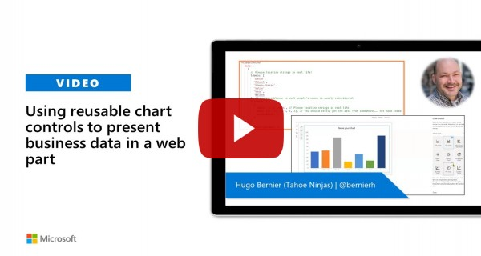](https://www.youtube.com/watch?v=U_rtVSyM6_I "Using reusable chart controls to present business data in a web part")

## Help

We do not support samples, but this community is always willing to help, and we want to improve these samples. We use GitHub to track issues, which makes it easy for  community members to volunteer their time and help resolve issues.

If you're having issues building the solution, please run [spfx doctor](https://pnp.github.io/cli-microsoft365/cmd/spfx/spfx-doctor/) from within the solution folder to diagnose incompatibility issues with your environment.

You can try looking at [issues related to this sample](https://github.com/pnp/sp-dev-fx-webparts/issues?q=label%3A%22sample%3A%20react-chartcontrol") to see if anybody else is having the same issues.

You can also try looking at [discussions related to this sample](https://github.com/pnp/sp-dev-fx-webparts/discussions?discussions_q=react-chartcontrol) and see what the community is saying.

If you encounter any issues while using this sample, [create a new issue](https://github.com/pnp/sp-dev-fx-webparts/issues/new?assignees=&labels=Needs%3A+Triage+%3Amag%3A%2Ctype%3Abug-suspected%2Csample%3A%20react-chartcontrol&template=bug-report.yml&sample=react-chartcontrol&authors=@hugoabernier&title=react-chartcontrol%20-%20).

For questions regarding this sample, [create a new question](https://github.com/pnp/sp-dev-fx-webparts/issues/new?assignees=&labels=Needs%3A+Triage+%3Amag%3A%2Ctype%3Aquestion%2Csample%3A%20react-chartcontrol&template=question.yml&sample=react-chartcontrol&authors=@hugoabernier&title=react-chartcontrol%20-%20).

Finally, if you have an idea for improvement, [make a suggestion](https://github.com/pnp/sp-dev-fx-webparts/issues/new?assignees=&labels=Needs%3A+Triage+%3Amag%3A%2Ctype%3Aenhancement%2Csample%3A%20react-chartcontrol&template=question.yml&sample=react-chartcontrol&authors=@hugoabernier&title=react-chartcontrol%20-%20).

## Disclaimer

**THIS CODE IS PROVIDED *AS IS* WITHOUT WARRANTY OF ANY KIND, EITHER EXPRESS OR IMPLIED, INCLUDING ANY IMPLIED WARRANTIES OF FITNESS FOR A PARTICULAR PURPOSE, MERCHANTABILITY, OR NON-INFRINGEMENT.**

