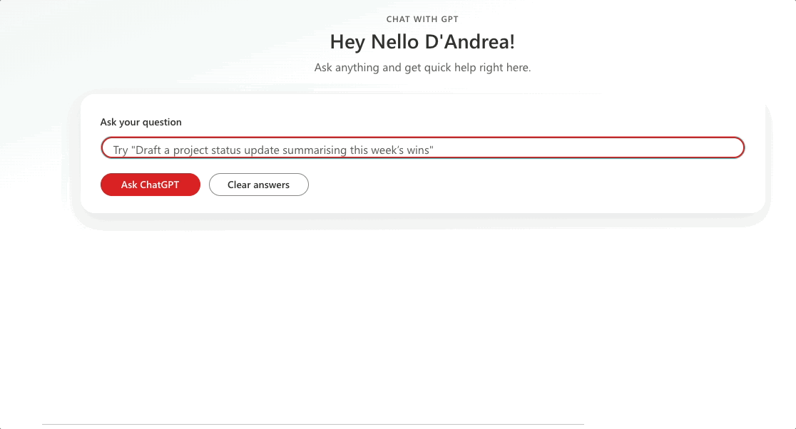
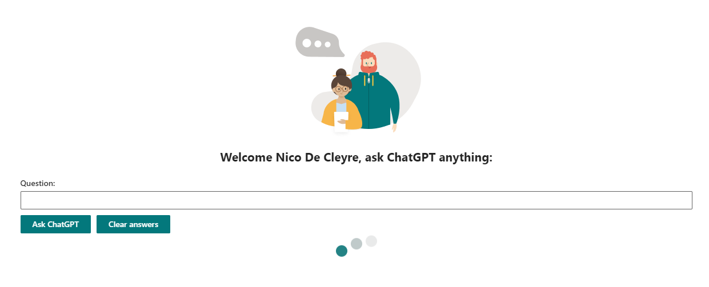
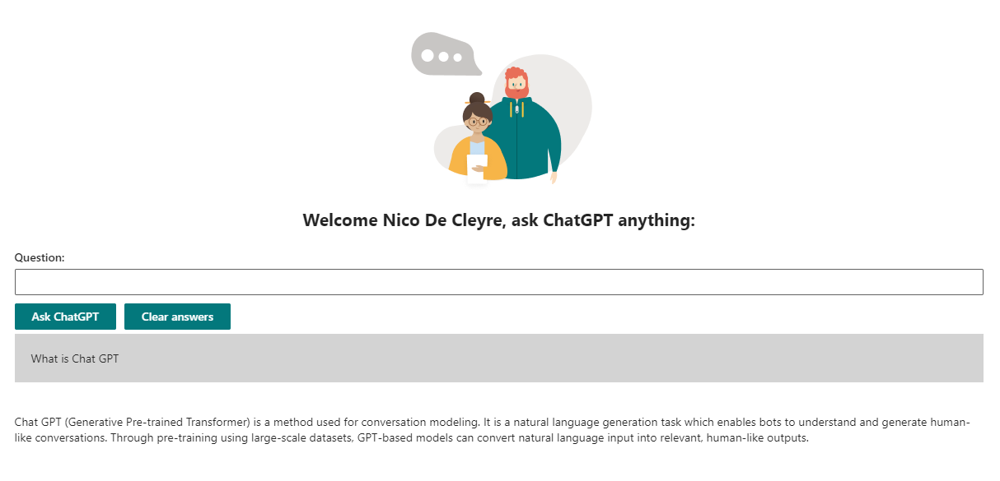

# Chat GPT inside SPFx

## Summary

This webpart uses Chat GPT in an SPFx webpart. You can ask questions from the web part and you will see the answers, most recent answers first.

## Compatibility

This sample is optimally compatible with the following environment configuration:

-Incompatible-red.svg "SharePoint Server 2016 Feature Pack 2 requires SPFx 1.1")

For more information about SPFx compatibility, please refer to https://aka.ms/spfx-matrix

## Applies to

* [SharePoint Framework](https://learn.microsoft.com/sharepoint/dev/spfx/sharepoint-framework-overview)
* [Microsoft 365 tenant](https://learn.microsoft.com/sharepoint/dev/spfx/set-up-your-development-environment)

> Get your own free development tenant by subscribing to [Microsoft 365 developer program](http://aka.ms/m365devprogram)

## Authors

[Nico De Cleyre](https://github.com/nicodecleyre) ([@NicoDeCleyre](https://twitter.com/NicoDeCleyre)), Ordina Belgium

## Version history

Version|Date|Comments
-------|----|--------
1.0|February 4, 2023|Initial release

## Prerequisites

This web part needs a Chat GPT api key, which you can get in the settings of the [https://platform.openai.com](https://platform.openai.com) environment. (Click on your profile in the top right corner and then click on 'view API keys').

You must then enter this api key in the web part properties

## Minimal path to awesome

<!-- 
PRO TIP:

For commands, use the `code syntax`

For button labels, page names, dialog names, etc. as they appear on the screen, use **Bold**

Don't use "click", use "select" or "use"

As tempting as it may be, don't just use images to describe the steps. Let's be as inclusive as possible and think about accessibility.

-->

* Clone this repository (or [download this solution as a .ZIP file](https://pnp.github.io/download-partial/?url=https://github.com/pnp/sp-dev-fx-webparts/tree/main/samples/react-chat-gpt) then unzip it)
* From your command line, change your current directory to the directory containing this sample (`react-chat-gpt`, located under `samples`)
* in the command line run:
  * `npm install`
  * `gulp serve`

> This sample can also be opened with [VS Code Remote Development](https://code.visualstudio.com/docs/remote/remote-overview). Visit <https://aka.ms/spfx-devcontainer> for further instructions.

## Features

Description of the web part with possible additional details than in short summary.
This Web Part illustrates the following concepts on top of the SharePoint Framework:

* topic 1
* topic 2
* topic 3

## Help

We do not support samples, but this community is always willing to help, and we want to improve these samples. We use GitHub to track issues, which makes it easy for  community members to volunteer their time and help resolve issues.

If you're having issues building the solution, please run [spfx doctor](https://pnp.github.io/cli-microsoft365/cmd/spfx/spfx-doctor/) from within the solution folder to diagnose incompatibility issues with your environment.

You can try looking at [issues related to this sample](https://github.com/pnp/sp-dev-fx-webparts/issues?q=label%3A%22sample%3A%20react-chat-gpt%22) to see if anybody else is having the same issues.

You can also try looking at [discussions related to this sample](https://github.com/pnp/sp-dev-fx-webparts/discussions?discussions_q=react-chat-gpt) and see what the community is saying.

If you encounter any issues using this sample, [create a new issue](https://github.com/pnp/sp-dev-fx-webparts/issues/new?assignees=&labels=Needs%3A+Triage+%3Amag%3A%2Ctype%3Abug-suspected%2Csample%3A%20react-chat-gpt&template=bug-report.yml&sample=react-chat-gpt&authors=@YOURGITHUBUSERNAME&title=react-chat-gpt%20-%20).

For questions regarding this sample, [create a new question](https://github.com/pnp/sp-dev-fx-webparts/issues/new?assignees=&labels=Needs%3A+Triage+%3Amag%3A%2Ctype%3Aquestion%2Csample%3A%20react-chat-gpt&template=question.yml&sample=react-chat-gpt&authors=@YOURGITHUBUSERNAME&title=react-chat-gpt%20-%20).

Finally, if you have an idea for improvement, [make a suggestion](https://github.com/pnp/sp-dev-fx-webparts/issues/new?assignees=&labels=Needs%3A+Triage+%3Amag%3A%2Ctype%3Aenhancement%2Csample%3A%20react-chat-gpt&template=suggestion.yml&sample=react-chat-gpt&authors=@YOURGITHUBUSERNAME&title=react-chat-gpt%20-%20).

## Disclaimer

**THIS CODE IS PROVIDED *AS IS* WITHOUT WARRANTY OF ANY KIND, EITHER EXPRESS OR IMPLIED, INCLUDING ANY IMPLIED WARRANTIES OF FITNESS FOR A PARTICULAR PURPOSE, MERCHANTABILITY, OR NON-INFRINGEMENT.**

