# Chat With Semantic Kernel and Plugins

## Summary

This solution demonstrates an intelligent chat interface built with SharePoint Framework (SPFx) that integrates with Azure Functions and Microsoft Semantic Kernel. The chat web part provides a modern conversational UI with real-time communication using Server-Sent Events (SSE), allowing users to interact with AI-powered capabilities directly within SharePoint Online.

The backend leverages Azure Functions with .NET 10 and Semantic Kernel for orchestrating AI interactions, including function calling capabilities for context-aware operations such as retrieving dates, user information, and calendar data from Microsoft Graph. The entire solution is protected by Entra ID (Azure AD) authentication.

Key features include:

- Real-time chat streaming with SSE
- Semantic Kernel integration with extensible function calling
- Semantic Kernel Plugins with Graph Calls
- Secure authentication via Entra ID

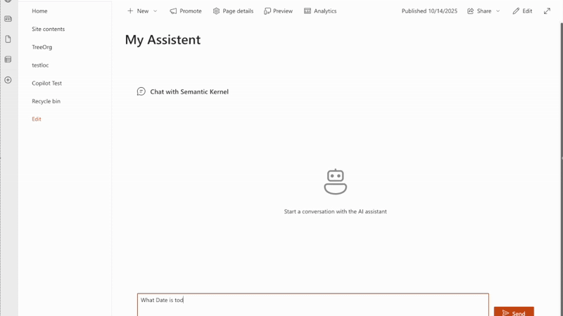

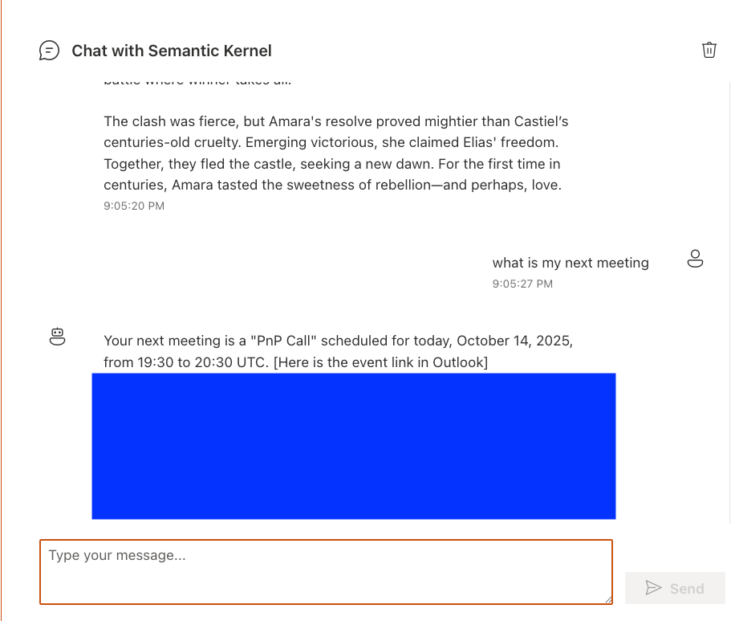
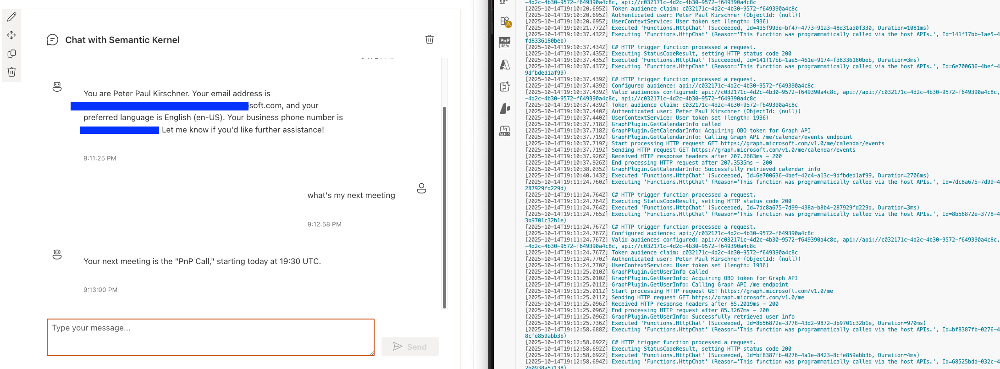
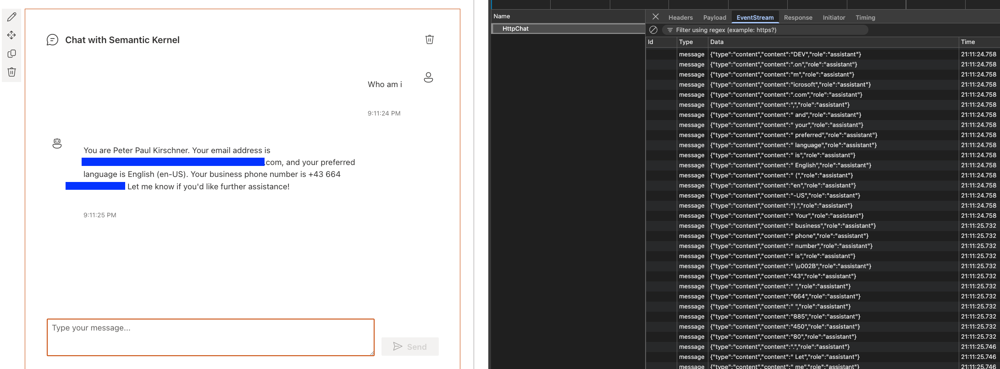
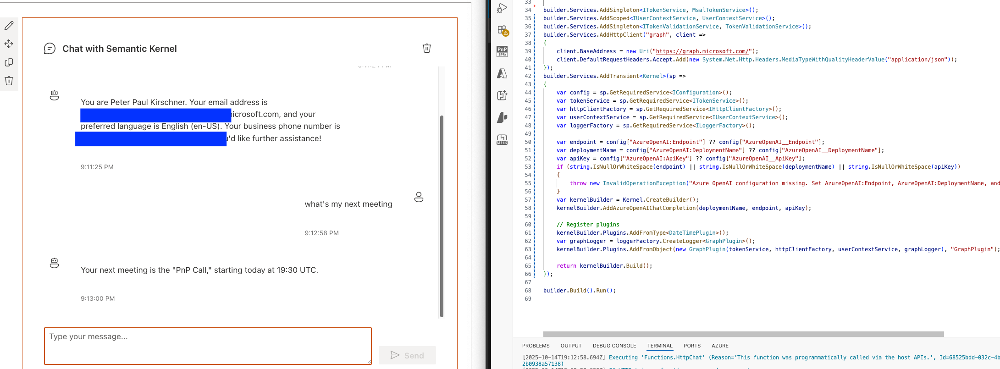

[Video](./assets/ReactChatSk.mp4)

## Compatibility

| :warning: Important          |
|:---------------------------|
| Every SPFx version is optimally compatible with specific versions of Node.js. In order to be able to build this sample, you need to ensure that the version of Node on your workstation matches one of the versions listed in this section. This sample will not work on a different version of Node.|
|Refer to <https://aka.ms/spfx-matrix> for more information on SPFx compatibility.   |

This sample is optimally compatible with the following environment configuration:

-Incompatible-red.svg "SharePoint Server 2016 Feature Pack 2 requires SPFx 1.1")

## Applies to

- [SharePoint Framework](https://aka.ms/spfx)

## Contributors

- [Peter Paul Kirschner](https://github.com/petkir)

## Version history

|Version|Date|Comments|
|-------|----|--------|
|1.0|Okt, 2025|Initial release|

## Minimal Path to Awesome

- Clone this repository
- Ensure that you are at the solution folder
- Create an App Registration
- Setup Variables
  - `cp azure-function-sk/local.template.json azure-function-sk/local.settings.json`
  - fillout `azure-function-sk/local.settings.json`
  - fillout `config/package-solution.json`
- in the command-line run:
  - `npm install`
  - `gulp bundle && gulp package-solution`
  - `gulp serve --nobrowser`
- in other command-line run:
  - `cd azure-function-sk`
  - `dotnet run`
- Upload Sharepoint Solution to SharePoint
  - Approve API Permissions
  
> This sample can also be opened with [VS Code Remote Development](https://code.visualstudio.com/docs/remote/remote-overview). Visit https://aka.ms/spfx-devcontainer for further instructions.

### App Registration

- Create an App Registration 
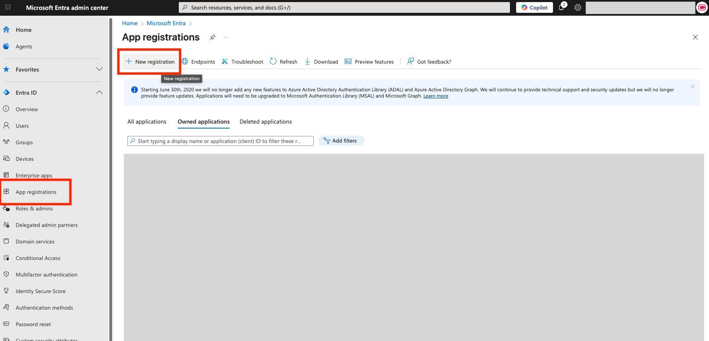
- Single Tenant with the Name React-Chat-Sk
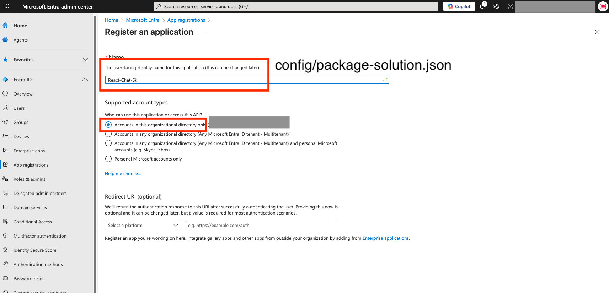

- Copy ClientID and TenantID to:
  - `azure-function-sk/local.settings.json` (`AzureAd__TenantId`, `AzureAd__ClientId`)
  - `config/package-solution.json` (`webApiPermissionRequests.appId`)
  - `src/globalConfig.ts` (`AZURE_FUNCTION_APP_ID`)
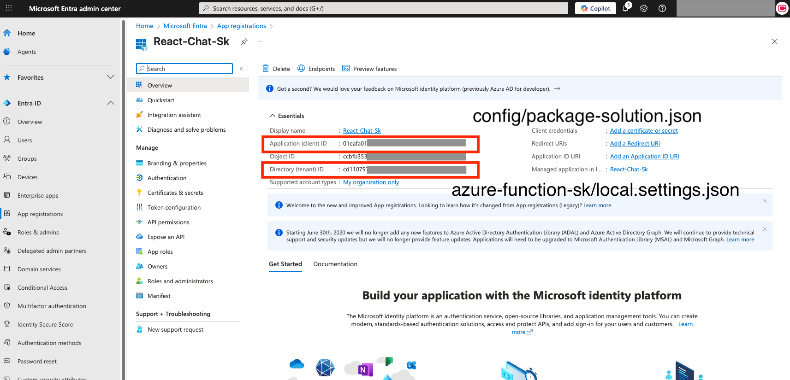

- API Permissions
  - All permissions are in delegated context
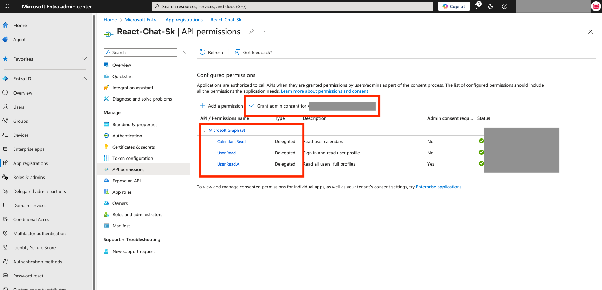

- Expose API
  - Scope: `user_impersonation`
  - Update `azure-function-sk/local.settings.json` (`AzureAd__Audience`, `Downstream__Scopes`)
  - Update `config/package-solution.json` (`webApiPermissionRequests.scope`)
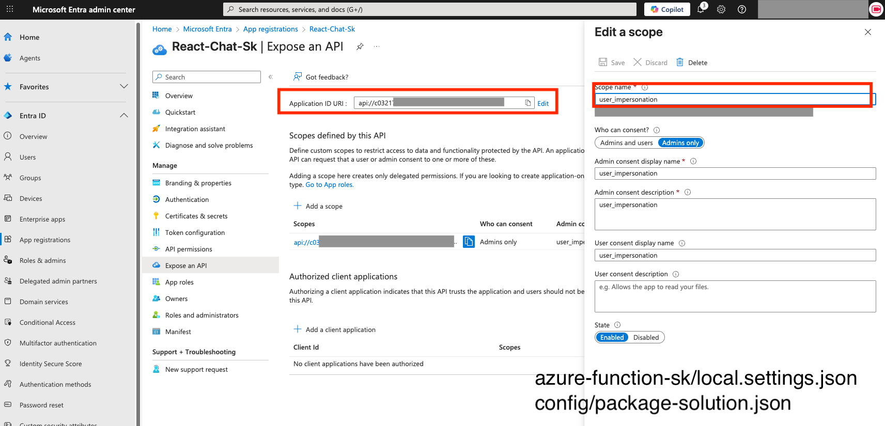

- Generate Client Secret
  - Update `azure-function-sk/local.settings.json` (`AzureAd__ClientSecret`)
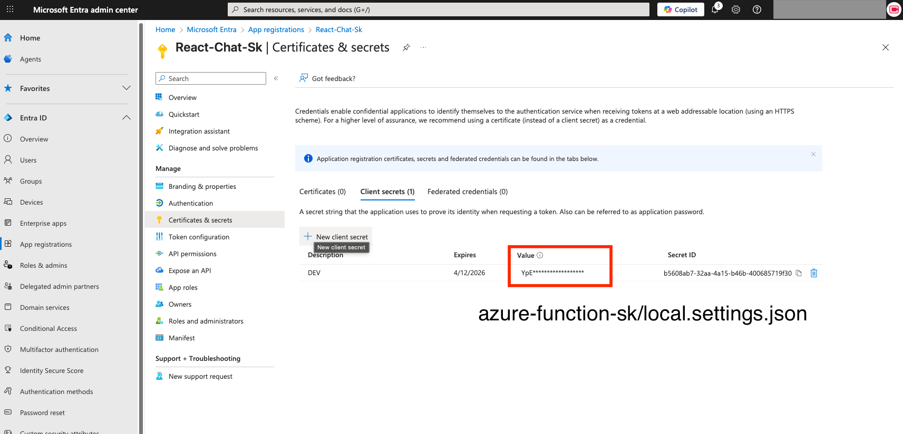

### API Permissions

- Upload the app to the Company App Catalog and enable it
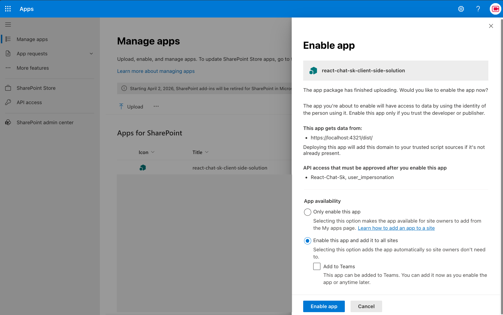

- Go to API Permissions
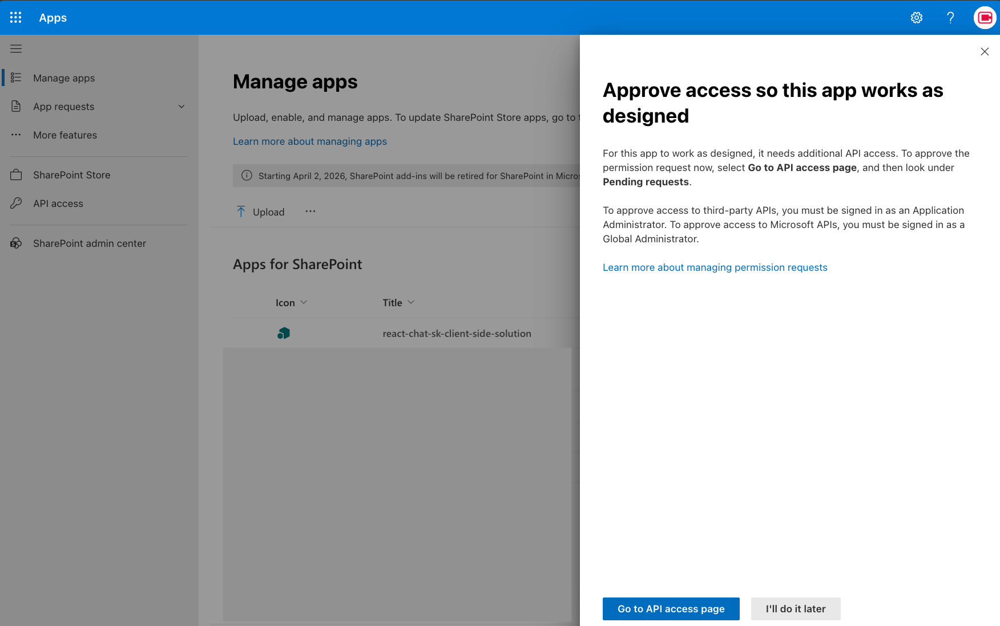

- Approve pending API requests
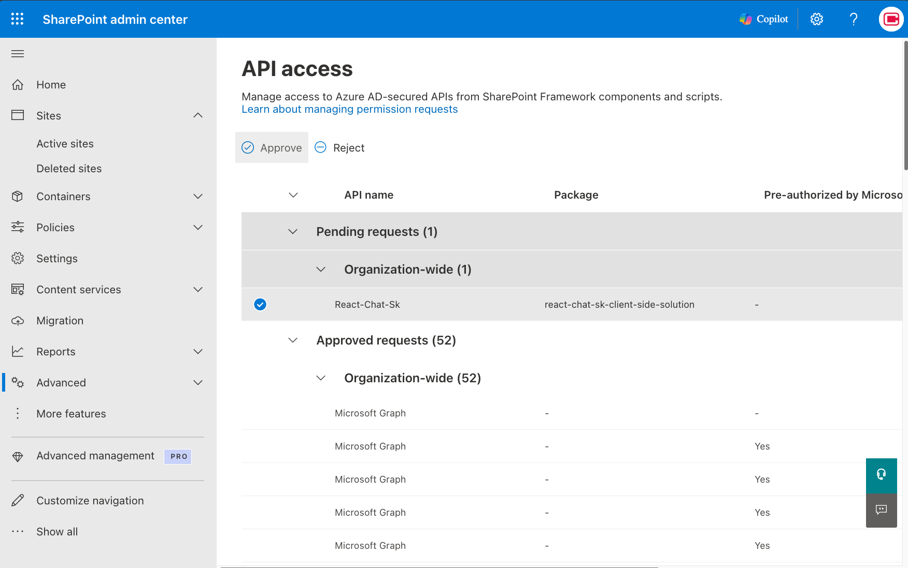

## Features

- The main purpose: an SPFx chat webpart with Azure Functions and Semantic Kernel integration
- Key technical components: real-time SSE communication, AI-powered capabilities
- Backend architecture: Azure Functions with .NET 10, Semantic Kernel for orchestration
- Functionality: function calling for dates, user info, and calendar data via Microsoft Graph
- Security: Entra ID authentication
- UI: Modern React with Fluent UI components

## Help

We do not support samples directly, but we use GitHub to track issues and want to continuously improve these samples.

If you encounter any issues while using this sample, [create a new issue](https://github.com/pnp/sp-dev-fx-webparts/issues/new?assignees=&labels=Needs%3A+Triage+%3Amag%3A%2Ctype%3Abug-suspected%2Csample%3A%20react-chat-sk&template=bug-report.yml&sample=react-chat-sk&authors=@petkir&title=react-chat-sk%20-%20).

For questions regarding this sample, [create a new question](https://github.com/pnp/sp-dev-fx-webparts/issues/new?assignees=&labels=Needs%3A+Triage+%3Amag%3A%2Ctype%3Aquestion%2Csample%3A%20react-chat-sk&template=question.yml&sample=react-chat-sk&authors=@petkir&title=react-chat-sk%20-%20).

Finally, if you have an idea for improvement, [make a suggestion](https://github.com/pnp/sp-dev-fx-webparts/issues/new?assignees=&labels=Needs%3A+Triage+%3Amag%3A%2Ctype%3Aenhancement%2Csample%3A%20react-chat-sk&template=question.yml&sample=react-chat-sk&authors=@petkir&title=react-chat-sk%20-%20).

## Disclaimer

**THIS CODE IS PROVIDED *AS IS* WITHOUT WARRANTY OF ANY KIND, EITHER EXPRESS OR IMPLIED, INCLUDING ANY IMPLIED WARRANTIES OF FITNESS FOR A PARTICULAR PURPOSE, MERCHANTABILITY, OR NON-INFRINGEMENT.**

