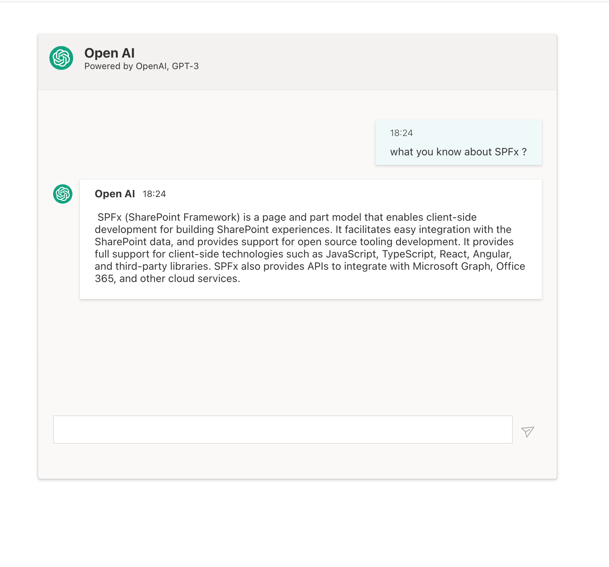
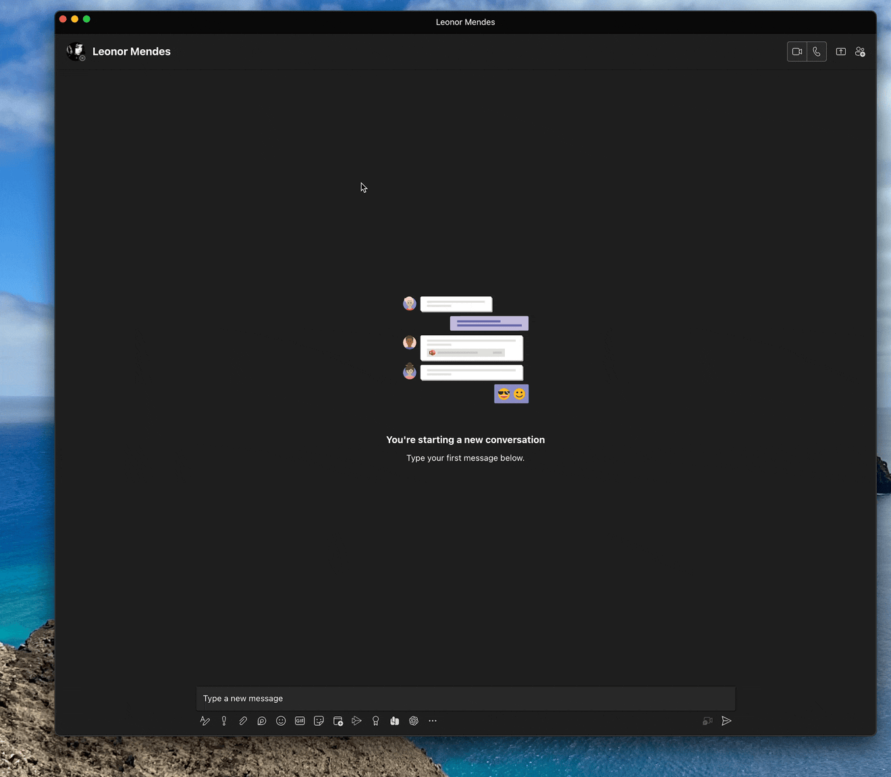

# Chat GPT App

## Summary

This App is a implementation of OpenAI ChatGPT-3. It runs on SharePoint, Teams as Personal or Teams App and Message Extension.

## Compatibility

| :warning: Important          |
|:---------------------------|
| Every SPFx version is optimally compatible with specific versions of Node.js. In order to be able to build this sample, you need to ensure that the version of Node on your workstation matches one of the versions listed in this section. This sample will not work on a different version of Node.|
|Refer to <https://aka.ms/spfx-matrix> for more information on SPFx compatibility.   |

This sample is optimally compatible with the following environment configuration:

-Incompatible-red.svg "SharePoint Server 2016 Feature Pack 2 requires SPFx 1.1")

## Applies to

* [SharePoint Framework](https://learn.microsoft.com/sharepoint/dev/spfx/sharepoint-framework-overview)
* [Microsoft 365 tenant](https://learn.microsoft.com/sharepoint/dev/spfx/set-up-your-development-environment)

> Get your own free development tenant by subscribing to [Microsoft 365 developer program](http://aka.ms/m365devprogram)

## Prerequisites

The SPFx App has thisPrerequisites:

* Azure Function Deployed to Azure 

   In the directory **./OpenAIFunctionProject/OpenAI-azure-functions.zip**  you will found the project with AzureFunction zip.ed, please copy to local computer unzip and deploy. The Azure Function App needs to be configured with Authentication Provider Microsoft , please see the README.md file on the project.

* OpenAI KEY

   The App require your personal API_KEY to call the API to ChatGPT. Please go to [OpenAI](https://platform.openai.com/) and create an Account and get your API KEY.
   This API KY needs to be configured on the Azure Function App in Applications Settings. See README.md on Azure Functions Project for more details.

* Configure Tenant Properties.

    The App needs the follow tenant properties configured on your tenant :

  * "OpenAIFunctionsAppId" this Tenant property has the Azure APPID used to secure your Azure Function APP (see README.md on OpenAIFunctionProject)

      To add Tenant property you can use M365 Cli or PowerShell to do it.

      sample M365 Cli  :

        ``m365 spo storageentity set --key OpenAIFunctionsAppId --value  6b4a20b2-bf2f-xxxx-xxxx-af960a40c2dc  --appCatalogUrl https://xxxxx.sharepoint.com/sites/appcatalog``

      sample PnP-PowerShell:

        ``Set-PnPStorageEntity -Key OpenAIFunctionsAppId -Value 6b4a20b2-bf2f-xxxx-xxxx-af960a40c2dc``

  * "OpenAIAzureFunctionUrl", this Tenant property has the URL of Azure Function

      sample M365 Cli  :

        ``m365 spo storageentity set --key OpenAIAzureFunctionUrl --value  https://openaifunctionsapp.azurewebsites.net/api/OpenAICompletion  --appCatalogUrl https://xxxxx.sharepoint.com/sites/appcatalog``

      sample PnP-PowerShell:

         ``Set-PnPStorageEntity -Key OpenAIAzureFunctionUrl -Value  https://openaifunctionsapp.azurewebsites.net/api/OpenAICompletion``

    * Upload APP to Teams catalog

      This App can be used has Teams Message Extension, please go to "teams" directory and upload the zip file to Teams App on M365 Teams Administration.

  * Approve the Required App Permissions on SharePoint Admin.

    You need to add the required permissions to the App for your Azure App used to secure the Azure Function App, by default the project has the follow defined on the package-solution.json:

    ``"webApiPermissionRequests": [
      {
        "resource": "OpenAIFunctionsApp",
        "scope": "user_impersonation"
      }
    ],``

This assume you have a Azure App called "OpenAIFunctionsApp", you can change this before bundle and create the package to deploy and after you Azure Functions App configured. <https://admin.teams.microsoft.com/policies/manage-apps>

## Contributors

* [João Mendes](https://github.com/joaojmendes)

## Version history

Version|Date|Comments
-------|----|--------
1.0.0|Feb 19, 2023|Initial release
1.1.0|March 2, 2023|Update ChatGPT-APP to use the latest API and model ChatGPT-3.5-turbo

## Minimal Path to Awesome

* Clone this repository
* in the command line run:
  * `npm install`
  * `gulp build`
  * `gulp bundle --ship`
  * `gulp package-solution --ship`
  * Add and Deploy Package to AppCatalog
 

> This sample can also be opened with [VS Code Remote Development](https://code.visualstudio.com/docs/remote/remote-overview). Visit <https://aka.ms/spfx-devcontainer> for further instructions.

## Features

This project shows how to use OpenAPI to ChatGPT and share information on teams message as an adaptive card.

* using React for building SharePoint Framework client-side web parts
* using React components for building ChatGPT web part
* using OpenAI API  
* using MSGraph API to send AdaptiveCard to Chat 
* Using React Hooks
* using Global State Management (JOTAI)
* using localStorage
* using Fluent UI FrameWork

## References

* [Getting started with SharePoint Framework](https://learn.microsoft.com/sharepoint/dev/spfx/set-up-your-developer-tenant)
* [Building for Microsoft teams](https://learn.microsoft.com/sharepoint/dev/spfx/build-for-teams-overview)
* [Use Microsoft Graph in your solution](https://learn.microsoft.com/sharepoint/dev/spfx/web-parts/get-started/using-microsoft-graph-apis)
* [Publish SharePoint Framework applications to the Marketplace](https://learn.microsoft.com/sharepoint/dev/spfx/publish-to-marketplace-overview)
* [Microsoft 365 Patterns and Practices](https://aka.ms/m365pnp) - Guidance, tooling, samples and open-source controls for your Microsoft 365 development
* [Fluent UI version 9](https://github.com/microsoft/fluentui/tree/master/packages/react-components) - Converged Fluent UI components

## Help

We do not support samples, but we this community is always willing to help, and we want to improve these samples. We use GitHub to track issues, which makes it easy for  community members to volunteer their time and help resolve issues.

If you're having issues building the solution, please run [spfx doctor](https://pnp.github.io/cli-microsoft365/cmd/spfx/spfx-doctor/) from within the solution folder to diagnose incompatibility issues with your environment.

If you encounter any issues while using this sample, [create a new issue](https://github.com/pnp/sp-dev-fx-webparts/issues/new?assignees=&labels=Needs%3A+Triage+%3Amag%3A%2Ctype%3Abug-suspected%2Csample%3A%20react-chatgpt-app&template=bug-report.yml&sample=react-chatgpt-app&authors=@smaity%20@joaojmendes&title=react-chatgpt-app%20-%20).

For questions regarding this sample, [create a new question](https://github.com/pnp/sp-dev-fx-webparts/issues/new?assignees=&labels=Needs%3A+Triage+%3Amag%3A%2Ctype%3Aquestion%2Csample%3A%20react-chatgpt-app&template=question.yml&sample=react-chatgpt-app&authors=@smaity%20@joaojmendes&title=react-chatgpt-app%20-%20).

Finally, if you have an idea for improvement, [make a suggestion](https://github.com/pnp/sp-dev-fx-webparts/issues/new?assignees=&labels=Needs%3A+Triage+%3Amag%3A%2Ctype%3Aenhancement%2Csample%3A%20react-chatgpt-app&template=question.yml&sample=react-chatgpt-app&authors=@smaity%20@joaojmendes&title=react-chatgpt-app%20-%20).

## Disclaimer

**THIS CODE IS PROVIDED *AS IS* WITHOUT WARRANTY OF ANY KIND, EITHER EXPRESS OR IMPLIED, INCLUDING ANY IMPLIED WARRANTIES OF FITNESS FOR A PARTICULAR PURPOSE, MERCHANTABILITY, OR NON-INFRINGEMENT.**

