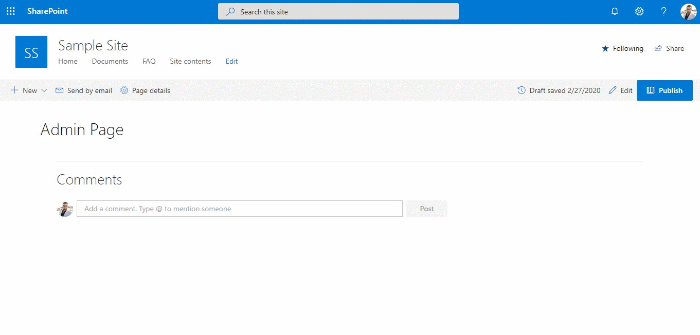

# Check User Group

## Summary

This web part finds all the Office 365 or AAD Security groups a user is a member of or all the members present in such a group. It can be used as an admin utility to quickly check the membership of any user or group from within a SharePoint page itself. The retrieved results can also be exported to a CSV file.

## Used SharePoint Framework Version

## Features

This web part uses Microsoft Graph API to get all the Office 365 or AAD Security Groups a user is a member of or all the members in such a group.

This extension illustrates the following concepts:

* Requesting **Directory.Read.All** permission scope for Microsoft Graph through the `webApiPermissionRequests` property in `package-solution.json`
* Using MSGraphClient to call the **/groups/{groupId}/members** API to get all the members in a group
* Using MSGraphClient to call the **/users/${email}/memberOf** API to get all the groups a user is member of
* Exporting the results to a CSV file using [**react-csv**](https://www.npmjs.com/package/react-csv) third party package

## Solution

Solution|Author(s)
--------|---------
react-check-user-group | [Aakash Bhardwaj](https://twitter.com/aakash_316)

## Minimal Path to Awesome

* Clone this repository
* `npm install`
* `gulp bundle --ship`
* `gulp package-solution --ship`
* Add to Site Collection App Catalog and Install the App
* Go to the API Management section in the new SharePoint Admin Center (*https://{tenantname}-admin.sharepoint.com/_layouts/15/online/AdminHome.aspx#/webApiPermissionManagement*)
* Approve the permission request for Directory.Read.All to Microsoft Graph

## Disclaimer

**THIS CODE IS PROVIDED *AS IS* WITHOUT WARRANTY OF ANY KIND, EITHER EXPRESS OR IMPLIED, INCLUDING ANY IMPLIED WARRANTIES OF FITNESS FOR A PARTICULAR PURPOSE, MERCHANTABILITY, OR NON-INFRINGEMENT.**

---

