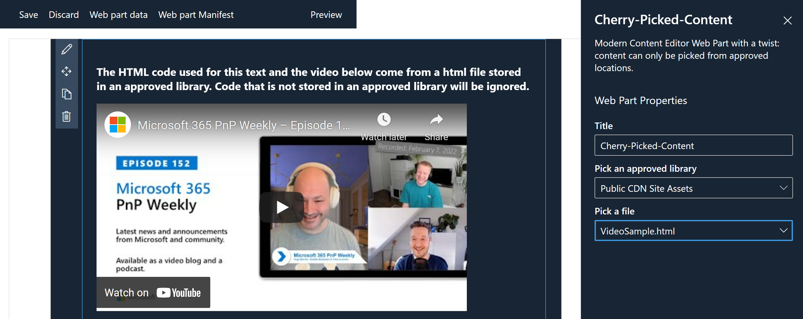

# Cherry picked content

## Summary

The Cherry-Picked Content Web Part is a modern replacement for the classic Content Editor Web Part, with a twist: code snippets can only be picked from approved document libraries.

## Compatibility

-Incompatible-red.svg "SharePoint Server 2016 Feature Pack 2 requires SPFx 1.1")

## Applies to

- [SharePoint Framework](https://aka.ms/spfx)
- [Microsoft 365 tenant](https://docs.microsoft.com/en-us/sharepoint/dev/spfx/set-up-your-developer-tenant)

> Get your own free development tenant by subscribing to [Microsoft 365 developer program](http://aka.ms/o365devprogram)

## Prerequisites

Start by editing the `ApprovedLibraries.ts` file to list your approved libraries. Then upload your code snippets to those locations. If you are looking for ideas, check out the samples folder.

The code can be rendered in two ways:

- isolated: the code is wrapped in an `iframe` to prevent conflicts with other Web Parts. Note: this is not a security feature.
- non isolated: the code is directly inserted in the page.

## Solution

Solution|Author(s)
--------|---------
React-Cherry-Picked-Content | [Christophe Humbert](https://github.com/PathToSharePoint)

## Version history

Version|Date|Comments
-------|----|--------
0.3.0|March 9, 2022|4 samples added
0.2.0|March 6, 2022|Refactoring
0.1.0|February 21, 2022|Initial draft

## Minimal path to awesome

- Clone this repository (or [download this solution as a .ZIP file](https://pnp.github.io/download-partial/?url=https://github.com/pnp/sp-dev-fx-webparts/tree/main/samples/react-cherry-picked-content) then unzip it)
- From your command line, change your current directory to the directory containing this sample (`react-cherry-picked-content`, located under `samples`)
- Under components, edit `ApprovedLibraries.ts` to list your approved libraries that contain HTML snippets
- Upload the code snippets
- Ensure that you are at the solution folder
- in the command-line run:
  - `npm install`
  - `gulp serve`

## Features

This Web Part illustrates the following concepts:

- Cascading dropdown and conditional display in the Property Pane
- Use of `SPHttpClient` and the SharePoint REST API to query SharePoint content
- React function component with `useState` and `useEffect` hooks
- React Portal in combination with an `iframe`
- Various examples of client-side code in the samples: Microsoft Graph (teams), Microsoft Graph Toolkit (people, email, agenda), charts (Chart.js, Chartist), widgets (map, stock, countdown, clock, video, game), SharePoint SOAP and REST APIs.

## References

- [Getting started with SharePoint Framework](https://docs.microsoft.com/en-us/sharepoint/dev/spfx/set-up-your-developer-tenant)
- [Building for Microsoft teams](https://docs.microsoft.com/en-us/sharepoint/dev/spfx/build-for-teams-overview)
- [Use Microsoft Graph in your solution](https://docs.microsoft.com/en-us/sharepoint/dev/spfx/web-parts/get-started/using-microsoft-graph-apis)
- [Publish SharePoint Framework applications to the Marketplace](https://docs.microsoft.com/en-us/sharepoint/dev/spfx/publish-to-marketplace-overview)
- [Microsoft 365 Patterns and Practices](https://aka.ms/m365pnp) - Guidance, tooling, samples and open-source controls for your Microsoft 365 development

## Help

We do not support samples, but this community is always willing to help, and we want to improve these samples. We use GitHub to track issues, which makes it easy for  community members to volunteer their time and help resolve issues.

If you're having issues building the solution, please run [spfx doctor](https://pnp.github.io/cli-microsoft365/cmd/spfx/spfx-doctor/) from within the solution folder to diagnose incompatibility issues with your environment.

You can try looking at [issues related to this sample](https://github.com/pnp/sp-dev-fx-webparts/issues?q=label%3A%22sample%3A%20react-cherry-picked-content%22) to see if anybody else is having the same issues.

You can also try looking at [discussions related to this sample](https://github.com/pnp/sp-dev-fx-webparts/discussions?discussions_q=react-cherry-picked-content) and see what the community is saying.

If you encounter any issues while using this sample, [create a new issue](https://github.com/pnp/sp-dev-fx-webparts/issues/new?assignees=&labels=Needs%3A+Triage+%3Amag%3A%2Ctype%3Abug-suspected%2Csample%3A%20react-cherry-picked-content&template=bug-report.yml&sample=react-cherry-picked-content&authors=@PathToSharePoint&title=react-cherry-picked-content%20-%20).

For questions regarding this sample, [create a new question](https://github.com/pnp/sp-dev-fx-webparts/issues/new?assignees=&labels=Needs%3A+Triage+%3Amag%3A%2Ctype%3Aquestion%2Csample%3A%20react-cherry-picked-content&template=question.yml&sample=react-cherry-picked-content&authors=@PathToSharePoint&title=react-cherry-picked-content%20-%20).

Finally, if you have an idea for improvement, [make a suggestion](https://github.com/pnp/sp-dev-fx-webparts/issues/new?assignees=&labels=Needs%3A+Triage+%3Amag%3A%2Ctype%3Aenhancement%2Csample%3A%20react-cherry-picked-content&template=suggestion.yml&sample=react-cherry-picked-content&authors=@PathToSharePoint&title=react-cherry-picked-content%20-%20).

## Disclaimer

**THIS CODE IS PROVIDED *AS IS* WITHOUT WARRANTY OF ANY KIND, EITHER EXPRESS OR IMPLIED, INCLUDING ANY IMPLIED WARRANTIES OF FITNESS FOR A PARTICULAR PURPOSE, MERCHANTABILITY, OR NON-INFRINGEMENT.**

