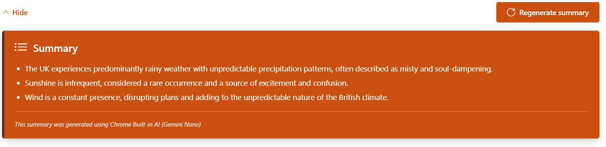
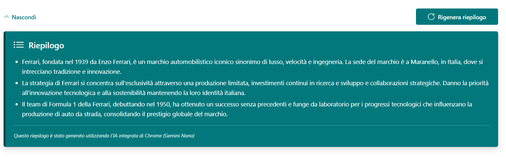
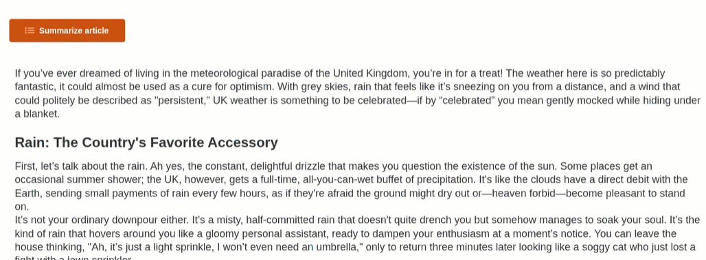
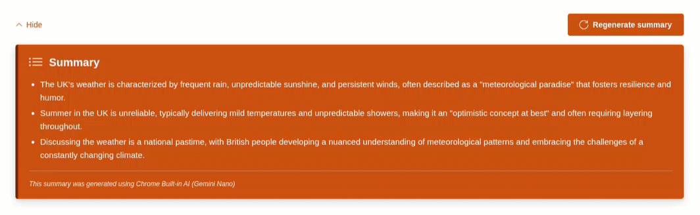
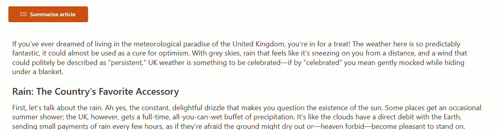

# Summarize Page Content with Chrome Built-in AI

## Summary

This SharePoint Framework (SPFx) web part uses Chrome's built-in Summarizer API (Gemini Nano) to summarize SharePoint page content with advanced features including caching, translation, multilingual support, and permission-based access control. All AI processing runs entirely in the browser using Chrome's on-device AI capabilities - no server-side APIs required.


### Summary in English using Chrome built-in AI summarization



### Summary in Italian using Chrome built-in AI translation (of a page in Italian)



### First time experience - Model Download for editors and summary generation



### Summary Regeneration by editors (faster than first time)



### Experience for read-only users (no model download)



## Used SharePoint Framework Version


## Applies to

- [SharePoint Framework](https://aka.ms/spfx)
- [Microsoft 365 tenant](https://learn.microsoft.com/sharepoint/dev/spfx/set-up-your-developer-tenant)

> Get your own free development tenant by subscribing to [Microsoft 365 developer program](http://aka.ms/o365devprogram)

## Prerequisites

### Browser Requirements

- **Chrome 138 or later** with built-in AI features enabled
- **Operating System**:
  - Windows 10 or 11
  - macOS 13+ (Ventura and onwards)
  - Linux
  - ChromeOS (from Platform 16389.0.0 onwards) on Chromebook Plus devices
- **Storage**: At least 22 GB of free space for model download
- **Hardware**:
  - GPU: More than 4 GB of VRAM, OR
  - CPU: 16 GB of RAM and 4+ CPU cores
- **Network**: Unlimited data or unmetered connection for model download

### Instructions for editors (users generating summaries)

#### Verify Device Performance Class (Optional)

- Open Chrome and navigate to `chrome://on-device-internals`
- Check the value for `Device performance class`. If it is `low` or `Very low`, summarization may take a long time.

#### Using the Summarizer

- The first time you use the summarizer, the Gemini Nano model (~3 GB) will be downloaded. Ensure you have sufficient disk space and an unmetered network connection.
- This might take a while depending on your connection speed.
- Once downloaded, the article will be summarized locally in the browser.
- For subsequent uses, the summarizer will be ready to use immediately without re-downloading the model.

### Development Requirements

- Node.js v18 LTS
- SharePoint Online tenant
- SPFx development environment

## Collaborators

- [Anoop T](https://github.com/anoopt) (@anoopt)

## Version history

| Version | Date             | Comments        |
| ------- | ---------------- | --------------- |
| 1.0     | November 2025    | Initial release with Chrome Summarizer API |

## Minimal Path to Awesome

### Initial Setup

- Clone this repository
- Navigate to the `react-chrome-built-in-ai-summarise-page-content` folder
- In the command-line run:
  - `npm install`
  - `gulp serve`

### SharePoint List Setup

The web part automatically uses a SharePoint list named "Page Summary Cache" to store summaries. You need to create this list with the following schema:

**List Name**: `Page Summary Cache`

**Columns**:

- `Title` (Single line of text) - Default column
- `builtinaiPageId` (Single line of text) - **Indexed**
- `builtinaiLanguage` (Single line of text)
- `builtinaiSummary` (Multiple lines of text)

**Quick Setup**: Upload the `sharepoint/assets/schema-summary-cache.xml` file using the SharePoint list template feature.

### Deployment

- Add the web part to a SharePoint page with content
- **Important**: After deploying, approve the Microsoft Graph API permissions:
  - Go to SharePoint Admin Center → Advanced → API Access
  - Approve the `Sites.Read.All` permission request
- Click "Summarize article" to generate a summary (requires editListItems permission)

### Build for Production

```bash
npm run build
gulp package-solution --ship
```

The package will be available at: `sharepoint/solution/summarize-page-content-built-in-ai.sppkg`

## Key Dependencies

- **SPFx**: 1.21.1
- **React**: 17.0.1
- **Fluent UI React**: 8.106.4
- **@apvee/spfx-react-toolkit**: 1.0.0 - Provides essential SPFx React hooks
- **PnPjs**: Via spfx-react-toolkit for SharePoint operations
- **marked**: 17.0.0 - Markdown parsing and rendering

## Features

This web part demonstrates the following:

### Core Functionality

- **Chrome's Built-in Summarizer API**: Uses Gemini Nano for on-device AI summarization
- **Microsoft Graph Integration**: Fetches SharePoint page content via Graph API
- **SharePoint List Caching**: Stores generated summaries in a SharePoint list for reuse
- **Streaming Support**: Real-time streaming of summary generation
- **Markdown Rendering**: Supports markdown-formatted summaries with proper styling

### Multilingual Support

- **Language Detection**: Automatically detects page content language
- **Translation**: Translates content between English and target language if needed
- **Supported Languages**: English, Japanese, Spanish (direct), Italian, French (via translation)
- **Locale-specific UI**: Interface adapts to user's SharePoint locale (en-US, it-IT, fr-FR)

### User Experience

- **Permission-Based Access**: Only users with `editListItems` permission can generate summaries
- **Read-Only User Support**: Non-editors can view cached summaries without triggering AI downloads
- **Smooth Animations**: Fade-in/out transitions and slide up/down effects for show/hide
- **Progress Indicators**: Visual feedback during model download and generation
- **Hide/Show Toggle**: Collapsible summary view
- **Regenerate Option**: Editors can regenerate summaries with force refresh

### Technical Features

- **Fluent UI Components**: Modern, responsive design with PrimaryButton, Shimmer, MessageBar, ProgressIndicator
- **React Hooks**: Custom hooks for Summarizer, Translator, Language Detector, and Summary Cache
- **@apvee/spfx-react-toolkit**: Leverages powerful SPFx hooks for simplified development
  - `useSPFxContext`: Access to SharePoint context
  - `useSPFxPageContext`: Page-specific context and metadata
  - `useSPFxMSGraphClient`: Simplified Microsoft Graph API calls
  - `useSPFxPnP`: PnPjs integration for SharePoint REST operations
  - `useSPFxPermissions`: Permission-based UI rendering
  - `useSPFxLocaleInfo`: Locale and language detection
- **TypeScript**: Fully typed with comprehensive interfaces
- **Error Handling**: Browser compatibility checks, API availability validation, comprehensive error messages
- **Performance Optimized**: Caching reduces redundant AI processing and model downloads

### Key Concepts Illustrated

- Chrome AI APIs (Gemini Nano, Summarizer, Translator, Language Detector)
- Microsoft Graph API integration in SPFx
- SharePoint REST API for list operations (via PnPjs)
- TypeScript custom hooks pattern
- **@apvee/spfx-react-toolkit** for streamlined SPFx development
- Fluent UI React components v8
- On-device machine learning
- Progressive Web Capabilities
- Permission-based UI rendering with SPFx permissions API
- Multilingual content processing
- SharePoint list as cache storage

## How It Works

### For Editors (users with editListItems permission)

1. **Page Content Extraction**: Uses Microsoft Graph API to fetch text content from web parts on the current SharePoint page
2. **Language Detection**: Automatically detects the language of the page content
3. **Translation (if needed)**: Translates content to English if not in supported Summarizer language (en/ja/es)
4. **Content Cleaning**: Removes HTML tags and normalizes text
5. **AI Summarization**: Passes cleaned content to Chrome's Summarizer API with optimized parameters
6. **Translation Back (if needed)**: Translates summary back to original language
7. **Caching**: Stores summary in SharePoint list with page ID and language
8. **Display Results**: Shows summary with hide/show toggle and regenerate option

### For Read-Only Users (users without editListItems permission)

1. **Cache Check**: Checks SharePoint list for existing summary
2. **Load Cached Summary**: If found, displays cached summary without triggering AI
3. **No Cache Available**: Shows disabled button with message to wait for editor
4. **No Model Download**: Prevents unnecessary AI model downloads on user machines

### Caching Strategy

- Summaries are stored in a SharePoint list named "Page Summary Cache"
- Cache key: Page ID + Language code (e.g., `{pageId}_it`)
- Editors can force regenerate to update cached summaries
- Read-only users always see the latest cached version

## Limitations

- Only works in Chrome 138+ (other browsers will show a warning)
- First use requires downloading the Gemini Nano model (~22GB)
- Requires specific hardware capabilities (see prerequisites)
- Model download requires unmetered network connection
- Summarization quality depends on page content structure
- Direct summarization only supports English, Japanese, and Spanish (other languages use translation)
- Caching requires SharePoint list to be created and properly configured
- Only users with `editListItems` permission can generate/regenerate summaries

## Security & Permissions

### SharePoint Permissions Required

- **Editors** (generate summaries): `editListItems` permission on the site
- **Viewers** (view cached summaries): Standard read access to the site

### API Permissions

- **Microsoft Graph**: `Sites.Read.All` (to read page content)

### Data Privacy

- All AI processing happens locally in the user's browser
- No data is sent to external servers for summarization
- Summaries are stored in your SharePoint tenant (not external storage)
- Cache list can be secured with standard SharePoint permissions

## References

- [Chrome Summarizer API Documentation](https://developer.chrome.com/docs/ai/summarizer-api)
- [Chrome Translator API Documentation](https://developer.chrome.com/docs/ai/translator-api)
- [Chrome Language Detector API Documentation](https://developer.chrome.com/docs/ai/language-detector-api)
- [Chrome Built-in AI Overview](https://developer.chrome.com/docs/ai/built-in)
- [Getting started with SharePoint Framework](https://docs.microsoft.com/en-us/sharepoint/dev/spfx/set-up-your-developer-tenant)
- [Use Microsoft Graph in your solution](https://docs.microsoft.com/en-us/sharepoint/dev/spfx/web-parts/get-started/using-microsoft-graph-apis)
- [Fluent UI React Components](https://developer.microsoft.com/en-us/fluentui#/controls/web)
- [SharePoint REST API](https://docs.microsoft.com/en-us/sharepoint/dev/sp-add-ins/get-to-know-the-sharepoint-rest-service)
- [Microsoft 365 Patterns and Practices](https://aka.ms/m365pnp)
- [@apvee/spfx-react-toolkit](https://www.npmjs.com/package/@apvee/spfx-react-toolkit)

---

## Contributing

Contributions are welcome! Please feel free to submit a Pull Request.

## License

This project is licensed under the MIT License.

## Support

If you encounter any issues or have questions, please [open an issue](https://github.com/pnp/sp-dev-fx-webparts/issues) on GitHub.


