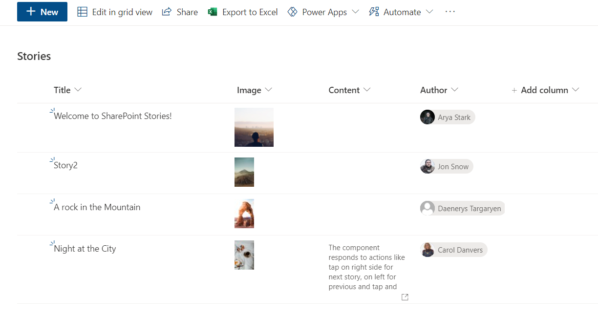

# Company Stories Webpart

## Summary

This web part allows you to add images to a SharePoint List, and renders them with a UX very similar to Instagram Stories (or Twitter Reels, or [Place your Social network here]). It is a way to engage employees, showing relevant content in a well-known visual appearance.

## Used SharePoint Framework Version

## Applies to

- [SharePoint Framework](https://aka.ms/spfx)
- [Microsoft 365 tenant](https://docs.microsoft.com/en-us/sharepoint/dev/spfx/set-up-your-developer-tenant)

> Get your own free development tenant by subscribing to [Microsoft 365 developer program](http://aka.ms/o365devprogram)

## Prerequisites

- A SharePoint list called "Stories" with the following fields:
  - Image: image field type
  - Content: multi-line field type
  - Author: Person field type

- Permission _User.ReadBasic.All_ to the Graph API

## Solution

Solution|Author(s)
--------|---------
react-company-stories | Luis Mañez (MVP, [ClearPeople](http://www.clearpeople.com), @luismanez)

## Version history

Version|Date|Comments
-------|----|--------
1.0|March 31, 2021|Initial release

## Disclaimer

**THIS CODE IS PROVIDED *AS IS* WITHOUT WARRANTY OF ANY KIND, EITHER EXPRESS OR IMPLIED, INCLUDING ANY IMPLIED WARRANTIES OF FITNESS FOR A PARTICULAR PURPOSE, MERCHANTABILITY, OR NON-INFRINGEMENT.**

---

## Minimal Path to Awesome

- Configure SharePoint permissions to Graph API (see Prerequisites). Suggest you to use the [Microsoft 365 CLI](https://blog.mastykarz.nl/grant-api-permissions-office-365-cli/)
- Clone this repository
- Ensure that you are at the solution folder
- In the command-line run:
  - **npm install**
  - **gulp serve --nobrowser**
- Add the web part to the SharePoint Workbench (same Site where the List was created)

## Features

This web part illustrates the following concepts:

- Using the Microsoft Graph Toolkit react components: [Person component](https://docs.microsoft.com/en-us/graph/toolkit/components/person)
- Using FluentUI components
- Using [react-insta-stories](https://www.npmjs.com/package/react-insta-stories) package
- Using SP REST API

## References

About SPFx:

- [Getting started with SharePoint Framework](https://docs.microsoft.com/en-us/sharepoint/dev/spfx/set-up-your-developer-tenant)
- [Building for Microsoft teams](https://docs.microsoft.com/en-us/sharepoint/dev/spfx/build-for-teams-overview)
- [Use Microsoft Graph in your solution](https://docs.microsoft.com/en-us/sharepoint/dev/spfx/web-parts/get-started/using-microsoft-graph-apis)
- [Publish SharePoint Framework applications to the Marketplace](https://docs.microsoft.com/en-us/sharepoint/dev/spfx/publish-to-marketplace-overview)
- [Microsoft 365 Patterns and Practices](https://aka.ms/m365pnp) - Guidance, tooling, samples and open-source controls for your Microsoft 365 development
