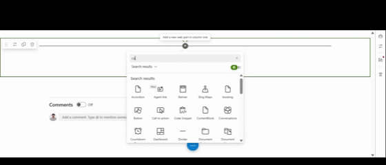

# Content Block

## Summary

A dynamic SharePoint Framework (SPFx) web part that displays content in a flexible two-panel layout with rich text editing capabilities. Features drag-and-drop reordering, active/inactive content management, image uploads to SharePoint, and configurable layouts - perfect for creating engaging content sections on SharePoint pages.



## Compatibility

| :warning: Important          |
|:---------------------------|
| Every SPFx version is optimally compatible with specific versions of Node.js. In order to be able to build this sample, you need to ensure that the version of Node on your workstation matches one of the versions listed in this section. This sample will not work on a different version of Node.|
|Refer to <https://aka.ms/spfx-matrix> for more information on SPFx compatibility.   |

This sample is optimally compatible with the following environment configuration:


-Incompatible-red.svg "SharePoint Server 2016 Feature Pack 2 requires SPFx 1.1")


## Applies to

- [SharePoint Framework](https://aka.ms/spfx)
- [Microsoft 365 tenant](https://docs.microsoft.com/en-us/sharepoint/dev/spfx/set-up-your-developer-tenant)

> Get your own free development tenant by subscribing to [Microsoft 365 developer program](http://aka.ms/o365devprogram)

## Prerequisites

- SharePoint Online environment
- A SharePoint list with the following columns:
  - **Title** (Single line of text) - Required
  - **Description** (Multiple lines of text) - Required
  - **Title2** (Single line of text) - Required
  - **Description2** (Multiple lines of text) - Required
  - **Active** (Yes/No) - Automatically created by the web part
  - **SortOrder** (Ngumber) - Automatically created by the web part

## Contributors

- [Sai Siva Ram Bandaru](https://github.com/saiiiiiii)

## Version history

| Version | Date             | Comments        |
| ------- | ---------------- | --------------- |
| 1.0     | December 24, 2025 | Initial release |

## Minimal Path to Awesome

- Clone this repository
- Ensure that you are at the solution folder
- In the command-line run:
  - `npm install`
  - `gulp serve`
- Create a SharePoint list with required columns (Title, Description, Title2, Description2)
- Add the web part to a page and configure it to use list

## Features

This web part illustrates the following concepts:

### Core Features

- **Flexible Two-Panel Layout**: Display content in three configurable layouts:
  - 50/50 split (equal panels)
  - 75/25 split (left panel larger)
  - 25/75 split (right panel larger)
- **Rich Text Editor**: Full-featured HTML editor with:
  - Text formatting (bold, italic, underline, strikethrough)
  - Font size controls
  - Text and highlight colors
  - Lists (bulleted and numbered)
  - Text alignment
  - Links, tables, and horizontal rules
  - Image insertion with SharePoint upload
  - Source code editing mode
  - Heading styles (H1-H6)
- **Content Management Panel**: Comprehensive editing interface with:
  - Two-tab interface (Configuration + Item Management)
  - Drag-and-drop reordering
  - Active/inactive content toggle
  - Expandable accordion rows for editing
  - Add, edit, and delete operations
  - Batch save functionality
- **Image Upload Service**: Upload images directly to SharePoint SiteAssets
  - Automatic folder creation (SiteAssets/ProjectImages)
  - File validation (type and size)
  - Unique filename generation
  - Direct SharePoint integration
- **Active/Inactive Managegment**: 
  - Toggle content visibility without deletion
  - Separate groups for active and inactive items
  - Only active items display to end users
- **Drag-and-Drop Reordering**: Powered by @dnd-kit
  - Visual feedback during dragging
  - Reorder within active or inactive groups
  - Automatic sort order persistence
- **Responsive Design**: 
  - Mobile-friendly stacked layout
  - Adaptive panel sizing
  - Touch-friendly controls

### Technical Highlights

- **PnP JS v4 Integration**: Modern SharePoint REST API interactions using @pnp/sp
- **React Functional Components**: Modern React hooks and patterns
- **TypeScript**: Fully typed interfaces for better development experience
- **SCSS Modules**: Scoped styling with CSS variables and mixins
- **Fluent UI React v8**: Microsoft's design system components
- **DnD Kit**: Modern drag-and-drop functionality
- **Automatic Column Management**: Web part creates required columns if missing
- **Permission-Aware**: Graceful handling of library access
- **Performance Optimized**: 
  - Memoized components to prevent unnecessary re-renders
  - Debounced input updates
  - Efficient batch operations

### Rich Text Editor Features

The custom RichTextEditor component provides:

- **Formatting Toolbar**: Comprehensive formatting options
- **Image Management**:
  - Upload to SharePoint (SiteAssets/ProjectImages)
  - Insert by URL
  - Preview before insertion
  - Max 10MB file size
- **Table Insertion**: Create tables with custom rows/columns
- **Source Code Mode**: Edit HTML directly
- **Keyboard Shortcuts**: Standard formatting shortcuts (Ctrl+B, Ctrl+I, etc.)
- **Content Sanitization**: XSS protection through HTML sanitization
- **Undo/Redo**: Built-in history management

### Layout Options

#### 50/50 Layout
Equal width panels - ideal for balanced content presentation

#### 75/25 Layout
Large left panel, smaller right panel - great for main content with sidebar

#### 25/75 Layout
Smaller left panel, large right panel - perfect for navigation with detailed content

## Configuration

### Web Part Properties

| Property | Type | Default | Description |
|----------|------|---------|-------------|
| listId | string | "" | GUID of the SharePoint list containing content blocks |
| layout | choice | "50-50" | Layout style: "50-50", "75-25", or "25-75" |

### SharePoint List Structure

The web part requires a SharePoint list with these columns:

| Column Name | Type | Required | Description |
|-------------|------|----------|-------------|
| Title | Single line of text | Yes | Title for left panel |
| Description | Multiple lines of text | Yes | Rich HTML content for left panel |
| Title2 | Single line of text | Yes | Title for right panel |
| Description2 | Multiple lines of text | Yes | Rich HTML content for right panel |
| Active | Yes/No | Auto-created | Whether content block is active |
| SortOrder | Number | Auto-created | Display order of content blocks |

**Note**: The web part automatically creates the Active and SortOrder columns if they don't exist.

## Usage

### Initial Setup

1. Create a SharePoint list with the required columns (Title, Description, Title2, Description2)
2. Add the Content Block web part to a SharePoint page
3. Click the **Edit** icon on the web part
4. The Content Block Manager panel will open

### Configuration Tab

1. **Select List**: Choose the SharePoint list containing content
2. **Select Layout**: Choose preferred layout (50/50, 75/25, or 25/75)
3. **Lock List**: Lock selection to prevent accidental changes
4. Click **Next** to proceed to item management

### Managing Content

#### Adding Items

1. In the **Manage Items** tab, click **Add Item**
2. A new expandable row appears
3. Fill in:
   - Title (left panel header)
   - Body (left panel rich text content)
   - Title 2 (right panel header)
   - Body 2 (right panel rich text content)
4. Click **Save** to persist changes

#### Editing Items

1. Click the **chevron** icon to expand an item row
2. Edit any field using the rich text editors
3. Changes are tracked automatically
4. Click **Save** to persist all changes

#### Reordering Items

1. Click and hold the **grip handle** (⋮⋮) on any item
2. Drag the item up or down
3. Release to drop in the new position
4. Click **Save** to persist the new order

#### Activating/Deactivating Items

1. Use the **toggle switch** on any item row
2. Active items appear under "Active Items"
3. Inactive items appear under "Inactive Items"
4. Only active items are visible to end users
5. Click **Save** to persist changes

#### Deleting Items

1. Click the **delete** icon on any item row
2. Confirm deletion in the prompt
3. Click **Save** to permanently remove the item

### Using the Rich Text Editor

#### Text Formatting

- Select text and click toolbar buttons for formatting
- Use keyboard shortcuts: Ctrl+B (bold), Ctrl+I (italic), Ctrl+U (underline)
- Choose heading styles from the dropdown

#### Inserting Images

1. Click the **image** icon in the toolbar
2. Choose one of two options:
   - **Upload to SharePoint**: Select a file (max 10MB)
   - **Enter URL**: Paste an image URL
3. Preview the image
4. Click **Upload & Insert** or **Insert Image**
5. Images are stored in SiteAssets/ProjectImages

#### Source Code Editing

1. Click the **code** icon to toggle source mode
2. Edit HTML directly
3. Click again to return to visual mode

- [UI Editor Sample](https://github.com/pnp/sp-dev-fx-webparts/tree/main/samples/react-uieditor)

### Display Modes

#### Edit Mode
- Settings icon appears in top-right corner
- Click to open Content Block Manager
- Configure list and manage items

#### Read Mode (Published Page)
- Only active content blocks are displayed
- Content appears in selected layout
- Users can interact with links and images
- No editing controls visible

## Advanced Scenarios

### Multiple Content Blocks

Create multiple content blocks in list to build rich page sections:
- Each block can have different content in left/right panels
- Reorder blocks to tell a story
- Deactivate seasonal content without deletion

### Image Management

Images uploaded through the editor are stored in:
```
/sites/SiteName/SiteAssets/ProjectImages/
```

Files are named with timestamps to prevent conflicts:
```
1640000000000_image.jpg
```


### Responsive Behavior

The web part automatically switches to stacked layout on mobile devices:
- Breakpoint: 768px
- Panels stack vertically
- Full-width panels for easier reading

## Dependencies

### Production Dependencies

```json
{
  "@dnd-kit/core": "^6.3.1",
  "@dnd-kit/modifiers": "^9.0.0",
  "@dnd-kit/sortable": "^10.0.0",
  "@fluentui/react": "^8.106.4",
  "@pnp/sp": "^4.17.0",
  "react": "17.0.1",
  "react-dom": "17.0.1"
}
```

### Key Libraries

- **@pnp/sp**: SharePoint REST API wrapper
- **@dnd-kit**: Modern drag-and-drop library
- **@fluentui/react**: Microsoft Fluent UI components
- **React**: UI framework

## References

- [Getting started with SharePoint Framework](https://docs.microsoft.com/en-us/sharepoint/dev/spfx/set-up-your-developer-tenant)
- [Building for Microsoft teams](https://docs.microsoft.com/en-us/sharepoint/dev/spfx/build-for-teams-overview)
- [Use Microsoft Graph in your solution](https://docs.microsoft.com/en-us/sharepoint/dev/spfx/web-parts/get-started/using-microsoft-graph-apis)
- [Publish SharePoint Framework applications to the Marketplace](https://docs.microsoft.com/en-us/sharepoint/dev/spfx/publish-to-marketplace-overview)
- [Microsoft 365 Patterns and Practices](https://aka.ms/m365pnp)
- [PnP JS Documentation](https://pnp.github.io/pnpjs/)
- [Fluent UI React](https://developer.microsoft.com/en-us/fluentui#/controls/web)
- [DnD Kit Documentation](https://docs.dndkit.com/)


## Help

We do not support samples, but this community is always willing to help, and we want to improve these samples. We use GitHub to track issues, which makes it easy for community members to volunteer their time and help resolve issues.

If you're having issues building the solution, please run [spfx doctor](https://pnp.github.io/cli-microsoft365/cmd/spfx/spfx-doctor/) from within the solution folder to diagnose incompatibility issues with your environment.

You can try looking at [issues related to this sample](https://github.com/pnp/sp-dev-fx-webparts/issues?q=label%3A%22sample%3A%20document-explorer%22) to see if anybody else is having the same issues.

You can also try looking at [discussions related to this sample](https://github.com/pnp/sp-dev-fx-webparts/discussions?discussions_q=document-explorer) and see what the community is saying.

If you encounter any issues while using this sample, [create a new issue](https://github.com/pnp/sp-dev-fx-webparts/issues/new?assignees=&labels=Needs%3A+Triage+%3Amag%3A%2Ctype%3Abug-suspected%2Csample%3A%20document-explorer&template=bug-report.yml&sample=document-explorer&authors=@saiiiiiii&title=document-explorer%20-%20).

For questions regarding this sample, [create a new question](https://github.com/pnp/sp-dev-fx-webparts/issues/new?assignees=&labels=Needs%3A+Triage+%3Amag%3A%2Ctype%3Aquestion%2Csample%3A%20document-explorer&template=question.yml&sample=document-explorer&authors=@saiiiiiii&title=document-explorer%20-%20).

Finally, if you have an idea for improvement, [make a suggestion](https://github.com/pnp/sp-dev-fx-webparts/issues/new?assignees=&labels=Needs%3A+Triage+%3Amag%3A%2Ctype%3Aenhancement%2Csample%3A%20document-explorer&template=suggestion.yml&sample=document-explorer&authors=@saiiiiiii&title=document-explorer%20-%20).

## Disclaimer

**THIS CODE IS PROVIDED *AS IS* WITHOUT WARRANTY OF ANY KIND, EITHER EXPRESS OR IMPLIED, INCLUDING ANY IMPLIED WARRANTIES OF FITNESS FOR A PARTICULAR PURPOSE, MERCHANTABILITY, OR NON-INFRINGEMENT.**

