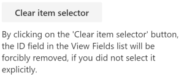

# React Content Query web part (SharePoint Online-Compatible)

## Summary

> **NOTE:** This web part was built with SPFx 1.10.0, making it only compatible with SharePoint Online. If you wish, you can use [an earlier version of this web part](../OnPrem/README.md) which is compatible on-premises versions of SharePoint.

The **Content Query web part** is a modern version of the good old **Content by Query web part** that was introduced in SharePoint 2007. Built for Office 365, this modern version is built using the **SharePoint Framework (SPFx)** and uses the latest *Web Stack* practices. 

While the original web part was based on an **XSLT** templating engine, this *React* web part is based on the well known [Handlebars templating engine](http://handlebarsjs.com), which empowers users to create simple, yet powerful **HTML** templates for rendering the queried content. This new version also lets the user query *any site collections* which resides on the same domain URL, add *unlimited filters*, query `DateTime` fields to the *nearest minute* rather than being limited to a day, and much more.


## Used SharePoint Framework Version


## Applies to

* [SharePoint Framework Developer](https://docs.microsoft.com/sharepoint/dev/spfx/sharepoint-framework-overview)
* [Office 365 developer tenant](https://docs.microsoft.com/sharepoint/dev/spfx/set-up-your-developer-tenant)

## Solution

Solution|Authors
--------|-----------
react-content-query-web part (Online)|David Warner II ([Warner Digital](http://warner.digital), [@DavidWarnerII](https://twitter.com/davidwarnerii))
react-content-query-web part (Online)|Hugo Bernier ([Tahoe Ninjas](http://tahoeninjas.blog), [@bernierh](https://twitter.com/bernierh))
react-content-query-web part (Online)|Paolo Pialorsi ([PiaSys.com](https://piasys.com/), [@PaoloPia](https://twitter.com/PaoloPia?s=20))
react-content-query-web part |Simon-Pierre Plante

## Version history

Version|Date|Comments
-------|----|--------
1.0.0|May 04, 2017|Initial release
1.0.1|July 23rd 15, 2017|Updated to GA Version
1.0.3|August 12, 2017|Added external scripts functionality
1.0.4|August 31, 2017|Fixed a bug where tenant sites/subsites were missing from the **Web Url** dropdown
1.0.5|September 1st, 2017|Added a **Site Url** parameter next to the **Web Url** parameter in order to narrow down the results
1.0.6|September 19, 2017|Upgraded to SharePoint drop 1.2.0 and added the site URL and web URL preselection when adding the web part for the first time on a page. Also fixed a bug with fields that had spaces in their internal names (automatically replaced with `_x0020_` by SharePoint).
1.0.7|November 17, 2017|Reverted to drop 1.1.0 in order to keep compatibility for SP2016 on-premise
1.0.8|March 17, 2018|Updated to store the selected list using its ID instead of its title, so the web part keeps working if the list title gets updated.
1.0.9|March 28, 2018|Added a switch to enable the web part to apply it's query recursively within folders, and fixed a bug where webs could sometimes not appear under the web URL dropdown
1.0.10|April 5, 2018|Fixed a bug where the webs of the selected site collection were not being loaded correctly for particular tenants
1.0.11|May 22, 2018|Fixed a bug causing filters to loose their sort order in IE
1.0.12|April 19, 2020|Upgraded to SPFx 1.10
1.0.13|April 28, 2020|Added support for Dynamic Data

## Disclaimer

**THIS CODE IS PROVIDED *AS IS* WITHOUT WARRANTY OF ANY KIND, EITHER EXPRESS OR IMPLIED, INCLUDING ANY IMPLIED WARRANTIES OF FITNESS FOR A PARTICULAR PURPOSE, MERCHANTABILITY, OR NON-INFRINGEMENT.**

## Minimal Path to Awesome

### Global dependencies

Requires Gulp globally installed:

```shell
npm install --global gulp
```

### Building the code

Download & install all dependencies, build, bundle & package the project

```shell
# download & install dependencies
npm install

# transpile all TypeScript & SCSS => JavaScript & CSS
gulp build

# create component bundle & manifest
gulp bundle

# create SharePoint package
gulp package-solution
```

These commands produce the following:

- `./lib`: intermediate-stage commonjs build artifacts
- `./dist`: bundled script, along with other resources
- `./temp/deploy`: all resources required by component(s) to deploy to a CDN (when `--ship` argument present)

## Build options

- `gulp clean`: Deletes all build output (`/dist`, `/lib`, `/temp`, etc.).
- `gulp build`: Transpiles all TypeScript & SCSS to JavaScript & CSS, generates source map files & TypeScript type declaration files
- `gulp bundle [--ship|-p|--production]`: Runs gulp task **build**, then uses webpack to create the JavaScript bundle(s) and component manifest(s) as defined in `./config/config.json`. The `--ship`, `-p` or `--production` argument specifies a production build that will generate minified bundles.
- `gulp serve [--ship|-p|--production]`: Runs gulp tasks `build`, `bundle` & starts the local webserver. Depending on the project type, it opens the browser and navigates to the local workbench or specified URL (in the case of extension components). The `--ship`, `-p` or `--production` argument specifies a production build that modifies the resulting package for production hosting rather than local hosting of assets.
- `gulp package-solution`: Creates the SharePoint Package (`.sppkg`) file.
- `gulp dist`: Creates a production-ready SharePoint Package (`.sppkg`) file. The following gulp task gets executed in this specific order `gulp clean`, `gulp bundle`, `gulp package-solution.`
- `gulp dev`: Creates a development-ready SharePoint Package (`.sppkg`) file. The following gulp task will be executed in this specific order `gulp clean`, `gulp bundle`, `gulp package-solution.`

> View all available gulp tasks by running `gulp --tasks`

## Features

### Cross site collection

The web part uses the search in order to get all sites under the current domain, which makes it possible to query not only sub-sites but other site collections and their sub-sites as well. By default, the current site collection and the current web on which the user is adding the web part will be pre-selected automatically.


### Unlimited filters

The user isn't limited to 3 filters anymore, an unlimited amount of filters can be added to narrow down your query


### Improved date/time filters

It is now possible to include time validation when querying date fields, giving the ability to be more precise when it comes to querying items against date values.


### Handlebars templating engine

Enjoy a simple, yet powerful, HTML-based templating engine for rendering your results. The web part even generates a default Handlebars template for you based on the view fields you have selected during the configuration!

For advanced users, more than 150 Handlebars block helpers are available by default within the user-defined template. For a list of all block helpers, see [handlebars-helpers](https://github.com/helpers/handlebars-helpers#helpers)

### Built-in template editor

Edit your Handlebars template directly within the tool pane using a built-in [code editor](https://ace.c9.io/) which provides code folding, syntax highlighting, line wrapping, indentation and many more features to the tip of your fingers.

### Include your own external scripts and/or block helpers!

You can now specify your own external scripts that needs to be loaded either **before** or **after** rendering the Handlebars template.


External scripts can be used to include either libraries such as *jQuery*, or even *custom logic scripts* that can leverage the exposed `onPrerender` and `onPostRender` methods for advanced functionality. 

### Dynamic Data support

You can configure the web part to be a provider of [Dynamic Data](https://docs.microsoft.com/en-us/sharepoint/dev/spfx/dynamic-data) for other web parts. You simply need to select the `ID` field in the list of **View Fields** and to include in the Handlebars template an HTML element with CSS class name `selectItem` and a custom `data-\*` attribute with name `data-itemId` providing the value of the `ID` field for every item. Here you can see a sample code excerpt of a selection button:

```html
<button class='selectItem' data-itemId='{{ID.textValue}}'>Select</button>
```

If you like, in the property pane panel where you configure the View Fields and the Handlebar template, there is a button called **Configure item selector** that you can press to automatically select the `ID` field and to enrich the auto-generated Handlebars template with the above HTML code.


The output in the Handlebars template will be like the following one.


Once you configured the item selector, you can update its HTML code, if you like. The default template will output UI like in the following image.


If you did not customize the auto-generated Handlebars template, you can even remove the item selector by pressing **Clear item selector**, which will become available when the item selector is configured.



In order to consume the Dynamic Data provided by the web part, you will have to add to the current modern page another web part -- created as a Dynamic Data consumer -- and choose **Connect to source**.


Once connected to a source, you will able to connect any of the following properties:

* `webUrl`: the absolute URL of the web containing the currently selected item.
* `listId`: the ID (GUID) of the list containing the currently selected item.
* `itemId`: the ID (number) of the currently selected item.


## Getting Started

### Adding the web part to your page

To add the **Content Query web part** to your site page you have two options:

* Either clone this repository, build the project yourself and connect it to SharePoint (see [Connect your client-side web part to SharePoint](https://docs.microsoft.com/sharepoint/dev/spfx/web-parts/get-started/connect-to-sharepoint))
* Or download the `react-content-query-web part.sppkg` file available in the `sharepoint/solution` folder of the repository and add it directly in your app catalog in order to be able to use it in your site. 

> Note: The second method will only work for Office 365 sites, since the `.sppkg` file points to an Office 365 public CDN URL which expects the referrer to come from a valid `https://**\*.sharepoint.com\***` URL.

### Configuring the web part

As seen in the [User friendly configuration](#user-friendly-configuration) section, configuring the web part is quite straight forward. However, here's a list of *gotchas* that could save you some time :

* The **Web Url** property uses the search to find all sites that are under the current domain. That being said, newly created sites can take a while to appear within the dropdown options, based on the search crawl schedule.
* The **Filters** property still supports query string expressions like `[PageQueryString:ParamName]` for text fields, and date expressions such as `[Today]` or `[Today] + 4` for date fields.
* The **Template** property stops getting automatically generated while selecting view fields as soon as the template is manually updated, in order to prevent unwanted loss of templating efforts.
* The **Template Url** property has priority over the **Template** property, which means if a valid handlebars template URL is provided, the inline template will be kept, but ignored at runtime.  

### Designing your Handlebars template

#### Basics

Before anything, make sure you understand the basics of Handlebars and its associated syntax by reading their [documentation](http://handlebarsjs.com)

#### Available tokens

To make it simple, a **template context** is automatically exposed within the handlebars template, giving the user the ability to work with the following exposed tokens :

Property         | Description
-----------------|------------------
`{{items}}`        | The array of objects that represents the items returned from the CAML query
`{{pageContext}}`  | The SPFx [PageContext](https://github.com/SharePoint/sp-dev-docs/blob/master/reference/spfx/sp-page-context/pagecontext.md) object which contains useful information about the current web, list, user, language etc...
`{{accessDenied}}` | A boolean value indicating if the current user has a denied access to the configured site that gets queried. This gives the designer the power to decide what to render in a case where the current user doesn't have access to the queried site.
`{{webNotFound}}`  | A boolean value indicating if the configured site that gets queried doesn't exist anymore. This also gives the designer the power to decide what to render in a case where the queried site doesn't exist anymore.

#### Available block helpers

Besides the available tokens above, nearly 150 [block helpers](http://handlebarsjs.com/block_helpers.html) are also available for use in the Handlebars template, see [handlebars-helpers](https://github.com/helpers/handlebars-helpers#helpers) for a list of all possible block helpers.

*Example using the "compare" block helper for conditional rendering based on current language :*

```handlebars
{{#compare pageContext.web.language '==' 1033}}
    <h1>This is rendered if current language is 1033</h1>
{{else}}
    <h1>This is rendered if current language is anything else
{{/compare}}
```

#### Displaying items and their values

For displaying items and their field values, we must first iterate through the exposed `{{items}}` token using a `{{each}}` block helper:

##### Handlebars

```handlebars
{{#each items}}
    <div class="item"></div>
{{/each}}
```

##### Output

```html
<div class="item"></div>
<div class="item"></div>
<div class="item"></div>
...
```

Once we can loop within the items, we can render any field, as long as the field has been selected in the **View Fields** property of the tool pane. The Handlebars token corresponding to a field is always the field's internal name, which is displayed between `{{brackets}}` next to the field's display name in the property pane for reference.

##### Handlebars

```handlebars
{{#each items}}
    <div class="item">
        <p>MyField value : {{MyField}}</p>
    </div>
{{/each}}
```

##### Output

```html
<div class="item">[object]</div>
<div class="item">[object]</div>
<div class="item">[object]</div>
```

We are almost there, the above code is rendering an `[object]` because the Content Query web part offers 3 different ways to render a field value:

Property | Description
---------|---------------
`{{MyField.textValue}}` | Renders the text value of the field, a more readable end-user value to use for display.
`{{MyField.htmlValue}}` | Renders the HTML value of the field. For example, a *Link* field HTML value would render something like `<a href="...">My Link Field</a>`
`{{MyField.rawValue}}`  | Returns the raw value of the field. For example, a *Taxonomy* field raw value would return an object which contains the term `wssId` and its label

##### Handlebars

```handlebars
{{#each items}}
    <div class="item">
        <p>MyUserField text value : {{MyUserField.textValue}}</p>
        <p>MyUserField html value : {{MyUserField.htmlValue}}</p>
        <p>MyUserField raw value : {{MyUserField.rawValue}}</p>
    </div>
{{/each}}
```

##### Output

```html
<div class="item">
    <p>MyUserField text value : Simon-Pierre Plante</p>
    <p>MyUserField html value : <a href="..." onclick="...">Simon-Pierre Plante</a></p>
    <p>MyUserField raw value : 26</p>
</div>
...
```

### Including your own external scripts and/or block helpers

#### Including basic library files

For including JavaScript files within the web part, file URLs must be added to the **External Scripts** parameter available in the tool pane.


Each file URL must be on its own line, and placed in the desired order. The scripts will be loaded asynchronously, but in a sequential fashion, which means that the web part will wait until a script is completely loaded before proceeding to load the next one.

#### Including custom logic files

If you need custom logic files that can interact precisely **before** or **after** the rendering of the HTML generated by the *Handlebars* template, you must follow the pattern below in order for the web part to recognize the endpoints and call them when needed :

```javascript
ReactContentQuery.ExternalScripts.MyScriptFile = {
	
    onPreRender: function(wpContext, handlebarsContext) {
        // Do something before rendering (ie: adding a custom block helper)
    },
    
    onPostRender: function(wpContext, handlebarsContext) {
        // Do something after rendering (ie: calling a plugin on the generated HTML)
    }
    
}
```

Looking at this example, here are the key things that needs to be respected in order for the file to work :

#### Namespace

* The script uses a namespace which starts by `ReactContentQuery.ExternalScripts.`, followed by the name of its own file
* The name of the file has to be written without its `.js` extension, and without any characters that aren't letters or numbers
* The name of the file needs to respect the same casing as in it's URL

Examples :

##### MyScript.js

```javascript
ReactContentQuery.ExternalScripts.MyScript {
    ...
}
```

##### _My-Funky*named*Script_.js

```javascript
ReactContentQuery.ExternalScripts.MyFunkynamedScript {
    ...
}
```

#### Functions

* The script implements the `onPreRender` function for code that has to be executed before rendering
* The scripts implements the `onPostRender` function for code that has to be executed after rendering

Both functions provide the following parameters:

Parameter             | Description
----------------------|-------------
`wpContext`         | Represents the context of the web part that called the function, which exposes all kinds of useful information such as `wpContext.
`domElement` | Represents the HTML element on which the current web part is being rendered.
`handlebarsContext` | Represents the handlebars context used for generating the template of the current web part. Can be used for adding handlebar block helpers in the `onPreRender` function for example.


#### Including custom block helpers

Custom *block helpers* that can be used directly within the *Handlebars* template can be added simply by using a custom logic script file that implements the `onPreRender` function.

Example:

##### MyCustomBlockHelper.js

```javascript
ReactContentQuery.ExternalScripts.MyCustomBlockHelper = {

    onPreRender: function(wpContext, handlebarsContext) {
    
        // Adds the "testHelper"
        handlebarsContext.registerHelper('testHelper', function(param, options) {
            return "Output from testHelper : " + param;
        });
    }
}
```


