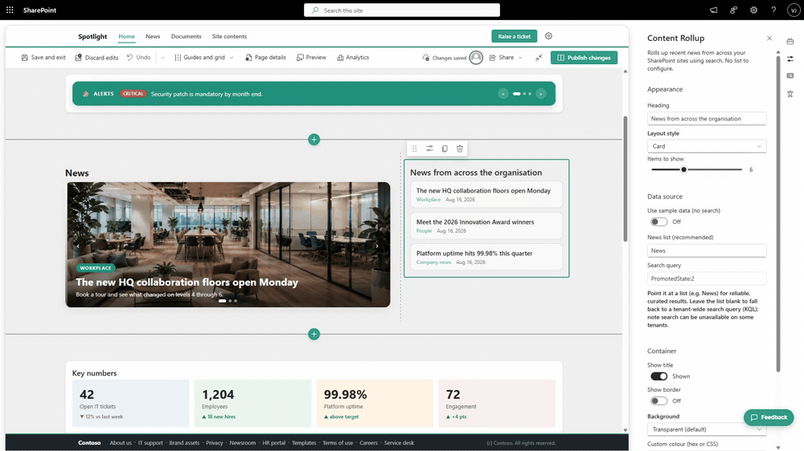

# Content Rollup

## Summary

Content Rollup gathers recent news and content from across your SharePoint sites and shows it in one web part. Point it at a list such as **News** and it renders those items newest first. Leave the list blank and it runs a tenant-wide Microsoft Search (KQL) query instead. There is no CAML and no Handlebars template to wire up, so nothing breaks when you move it between tenants, which is exactly where the older content-query web parts fall over. Pick one of four layouts, set how many items to show, and drop it on a page.

## Compatibility

This sample is optimally compatible with the following environment configuration.

- SharePoint Framework `1.21.1`
- Node.js `v22` (required by SPFx 1.21)
- SharePoint Online

## Applies to

- [SharePoint Framework](https://aka.ms/spfx)
- [Microsoft 365 tenant](https://learn.microsoft.com/en-us/microsoftteams/platform/concepts/build-and-test/prepare-your-o365-tenant)

> Get your own free development tenant by subscribing to the [Microsoft 365 developer program](https://aka.ms/o365devprogram).

## Prerequisites

- A SharePoint Online site.
- Optionally, a **News** list (or any list) you want to roll up.
- For the search fallback, Microsoft Search must be available on the tenant. Where search is locked down, bind a list instead.

## Solution

| Solution | Author(s) |
| -------- | --------- |
| react-content-rollup | Vijay Kumar G ([@gvijaikumar9](https://github.com/gvijaikumar9), [fivenumber.com](https://www.fivenumber.com)) |

## Version history

| Version | Date | Comments |
| ------- | ---- | -------- |
| 1.0 | August 27, 2026 | Initial release |

## Minimal Path to Awesome

- Clone this repository (or download this solution folder).
- Ensure that you are at the solution folder.
- In the command line run:
  - `npm install`
  - `gulp serve` to test the web part in the hosted workbench, or
  - `gulp bundle --ship` then `gulp package-solution --ship` to build the package.
- Upload the generated `.sppkg` from the `sharepoint/solution` folder to your tenant App Catalog and add the **Content Rollup** web part to a page.

## Features

This web part illustrates the following concepts:

- Rolling up recent content from a chosen list, or across every site through a tenant-wide Microsoft Search (KQL) query.
- Four layout styles (Card, Minimal, Bold, Compact) and a slider that sets how many items to show.
- An optional heading, border, and background colour (transparent, white, light grey, accent tint, or your own hex value).
- One switch between two data sources: bind a list where search is locked down, fall back to search everywhere else. When nothing matches, it says so plainly instead of throwing an error.
- No CAML and no Handlebars pipeline, which is what makes the older content-query web parts brittle.

## References

- [Getting started with SharePoint Framework](https://learn.microsoft.com/en-us/sharepoint/dev/spfx/set-up-your-development-environment)
- [Overview of SharePoint client-side web parts](https://learn.microsoft.com/en-us/sharepoint/dev/spfx/web-parts/overview-client-side-web-parts)
- [Use the Microsoft Search API to query data](https://learn.microsoft.com/en-us/graph/search-concept-overview)
- [Building for Microsoft 365](https://learn.microsoft.com/en-us/office/developer-program/microsoft-365-developer-program)

## Help

We do not support samples, but this community is always willing to help, and we want to improve these samples. We use GitHub to track issues, which makes it easy for community members to volunteer their time and help resolve issues.

If you encounter any issues while using this sample, [create a new issue](https://github.com/pnp/sp-dev-fx-webparts/issues/new/choose).

For questions regarding this sample, [create a new question](https://github.com/pnp/sp-dev-fx-webparts/issues/new/choose).

Finally, if you have an idea for improvement, [make a suggestion](https://github.com/pnp/sp-dev-fx-webparts/issues/new/choose).

## Disclaimer

**THIS CODE IS PROVIDED *AS IS* WITHOUT WARRANTY OF ANY KIND, EITHER EXPRESS OR IMPLIED, INCLUDING ANY IMPLIED WARRANTIES OF FITNESS FOR A PARTICULAR PURPOSE, MERCHANTABILITY, OR NON-INFRINGEMENT.**

