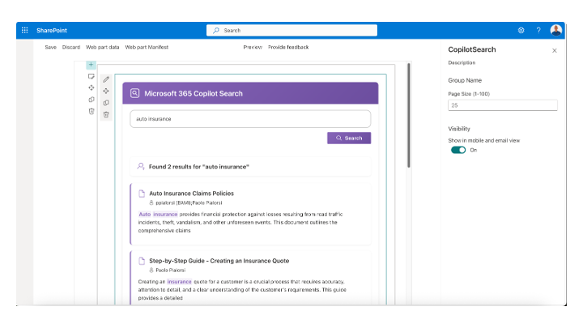

# Microsoft 365 Copilot Chat and Search Web Parts


This SharePoint Framework (SPFx) solution demonstrates how to integrate with Microsoft 365 Copilot APIs using Work IQ to create interactive AI experiences directly within SharePoint pages. The solution includes two web parts: Copilot Chat and Copilot Search.




## Summary

This sample provides two fully functional web parts that leverage Work IQ Copilot APIs:

### Copilot Chat Web Part

A conversational interface using the `/beta/copilot/conversations` API to create conversations and exchange messages with Microsoft 365 Copilot:

- **Conversational AI**: Create and manage chat conversations with Microsoft 365 Copilot
- **Additional Context**: Configure custom instructions to guide Copilot's responses
- **Web Search**: Enable or disable public web content in Copilot responses
- **File References**: Include external files (PDFs, documents) for Copilot to reference
- **Markdown Rendering**: Display AI responses with rich formatting, tables, and code blocks
- **Chat History**: Maintain conversation history within a session
- **Multiple Conversations**: Start new conversations as needed

### Copilot Search Web Part

An intelligent search interface using the `/beta/copilot/search` API for hybrid semantic and lexical search:

- **Natural Language Search**: Enter queries in plain language to find relevant documents
- **Semantic Understanding**: AI-powered search that understands context and intent
- **Rich Metadata**: Display document titles, authors, and resource types
- **Keyword Highlighting**: Preview text with highlighted search terms
- **Direct Document Access**: Click-through links to search results
- **Configurable Results**: Customize page size for search results

## Contributors

* [Paolo Pialorsi](https://github.com/PaoloPia)

## Version history

|Version|Date|Comments|
|-------|----|--------|
|1.0|December 08, 2025|Initial release|

## Solution Structure

```
react-copilot-apis/
├── src/
│   ├── services/
│   │   ├── CopilotChatService.ts        # Chat service implementation
│   │   ├── ICopilotChatService.ts       # Chat interface and types
│   │   ├── CopilotSearchService.ts      # Search service implementation
│   │   └── ICopilotSearchService.ts     # Search interface and types
│   └── webparts/
│       ├── copilotChat/
│       │   ├── CopilotChatWebPart.ts    # Chat web part entry point
│       │   └── components/
│       │       ├── CopilotChat.tsx       # Chat React component
│       │       └── CopilotChat.module.scss # Chat styling
│       └── copilotSearch/
│           ├── CopilotSearchWebPart.ts  # Search web part entry point
│           └── components/
│               ├── CopilotSearch.tsx     # Search React component
│               └── CopilotSearch.module.scss # Search styling
├── package.json
└── README.md
```

## How It Works

### Copilot Chat

1. **Conversation Creation**: On first message, the service creates a new Copilot conversation via `POST /beta/copilot/conversations`
2. **Message Exchange**: User messages are sent to `POST /beta/copilot/conversations/{id}/chat` with optional context, files, and web search settings
3. **Response Rendering**: AI responses are parsed and rendered as Markdown with support for tables, code blocks, and formatting
4. **Service Scope**: The `CopilotChatService` is registered as a singleton service in the SPFx service scope for efficient Work IQ client management

### Copilot Search

1. **Search Request**: User queries are sent to `POST /beta/copilot/search` with natural language text
2. **Metadata Retrieval**: The service requests title and author metadata for each search result
3. **Keyword Highlighting**: Preview text includes highlighted keywords using `<c0>` tags which are converted to bold formatting
4. **Result Display**: Search hits are displayed with document titles as clickable links, author information, and formatted preview text
5. **Service Scope**: The `CopilotSearchService` is registered as a singleton service in the SPFx service scope for efficient Work IQ client management

## Prerequisites

- **Node.js**: v22.14.0 or higher (< v23.0.0)
- **SharePoint Framework**: v1.22.0-rc.0 or higher
- **Microsoft 365 Tenant**: With Microsoft 365 Copilot license
- **SharePoint Online**: Environment with sufficient permissions
- **Work IQ Permissions**: The web part requires delegated permissions for Copilot APIs (*Sites.Read.All, Mail.Read, People.Read.All, OnlineMeetingTranscript.Read.All, Chat.Read, ChannelMessage.Read.All, ExternalItem.Read.All*)

## Setup Instructions

### 1. Clone the Repository

```bash
git clone <repository-url>
cd react-copilot-apis
```

### 2. Install Dependencies

```bash
npm install
```

### 3. Trust the Development Certificate

```bash
npm run trust-dev-cert
```

### 4. Start the Development Server

```bash
npm run start
```

### 5. Test the Web Part

Open the SPFx Workbanch (_layouts/15/workbench.aspx) and load the webpart from the local development environment.

### 6. Package for Production

```bash
npm run package-solution
```

The package will be created in `sharepoint/solution/react-copilot-apis.sppkg`

### 7. Deploy to SharePoint

1. Upload the `.sppkg` file to your SharePoint App Catalog
2. When prompted, approve the Work IQ permission requests (admin consent required)
3. Add the web part to any SharePoint page

## Configuration

### Copilot Chat Web Part

The Chat web part provides three configurable properties in the property pane:

1. **Additional Instructions**: Custom context or instructions to guide Copilot's behavior (multiline text)
2. **Enable Public Web Content**: Toggle to enable/disable web search in Copilot responses
3. **Files**: Comma-separated URLs of external files for Copilot to reference (e.g., PDFs, Word documents)

### Copilot Search Web Part

The Search web part provides one configurable property in the property pane:

1. **Page Size**: Number of search results to display per page (1-100, default: 25)

## Key Features

### CopilotChatService

- **CreateCopilotConversation()**: Creates a new conversation and returns conversation ID
- **SendChatMessage()**: Sends a message with optional parameters:
  - `additionalContext`: Array of context messages
  - `files`: Array of file references (URIs)
  - `webSearchEnabled`: Boolean to enable web search
  - `contextualResources`: Combined resources object

### CopilotSearchService

- **Search()**: Performs hybrid semantic and lexical search with parameters:
  - `query`: Natural language search query (max 1,500 characters)
  - `pageSize`: Number of results to return (1-100)
  - `dataSources`: Configuration for OneDrive data source with metadata fields

### Chat React Component

- Real-time message rendering with Markdown support
- Conversation history management
- Loading states and error handling
- Responsive design with Fluent UI components
- Keyboard shortcuts (Ctrl+Enter to send)

### Search React Component

- Natural language search input
- Loading states and error handling
- Rich result display with titles, authors, and preview text
- Keyword highlighting in preview text
- Direct links to document locations
- Responsive design with Fluent UI components
- Keyboard shortcuts (Enter to search)

## API Endpoints Used

### Chat APIs
- `POST /beta/copilot/conversations` - Create new conversation
- `POST /beta/copilot/conversations/{id}/chat` - Send chat message

### Search APIs
- `POST /beta/copilot/search` - Perform hybrid semantic and lexical search across OneDrive

## Limitations

- Requires Microsoft 365 Copilot license and appropriate Work IQ API permissions
- Uses Beta Work IQ APIs which may change
- Conversation history is session-based (not persisted across page reloads)
- Admin consent required for Work IQ API permissions

## References

- [Work IQ Copilot APIs](https://learn.microsoft.com/en-us/graph/api/resources/copilot-api-overview)
- [SharePoint Framework Overview](https://learn.microsoft.com/en-us/sharepoint/dev/spfx/sharepoint-framework-overview)
- [Work IQ TypeScript Client](https://github.com/microsoftgraph/msgraph-sdk-javascript)
- [React Markdown Documentation](https://github.com/remarkjs/react-markdown)

## Disclaimer

**THIS CODE IS PROVIDED *AS IS* WITHOUT WARRANTY OF ANY KIND, EITHER EXPRESS OR IMPLIED, INCLUDING ANY IMPLIED WARRANTIES OF FITNESS FOR A PARTICULAR PURPOSE, MERCHANTABILITY, OR NON-INFRINGEMENT.**

---

