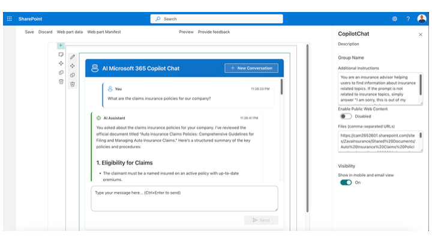

# Microsoft 365 Copilot Chat Web Part

This SharePoint Framework (SPFx) web part demonstrates how to integrate with Microsoft 365 Copilot APIs using Work IQ to create an interactive AI chat experience directly within SharePoint pages.



## Summary

This sample provides a fully functional chat interface that leverages the Work IQ Copilot APIs (`/beta/copilot/conversations`) to create conversations and exchange messages with Microsoft 365 Copilot. The web part supports advanced features including:

- **Conversational AI**: Create and manage chat conversations with Microsoft 365 Copilot
- **Additional Context**: Configure custom instructions to guide Copilot's responses
- **Web Search**: Enable or disable public web content in Copilot responses
- **File References**: Include external files (PDFs, documents) for Copilot to reference
- **Markdown Rendering**: Display AI responses with rich formatting, tables, and code blocks
- **Chat History**: Maintain conversation history within a session
- **Multiple Conversations**: Start new conversations as needed

## Solution Structure

```
react-copilot-apis/
├── src/
│   ├── services/
│   │   ├── CopilotChatService.ts        # Service implementation for Copilot APIs
│   │   └── ICopilotChatService.ts       # Interface and type definitions
│   └── webparts/
│       └── copilotChat/
│           ├── CopilotChatWebPart.ts    # Web part entry point
│           └── components/
│               ├── CopilotChat.tsx       # Main React component
│               └── CopilotChat.module.scss # Styling
├── package.json
└── README.md
```

## How It Works

1. **Conversation Creation**: On first message, the service creates a new Copilot conversation via `POST /beta/copilot/conversations`
2. **Message Exchange**: User messages are sent to `POST /beta/copilot/conversations/{id}/chat` with optional context, files, and web search settings
3. **Response Rendering**: AI responses are parsed and rendered as Markdown with support for tables, code blocks, and formatting
4. **Service Scope**: The `CopilotChatService` is registered as a singleton service in the SPFx service scope for efficient Work IQ client management

## Prerequisites

- **Node.js**: v22.14.0 or higher (< v23.0.0)
- **SharePoint Framework**: v1.22.0-rc.0 or higher
- **Microsoft 365 Tenant**: With Microsoft 365 Copilot license
- **SharePoint Online**: Environment with sufficient permissions
- **Work IQ Permissions**: The web part requires delegated permissions for Copilot APIs (*Sites.Read.All, Mail.Read, People.Read.All, OnlineMeetingTranscript.Read.All, Chat.Read, ChannelMessage.Read.All, ExternalItem.Read.All*)

## Setup Instructions

### 1. Clone the Repository

```bash
git clone <repository-url>
cd react-copilot-apis
```

### 2. Install Dependencies

```bash
npm install
```

### 3. Trust the Development Certificate

```bash
npm run trust-dev-cert
```

### 4. Start the Development Server

```bash
npm run start
```

### 5. Test the Web Part

Open the SPFx Workbanch (_layouts/15/workbench.aspx) and load the webpart from the local development environment.

### 6. Package for Production

```bash
npm run package-solution
```

The package will be created in `sharepoint/solution/react-copilot-apis.sppkg`

### 7. Deploy to SharePoint

1. Upload the `.sppkg` file to your SharePoint App Catalog
2. When prompted, approve the Work IQ permission requests (admin consent required)
3. Add the web part to any SharePoint page

## Configuration

The web part provides three configurable properties in the property pane:

1. **Additional Instructions**: Custom context or instructions to guide Copilot's behavior (multiline text)
2. **Enable Public Web Content**: Toggle to enable/disable web search in Copilot responses
3. **Files**: Comma-separated URLs of external files for Copilot to reference (e.g., PDFs, Word documents)

## Key Features

### CopilotChatService

- **CreateCopilotConversation()**: Creates a new conversation and returns conversation ID
- **SendChatMessage()**: Sends a message with optional parameters:
  - `additionalContext`: Array of context messages
  - `files`: Array of file references (URIs)
  - `webSearchEnabled`: Boolean to enable web search
  - `contextualResources`: Combined resources object

### React Component

- Real-time message rendering with Markdown support
- Conversation history management
- Loading states and error handling
- Responsive design with Fluent UI components
- Keyboard shortcuts (Ctrl+Enter to send)

## API Endpoints Used

- `POST /beta/copilot/conversations` - Create new conversation
- `POST /beta/copilot/conversations/{id}/chat` - Send chat message

## Limitations

- Requires Microsoft 365 Copilot license and appropriate Work IQ API permissions
- Uses Beta Work IQ APIs which may change
- Conversation history is session-based (not persisted across page reloads)
- Admin consent required for Work IQ API permissions

## References

- [Work IQ Copilot APIs](https://learn.microsoft.com/en-us/graph/api/resources/copilot-api-overview)
- [SharePoint Framework Overview](https://learn.microsoft.com/en-us/sharepoint/dev/spfx/sharepoint-framework-overview)
- [Work IQ TypeScript Client](https://github.com/microsoftgraph/msgraph-sdk-javascript)
- [React Markdown Documentation](https://github.com/remarkjs/react-markdown)

## Disclaimer

**THIS CODE IS PROVIDED *AS IS* WITHOUT WARRANTY OF ANY KIND, EITHER EXPRESS OR IMPLIED, INCLUDING ANY IMPLIED WARRANTIES OF FITNESS FOR A PARTICULAR PURPOSE, MERCHANTABILITY, OR NON-INFRINGEMENT.**

---

