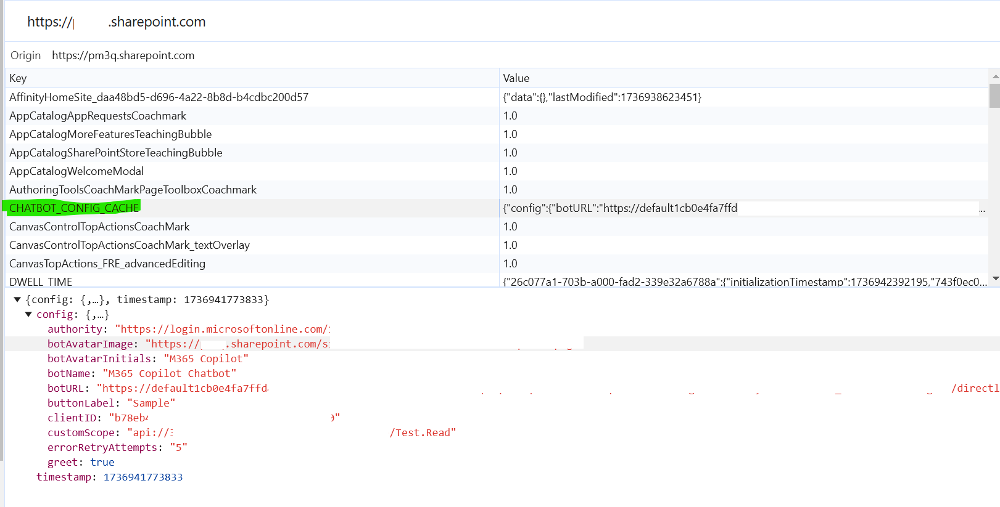
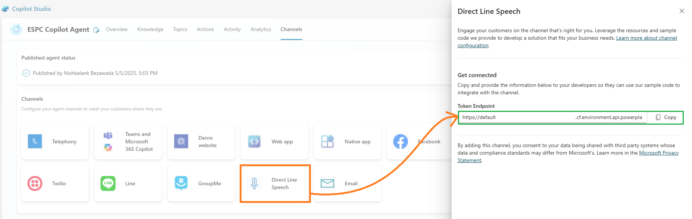

# Copilot Chat Bubble with SSO – ESPC 2024 Session Summarizer

## Summary

This web part integrates a Microsoft Copilot Agent, built via Copilot Studio, into SharePoint Online. It features Single Sign-On (SSO) and a chat interface.

For demonstration purposes, this sample uses a Copilot agent that summarizes sessions at ESPC 2024, providing concise overviews of all sessions and topics, including key takeaways and speaker insights.

The web part uses cache management to store its properties, which are fetched from a SharePoint list.

### Web Part Properties

This web part reads its configuration from a SharePoint list named **CopilotAgentConfig**. Create the "CopilotAgentConfig" list with the following columns:

| Property Name      | Column Type           | Explanation                                                                                                         | Mandatory? |
|--------------------|----------------------|---------------------------------------------------------------------------------------------------------------------|:----------:|
| BotName            | Single line of text  | Name of the bot                                                                                                     | No         |
| BotURL             | Single line of text  | The token endpoint for MCS (found in Copilot Studio: Settings → Channels → Mobile App, see screenshot below)        | Yes        |
| BotAvatarImage     | Single line of text  | Direct link to the avatar image                                                                                     | No         |
| BotAvatarInitials  | Single line of text  | Bot initials used when no image is present                                                                          | No         |
| Greet              | Yes/No               | Should the Copilot greet users at the start of the conversation                                                     | No         |
| CustomScope        | Single line of text  | Scope defined for the custom API in the Copilot app registration (e.g., `api://<app-id>/SPO.Read`)                  | Yes        |
| ClientID           | Single line of text  | Application ID from the Canvas app registration (see setup instructions)                                            | Yes        |
| Authority          | Single line of text  | Login URL for your tenant (e.g., `https://login.microsoftonline.com/<tenant>.onmicrosoft.com`)                      | Yes        |
| ErrorRetryAttempts | Single line of text  | Number of retry attempts to get properties from the list                                                            | Yes        |

## Compatibility

| :warning: **Important** |
|:------------------------|
| Each SPFx version is compatible with specific Node.js versions. Ensure your Node.js version matches those listed below. This sample will not work with other Node.js versions. See [SPFx compatibility matrix](https://aka.ms/spfx-matrix) for details. |

This sample is compatible with the following environment:

-Incompatible-red.svg "SharePoint Server 2016 Feature Pack 2 requires SPFx 1.1")

## Applies to

- [SharePoint Framework](https://aka.ms/spfx)
- [Microsoft 365 tenant](https://docs.microsoft.com/en-us/sharepoint/dev/spfx/set-up-your-developer-tenant)

> Get a free development tenant by joining the [Microsoft 365 developer program](http://aka.ms/o365devprogram).

## Contributors

- [Nishkalank Bezawada](https://github.com/NishkalankBezawada)

## Version History

| Version | Date             | Comments        |
|---------|------------------|----------------|
| 1.0     | January 10, 2025 | Initial release|
| 1.1     | May 16, 2025 | Updated documentation|

## Minimal Path to Awesome

For detailed setup instructions, see [Setup.md](Setup.md).

## Features

This sample demonstrates:

- Microsoft Copilot integration
- Chat interface
- Single Sign-On (SSO)
- Customizability for organizational needs
- Secure implementation

## References

- [Copilot Studio – Building SharePoint SSO Component](https://github.com/microsoft/CopilotStudioSamples/tree/master/SharePointSSOComponent?wt.mc_id=MVP_331342)

## Help

We do not provide official support for samples, but the community is active and helpful. Issues are tracked on GitHub, making it easy for community members to assist.

If you have trouble building the solution, run [spfx doctor](https://pnp.github.io/cli-microsoft365/cmd/spfx/spfx-doctor/) in the solution folder to diagnose environment issues.

- [Sample issues](https://github.com/pnp/sp-dev-fx-webparts/issues?q=label%3A%22sample%3A%20react-copilot-chatbubble-with-sso%22)
- [Sample discussions](https://github.com/pnp/sp-dev-fx-webparts/discussions?discussions_q=react-copilot-chatbubble-with-sso)

If you encounter issues, [create a new issue](https://github.com/pnp/sp-dev-fx-webparts/issues/new?assignees=&labels=Needs%3A+Triage+%3Amag%3A%2Ctype%3Abug-suspected%2Csample%3A%20react-copilot-chatbubble-with-sso&template=bug-report.yml&sample=react-copilot-chatbubble-with-sso&authors=@NishkalankBezawada&title=react-copilot-chatbubble-with-sso%20-%20).

For questions, [create a new question](https://github.com/pnp/sp-dev-fx-webparts/issues/new?assignees=&labels=Needs%3A+Triage+%3Amag%3A%2Ctype%3Aquestion%2Csample%3A%20react-copilot-chatbubble-with-sso&template=question.yml&sample=react-copilot-chatbubble-with-sso&authors=@NishkalankBezawada&title=react-copilot-chatbubble-with-sso%20-%20).

For suggestions, [make a suggestion](https://github.com/pnp/sp-dev-fx-webparts/issues/new?assignees=&labels=Needs%3A+Triage+%3Amag%3A%2Ctype%3Aenhancement%2Csample%3A%20react-copilot-chatbubble-with-sso&template=suggestion.yml&sample=react-copilot-chatbubble-with-sso&authors=@NishkalankBezawada&title=react-copilot-chatbubble-with-sso%20-%20).

## Disclaimer

**THIS CODE IS PROVIDED *AS IS* WITHOUT WARRANTY OF ANY KIND, EITHER EXPRESS OR IMPLIED, INCLUDING ANY IMPLIED WARRANTIES OF FITNESS FOR A PARTICULAR PURPOSE, MERCHANTABILITY, OR NON-INFRINGEMENT.**

