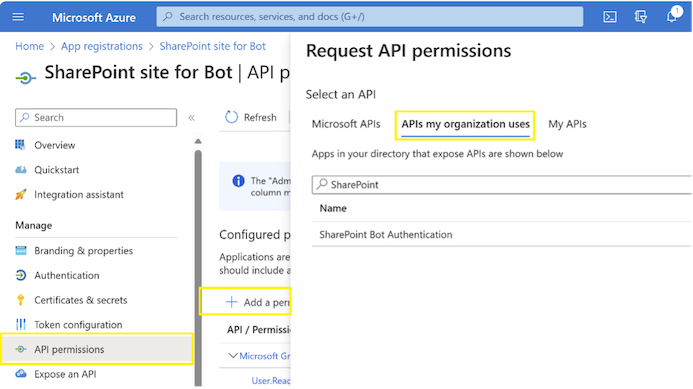

# Deploy a Microsoft Copilot Studio copilot as a SharePoint component with single sign-on (SSO) enabled

To follow through the end-to-end setup process, you would need to:

1. Configure Microsoft Entra ID authentication for your copilot.
2. Register your SharePoint site as a canvas app – an application that will host your copilot and handle the single sign-on flow.
3. Build the SharePoint component and configure its properties based on values from step (2).
4. Upload the component to SharePoint and add the component to your site.

## Step 1 - Configure Microsoft Entra ID authentication for your copilot

This step can be completed mostly by following the instructions here: [Configure user authentication with Microsoft Entra ID](https://learn.microsoft.com/en-us/power-virtual-agents/configuration-authentication-azure-ad), with some added configuration which is specified below.

1. **Optional – add scopes for SharePoint and OneDrive**. For your copilot to use the Generative Answers capability over a SharePoint or OneDrive data source, you would need to configure additional scopes for the API permissions assigned to your app. Please refer to [Generative answers with Search and summarize: Authentication](https://learn.microsoft.com/en-us/power-virtual-agents/nlu-boost-node#authentication).

  
   
  <em>API Permissions of the copilot app registration</em>

2. **Mandatory – populate the token exchange URL in the copilot’s authentication settings.** Your copilot will send this URL to any custom application hosting it, instructing the custom application it should sign users in by acquiring a token matching this custom scope. The value for “token exchange URL” is the full URI for the custom scope you have added when configuring a custom API.

  
   
  <em>The custom scope for the copilot app registration</em>

 

  
   
  <em>Authentication configuration of the copilot, including token exchange URL</em>

Once all the steps under [Configure user authentication with Microsoft Entra ID](https://learn.microsoft.com/en-us/power-virtual-agents/configuration-authentication-azure-ad) have been completed and the optional additional scopes have been specified, you should be able to use Generative Answers over a SharePoint or OneDrive data source from the Microsoft Copilot Studio authoring experience. Please refer to [Use content on SharePoint or OneDrive for Business for generative answers](https://learn.microsoft.com/en-us/power-virtual-agents/nlu-generative-answers-sharepoint-onedrive) for instructions on add a SharePoint or OneDrive data source for your Copilot Generative Answers node.

Before moving to Step 2, make sure the Copilot Studio authoring canvas can successfully sign you in. If "Require users to sign in" is selected in the authentication settings, the canvas will try to sign in you in as soon as the conversation starts. Otherwise, the-sign in topic will have to be triggered by a specific event in the conversation. In case Generative Answers is configured over SharePoint or OneDrive, please make sure your copilot responds to questions as expected.

**Important:** For now, the copilot canvas will use a validation code to sign you in, but once the setup is complete, users will be signed-in seamlessly.

## Step 2 - Register your SharePoint site as a custom canvas

A custom canvas is a custom application that hosts your copilot. In our case, it is also the application that will be responsible for a seamless sign-in experience.

In order to configure your SharePoint site as a canvas application with single sign-on enabled, follow the steps specified in [Configure single sign-on with Microsoft Entra ID](https://learn.microsoft.com/en-us/power-virtual-agents/configure-sso?tabs=webApp#create-app-registrations-for-your-custom-website).

When configuring the canvas app registration, pay attention to the following details:

1. When adding a platform to the canvas app registration, select “Single-page application” and not “Web”. Web redirect URIs only support the implicit grant flow for authentication, which is considered less secure and cannot be used with MSAL.js 2.x, which is the authentication library included in the code sample provided here. For a discussion about the differences between Web and SPA redirects, please refer to: [https://github.com/MicrosoftDocs/azure-docs/issues/70484#issuecomment-791077654](https://github.com/MicrosoftDocs/azure-docs/issues/70484#issuecomment-791077654)

2. The redirect URI should be the same as the URL for your SharePoint site that will host the copilot. For example, if you plan to deploy the copilot on <https://mytenant.sharepoint.com/sites/MySite>, set this as your redirect URI.

   **Important:** Users can reach your SharePoint site via addresses that include trailing slashes. Since redirect URIs are sensitive to this variation, consider creating two redirect URIs representing the same site, with and without a trailing slash (for example: <https://mytenant.sharepoint.com/sites/MySite> and <https://mytenant.sharepoint.com/sites/MySite/>)

3. The canvas app registration will need permissions for the custom API that was configured in *Step 1*. To add this permission, select an API from “APIs my organization uses” and search for the name you have given your copilot app registration in *Step 1*. For example, if your copilot app registration is called “SharePoint Bot Authentication” search for that name in the list of APIs, and select your custom scope (a name for your custom scope has been selected while configuring a custom API for your copilot app registration)

  
   
  <em>The API can be found under “APIs my organization uses”</em>

 

  
   
  <em>Selecting the scope for the API</em>

4. After registering your canvas app, you will not have to use the code sample the page refers to. The code sample provided is a standalone web page implementing SSO for Microsoft Copilot Studio which can be used for testing purposes, but it is not a SharePoint component.

   However, you will need to document the Application (client) ID for the SharePoint component configuration in the next step.

  
   
  <em>The Application (client) ID</em>

## Step 3 - Download and configure the SharePoint SPFx web part

Make sure your development environment includes the following tools and libraries:

   1. VS Code (or a similar code editor)
   2. A version of Node.JS which is [supported by the SPFx framework](https://learn.microsoft.com/en-us/sharepoint/dev/spfx/compatibility#spfx-development-environment-compatibility) (for this sample, use v18)
   3. A [Git](https://git-scm.com/downloads)  client for your OS
   4. Clone this repo
   5. Run the following commands to package the solution
      1. `npm install`
      2. `gulp bundle --shp`
      3. `gulp package-solution --ship`

### Webpart properties

This webpart reads the configuration from a configuration list as CopilotAgentConfig.
- Create the "CopilotAgentConfig" list with below columns

|Property Name|Column type|Explanation|Mandatory?|
| :- | :- | :- | :- |
|BotName|Single line of text|Name of the Bot|No|
|BotURL|Single line of text|The token endpoint for MCS. This can be found in the CoPilot studio, under Settings -> Channels -> Mobile App (Screenshot below)|Yes|
|BotAvatarImage|Single line of text|Direct link for the avatar image|No|
|BotAvatarInitials|Single line of text|bot initials used when no image present|No|
|Greet|Yes/No|Should the copilot greet users at the beginning of the conversation|No|
|CustomScope|Single line of text|
The scope defined for the custom API in the copilot app registration (Step 1). For example:

api://35337616-eee1-4049-9d37-a78b24c3bef2/SPO.Read
|Yes|
|ClientID|Single line of text|The Application ID from the Canvas app registration configured in step 2|Yes|
|Authority|Single line of text|
The login URL for your tenant. For example: https://login.microsoftonline.com/mytenant.onmicrosoft.com|Yes|
|ErrorRetryAttempts|Single line of text|Number of retry attempts made to get the properties from the List|Yes|No|

After adding the web part on the page and configure with required properties, you will see the chat canvas for your copilot. Based on the logic of your copilot, users will be signed in automatically at the beginning of the conversation, or when a specific event occurs.

