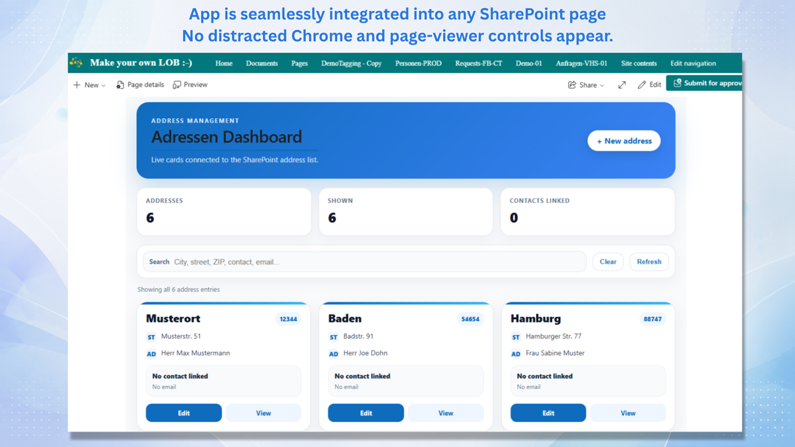
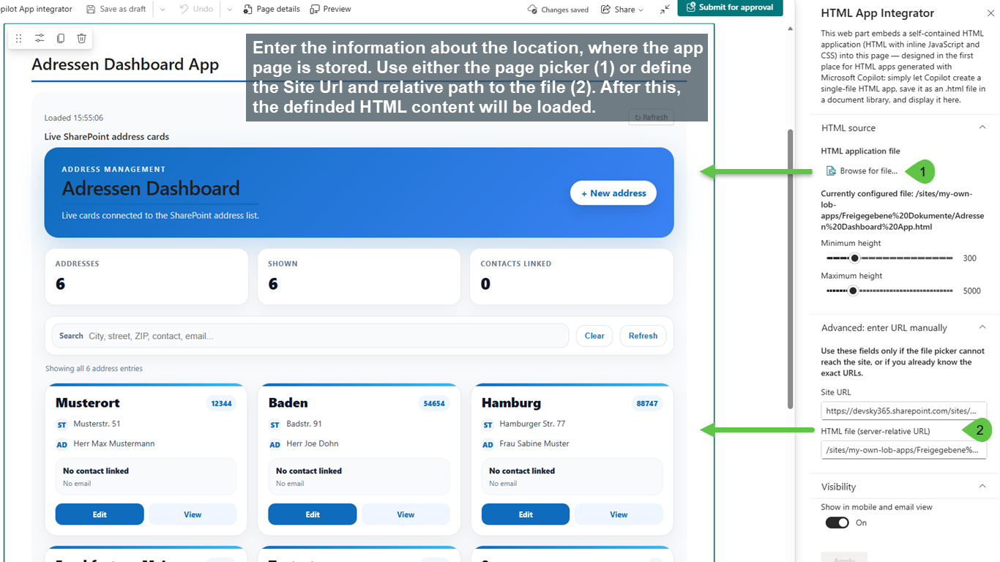
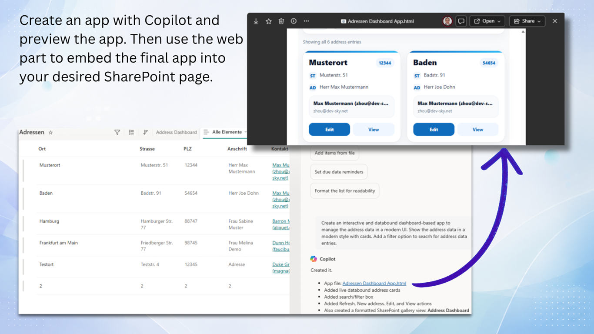
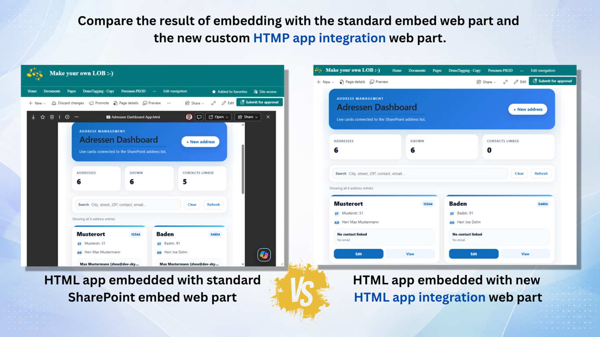

# Integrate (Copilot) HTML apps seamlessly in SharePoint (WebPart)

## Summary

An SPFx web part that embeds small, self-contained HTML applications (HTML + inline JavaScript + CSS, stored in a SharePoint document library) into SharePoint pages **without** the SharePoint file-preview chrome (toolbar, download button).

How it works:

1. The web part loads the selected HTML file as **text** through the SharePoint REST API (`GetFileByServerRelativePath(...)/$value`) — the file is never opened through its SharePoint URL, so no preview toolbar appears.
2. If the file declares data sources in an embedded manifest (`<script type="application/json" class="ka-livedata-manifest">`), the web part resolves them in the page context with `SPHttpClient`: SharePoint **lists** (paged, flattened to `{headers, rows}` JSON) and **text files**.
3. It rewrites inline event handlers (`onclick="…"`) and `javascript:` URLs into `addEventListener` registrations — see *CSP compatibility* below.
4. It injects a bootstrap layer into the document: the resolved data as `window.__LD_RESULTS__` (keyed by each source's `spItemUrl`), an instance ID, automatic height reporting (`ResizeObserver` → `postMessage`), the handler bindings, and an error/warning relay.
5. The transformed document is rendered through a **sandboxed `iframe.srcdoc`**.

The app inside the iframe can request a full reload (HTML + data) by sending `postMessage({ type: 'ka-html-viewer-refresh' }, '*')` — see `documents/Demo01.html` for a working example app (live contact directory bound to a SharePoint list).

*Full page integrated Copilot app*

*Configuration of the web part*

*Create a databound HTML dashboard app with Copilot*

*HTML embedded via SharePoint approach vs. using the web part*

## Video

## Compatibility

| :warning: Important          |
|:---------------------------|
| Every SPFx version is only compatible with specific version(s) of Node.js. In order to be able to build this sample, please ensure that the version of Node on your workstation matches one of the versions listed in this section. This sample will not work on a different version of Node.|
|Refer to <https://aka.ms/spfx-matrix> for more information on SPFx compatibility.   |

-Incompatible-red.svg "SharePoint Server 2016 Feature Pack 2 requires SPFx 1.1")

## Used SharePoint Framework Version

## Applies to

- [SharePoint Framework](https://aka.ms/spfx)
- [Microsoft 365 tenant](https://docs.microsoft.comsharepoint/dev/spfx/set-up-your-developer-tenant)

> Get your own free development tenant by subscribing to [Microsoft 365 developer program](http://aka.ms/o365devprogram)

## Prerequisites

> An HTML app generated by Copilot to embed this in a SharePoint page and a valid Copilot license to use Copilot in SharePoint.

## Contributors

- [Marc André Schröder-Zhou](https://github.com/maschroeder-z)

## Version history

| Version | Date             | Comments                        |
| ------- | ---------------- | ------------------------------- |
| 1.0     | 10.08.2026       | Initial Release                 |
| 1.0.1   | 04.09.2026       | Optimized inline handler        |

## Web part properties

| Property | Description |
| --- | --- |
| Site URL | Absolute URL of the site hosting the HTML file (must be in the current tenant) |
| HTML file | Server-relative URL of the `.html` file |
| Minimum height | Initial/minimum iframe height in px (100–1000) |
| Maximum height | Upper clamp for automatic height in px (1000–20000) |
| Compatibility warnings | Whether the warning banner above the app is shown or hidden (console output is unaffected) |

## Security model

- The iframe sandbox is `allow-scripts allow-forms allow-popups allow-popups-to-escape-sandbox` — deliberately **without** `allow-same-origin`. The embedded document runs in an opaque origin: no cookies, no direct SharePoint REST access, no parent-DOM access; `postMessage` is the only channel.
- A `<meta>` Content-Security-Policy is injected: `default-src 'none'`, nonce-based `script-src`/`style-src`, `style-src-attr 'unsafe-inline'` (embedded apps use inline `style=""` attributes), images/fonts only from the tenant origin (+ `data:`/`blob:`), `connect-src` limited to the tenant origin. `script-src` also carries `'unsafe-eval'` — required by the handler rewrite below and by the eval-based template/chart libraries these apps bundle; SharePoint's own inherited policy grants it in any case. Because the sandbox has no `allow-same-origin`, `fetch`/XHR from the app go out **without credentials**, so SharePoint REST calls still fail with 401 — the manifest data sources remain the supported way to read list data.
- Manifest validation: max 10 data sources, `https` + current-tenant origin only, GUID list IDs. The HTML file itself must live in the current tenant and end in `.html`.
- **Page-CSP inheritance:** `srcdoc` documents inherit the SharePoint page's own Content-Security-Policy, whose `script-src` allows inline scripts only via SharePoint's per-load nonce. The web part therefore reads the page's CSP nonce (from the page's script elements) and stamps the embedded document's scripts with it; on hosts without a page CSP it falls back to a self-generated nonce. Without this, the inherited policy blocks every inline script in the iframe.
- **CSP compatibility (inline event handlers):** a nonce can be stamped onto a `<script>` element, but never onto an `onclick=""` attribute — and CSP hashes do not cover event handlers without `'unsafe-hashes'`. Under the inherited SharePoint policy every inline handler in an embedded app would therefore be blocked (`Executing inline event handler violates the following Content Security Policy directive 'script-src …'`), leaving the app rendered but unresponsive. `InlineHandlerRewriter` strips `on*` attributes and `javascript:` URLs from the document and passes their bodies to the bootstrap as escaped JSON, which re-binds them with `addEventListener` from nonce-approved script. A `MutationObserver` applies the same conversion to markup the app injects at runtime (`innerHTML` containing `onclick=`). `this`, `event` and `return false` behave as they do in a real inline handler.

  Not reproduced: the implicit `with(this)` / `with(document)` scope of inline handlers. `onclick="form.reset()"` or `onclick="submit()"` will throw; use `document.getElementById('…')` instead. Such failures are reported once each to the browser console and to the warning banner above the app (which page authors can hide in the web part settings).

- `requiresCustomScript` remains `false` in the manifest: author-supplied script executes only inside the no-same-origin sandbox with the CSP above, not in the page's origin.

## HTML application contract

An HTML file works in this web part if it:

- is a valid, self-contained HTML document (inline scripts and styles),
- optionally declares data sources via the `ka-livedata-manifest` JSON block (plain array or `{schemaVersion, items}` object),
- reads its data from `window.__LD_RESULTS__[spItemUrl]` instead of calling SharePoint directly,
- communicates with the host only via `postMessage` (e.g. the refresh message above).

Static HTML files without a manifest also work — the web part just injects the host bridge and renders the document.

## Minimal Path to Awesome

- Clone this repository
- Ensure that you are at the solution folder
- in the command-line run:
  - `npm install`
  - `gulp serve`

> Check your current Node version and installed SPFx-Framework version.

## Features

- Embed Copilot generated HTML apps in SharePoint pages
- Supports inline page integration
- Support full page mode
- No additional chrome and page-viewer controls

## Help

Please contact me for further help or information about the sample.

## References

- [Getting started with SharePoint Framework](https://docs.microsoft.com/en-us/sharepoint/dev/spfx/set-up-your-developer-tenant)
- [Building for Microsoft teams](https://docs.microsoft.com/en-us/sharepoint/dev/spfx/build-for-teams-overview)
- [Use Microsoft Graph in your solution](https://docs.microsoft.com/en-us/sharepoint/dev/spfx/web-parts/get-started/using-microsoft-graph-apis)
- [Publish SharePoint Framework applications to the Marketplace](https://docs.microsoft.com/en-us/sharepoint/dev/spfx/publish-to-marketplace-overview)
- [Microsoft 365 Patterns and Practices](https://aka.ms/m365pnp) - Guidance, tooling, samples and open-source controls for your Microsoft 365 development

## Disclaimer

**THIS CODE IS PROVIDED *AS IS* WITHOUT WARRANTY OF ANY KIND, EITHER EXPRESS OR IMPLIED, INCLUDING ANY IMPLIED WARRANTIES OF FITNESS FOR A PARTICULAR PURPOSE, MERCHANTABILITY, OR NON-INFRINGEMENT.**

