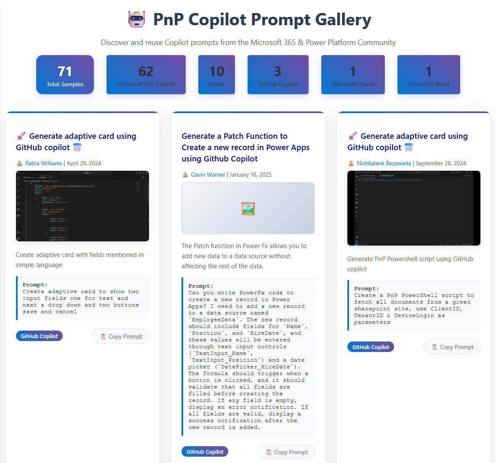

# PnP Copilot Prompt Gallery

## Summary

This solution displays a gallery of Copilot prompts from the PnP copilot-prompts repository and allows users to easily copy prompts for reuse.

## Compatibility

| :warning: Important          |
|:---------------------------|
| Every SPFx version is optimally compatible with specific versions of Node.js. In order to be able to build this sample, you need to ensure that the version of Node on your workstation matches one of the versions listed in this section. This sample will not work on a different version of Node.|
|Refer to <https://aka.ms/spfx-matrix> for more information on SPFx compatibility.   |

This sample is optimally compatible with the following environment configuration:

-Incompatible-red.svg "SharePoint Server 2016 Feature Pack 2 requires SPFx 1.1")

## Applies to

* [SharePoint Framework](https://learn.microsoft.com/sharepoint/dev/spfx/sharepoint-framework-overview)
* [Microsoft 365 tenant](https://learn.microsoft.com/sharepoint/dev/spfx/set-up-your-development-environment)

> Get your own free development tenant by subscribing to [Microsoft 365 developer program](https://aka.ms/m365/devprogram)

## Contributors

* [Saurabh Tripathi](https://github.com/saurabh7019)

## Version history

|Version|Date|Comments|
|-------|----|--------|
|1.0|August 21, 2025|Initial release|

## Prerequisites

- Clone the Copilot samples repository first: `git clone https://github.com/pnp/copilot-prompts.git`
- Generate sample data by running the `prepare-sample-data.ps1` script located in the `scripts` folder. Provide the path to the copilot-prompts repository and specify an output path for the JSON file:
  `.\prepare-sample-data.ps1 -RepoPath "C:\temp\copilot-prompts" -OutputPath "C:\temp\reports\copilot-prompts-samples.json"`
- If no custom sample data file is provided, the solution will use the default sample data included in the project.

## Minimal path to awesome

* Clone this repository (or [download this solution as a .ZIP file](https://pnp.github.io/download-partial/?url=https://github.com/pnp/sp-dev-fx-webparts/tree/main/samples/react-copilot-prompt-gallery) then unzip it)
* From your command line, change your current directory to the directory containing this sample (`react-copilot-prompt-gallery`, located under `samples`)
* in the command line run:
  * `npm install`
  * `gulp serve`

> This sample can also be opened with [VS Code Remote Development](https://code.visualstudio.com/docs/remote/remote-overview). Visit <https://aka.ms/spfx-devcontainer> for further instructions.

## Features

Key features of this web part:

- Displays a gallery of Copilot prompt samples from the PnP copilot-prompts repository.
- Allows users to filter samples by prerequisite category (e.g., Microsoft 365 Copilot, Github Copilot, etc.).
- Shows contributor information, published date, preview, and prompt details for each sample.
- Provides a one-click copy button for each prompt to easily reuse in your own solutions.

## Help

We do not support samples, but this community is always willing to help, and we want to improve these samples. We use GitHub to track issues, which makes it easy for  community members to volunteer their time and help resolve issues.

If you're having issues building the solution, please run [spfx doctor](https://pnp.github.io/cli-microsoft365/cmd/spfx/spfx-doctor/) from within the solution folder to diagnose incompatibility issues with your environment.

You can try looking at [issues related to this sample](https://github.com/pnp/sp-dev-fx-webparts/issues?q=label%3A%22sample%3A%20react-copilot-prompt-gallery%22) to see if anybody else is having the same issues.

You can also try looking at [discussions related to this sample](https://github.com/pnp/sp-dev-fx-webparts/discussions?discussions_q=react-copilot-prompt-gallery) and see what the community is saying.

If you encounter any issues using this sample, [create a new issue](https://github.com/pnp/sp-dev-fx-webparts/issues/new?assignees=&labels=Needs%3A+Triage+%3Amag%3A%2Ctype%3Abug-suspected%2Csample%3A%20react-copilot-prompt-gallery&template=bug-report.yml&sample=react-copilot-prompt-gallery&authors=@saurabh7019&title=react-copilot-prompt-gallery%20-%20).

For questions regarding this sample, [create a new question](https://github.com/pnp/sp-dev-fx-webparts/issues/new?assignees=&labels=Needs%3A+Triage+%3Amag%3A%2Ctype%3Aquestion%2Csample%3A%20react-copilot-prompt-gallery&template=question.yml&sample=react-copilot-prompt-gallery&authors=@saurabh7019&title=react-copilot-prompt-gallery%20-%20).

Finally, if you have an idea for improvement, [make a suggestion](https://github.com/pnp/sp-dev-fx-webparts/issues/new?assignees=&labels=Needs%3A+Triage+%3Amag%3A%2Ctype%3Aenhancement%2Csample%3A%20react-copilot-prompt-gallery&template=suggestion.yml&sample=react-copilot-prompt-gallery&authors=@saurabh7019&title=react-copilot-prompt-gallery%20-%20).

## Disclaimer

**THIS CODE IS PROVIDED *AS IS* WITHOUT WARRANTY OF ANY KIND, EITHER EXPRESS OR IMPLIED, INCLUDING ANY IMPLIED WARRANTIES OF FITNESS FOR A PARTICULAR PURPOSE, MERCHANTABILITY, OR NON-INFRINGEMENT.**

