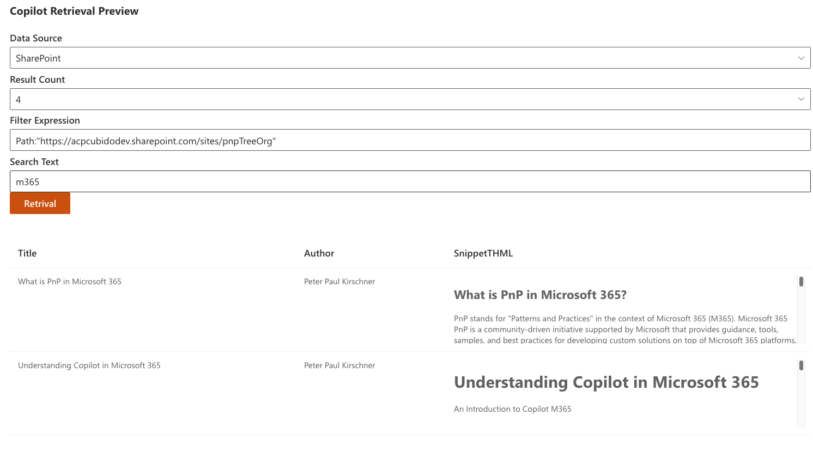

# Copilot Retrieval API Playground

## Summary

This SPFx sample shows how to integrate a Copilot retrieval API into an SPFx web part and provides a hands‑on workflow to evaluate and tune search relevance.

Recommended steps:

1. Change the filterExpression to broaden or narrow the set of returned documents and observe how results change.
2. Try different queryText inputs — short phrases, long sentences, synonyms, paraphrases, and common misspellings — to test the semantic index and matching behavior.
3. Compare outcomes by relevance, ranking, and the metadata returned for each hit.
4. Inspect the request and response JSON to review similarity scores, matched fields, and any debug fields returned by the retrieval service.

Use this process to systematically evaluate and optimize your retrieval experience.



## Compatibility

| :warning: Important          |
|:---------------------------|
| Every SPFx version is optimally compatible with specific versions of Node.js. In order to be able to build this sample, you need to ensure that the version of Node on your workstation matches one of the versions listed in this section. This sample will not work on a different version of Node.|
|Refer to <https://aka.ms/spfx-matrix> for more information on SPFx compatibility.   |

This sample is optimally compatible with the following environment configuration:


-Incompatible-red.svg "SharePoint Server 2016 Feature Pack 2 requires SPFx 1.1")


## Applies to

- [SharePoint Framework](https://aka.ms/spfx)

## Contributors

- [Peter Paul Kirschner](https://github.com/petkir)

## Version history

|Version|Date|Comments|
|-------|----|--------|
|1.0|Okt, 2025|Initial release|

## Minimal Path to Awesome

- Clone this repository
- Ensure that you are at the solution folder
- in the command-line run:
  - `npm install`
  - `gulp serve`

> This sample can also be opened with [VS Code Remote Development](https://code.visualstudio.com/docs/remote/remote-overview). Visit https://aka.ms/spfx-devcontainer for further instructions.

## Features

This sample demonstrates how to wire a retrieval/search API into an SPFx React.
This sample demonstrates how to integrate a retrieval/search API (Copilot Retrieval) into an SPFx React web part.

If you want to test External Items from Microsoft Graph, add the following API permission request to `config/package-solution.json` under the `webApiPermissionRequests` section:

```json
{
  "resource": "Microsoft Graph",
  "scope": "ExternalItem.Read.All"
}
```

After granting that permission, set the data source to ExternalItem in your component (for example, in `CopilotRetrivalPreview.tsx` or the component props):

```json
"dataSource": "externalItem"
```

You should also update the Data Source dropdown to include the ExternalItem option. Example TSX:

```tsx
<Dropdown
  placeholder="Select a data source"
  label="Data Source"
  options={[
    { key: 'sharePoint', text: 'SharePoint' },
    { key: 'oneDriveBusiness', text: 'OneDrive' },
    { key: 'externalItem', text: 'ExternalItem' }
  ]}
  selectedKey={this.state.dataSource || 'sharePoint'}
  onChange={(e, option) => this.setState({ dataSource: String(option?.key) })}
/>
```

Read more
[Overview of the Microsoft 365 Copilot Retrieval API](https://learn.microsoft.com/microsoft-365-copilot/extensibility/api/ai-services/retrieval/overview)
[Retrieve grounding data](https://learn.microsoft.com/microsoft-365-copilot/extensibility/api/ai-services/retrieval/copilotroot-retrieval)

Notes:

- Make sure to update the permission in the correct file: `config/package-solution.json` (the sample previously had a misspelled filename).
- After updating `package-solution.json`, package and deploy the solution and grant the permission in the tenant admin consent page if required.

## Help

We do not support samples directly, but we use GitHub to track issues and want to continuously improve these samples.

If you encounter any issues while using this sample, [create a new issue](https://github.com/pnp/sp-dev-fx-webparts/issues/new?assignees=&labels=Needs%3A+Triage+%3Amag%3A%2Ctype%3Abug-suspected%2Csample%3A%20react-copilot-retrieval-api&template=bug-report.yml&sample=react-copilot-retrieval-api&authors=@petkir&title=react-copilot-retrieval-api%20-%20).

For questions regarding this sample, [create a new question](https://github.com/pnp/sp-dev-fx-webparts/issues/new?assignees=&labels=Needs%3A+Triage+%3Amag%3A%2Ctype%3Aquestion%2Csample%3A%20react-copilot-retrieval-api&template=question.yml&sample=react-copilot-retrieval-api&authors=@petkir&title=react-copilot-retrieval-api%20-%20).

Finally, if you have an idea for improvement, [make a suggestion](https://github.com/pnp/sp-dev-fx-webparts/issues/new?assignees=&labels=Needs%3A+Triage+%3Amag%3A%2Ctype%3Aenhancement%2Csample%3A%20react-copilot-retrieval-api&template=question.yml&sample=react-copilot-retrieval-api&authors=@petkir&title=react-copilot-retrieval-api%20-%20).

## Disclaimer

**THIS CODE IS PROVIDED *AS IS* WITHOUT WARRANTY OF ANY KIND, EITHER EXPRESS OR IMPLIED, INCLUDING ANY IMPLIED WARRANTIES OF FITNESS FOR A PARTICULAR PURPOSE, MERCHANTABILITY, OR NON-INFRINGEMENT.**

