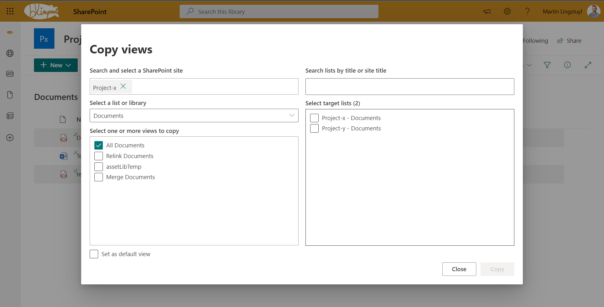

# Copy Views

## Summary

This solution enables a user to copy views from one list/library to another across site collections. It can be used as a webpart on a page, or as a ListView Command Set extension. The user can select multiple views to copy to multiple target lists.

## Used Versions

-Unknown-red.svg "SharePoint Server 2016 Feature Pack 2 requires SPFx 1.1")

## Applies to

- [SharePoint Framework](https://aka.ms/spfx)
- [Microsoft 365 tenant](https://docs.microsoft.com/en-us/sharepoint/dev/spfx/set-up-your-developer-tenant)

> Get your own free development tenant by subscribing to [Microsoft 365 developer program](http://aka.ms/o365devprogram)

## Solution

| Solution    | Author(s)                                               |
| ----------- | ------------------------------------------------------- |
| Copy Views | [Martin Lingstuyl](https://github.com/martinlingstuyl) ([@martinlingstuyl](https://twitter.com/martinlingstuyl)), I4-YOU Business Solutions b.v. |

## Version history

| Version | Date             | Comments        |
| ------- | ---------------- | --------------- |
| 1.0     | August 29, 2022 | Initial release |

## Minimal Path to Awesome

- Clone this repository
- Ensure that you are at the solution folder
- in the command-line run:
  - **npm install**
  - **gulp serve**
- To package and deploy:
  - Use `gulp bundle --ship` & `gulp package-solution --ship`
  - Add the `.sppkg` to your SharePoint App Catalog

>  This sample can also be opened with [VS Code Remote Development](https://code.visualstudio.com/docs/remote/remote-overview). Visit https://aka.ms/spfx-devcontainer for further instructions.

## Features

- Views can be copied from one list or library to other lists or libraries across site collections.
- List views can only be copied to other *lists* and library views can only be copied to other *libraries*.
- When opening the component using the List view Command Set extension, the current site, list and view will be preselected. When opening the component from a webpart, the current site will be preselected. 
- When copying views, the following things will be included:
  - Field references. 
  - Sort and filter settings. 
  - Column formatting and view formatting.
- Fields that are not available on the target list are excluded from the copied view. The view query is cleaned of these fields so as not to break the view when columns are used to filter on. *
- Views of type 'Kanban board' and 'modern calendar' are currently **not** supported.
- Views that are set to default on the source list will not automatically be set to default on the target list. The checkbox 'Set as default' will need to be used. 

> *The component uses the DOM parser to parse the ViewQuery XML, and removes any filter conditions that reference fields that are not available on the target list. The component can even clean filter queries with multiple And/Or CAML-conditions.

## Disclaimer

**THIS CODE IS PROVIDED _AS IS_ WITHOUT WARRANTY OF ANY KIND, EITHER EXPRESS OR IMPLIED, INCLUDING ANY IMPLIED WARRANTIES OF FITNESS FOR A PARTICULAR PURPOSE, MERCHANTABILITY, OR NON-INFRINGEMENT.**

---

