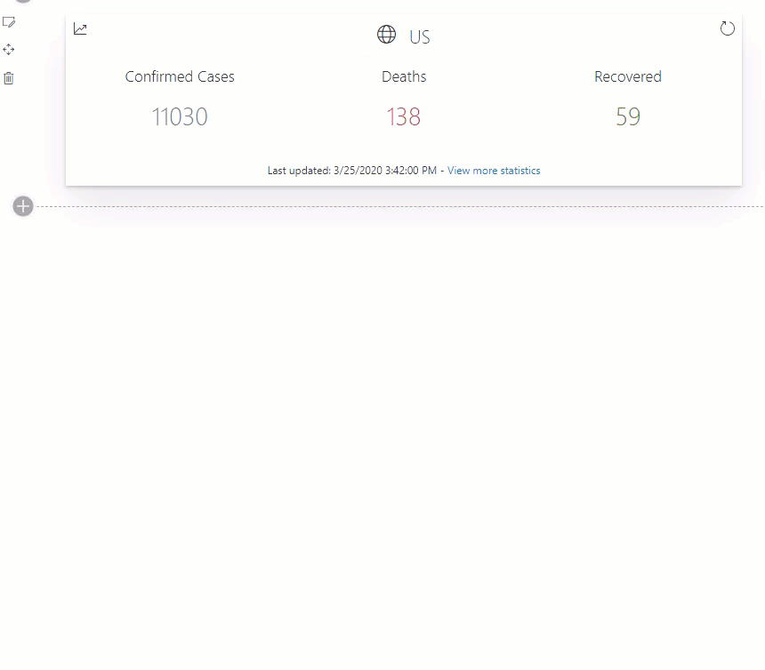

# COVID 19 Information

## Summary

This web part displays info about the COVID-19 virus for a given country.
The following info is displayed:
 - Confirmed cases
 - Deaths
 - Recovered

## Compatibility

 
 

-Incompatible-red.svg "SharePoint Server 2016 Feature Pack 2 requires SPFx 1.1")

## Applies to

* [SharePoint Framework](https://docs.microsoft.com/sharepoint/dev/spfx/sharepoint-framework-overview)
* [Office 365 tenant](https://docs.microsoft.com/sharepoint/dev/spfx/set-up-your-development-environment)

## Solution

Solution|Author(s)
--------|---------
react-covid19-info | [Robin Agten](https://twitter.com/AgtenRobin)

## Web part properties

| Property                             	| Group                  	| Description                                                                                               	| Default 	|
|--------------------------------------	|------------------------	|-----------------------------------------------------------------------------------------------------------	|---------	|
| iso2 Country Code                    	| Country Settings       	| Defines the country for which the COVID-19 info should be displayed example: BE for Belgium               	| None    	|
| Show history button                  	| Web part configuration 	| Determines whether or not the history icon is shown. This can be used to show an graph of historical data 	| False   	|
| View more statistics                 	| Web part configuration 	| Provide an optional external link to more details statistics                                              	| None    	|
| Up count duration                    	| Web part configuration 	| Number of seconds for the counters to count up                                                            	| 2       	|
| Color for the Confirmed Cases number 	| Web part configuration 	| Defines the color of the Confirmed cases number                                                           	| #69797e 	|
| Color for the Deaths number          	| Web part configuration 	| Defines the color of the Deaths number                                                                    	| #d13438 	|
| Color for the Recovered number       	| Web part configuration 	| Defines the color of the Recovered number                                                                 	| #498205 	|

## Version history

Version|Date|Comments
-------|----|--------
1.0|March 25, 2020|Initial Release

## Minimal Path to Awesome

* Clone this repository
* From your command line, change your current directory to the directory containing this sample (`react-covid19-info`, located under `samples`)
* in the command line run:
  * `npm install`
  * `gulp serve`

>  This sample can also be opened with [VS Code Remote Development](https://code.visualstudio.com/docs/remote/remote-overview). Visit https://aka.ms/spfx-devcontainer for further instructions.

## Features

 * Configurable Country
 * Configurable Colors
 * Optional historical graph
 * Optional 'view more statistics' link

This Web Part illustrates the following concepts on top of the SharePoint Framework:

* Using external APIs using httpClient
* [Office Fabric UI React](https://developer.microsoft.com/en-us/fabric#/)
* [SPFx Controls React](https://sharepoint.github.io/sp-dev-fx-controls-react/)
* [SPFx Property Controls](https://sharepoint.github.io/sp-dev-fx-property-controls/)
* [Recharts](http://recharts.org/en-US/)

## Video

## Help

We do not support samples, but we this community is always willing to help, and we want to improve these samples. We use GitHub to track issues, which makes it easy for  community members to volunteer their time and help resolve issues.

If you're having issues building the solution, please run [spfx doctor](https://pnp.github.io/cli-microsoft365/cmd/spfx/spfx-doctor/) from within the solution folder to diagnose incompatibility issues with your environment.

You can try looking at [issues related to this sample](https://github.com/pnp/sp-dev-fx-webparts/issues?q=label%3A%22sample%3A%20react-covid19-info") to see if anybody else is having the same issues.

You can also try looking at [discussions related to this sample](https://github.com/pnp/sp-dev-fx-webparts/discussions?discussions_q=react-covid19-info) and see what the community is saying.

If you encounter any issues while using this sample, [create a new issue](https://github.com/pnp/sp-dev-fx-webparts/issues/new?assignees=&labels=Needs%3A+Triage+%3Amag%3A%2Ctype%3Abug-suspected%2Csample%3A%20react-covid19-info&template=bug-report.yml&sample=react-covid19-info&authors=@agtenr&title=react-covid19-info%20-%20).

For questions regarding this sample, [create a new question](https://github.com/pnp/sp-dev-fx-webparts/issues/new?assignees=&labels=Needs%3A+Triage+%3Amag%3A%2Ctype%3Aquestion%2Csample%3A%20react-covid19-info&template=question.yml&sample=react-covid19-info&authors=@agtenr&title=react-covid19-info%20-%20).

Finally, if you have an idea for improvement, [make a suggestion](https://github.com/pnp/sp-dev-fx-webparts/issues/new?assignees=&labels=Needs%3A+Triage+%3Amag%3A%2Ctype%3Aenhancement%2Csample%3A%20react-covid19-info&template=question.yml&sample=react-covid19-info&authors=@agtenr&title=react-covid19-info%20-%20).

## Disclaimer

**THIS CODE IS PROVIDED *AS IS* WITHOUT WARRANTY OF ANY KIND, EITHER EXPRESS OR IMPLIED, INCLUDING ANY IMPLIED WARRANTIES OF FITNESS FOR A PARTICULAR PURPOSE, MERCHANTABILITY, OR NON-INFRINGEMENT.**

