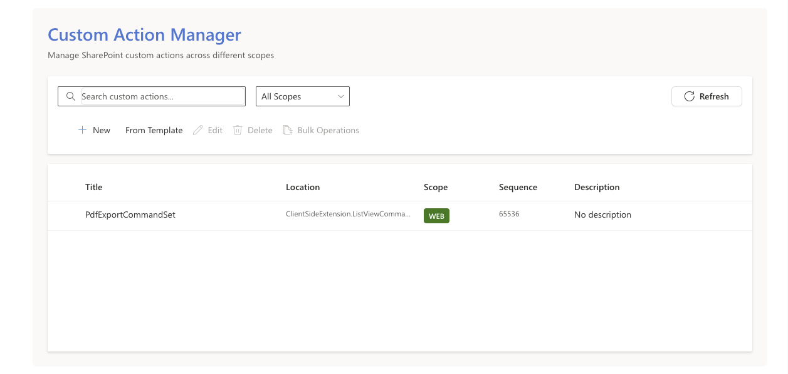
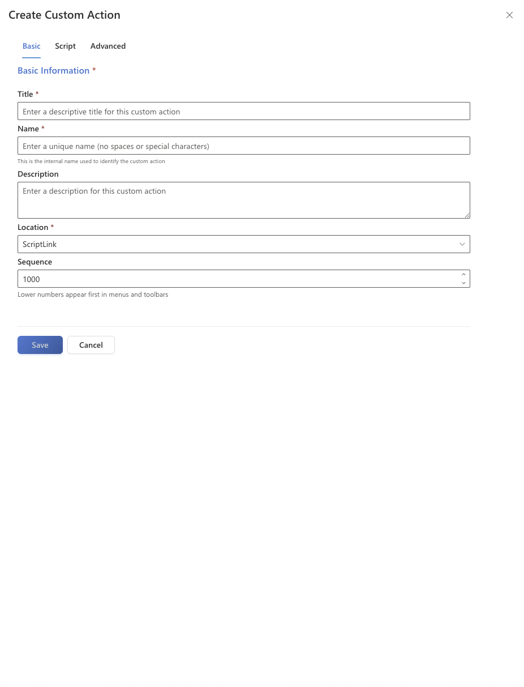

# SharePoint Custom Action Manager

## Summary
The SharePoint Custom Action Manager is a comprehensive, enterprise-grade SharePoint Framework (SPFx) web part for managing SharePoint custom actions with advanced features including bulk operations, role-based access control, template gallery, and advanced search capabilities.

Long story short, this solution provides everything you need for professional custom action management in SharePoint.




## Compatibility

| :warning: Important                                                                                                                                                                                                                                                                           |
| :-------------------------------------------------------------------------------------------------------------------------------------------------------------------------------------------------------------------------------------------------------------------------------------------- |
| Every SPFx version is only compatible with specific version(s) of Node.js. In order to be able to build this sample, please ensure that the version of Node on your workstation matches one of the versions listed in this section. This sample will not work on a different version of Node. |
| Refer to <https://aka.ms/spfx-matrix> for more information on SPFx compatibility.                                                                                                                                                                                                              |

This sample is optimally compatible with the following environment configuration:


For more information about SPFx compatibility, please refer to <https://aka.ms/spfx-matrix>

## Applies to

- [SharePoint Framework](https://learn.microsoft.com/sharepoint/dev/spfx/sharepoint-framework-overview)
- [Microsoft 365 tenant](https://learn.microsoft.com/sharepoint/dev/spfx/set-up-your-development-environment)

> Get your own free development tenant by subscribing to [Microsoft 365 developer program](http://aka.ms/m365devprogram)

# Features

The Custom Action Manager provides a comprehensive set of features organized into several key areas:

# Custom Action Manager Features

**Role-Based Access Control (RBAC)**  
- Site-level permissions integration with SharePoint groups  
- Granular permission system with four user roles: Administrator, Designer, Contributor, and Viewer  
- Dynamic permission checking based on SharePoint user groups with real-time evaluation  

**Advanced Bulk Operations**  
- Multi-select support with batch processing capabilities for enable/disable operations  
- Mass delete with comprehensive confirmation and rollback mechanisms  
- Import/Export functionality supporting JSON and CSV formats with configurable field selection  
- Cross-site deployment with enhanced service creation, proper logging, and progress tracking  

**Template Gallery System**  
- Built-in template library with 5 templates including navigation, notifications, analytics, security, and optimization  
- SharePoint List Integration for user-created templates with automatic provisioning  
- Parameter-driven creation with comprehensive validation, form generation, and real-time usage tracking  

**Advanced Search & Filtering**  
- Multi-criteria search across all custom action properties with tag-based filtering  
- Date range filters, status tracking, and author/category filtering with faceted search  
- Advanced query builder with AND/OR logic, search suggestions, and saved search queries  

**Professional User Experience**  
- Microsoft Fluent UI 8.x throughout with responsive design optimized for all devices  
- Dark/light theme support, keyboard navigation, and WCAG 2.1 AA accessibility compliance  
- Progressive loading with skeleton screens, contextual help, and undo/redo functionality  

**Custom Action Support**  
- Comprehensive location support: ScriptLink, Site Actions Menu, ECB, List View Command Sets, Application Customizers, Ribbon, Content Type Settings, and Site Settings  
- Advanced properties including Registration Types, Command UI Extensions, Client-side Components, Rights Management, Sequence Control, and Group Organization

## Prerequisites

- Node.js version compatible with SPFx (v18 LTS recommended)
- SharePoint Online or SharePoint 2019+ environment
- SharePoint Framework v1.21.1 or later
- Appropriate SharePoint permissions (Site Collection Admin recommended)

## Installation

1. **Download the Repository**
   ```bash
   git clone https://github.com/pnp/sp-dev-fx-webparts/blob/main/samples/react-custom-action-manager.git
   cd react-custom-action-manager
   ```

2. **Install Dependencies**
   ```bash
   npm install
   ```

3. **Trust Dev Certificate** (Development only)
   ```bash
   gulp trust-dev-cert
   ```

4. **Serve the Web Part** (Development)
   ```bash
   gulp serve
   ```

## Deployment

1. **Prepare the Package**
   ```bash
   # Bundle the solution
   gulp bundle --ship

   # Package the solution
   gulp package-solution --ship
   ```

2. **Deploy to SharePoint**
   - Navigate to your SharePoint App Catalog
   - Upload the .sppkg file from sharepoint/solution
   - Deploy and trust the web part when prompted

3. **Add to a Page**
   - Edit any SharePoint page
   - Add the Custom Action Manager web part
   - Configure via property pane

## Configuration

### Property Pane Settings

#### General Settings
- **Web Part Title**: Custom title display
- **Description**: Web part description
- **Default Scope**: Initial scope filter (Site/Web/List)
- **Page Size**: Items per page (10-100)
- **Enable Search**: Show/hide search functionality
- **Enable Filtering**: Enable advanced filtering options
- **Enable CRUD**: Enable create/edit/delete operations

#### Advanced Settings
- **Show Advanced Properties**: Display technical properties
- **Enable Bulk Operations**: Enable bulk operation features
- **Enable Templates**: Show template gallery
- **Enable RBAC**: Enable role-based access control

#### Theme Customization
- **Custom Theme**: Override default theme colors
- **Primary Color**: Set primary brand color
- **Secondary Color**: Set secondary accent color

### Advanced Configuration

#### Permission Configuration
The web part implements comprehensive RBAC:
```typescript
interface IPermissionConfig {
  enableRBAC: boolean;
  defaultRole: CustomActionRole;
  adminGroups: string[];          // SharePoint groups with admin access
  designerGroups: string[];       // Groups with designer access  
  contributorGroups: string[];    // Groups with contributor access
  bypassGroups: string[];         // Groups that bypass all restrictions
}
```

#### Search Implementation
Optimized search with real-time indexing:
```typescript
const searchCriteria: IAdvancedSearchCriteria = {
  searchTerm: "analytics",
  scope: "All",
  tags: ["tracking", "metrics"],
  dateCreatedFrom: new Date("2024-01-01"),
  status: [CustomActionStatus.Active]
};
```

## Development Guide

### Project Structure
```
Custom-Action-Manager/
├── config/
├── sharepoint/
├── src/
│   └── webparts/
│       └── customActionManager/
│           ├── components/
│           │   ├── CustomActionManager.tsx
│           │   ├── CustomActionManager.module.scss
│           │   └── interfaces/
│           ├── services/
│           │   ├── CustomActionService.ts
│           │   ├── BulkOperationsService.ts
│           │   ├── TemplateService.ts
│           │   └── PermissionService.ts
│           ├── loc/
│           └── CustomActionManagerWebPart.ts
└── package.json
```

### Key Components

#### CustomActionManager.tsx
Main component handling:
- Custom action CRUD operations
- Search and filtering functionality
- Bulk operations interface
- Template gallery management

#### Services Layer
Service implementations for:
- CustomActionService: SharePoint API abstraction
- BulkOperationsService: Batch processing with progress tracking
- TemplateService: Template CRUD operations and usage tracking
- PermissionService: Role-based access control management

### Technology Stack
- **SharePoint Framework 1.21.1** - Latest SPFx version
- **React 17** with TypeScript 5.3 - Modern component architecture
- **Fluent UI 8.x** - Official Microsoft design system
- **SharePoint REST APIs** - Native integration with comprehensive error handling

## Troubleshooting

### Common Issues

1. **Permission Errors**
   - Check user SharePoint group membership
   - Verify RBAC configuration
   - Confirm site collection permissions

2. **Bulk Operations Failing**
   - Check network connectivity
   - Verify target site accessibility
   - Review operation parameters

3. **Template Issues**
   - Confirm SharePoint list existence
   - Check template parameter validation
   - Verify template syntax

### Error Messages

| Error | Solution |
|-------|----------|
| "Access denied" | Check user permissions and RBAC settings |
| "Bulk operation failed" | Verify target sites and network connectivity |
| "Template validation error" | Review template parameters and syntax |

## Browser Support

| Browser | Support Status |
|---------|---------------|
| Microsoft Edge (Chromium) | ✅ Full Support |
| Google Chrome | ✅ Full Support |
| Firefox | ✅ Full Support |
| Safari | ✅ Full Support |
| Internet Explorer | ❌ Not Supported |

## Contributing

1. Fork the repository
2. Create a feature branch
3. Commit your changes
4. Push to the branch
5. Submit a pull request

## Contributors

- [Nicolas Kheirallah](https://github.com/NicolasKheirallah)

## Version History

| Version | Date | Changes |
|---------|------|---------|
| 3.0.0 | 2025-09-03 | Bug fixes and more production ready release!|
| 2.1.0 | 2025-08-15 | Template gallery and advanced search |
| 2.0.0 | 2025-06-03 | Bulk operations and improved UI |
| 1.5.0 | 2025-06-01 | Advanced filtering and export capabilities |
| 1.0.0 | 2025-04-01 | Initial release |

## Support

For support, please:
1. Check existing issues on GitHub
2. Create a new issue with detailed reproduction steps
3. Include browser and SharePoint version information

## Authors

- Nicolas Kheirallah

## Help

We do not support samples, but this community is always willing to help, and we want to improve these samples. We use GitHub to track issues, which makes it easy for community members to volunteer their time and help resolve issues.

If you're having issues building the solution, please run [spfx doctor](https://pnp.github.io/cli-microsoft365/cmd/spfx/spfx-doctor/) from within the solution folder to diagnose incompatibility issues with your environment.

You can try looking at [issues related to this sample](https://github.com/pnp/sp-dev-fx-webparts/issues?q=label%3A%22sample%3A%20custom-action-manager%22) to see if anybody else is having the same issues.

You can also try looking at [discussions related to this sample](https://github.com/pnp/sp-dev-fx-webparts/discussions?discussions_q=custom-action-manager) and see what the community is saying.

If you encounter any issues using this sample, [create a new issue](https://github.com/pnp/sp-dev-fx-webparts/issues/new?assignees=&labels=Needs%3A+Triage+%3Amag%3A%2Ctype%3Abug-suspected%2Csample%3A%20custom-action-manager&template=bug-report.yml&sample=custom-action-manager&authors=@NicolasKheirallah&title=custom-action-manager%20-%20).

For questions regarding this sample, [create a new question](https://github.com/pnp/sp-dev-fx-webparts/issues/new?assignees=&labels=Needs%3A+Triage+%3Amag%3A%2Ctype%3Aquestion%2Csample%3A%20custom-action-manager&template=question.yml&sample=custom-action-manager&authors=@NicolasKheirallah&title=custom-action-manager%20-%20).

Finally, if you have an idea for improvement, [make a suggestion](https://github.com/pnp/sp-dev-fx-webparts/issues/new?assignees=&labels=Needs%3A+Triage+%3Amag%3A%2Ctype%3Aenhancement%2Csample%3A%20custom-action-manager&template=suggestion.yml&sample=custom-action-manager&authors=@NicolasKheirallah&title=custom-action-manager%20-%20).

## Disclaimer

**THIS CODE IS PROVIDED _AS IS_ WITHOUT WARRANTY OF ANY KIND, EITHER EXPRESS OR IMPLIED, INCLUDING ANY IMPLIED WARRANTIES OF FITNESS FOR A PARTICULAR PURPOSE, MERCHANTABILITY, OR NON-INFRINGEMENT.**

