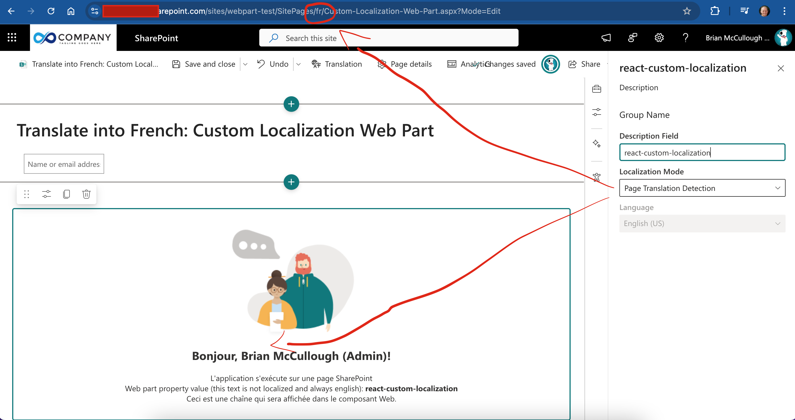
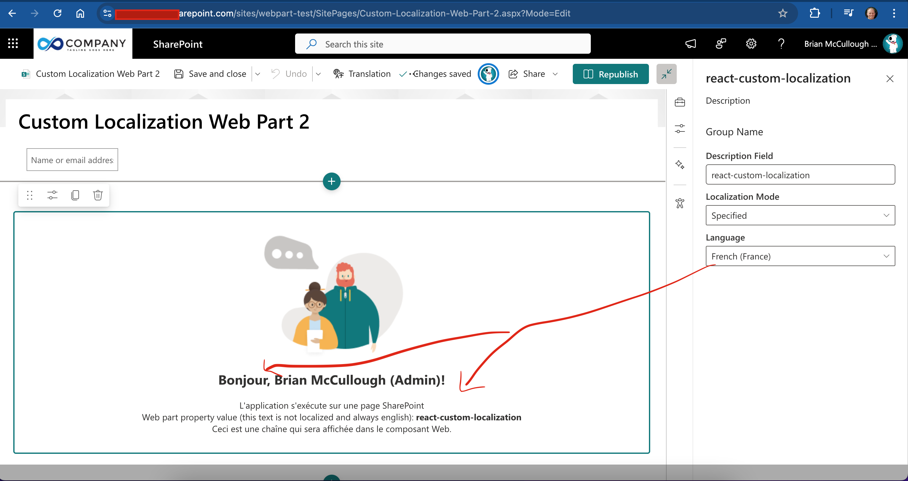
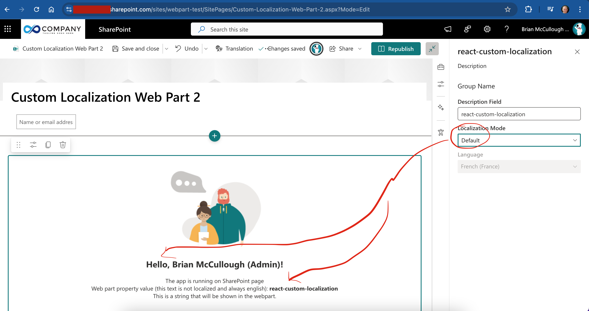

# Custom Localization

## Summary

This web part shows how you can load localization files (e.g. fr-fr.js) and use the localized strings if you have requirements to display localized text outside the [normal SPFx/SPO processing](https://learn.microsoft.com/en-us/sharepoint/dev/spfx/web-parts/guidance/localize-web-parts)

<!--
Please provide a high-quality screenshot of your web parts below. It should be stored in a folder called `assets`. 

If possible, use a resolution of 1920x1080.

If your web part uses a placeholder screen and requires the user to configure it, please use a screenshot of the web part as it appears **after** it has been configured.

You can add as many screen shots as you'd like to help users understand your web part without having to download it and install it.
-->

## Compatibility

| :warning: Important          |
|:---------------------------|
| Every SPFx version is optimally compatible with specific versions of Node.js. In order to be able to build this sample, you need to ensure that the version of Node on your workstation matches one of the versions listed in this section. This sample will not work on a different version of Node.|
|Refer to <https://aka.ms/spfx-matrix> for more information on SPFx compatibility.   |

This sample is optimally compatible with the following environment configuration:

-Incompatible-red.svg "SharePoint Server 2016 Feature Pack 2 requires SPFx 1.1")

<!---->

<!--
If using SPFx 1.18

If using SPFx 1.17.4

If using SPFx 1.16

If using SPFX 1.14, update the SPFx and Node.js tags as per below:

  If using SPFx 1.13.1, update the SPFx and Node.js tags accordingly:

  If using SPFx 1.12.1, update the SPFx and Node.js tags accordingly:

 

  If using an older version of SPFx, update the SPFx and Node.js compatibility tag accordingly:

  SPFx 1.11
 
 

 SPFx 1.10
 
 

 SPFx 1.4.1

  If you built this sample specifically for SharePoint 2016, or SharePoint 2019 support, update the SharePoint compatibility tag accordingly:

-Compatible-green.svg)

  If you know your web part only works on the hosted workbench, you can use this for the workbench compatibility tag:

  Otherwise:

  If your web part needs permissions before working in the hosted workbench, let people know;
-yellow.svg "Requires permissions to be granted before this solution can work on the hosted workbench")

  or:

  Otherwise:

 If you specifically built and tested this web part to work with Teams, use this for the Teams compatibility tag:
    
 And if you know for sure that it is NOT compatible with Teams, use this:
    

Don't worry if you're unsure about the compatibility matrix above. We'll verify it when we approve the PR. 
-->

## Applies to

* [SharePoint Framework](https://learn.microsoft.com/sharepoint/dev/spfx/sharepoint-framework-overview)
* [Microsoft 365 tenant](https://learn.microsoft.com/sharepoint/dev/spfx/set-up-your-development-environment)

> Get your own free development tenant by subscribing to [Microsoft 365 developer program](https://aka.ms/m365/devprogram)

## Contributors
<!--
We use this section to recognize and promote your contributions. Please provide one author per line -- even if you worked together on it.

We'll only use the info you provided here. Make sure to include your full name, not just your GitHub username.

Provide a link to your GitHub profile to help others find more cool things you have done. The only link we'll accept is a link to your GitHub profile.

If you want to provide links to your social media, blog, and employer name, make sure to update your GitHub profile.
-->

* [Brian McCullough](https://github.com/brianpmccullough)

## Version history

|Version|Date|Comments|
|-------|----|--------|
|1.0|January 23, 2025|Initial release|

## Prerequisites

<!--
Any special pre-requisites? Include any lists, permissions, offerings to the demo gods, or whatever else needs to be done for this web part to work.

Please describe the steps to configure the pre-requisites. Feel free to add screen shots, but make sure that there is a text description of the steps to perform.
 
-->

## Minimal path to awesome

<!-- 
PRO TIP:

For commands, use the `code syntax`

For button labels, page names, dialog names, etc. as they appear on the screen, use **Bold**

Don't use "click", use "select" or "use"

As tempting as it may be, don't just use images to describe the steps. Let's be as inclusive as possible and think about accessibility.

-->

* Clone this repository (or [download this solution as a .ZIP file](https://pnp.github.io/download-partial/?url=https://github.com/pnp/sp-dev-fx-webparts/tree/main/samples/react-custom-localization) then unzip it)
* From your command line, change your current directory to the directory containing this sample (`react-custom-localization`, located under `samples`)
* in the command line run:
  * `npm install`
  * `gulp serve`

> This sample can also be opened with [VS Code Remote Development](https://code.visualstudio.com/docs/remote/remote-overview). Visit <https://aka.ms/spfx-devcontainer> for further instructions.

## Features

Description of the web part with possible additional details than in short summary.
This Web Part illustrates the following concepts on top of the SharePoint Framework:

* Working with localization (a.k.a multilingual user interface or internationalization or globalization)
* Additional support for translated pages where you need to ensure the web part contents are displayed in the translated page's language, rather than the user, web, or browser settings/preferences.
* Dynamic module loading

<!--
Note that better pictures and documentation will increase the sample usage and the value you are providing for others. Thanks for your submissions in advance! You rock ❤.
-->

<!--
RESERVED FOR REPO MAINTAINERS

We'll add the video from the community call recording here

## Video

-->

## Help

<!--
You can just search and replace this page with the following values:

Search for:
YOUR-SOLUTION-NAME

Replace with your sample folder name. E.g.: react-my-cool-sample

Search for:
@YOURGITHUBUSERNAME

Replace with your GitHub username, prefixed with an "@". If you have more than one author, use %20 to separate them, making sure to prefix everyone's username individually with an "@".

Example:
@hugoabernier

Or:
@hugoabernier%20@VesaJuvonen%20@PopWarner
-->

We do not support samples, but this community is always willing to help, and we want to improve these samples. We use GitHub to track issues, which makes it easy for  community members to volunteer their time and help resolve issues.

If you're having issues building the solution, please run [spfx doctor](https://pnp.github.io/cli-microsoft365/cmd/spfx/spfx-doctor/) from within the solution folder to diagnose incompatibility issues with your environment.

You can try looking at [issues related to this sample](https://github.com/pnp/sp-dev-fx-webparts/issues?q=label%3A%22sample%3A%20react-custom-localization%22) to see if anybody else is having the same issues.

You can also try looking at [discussions related to this sample](https://github.com/pnp/sp-dev-fx-webparts/discussions?discussions_q=react-custom-localization) and see what the community is saying.

If you encounter any issues using this sample, [create a new issue](https://github.com/pnp/sp-dev-fx-webparts/issues/new?assignees=&labels=Needs%3A+Triage+%3Amag%3A%2Ctype%3Abug-suspected%2Csample%3A%20react-custom-localization&template=bug-report.yml&sample=react-custom-localization&authors=@brianpmccullough&title=react-custom-localization%20-%20).

For questions regarding this sample, [create a new question](https://github.com/pnp/sp-dev-fx-webparts/issues/new?assignees=&labels=Needs%3A+Triage+%3Amag%3A%2Ctype%3Aquestion%2Csample%3A%20react-custom-localization&template=question.yml&sample=react-custom-localization&authors=@brianpmccullough&title=react-custom-localization%20-%20).

Finally, if you have an idea for improvement, [make a suggestion](https://github.com/pnp/sp-dev-fx-webparts/issues/new?assignees=&labels=Needs%3A+Triage+%3Amag%3A%2Ctype%3Aenhancement%2Csample%3A%20react-custom-localization&template=suggestion.yml&sample=react-custom-localization&authors=@brianpmccullough&title=react-custom-localization%20-%20).

## Disclaimer

**THIS CODE IS PROVIDED *AS IS* WITHOUT WARRANTY OF ANY KIND, EITHER EXPRESS OR IMPLIED, INCLUDING ANY IMPLIED WARRANTIES OF FITNESS FOR A PARTICULAR PURPOSE, MERCHANTABILITY, OR NON-INFRINGEMENT.**

