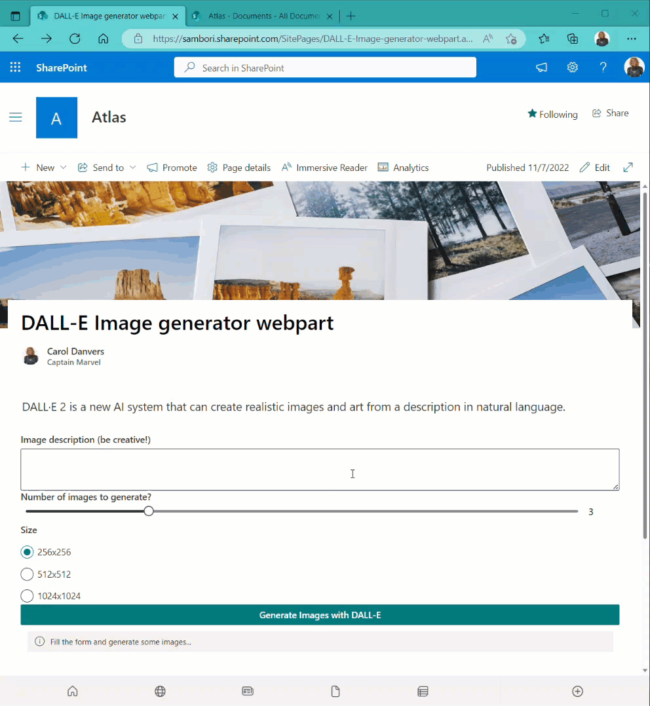

# Image generation webpart using DALL-E API

## Summary

This webpart allows you to generate some images using the recently released API of [DALL-E image generation](https://openai.com/dall-e-2/). Once the image is generated, the webpart allows you to save it to the Documents library of the current site collection.

__Note__: The Images API is in beta. During this time the API and models will evolve based on your feedback. To ensure all users can prototype comfortably, the default rate limit is 10 images per minute, 25 per 5 minutes.
In this sample, we are calling the API asking for Base64 images format, while the default is a URL. We are using the Base64 format, because DALL-E servers do not support CORS, so we cannot fetch the image content to save it to SharePoint. To achieve this feature, we use the Base64 format.

## Used SharePoint Framework Version

## Applies to

- [SharePoint Framework](https://aka.ms/spfx)
- [Microsoft 365 tenant](https://docs.microsoft.com/en-us/sharepoint/dev/spfx/set-up-your-developer-tenant)

> Get your own free development tenant by subscribing to [Microsoft 365 developer program](http://aka.ms/o365devprogram)

## Prerequisites

For being able to use the API, you first needs to register into the [DALL-E 2 website](https://labs.openai.com/auth/signup), and then, you must generate an [API Key](https://beta.openai.com/account/api-keys)

## Solution

| Solution    | Author(s)                                               |
| ----------- | ------------------------------------------------------- |
| react-dall-e-image-generation | [Luis Mañez](https://github.com/luismanez) ([MS MVP](https://mvp.microsoft.com/en-us/PublicProfile/5002617), [ClearPeople](https://www.clearpeople.com), [@luismanez](https://twitter.com/luismanez)) |

## Version history

| Version | Date             | Comments        |
| ------- | ---------------- | --------------- |
| 1.0     | November 08, 2022 | Initial release |

---

## Minimal Path to Awesome

- Clone this repository
- Ensure that you are at the solution folder
- Edit the file _/src/webparts/dalleImageGenerator/Constants.ts_ and set your DALL-E API Key generated in the pre-requisites section
- in the command-line run:
  - **npm install**
  - **gulp serve**

## Features

This extension illustrates the following concepts:

- use of the DALL-E API
- use of PnPJS

## References

- [DALL-E 2 website](https://labs.openai.com/auth/signup)
- [Getting started with SharePoint Framework](https://docs.microsoft.com/en-us/sharepoint/dev/spfx/set-up-your-developer-tenant)
- [Building for Microsoft teams](https://docs.microsoft.com/en-us/sharepoint/dev/spfx/build-for-teams-overview)
- [Use Microsoft Graph in your solution](https://docs.microsoft.com/en-us/sharepoint/dev/spfx/web-parts/get-started/using-microsoft-graph-apis)
- [Publish SharePoint Framework applications to the Marketplace](https://docs.microsoft.com/en-us/sharepoint/dev/spfx/publish-to-marketplace-overview)
- [Microsoft 365 Patterns and Practices](https://aka.ms/m365pnp) - Guidance, tooling, samples and open-source controls for your Microsoft 365 development

## Help
We do not support samples, but this community is always willing to help, and we want to improve these samples. We use GitHub to track issues, which makes it easy for community members to volunteer their time and help resolve issues.

If you're having issues building the solution, please run spfx doctor from within the solution folder to diagnose incompatibility issues with your environment.

You can try looking at issues related to this sample to see if anybody else is having the same issues.

You can also try looking at discussions related to this sample and see what the community is saying.

If you encounter any issues using this sample, create a new issue.

For questions regarding this sample, create a new question.

Finally, if you have an idea for improvement, make a suggestion.

## Disclaimer
THIS CODE IS PROVIDED AS IS WITHOUT WARRANTY OF ANY KIND, EITHER EXPRESS OR IMPLIED, INCLUDING ANY IMPLIED WARRANTIES OF FITNESS FOR A PARTICULAR PURPOSE, MERCHANTABILITY, OR NON-INFRINGEMENT.