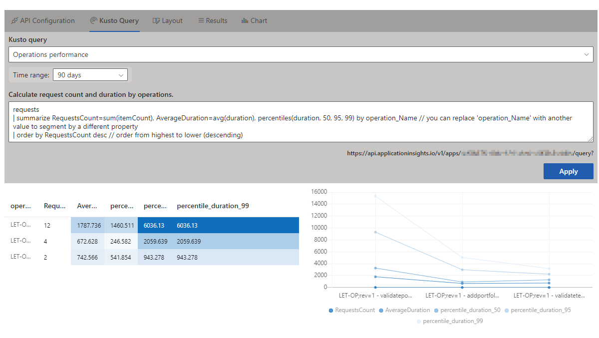
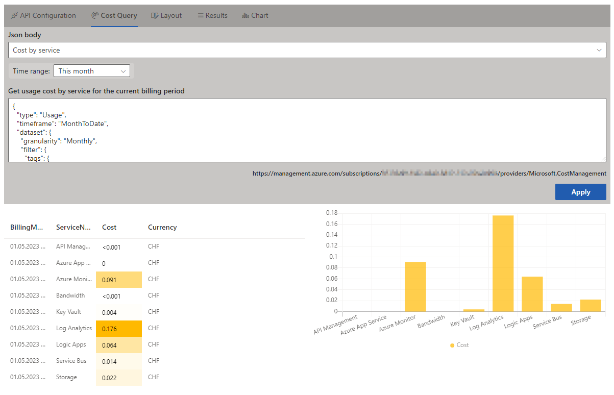
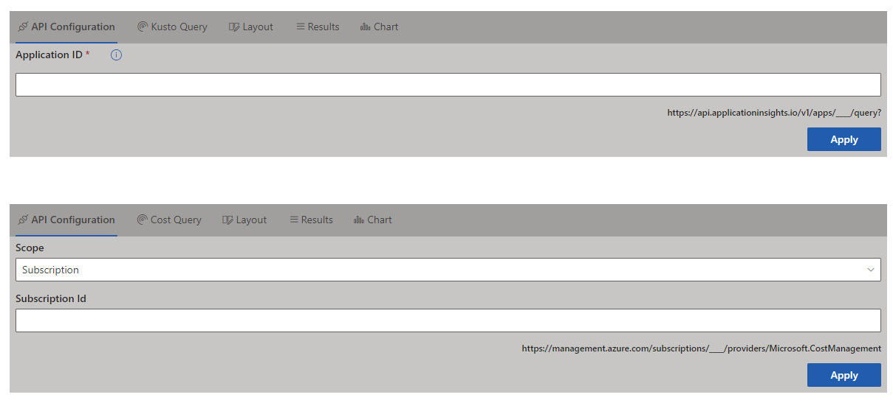
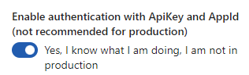
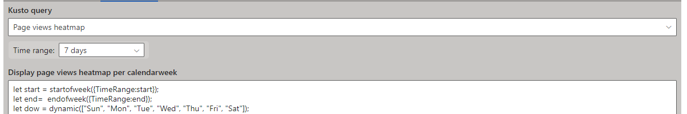

# Application Insights and Cost Management Dashboards

## Summary

Sharing Application Insights and solution's cost information with your stakeholders typically requires either using _Azure Dashboards_ or using _Power BI_. This sample solution allows displaying this dashboards directly in a SharePoint site or a tab in MS Teams, moving it close to the users.

This solution consists of two web parts:

- **Application Insights** executes Kusto query against the Application Insights service in your Azure tenant

    

- **Cost Insights** queries the usage data for the specified scope (management group, subscription, resource group)
    

## Compatibility

This sample is optimally compatible with the following environment configuration:

-Incompatible-red.svg "SharePoint Server 2016 Feature Pack 2 requires SPFx 1.1")

Tested with Node 16.14.2

## Applies to

- [SharePoint Framework](https://aka.ms/spfx)
- [Microsoft 365 tenant](https://docs.microsoft.com//sharepoint/dev/spfx/set-up-your-developer-tenant)

> Get your own free development tenant by subscribing to [Microsoft 365 developer program](http://aka.ms/o365devprogram)

## Authors

* [Kinga Kazala](https://github.com/kkazala)

## Version history

| Version | Date             | Comments        |
| ------- | ---------------- | --------------- |
| 1.0     | May 30, 2023     | Initial release |
|1.0.1    | August 10, 2023  | `clienttype` header to avoid using tenant rate limits |

## Prerequisites

- Azure tenant
- Application Insights resource (for Application Insights web part)
- Read access to Cost Management data (for Cost Insights web part), see **Required access to view data** in the [Azure EA subscription scopes](https://learn.microsoft.com//azure/cost-management-billing/costs/assign-access-acm-data#azure-ea-subscription-scopes) table
- SharePoint Administrator or Global Administrator to install the solution
- Global Administrator permissions to approve required API access:
  - Windows Azure Service Management API: user_impersonation
  - Application Insights API: user_impersonation

### Required Permissions

| resource | scope|
|-|-|
|Windows Azure Service Management API|user_impersonation|
|Application Insights API|user_impersonation|

## Minimal Path to Awesome

- Clone this repository
- Ensure that you are at the solution folder
- to debug, in the command-line run:
  - `npm install` / `pnpm install`
  - `gulp serve --nobrowser`
- to deploy, in the command-line run:
  - `gulp bundle --ship`
  - `gulp package-solution --ship`

## Configuration

### API Connection

Configuration dashboard allows defining connection settings.
**Application Insights** requires **Application ID**, which you may find by navigating to **Application Insights** / **API Access** (Configure group)
**Cost Management** access may be **scoped** to a management group, subscription and resource group.

Both APIs are accessed using **user impersonation**.

  

> **Optionally**, and for **Application Insights only**, you may enable access with Application ID and Key. To do so, open the web part properties panel and in the Developer Settings section, enable authentication with ApiKey and AppId:
>
> 

### Kusto Query / Cost Query

Both web parts have example queries that you may use to test the solution, or to treat as a starting point for defining your own queries.

**Application Insights logs** are retrieved using the **Application Insights API** and your custom Kusto query.

In case you want to refer to the _time range_ defined in the web part, type `{TimeRange:start}` in the Kusto query:

> Please **test** your query using either [Application Insights / Query - Get](https://learn.microsoft.com//rest/api/application-insights/query/get?tabs=HTTP#code-0) or query editor in Azure portal (Application Insights / Logs) to ensure the query is correct. Some expression you may use in Workspaces will not work in Application Insights Logs API and therefore, will also fail when executed using this web part.

**Cost information** is retrieved using the **Cost Management Usage API** and your custom JSON request. Please test it using [Cost Management / Query - Usage](https://learn.microsoft.com//rest/api/cost-management/query/usage?tabs=HTTP#code-try-0)

### Rendering results

Results may be displayed in a **table**, a **chart**, or **both**.
Table may be optionally formatted as a **heatmap**, chart supports _line chart_, _area chart_, _bar chart_, _column chart_ and _pie chart_ styles.

Colors may be changed to either SharePoint theme's accent colors, or gradient colors using one of the SharePoint accents.

Chart is rendered using [Chart Control](https://pnp.github.io/sp-dev-fx-controls-react/controls/ChartControl/) with dependency on `chart.js 2.9.4`. Labels and data series are detected based on the data types, e.g. _datetime_, _string_ or _number_; currently there is no option to define custom data mappings.

### Authentication

User impersonation is executed using [AadHttpClient](https://learn.microsoft.com//sharepoint/dev/spfx/use-aadhttpclient). To call the APIs, the solution requires the following **Application** API permissions:

- Windows Azure Service Management API: user_impersonation
- Application Insights API: user_impersonation

These permissions will be requested automatically once the solution is deployed, and must be granted by a Global Admin using [API access](https://yoursharepoint-admin.sharepoint.com/_layouts/15/online/AdminHome.aspx#/webApiPermissionManagement) page in SharePoint Administration

Authentication with `Application ID` and `API key` is also allowed for Application Insights dashboard (see _Api Connection_ above)

### Caching

`PnPClientStorage` is used to cache query results in local storage to avoid [throttling](https://learn.microsoft.com//azure/azure-resource-manager/management/request-limits-and-throttling). This is especially important when querying cost management APIs (see more information below).

By default, caching duration is set to:

- **15 minutes** for **Application Insights Dashboard**, and
- **1 day** for **Cost Insights Dashboard**

Cache duration for **Application Insights Dashboard** may be extended or disabled using web part properties panel. In case you want to delete the cache manually, the key names for this solution start with **spfxDashboard**.

### Rate Limit

This solution is using `clienttype` header to avoid using general tenant limits and to avoid the error 429 `Too many requests. Please retry.`

The **default rate limits** when querying cost management API **with/without** the `clienttype` parameter are:

| Response header |without `clienttype`| with `clienttype`|
|-|-|-|
|x-ms-ratelimit-remaining-microsoft.costmanagement-`clienttype-requests`|0|1995|
|x-ms-ratelimit-remaining-microsoft.costmanagement-`entity-requests`|2|0|
|x-ms-ratelimit-remaining-microsoft.costmanagement-`tenant-requests`|18|15|

The Cost Management API requests are still a subject to the rate limits. The above response headers, along with `x-ms-ratelimit-microsoft.costmanagement-qpu-consumed` (QPUs consumed by an API call) and `x-ms-ratelimit-microsoft.costmanagement-qpu-remaining` (list of remaining quotas) are printed in the browser console whenever a request to the API has been made

## Accessing Application Insights Data

To query Application Insights using the Application Insights Data Access API, you must **authenticate**:

- To query your workspaces, use Azure Active Directory (Azure AD) authentication.
- To quickly explore the API without using Azure AD authentication, you can use an API key to query sample data in a non-production environment.  You may try it here [here](https://learn.microsoft.com/rest/api/application-insights/query/get?tabs=HTTP#code-0), by adding **x-api-key** header set to **ApiKey** value

The Log Analytics API supports Azure AD authentication with three different Azure AD OAuth2 flows: authorization code, **implicit**, client credentials.
Client-side applications that are incapable of storing a secret, such as SharePoint Framework solutions, use **OAuth implicit flow**. In SharePoint Framework solutions, authorization by using the OAuth implicit flow is  done as part of the framework through MSGraphClient and AadHttpClient, both of which are introduced in SharePoint Framework v1.4.1.

Developers building a SharePoint Framework solution that requires access to specific resources secured with Azure AD list these resources along with the required permission scopes in the solution manifest. When deploying the solution package to the app catalog, SharePoint creates permission requests and prompts the administrator to manage the requested permissions. For each requested permission, a **global administrator** can decide whether they want to grant or deny the specific permission.

All permissions are granted to the whole tenant and not to a specific application that has requested them. When the administrator grants a specific permission, its added to the SharePoint Online Client Extensibility Azure AD application, which is provisioned by Microsoft in every Azure AD and which is used by the SharePoint Framework in the OAuth flow to provide solutions with valid access tokens.

## References

### Application Insights

- [Application Insights overview](https://learn.microsoft.com//azure/azure-monitor/app/app-insights-overview)
- [Application Insights API](https://learn.microsoft.com//rest/api/application-insights/)
- [Application Insights demo data](https://aka.ms/AIAnalyticsDemo)
- [KQL quick reference](https://learn.microsoft.com//azure/data-explorer/kql-quick-reference)
-[Fun With KQL – Variants Of Project](https://arcanecode.com/2022/06/06/fun-with-kql-variants-of-project/)
- [Resources, roles, and access control in Application Insights](https://learn.microsoft.com//azure/azure-monitor/app/resources-roles-access-control) - Assign access to users in the resource group or subscription to which your application resource belongs, not in the resource itself.

### Cost Management

- [Cost Management API](https://learn.microsoft.com//rest/api/cost-management/)
- [Cost Management Dimensions](https://learn.microsoft.com//rest/api/cost-management/dimensions/list?tabs=HTTP#code-try-0)
- [How to optimize your cloud investment with Cost Management](https://learn.microsoft.com//azure/cost-management-billing/costs/cost-mgt-best-practices)
- [Retrieve large cost datasets recurringly with exports](https://learn.microsoft.com//azure/cost-management-billing/costs/ingest-azure-usage-at-scale)
- [Manage costs with automation](https://learn.microsoft.com//azure/cost-management-billing/costs/manage-automation
)

>If you want to get the latest cost data, query at most once per day. Reports are refreshed every four hours. If you call more frequently, you'll receive identical data.
>The data in Usage Details is provided on a per meter basis, per day.
>
>If you want to get large amounts of exported data regularly, see [Retrieve large cost datasets recurringly with exports](https://learn.microsoft.com//azure/cost-management-billing/costs/ingest-azure-usage-at-scale).
>
>
>If you have scopes with a large amount of usage data (for example a Billing Account), consider placing multiple calls to child scopes so you get more manageable files that you can download. If your dataset is more than 2 GB month-to-month, consider using exports as a more scalable solution.

### Using Azure APIs

- [Connect to Azure AD-secured APIs in SharePoint Framework solutions](https://learn.microsoft.com//sharepoint/dev/spfx/use-aadhttpclient)
- [Application IDs of commonly used Microsoft applications](https://learn.microsoft.com//troubleshoot/azure/active-directory/verify-first-party-apps-sign-in#application-ids-of-commonly-used-microsoft-applications)
- [Throttling](https://learn.microsoft.com//azure/azure-resource-manager/management/request-limits-and-throttling) - The resource provider requests are also throttled per principal user ID and per hour.

- [Microsoft 365 Patterns and Practices](https://aka.ms/m365pnp) - Guidance, tooling, samples and open-source controls for your Microsoft 365 development

#### Used Application API

- `f5c26e74-f226-4ae8-85f0-b4af0080ac9e` Application Insights API
- `797f4846-ba00-4fd7-ba43-dac1f8f63013` Windows Azure Service Management API

## Help

We do not support samples, but this community is always willing to help, and we want to improve these samples. We use GitHub to track issues, which makes it easy for  community members to volunteer their time and help resolve issues.

If you're having issues building the solution, please run [spfx doctor](https://pnp.github.io/cli-microsoft365/cmd/spfx/spfx-doctor/) from within the solution folder to diagnose incompatibility issues with your environment.

You can try looking at [issues related to this sample](https://github.com/pnp/sp-dev-fx-webparts/issues?q=label%3A%22sample%3A%20react-dashboards%22) to see if anybody else is having the same issues.

You can also try looking at [discussions related to this sample](https://github.com/pnp/sp-dev-fx-webparts/discussions?discussions_q=react-dashboards) and see what the community is saying.

If you encounter any issues using this sample, [create a new issue](https://github.com/pnp/sp-dev-fx-webparts/issues/new?assignees=&labels=Needs%3A+Triage+%3Amag%3A%2Ctype%3Abug-suspected%2Csample%3A%20react-dashboards&template=bug-report.yml&sample=react-dashboards&authors=@kkazala&title=react-dashboards%20-%20).

For questions regarding this sample, [create a new question](https://github.com/pnp/sp-dev-fx-webparts/issues/new?assignees=&labels=Needs%3A+Triage+%3Amag%3A%2Ctype%3Aquestion%2Csample%3A%20react-dashboards&template=question.yml&sample=react-dashboards&authors=@kkazala&title=react-dashboards%20-%20).

Finally, if you have an idea for improvement, [make a suggestion](https://github.com/pnp/sp-dev-fx-webparts/issues/new?assignees=&labels=Needs%3A+Triage+%3Amag%3A%2Ctype%3Aenhancement%2Csample%3A%20react-dashboards&template=suggestion.yml&sample=react-dashboards&authors=@kkazala&title=react-dashboards%20-%20).

#### Developer resources

- [Build your first app with SPFx (Teams)](https://learn.microsoft.com/en-us/microsoftteams/platform/sbs-gs-spfx?tabs=vscode%2Cviscode)
- [Microsoft 365 Developer Proxy](https://github.com/microsoft/m365-developer-proxy)
- [How to use SPFx powered Microsoft Teams apps in Outlook and Office](https://pnp.github.io/blog/post/spfx-08-spfx-powered-teams-solutions-outlook-office/)

## Disclaimer

**THIS CODE IS PROVIDED _AS IS_ WITHOUT WARRANTY OF ANY KIND, EITHER EXPRESS OR IMPLIED, INCLUDING ANY IMPLIED WARRANTIES OF FITNESS FOR A PARTICULAR PURPOSE, MERCHANTABILITY, OR NON-INFRINGEMENT.**

