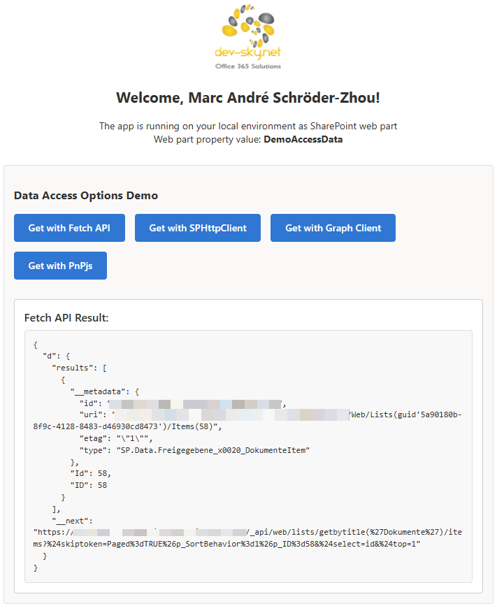

# SharePoint - Use different options to access SharePoint data
## Summary

This sample SPFx web part demonstrates multiple ways to read data from a SharePoint list/library. It includes side‑by‑side implementations using the native Fetch API, `SPHttpClient`, Microsoft Graph, and PnPjs. Configure `SITEID`, `SOURCELIBRARY`, and `SOURCELIBRARYID` in `src/Core/DataAccessOptions.ts`, then run and compare each approach with a single click in the UI.

*UI of the App*

*Overview about the data access options*

## Used SharePoint Framework Version

## Compatibility

| :warning: Important          |
|:---------------------------|
| Every SPFx version is only compatible with specific version(s) of Node.js. In order to be able to build this sample, please ensure that the version of Node on your workstation matches one of the versions listed in this section. This sample will not work on a different version of Node.|
|Refer to <https://aka.ms/spfx-matrix> for more information on SPFx compatibility.   |

 
 

-Incompatible-red.svg "SharePoint Server 2016 Feature Pack 2 requires SPFx 1.1")

## Applies to

- [SharePoint Framework](https://aka.ms/spfx)
- [Microsoft 365 tenant](https://docs.microsoft.com/en-us/sharepoint/dev/spfx/set-up-your-developer-tenant)

> Get your own free development tenant by subscribing to [Microsoft 365 developer program](http://aka.ms/o365devprogram)

## Prerequisites

> Check the file DataAccessOptions and set the variables: SITEID, SOURCELIBRARY and SOURCELIBRARYID
> Install the App and add the App to a page OR use the workbench.

## Contributors

* [Marc André Schröder-Zhou](https://github.com/maschroeder-z)

## Solution

| Solution    | Author(s)                                                   |
| ----------- | ----------------------------------------------------------- |
| Repository  | Marc André Schröder-Zhou (https://github.com/maschroeder-z) |

## Version history

| Version | Date             | Comments              |
| ------- | ---------------- | --------------------- |
| 1.0     | 18.10.2025       | Initial Release       |

## Minimal Path to Awesome

- Clone this repository
- Ensure that you are at the solution folder
- Configure `SITEID`, `SOURCELIBRARY`, `SOURCELIBRARYID` in `src/Core/DataAccessOptions.ts`
- in the command-line run:
  - **npm install**
  - **gulp serve**

> Check your current Node version and installed SPFx-Framework version.

## Features
 - Compare multiple data access methods side-by-side: Fetch, SPHttpClient, Microsoft Graph, and PnPjs
 - One-click buttons in the web part UI to invoke each option
 - Shows JSON results directly in the UI for quick verification
 - Works in local workbench and on SharePoint pages
 - Uses TypeScript and SPFx 1.21 with React 17
 - Example queries scoped to top item for fast responses

## Help
Please contact me for further help or information about the sample.

## References

- [Getting started with SharePoint Framework](https://docs.microsoft.com/en-us/sharepoint/dev/spfx/set-up-your-developer-tenant)
- [Building for Microsoft teams](https://docs.microsoft.com/en-us/sharepoint/dev/spfx/build-for-teams-overview)
- [Use Microsoft Graph in your solution](https://docs.microsoft.com/en-us/sharepoint/dev/spfx/web-parts/get-started/using-microsoft-graph-apis)
- [Publish SharePoint Framework applications to the Marketplace](https://docs.microsoft.com/en-us/sharepoint/dev/spfx/publish-to-marketplace-overview)
- [Microsoft 365 Patterns and Practices](https://aka.ms/m365pnp) - Guidance, tooling, samples and open-source controls for your Microsoft 365 development

## Disclaimer

**THIS CODE IS PROVIDED _AS IS_ WITHOUT WARRANTY OF ANY KIND, EITHER EXPRESS OR IMPLIED, INCLUDING ANY IMPLIED WARRANTIES OF FITNESS FOR A PARTICULAR PURPOSE, MERCHANTABILITY, OR NON-INFRINGEMENT.**

