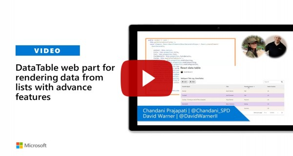

# SharePoint Framework DataTable web part sample

## Summary

This web part provides easy way to render SharePoint custom list in datatable view with all the necessary features. 

## Features

- Searching (Configurable)
- Sorting (Configurable)
- Download as a CSV and PDF,
- Pagination,
- Column Ordering,
- Dynamic colors for odd and even rows.

## Compatibility

 

-Incompatible-red.svg "SharePoint Server 2016 Feature Pack 2 requires SPFx 1.1")

## Applies to

* [SharePoint Framework](https://docs.microsoft.com/sharepoint/dev/spfx/sharepoint-framework-overview)
* [Office 365 tenant](https://docs.microsoft.com/sharepoint/dev/spfx/set-up-your-development-environment)

## Solution

Solution|Author(s)
--------|---------
react-datatable | [Chandani Prajapati](https://github.com/chandaniprajapati) ([@Chandani_SPD](https://twitter.com/Chandani_SPD))
react-datatable | [Abderahman Moujahid](https://github.com/Abderahman88)

## Version history

Version|Date|Comments
-------|----|--------
1.0|February 19, 2021|Initial release
1.1|February 24, 2021|Added support for large lists
1.2|March 01, 2021|Fixed search issue for number field
1.3|March 31,2021| Changed UI as per SharePoint list, Set themeing as per current SharePoint site theme, Created custom pagination by using reusable controls, Added features to export CSV based on the filter if the filter is available, Added hyperlink feature for image and link column in export to pdf and also set alternative row formatting in generated pdf as per property pane configuration odd/even row color, fixed object issue (for people/hyperlink, etc) in export to CSV.
1.4|April 10, 2021|Added feature to show profile picture in user column and shows display name of user field in export to CSV and PDF.
1.5|June 2, 2021|Added feature to show image in dataTable and upgraded to the SPFx version 1.12.1.
1.6|July 16, 2021|Changed library export-to-csv with react-csv
1.7|Feb 22, 2022|Upgrade to SPFx v1.14.0

## Minimal Path to Awesome

### Local testing

>  This sample can also be opened with [VS Code Remote Development](https://code.visualstudio.com/docs/remote/remote-overview). Visit https://aka.ms/spfx-devcontainer for further instructions.

* Clone the repository
* `cd` to web part's project folder
* In the command line run:
  * `npm install`
  * `gulp serve`

## Video

## Help

We do not support samples, but this community is always willing to help, and we want to improve these samples. We use GitHub to track issues, which makes it easy for  community members to volunteer their time and help resolve issues.

If you're having issues building the solution, please run [spfx doctor](https://pnp.github.io/cli-microsoft365/cmd/spfx/spfx-doctor/) from within the solution folder to diagnose incompatibility issues with your environment.

You can try looking at [issues related to this sample](https://github.com/pnp/sp-dev-fx-webparts/issues?q=label%3A%22sample%3A%20react-datatable") to see if anybody else is having the same issues.

You can also try looking at [discussions related to this sample](https://github.com/pnp/sp-dev-fx-webparts/discussions?discussions_q=react-datatable) and see what the community is saying.

If you encounter any issues while using this sample, [create a new issue](https://github.com/pnp/sp-dev-fx-webparts/issues/new?assignees=&labels=Needs%3A+Triage+%3Amag%3A%2Ctype%3Abug-suspected%2Csample%3A%20react-datatable&template=bug-report.yml&sample=react-datatable&authors=@Abderahman88%20@chandaniprajapati&title=react-datatable%20-%20).

For questions regarding this sample, [create a new question](https://github.com/pnp/sp-dev-fx-webparts/issues/new?assignees=&labels=Needs%3A+Triage+%3Amag%3A%2Ctype%3Aquestion%2Csample%3A%20react-datatable&template=question.yml&sample=react-datatable&authors=@Abderahman88%20@chandaniprajapati&title=react-datatable%20-%20).

Finally, if you have an idea for improvement, [make a suggestion](https://github.com/pnp/sp-dev-fx-webparts/issues/new?assignees=&labels=Needs%3A+Triage+%3Amag%3A%2Ctype%3Aenhancement%2Csample%3A%20react-datatable&template=question.yml&sample=react-datatable&authors=@Abderahman88%20@chandaniprajapati&title=react-datatable%20-%20).

## Disclaimer

**THIS CODE IS PROVIDED *AS IS* WITHOUT WARRANTY OF ANY KIND, EITHER EXPRESS OR IMPLIED, INCLUDING ANY IMPLIED WARRANTIES OF FITNESS FOR A PARTICULAR PURPOSE, MERCHANTABILITY, OR NON-INFRINGEMENT.**

