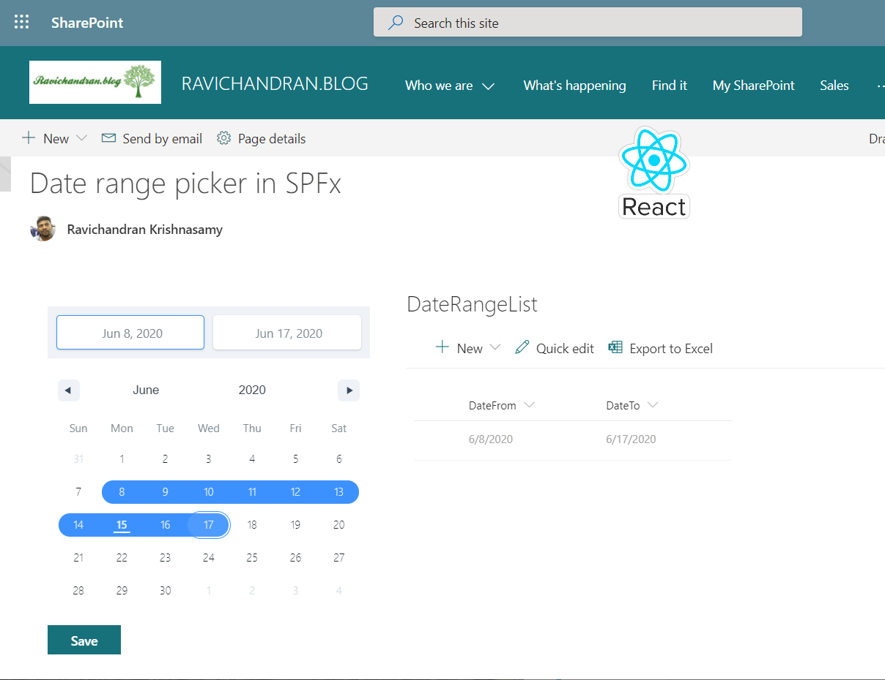

# Date range picker in SPFx

## Summary

This web part used the date range picker in the SharePoint Framework (SPFx) web part

## Used SharePoint Framework Version

## Applies to

* [SharePoint Framework](https://docs.microsoft.com/sharepoint/dev/spfx/sharepoint-framework-overview)
* [Office 365 tenant](https://docs.microsoft.com/sharepoint/dev/spfx/set-up-your-development-environment)

## Solution

Solution|Author(s)
--------|---------
react-daterangepicker |Ravichandran Krishnasamy ([@ravichandran-blog](https://github.com/ravichandran-blog) [Know More](https://ravichandran.blog/))

## Version history

Version|Date|Comments
-------|----|--------
1.0.0   |July 04, 2020  | Initial release.

## Disclaimer

**THIS CODE IS PROVIDED *AS IS* WITHOUT WARRANTY OF ANY KIND, EITHER EXPRESS OR IMPLIED, INCLUDING ANY IMPLIED WARRANTIES OF FITNESS FOR A PARTICULAR PURPOSE, MERCHANTABILITY, OR NON-INFRINGEMENT.**

---

## Minimal Path to Awesome

* Clone this repository
* in the command line run:
  * `npm install`
  * `gulp serve`

#### Local Mode

This solution can work on local mode.

