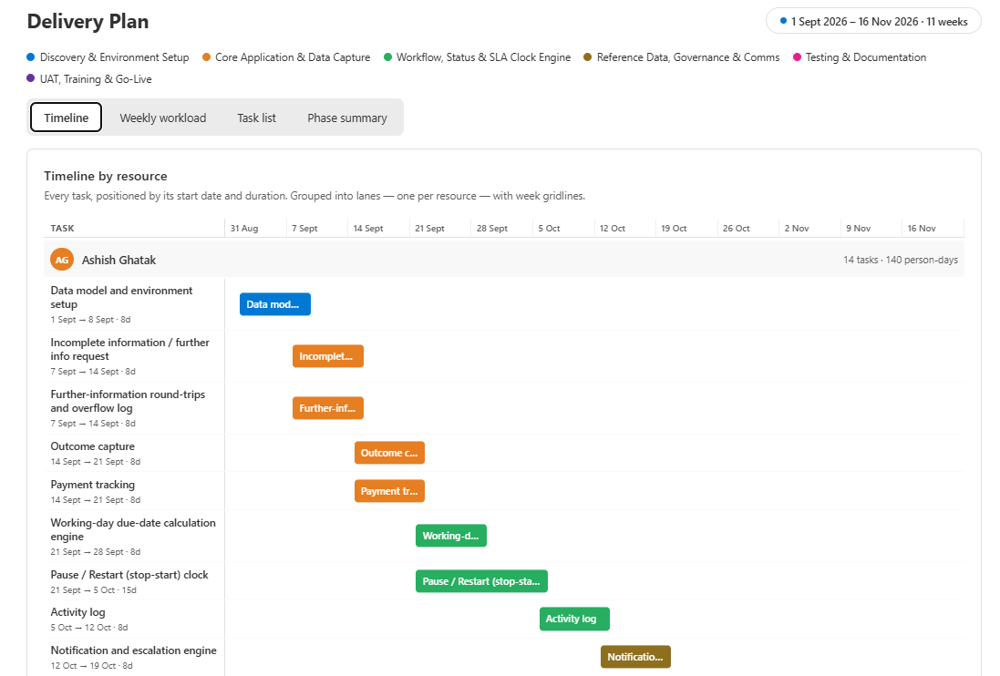
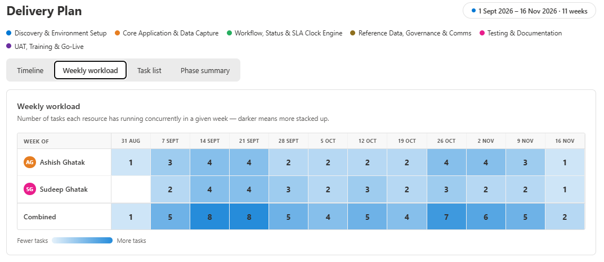
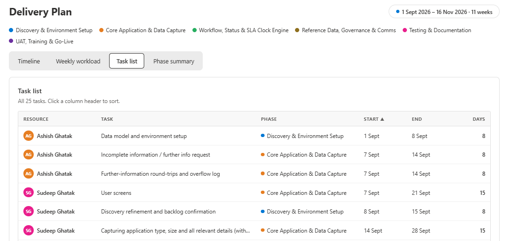
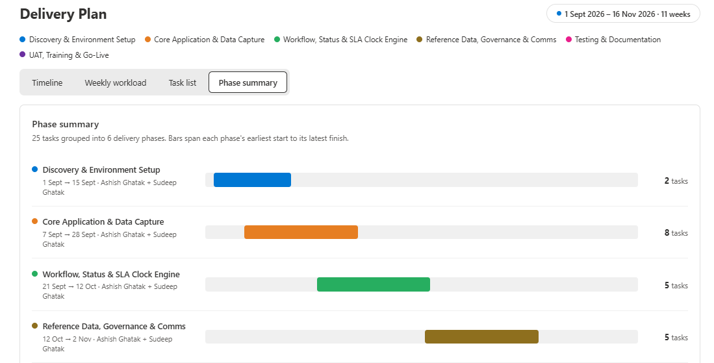

# Delivery Plan

## Summary

A project delivery dashboard web part that reads tasks from a SharePoint list and displays them across four interactive views. Resources, phases, and date ranges are all driven by list data — no hardcoded configuration required.

| View | Description |
|---|---|
| **Timeline** | Gantt chart grouped by resource — tasks appear as colour-coded bars positioned by start date and duration, with week gridlines and a today marker |
| **Weekly workload** | Heat-map grid showing how many tasks each resource has running concurrently per week — darker cells mean more concurrent work |
| **Task list** | Sortable table of all tasks with resource, phase, start date, end date and duration |
| **Phase summary** | Horizontal bars spanning each phase's earliest start to latest end, with contributing resources and task count |

Phases are auto-coloured from a 10-colour palette based on the unique values in your list's Phase column. The web part supports SharePoint's light and dark theme variants.

### Timeline — Gantt chart by resource



### Weekly workload — concurrent task heat-map



### Task list — sortable table



### Phase summary — phase-level bars



## Compatibility

| :warning: Important |
|:---|
| Every SPFx version is only compatible with specific version(s) of Node.js. In order to be able to build this sample, please ensure that the version of Node on your workstation matches one of the versions listed in this section. This sample will not work on a different version of Node. |
| Refer to <https://aka.ms/spfx-matrix> for more information on SPFx compatibility. |


## Applies to

- [SharePoint Framework](https://aka.ms/spfx)
- [Microsoft 365 tenant](https://docs.microsoft.com/en-us/sharepoint/dev/spfx/set-up-your-developer-tenant)

> Get your own free development tenant by subscribing to the [Microsoft 365 developer program](http://aka.ms/o365devprogram).

## Prerequisites

### SharePoint List

Create a SharePoint list named **DeliveryPlan** (configurable via the property pane) with the following columns:

| Column display name | Internal name | Type | Required |
|---|---|---|---|
| Title | `Title` | Single line of text | Yes |
| Resource | `Resource` | Person or Group (single selection) | Yes |
| Phase | `Phase` | Choice or Single line of text | Yes |
| Start Date | `StartDate` | Date and Time (Date only) | Yes |
| End Date | `EndDate` | Date and Time (Date only) | Yes |

Use the included PowerShell script to create the list and columns automatically — see [List setup script](#list-setup-scripts) below.

## Contributors

- [Sudeep Ghatak](https://github.com/sudeepghatak)

## Version history

| Version | Date | Comments |
|---|---|---|
| 1.0 | August 2026 | Initial release |

## Minimal Path to Awesome

- Clone this repository
- Move to the sample folder:

```bash
cd samples/react-delivery-plan
```

- Install dependencies:

```bash
npm install
```

- Trust the development certificate (first time only):

```bash
npm run trust-dev-cert
```

- Start the development server:

```bash
npm run serve
```

- Open the hosted workbench at `https://<your-tenant>.sharepoint.com/sites/<your-site>/_layouts/15/workbench.aspx`, add the **Delivery Plan** web part, and configure the list name in the property pane.

### Build for production

```bash
npm run build
node_modules/.bin/gulp package-solution --ship
```

Deploy the generated `sharepoint/solution/react-delivery-plan.sppkg` to your App Catalog.

## List Setup Scripts

Two PowerShell scripts are provided in the `scripts/` folder:

### 1. Create the list

```powershell
.\scripts\Create-DeliveryPlanList.ps1 `
    -SiteUrl  "https://contoso.sharepoint.com/sites/mysite" `
    -TenantId "your-tenant-id" `
    -ClientId "your-app-client-id"
```

Creates the list and all required columns. Safe to re-run — existing columns are skipped.

### 2. Load sample data

```powershell
.\scripts\Add-DeliveryPlanSampleData.ps1 `
    -SiteUrl        "https://contoso.sharepoint.com/sites/mysite" `
    -TenantId       "your-tenant-id" `
    -ClientId       "your-app-client-id" `
    -Resource1Email "sudeep@contoso.com" `
    -Resource2Email "ashish@contoso.com"
```

Loads 25 sample tasks across 6 phases and 2 resources spanning an 11-week delivery window. Safe to re-run — existing items are skipped.

Both scripts require the [PnP.PowerShell](https://pnp.github.io/powershell/) module:

```powershell
Install-Module PnP.PowerShell -Scope CurrentUser
```

## Features

### Timeline — Gantt chart by resource

Tasks are grouped into per-resource lanes. Within each lane, each task appears as a coloured bar whose horizontal position and width correspond exactly to its start date and duration in calendar days. The colour is determined by the task's phase.

The lane header shows the resource's avatar (initials, colour-coded by name), total task count, and cumulative person-days. A red vertical line marks today's date when it falls within the plan window.

### Weekly workload — concurrent task heat-map

For each resource, the number of tasks running in each calendar week is computed and displayed as a grid cell. Cell colour intensity scales from light (one task) to dark (highest task count) using a blue gradient. A Combined row totals across all resources per week.

### Task list — sortable table

All tasks are shown in a flat table. Click any column header to sort ascending; click again to reverse. Columns: Resource (avatar + name), Task, Phase (dot + label), Start, End, Days.

### Phase summary — phase-level bars

Phases are presented as horizontal bars spanning from the earliest task start to the latest task end within that phase. Contributing resource names are listed below the phase name. Task count is shown on the right.

### Automatic phase colours

Unique values in the Phase column are detected at render time and assigned colours from a built-in 10-colour palette in order of first appearance. No configuration needed — add a new phase value to the list and it gets its own colour automatically.

### Light and dark theme support

The web part responds to SharePoint's site theme. All neutral colours (text, backgrounds, borders) are driven by CSS custom properties that flip automatically when the site switches to a dark theme.

### Property pane

| Property | Default | Description |
|---|---|---|
| List name | `DeliveryPlan` | Internal name of the SharePoint list |
| Title | `Delivery Plan` | Heading displayed above the dashboard |
| Subtitle | *(empty)* | Optional sub-heading (e.g. project name or date range) |

## Solution

| Solution | Author(s) |
|---|---|
| react-delivery-plan | [Sudeep Ghatak](https://github.com/sudeepghatak) ([@sudeepghatak](https://twitter.com/sudeepghatak)), Theta |

## Help

We do not support samples, but this community is always willing to help, and we want to improve these samples. We use GitHub to track issues, which makes it easy for community members to volunteer their time and help resolve issues.

If you're having issues building the solution, please run [spfx doctor](https://pnp.github.io/cli-microsoft365/cmd/spfx/spfx-doctor/) from within the solution folder to diagnose incompatibility issues with your environment.

You can try looking at [issues related to this sample](https://github.com/pnp/sp-dev-fx-webparts/issues?q=label%3A%22sample%3A%20react-delivery-plan%22) to see if anybody else is having the same issues.

You can also try looking at [discussions related to this sample](https://github.com/pnp/sp-dev-fx-webparts/discussions?discussions_q=react-delivery-plan) and see what the community is saying.

If you encounter any issues while using this sample, [create a new issue](https://github.com/pnp/sp-dev-fx-webparts/issues/new?assignees=&labels=Needs%3A+Triage+%3Amag%3A%2Ctype%3Abug-suspected%2Csample%3A%20react-delivery-plan&template=bug-report.yml&sample=react-delivery-plan&authors=@sudeepghatak&title=react-delivery-plan%20-%20).

For questions regarding this sample, [create a new question](https://github.com/pnp/sp-dev-fx-webparts/issues/new?assignees=&labels=Needs%3A+Triage+%3Amag%3A%2Ctype%3Aquestion%2Csample%3A%20react-delivery-plan&template=question.yml&sample=react-delivery-plan&authors=@sudeepghatak&title=react-delivery-plan%20-%20).

Finally, if you have an idea for improvement, [make a suggestion](https://github.com/pnp/sp-dev-fx-webparts/issues/new?assignees=&labels=Needs%3A+Triage+%3Amag%3A%2Ctype%3Aenhancement%2Csample%3A%20react-delivery-plan&template=suggestion.yml&sample=react-delivery-plan&authors=@sudeepghatak&title=react-delivery-plan%20-%20).

## Disclaimer

**THIS CODE IS PROVIDED *AS IS* WITHOUT WARRANTY OF ANY KIND, EITHER EXPRESS OR IMPLIED, INCLUDING ANY IMPLIED WARRANTIES OF FITNESS FOR A PARTICULAR PURPOSE, MERCHANTABILITY, OR NON-INFRINGEMENT.**


